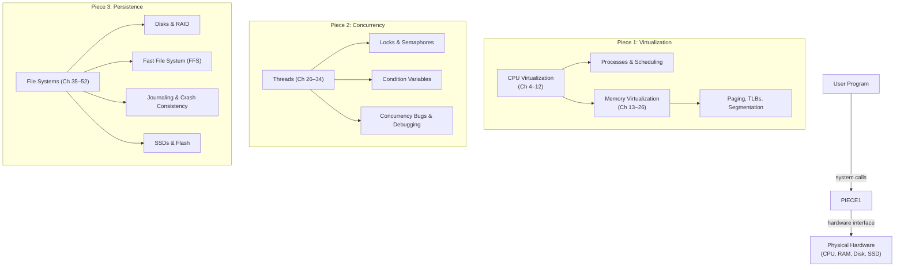
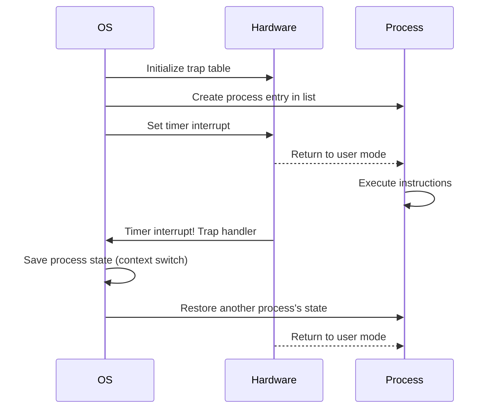
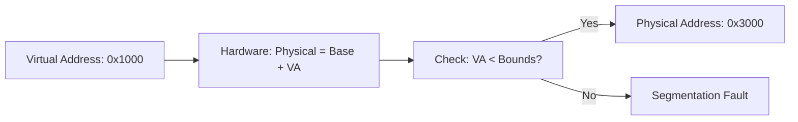
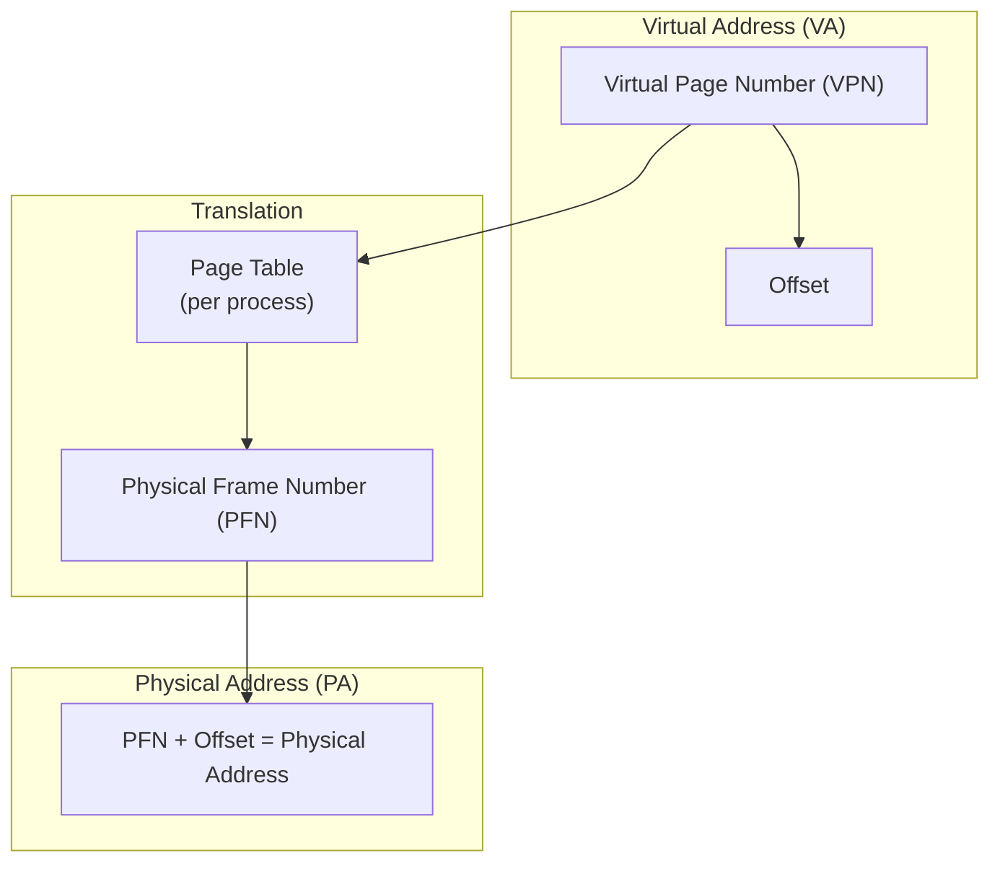
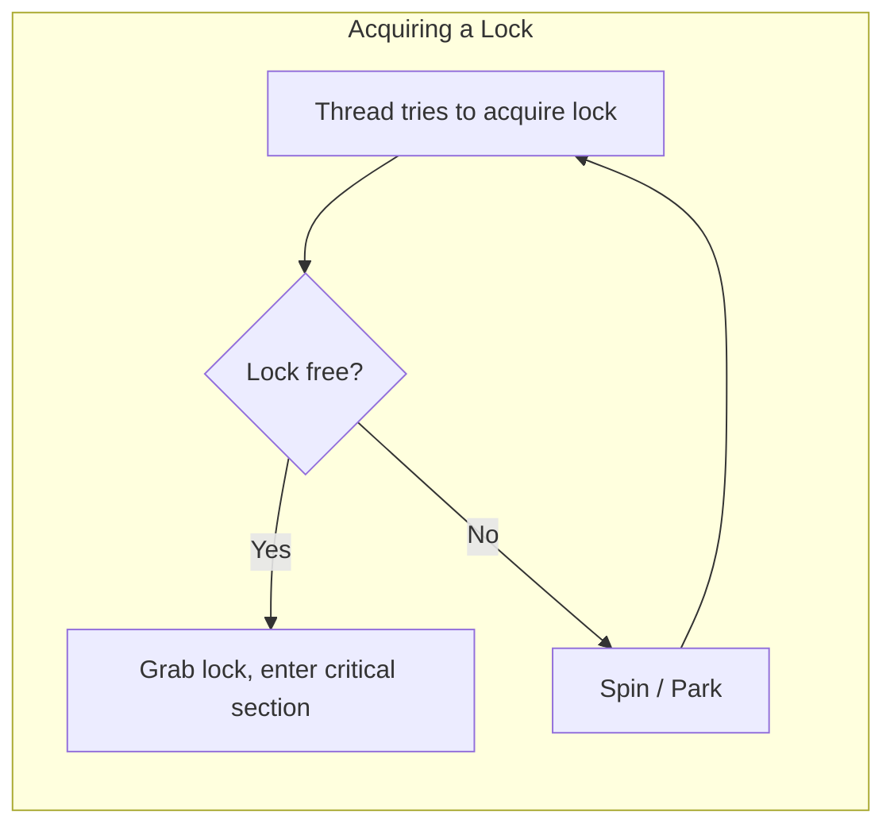

## The Three Pieces Architecture



---

## Part 1: Virtualization — CPU

### Processes and Limited Direct Execution (Ch 4–6)

The OS virtualizes the CPU by time-sharing: run one process for a while,
then switch to the next. Key mechanism: **Limited Direct Execution (LDE)**.



The key insight: run the program directly on the CPU (fast), but regain
control periodically via timer interrupts. No emulation needed.

### Scheduling Policies (Ch 7–9)

| Policy | Key Idea | Strength | Weakness |
|--------|----------|----------|----------|
| FIFO | First in, first out | Simple, fair in order | Convoy effect (short jobs wait behind long ones) |
| SJF | Shortest job first | Optimal avg. turnaround | Requires future knowledge; not preemptive |
| STCF | Shortest time-to-completion first | SJF + preemption | Still needs runtime estimates |
| RR | Round robin (time slice) | Great response time | Poor turnaround time |
| MLFQ | Multi-level feedback queue | Learns job type (I/O vs CPU) | Parameter tuning |
| CFS | Completely Fair Scheduler (Linux) | Proportional fairness | Complex accounting |

**The MLFQ insight**: a single policy can approximate SJF and RR by
observing behavior. Jobs that voluntarily yield the CPU are likely
interactive (boost priority). Jobs that use their full timeslice are
CPU-bound (demote priority).

---

## Part 1: Virtualization — Memory

### Address Spaces (Ch 13–15)

Each process gets a private address space. The OS virtualizes memory by
mapping virtual addresses to physical ones.

### Base-and-Bounds (Ch 15)

Simplest approach: a base register and a bounds register per process.



Problem: internal fragmentation (unused space between heap and stack).

### Segmentation (Ch 16)

Divide address space into segments (code, heap, stack). Each segment has
its own base + bounds. Eliminates internal fragmentation but introduces
external fragmentation.

### Paging (Ch 18–22)

Divide memory into fixed-size pages. A **page table** maps each virtual
page to a physical frame.



Paging eliminates external fragmentation. The **TLB (Translation
Lookaside Buffer)** caches recent translations so that most address
translations bypass the page table entirely.

### TLBs and Replacement (Ch 19)

On a TLB miss, the OS (or hardware) walks the page table. TLB replacement
policies (LRU, random) affect performance critically.

### Swapping (Ch 21–22)

When physical memory fills, the OS pages out some pages to disk. The
**page fault** handler brings them back. **Thrashing** occurs when the
working set exceeds available physical memory — the system spends all its
time paging.

---

## Part 2: Concurrency (Ch 26–34)

### The Concurrency Problem

Threads share the same address space. Without synchronization, access to
shared data is a **race** — the outcome depends on the interleaving of
instructions.

### Locks (Ch 28)

A lock provides mutual exclusion: only one thread can hold the lock at a
time. Building a correct lock requires hardware support:

- **Test-and-set** (spin lock): busy-waits, wasteful but simple
- **Compare-and-swap**: the basis for lock-free data structures
- **Fetch-and-add**: can build ticket locks (fair)

Better: **yield** or **park** the thread instead of spinning.



### Semaphores (Ch 31)

A semaphore is an integer with two atomic operations:
- **sem_wait**: decrement; block if value is zero
- **sem_post**: increment; wake a waiting thread

Semaphores can implement locks (initialized to 1) or ordering (initialized
to 0). This single primitive can solve almost any synchronization problem
— including the classic producer/consumer and reader/writer patterns.

### Condition Variables (Ch 30)

A condition variable lets a thread sleep until some condition holds. Used
with a lock:

```
pthread_mutex_lock(&m);
while (ready == 0)
    pthread_cond_wait(&cv, &m);
pthread_mutex_unlock(&m);
```

Always check the condition in a **while loop** (not if) — spurious
wakeups and subtle signal races mean the condition may not hold when the
thread wakes.

### Concurrency Bugs (Ch 32)

| Bug Type | Cause | Fix |
|---|---|---|
| Atomicity violation | Non-atomic access to shared variable | Add lock |
| Order violation | Thread B runs before A's condition is set | Add condition variable |
| Deadlock | Circular wait for locks | Fixed ordering, trylock, or lock-free |

**Deadlock** is the most insidious. Four conditions must hold: mutual
exclusion, hold-and-wait, no preemption, circular wait. Break any one.

---

## Part 3: Persistence (Ch 35–52)

### Files and Directories (Ch 37)

The OS provides a persistent name space. A file is a linear array of
bytes; a directory maps names to inodes. System calls: `open`, `read`,
`write`, `fsync`, `rename`.

### Disk Basics (Ch 36)

Disks are mechanical: seek (move arm), rotation (wait for sector), then
transfer. I/O schedulers reorder requests to minimize seek time (elevator
algorithm).

### RAID (Ch 38)

RAID improves performance and reliability by striping data across disks:

| Level | Redundancy | Usable Capacity | Read | Write |
|---|---|---|---|---|
| RAID-0 | None | N × disk | N × | N × |
| RAID-1 | Mirroring | N/2 × disk | N × (reads) | 1 × |
| RAID-4 | Parity disk | (N-1) × disk | (N-1) × | N × (small write penalty) |
| RAID-5 | Rotating parity | (N-1) × disk | (N-1) × | N/4 × (better writes) |

### FFS — Fast File System (Ch 40)

The Berkeley Fast File System organizes the disk into **cylinder groups**,
each containing inodes and data blocks. It co-locates related data
(directory, its files) in the same group, improving locality.

Key insight: the disk is treated as a collection of independent regions
rather than a linear array.

### Crash Consistency (Ch 42)

A crash during a write leaves the file system in an inconsistent state.
Three approaches:

1. **Fsck** (old): scan the entire disk after boot and fix. Slow.
2. **Journaling (write-ahead logging)**: commit changes to a journal first,
   then checkpoint to the main file system. On crash, replay the journal.
   Used by ext3/ext4.
3. **Copy-on-Write** (e.g., ZFS, btrfs): never overwrite data in place.
   Atomically flip a pointer to the new root.

### Journaling Details

```
Journal transaction:
  1. TxBegin (write journal block)
  2. Metadata + data (write journal blocks)
  3. TxEnd (mark journal complete)
  4. Checkpoint (copy to main file system)
```

Crash before TxEnd: skip (transaction is incomplete). Crash after TxEnd:
replay on mount.

### SSDs (Ch 44)

SSDs are fundamentally different from disks:
- **No mechanical delay** — random I/O is as fast as sequential
- **Erase-before-write** — must erase a large block (4-8 MB) to write
- **Write endurance** — each cell wears out after ~10K-100K writes
- **Garbage collection** — the SSD controller reclaims stale pages
- **Over-provisioning** — extra capacity to absorb writes

OSTEP's chapter on SSDs is one of the clearest anywhere outside
manufacturer white papers.

---

## Key Lessons

- Virtualization is an illusion maintained by the OS with hardware help
- Scheduling is always a trade-off — optimize for your workload
- Paging eliminates fragmentation via small fixed-size units
- Concurrency is fundamentally about controlling interleaving
- Locks are necessary but introduce deadlock risk
- A file system must survive crashes — journaling is the standard
- SSDs change the rules: optimize for writes, not seeks
- Separating mechanism (how) from policy (which) makes OS design modular

---

## Practical Applications

- Understanding virtual memory helps debug segfaults and memory leaks
- Concurrency knowledge is essential for multi-threaded server code
- File system design informs database storage engine architecture
- I/O scheduling concepts apply to any queue management problem
- SSD-aware design matters for building modern storage systems

---

## Action Plan

1. **Walk through a context switch.** Trace the code in xv6 or a Linux
   kernel fork — understand exactly what gets saved and restored
2. **Implement a scheduler.** Write MLFQ in C and test it against
   synthetic workloads
3. **Build a concurrent data structure.** Start with a lock-based queue,
   then try a lock-free version using CAS
4. **Play with paging.** Write a program that touches pages in various
   patterns and measure TLB miss rates with `perf stat`
5. **Create a simple file system.** Build a toy file system on a RAM disk
   with journaling. It will change how you think about durability
6. **Read the OSTEP homework.** Each chapter ends with simulation
   problems using the authors' Python simulators — run them
