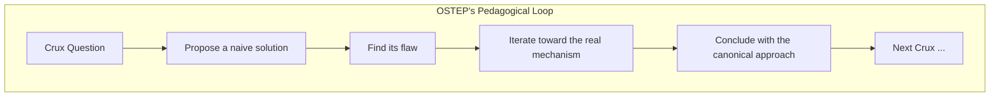

## Introduction

Welcome to BookAtlas. Today: *Operating Systems: Three Easy Pieces* by
Remzi H. Arpaci-Dusseau and Andrea C. Arpaci-Dusseau. Self-published 2018.
Seven hundred fourteen pages. And one of the most loved computer science
textbooks of the century.

The conceit: operating systems are not complicated. They are three
problems — virtualization, concurrency, persistence — and if you
understand these three pieces, you understand the modern OS.

Today: a self-taught programmer who learned everything they know about OS
from this book, and a former student at the University of Wisconsin who
took the class from Remzi himself.

---

## The First Page

**Programmer:** The opening grabbed me. Most textbooks start with a
definition — "An operating system is a program that manages computer
hardware." Boring. OSTEP starts with a question: "How does the OS
virtualize the CPU?" Not what, but how. I was in from that moment.

**Student:** I had Remzi for 537 at UW-Madison. The first lecture is
identical to Chapter 1. He stands at the board and says: "What does the
OS do? Two things. It makes the system easy to use — virtualization. And
it makes the system run well — it's a resource manager." That's the whole
class in one sentence. The rest is elaboration.

---

## The Crux of the Problem

**Programmer:** The "Crux" boxes are genius. Every chapter opens with a
question in a highlighted box. "The Crux: How can we virtualize memory
without wasting space?" Then the whole chapter is an answer. I never felt
lost. I always knew what problem I was solving.

**Student:** In class, Remzi would put the Crux on the projector and say
"OK, how should we do this?" And the lecture was the semester-long
process of convincing the students that we would have invented the OS
ourselves, given enough time. The book captures that exactly.

---

## The Beauty of Limited Direct Execution

**Programmer:** Chapter 6 — Limited Direct Execution — is the best
chapter in the book. The idea is so simple: just let the program run on
the CPU. Don't emulate it. Don't interpret it. Run it directly. But you
need two things: a timer interrupt to get control back, and a trap to
switch between user mode and kernel mode. That's it. The entire
virtualization strategy in 20 pages.

**Student:** Remzi called this "the OS's noble lie." We tell each process
"you have the whole CPU," but really we're time-sharing. The hard part is
making the lie believable — fast enough that no one notices the switching
overhead.

---

## Memory: Why Paging Wins

**Programmer:** I remember struggling with segmentation. Base-and-bounds
was too simple. Segmentation was too complex. Then paging comes in and
you realize why everyone uses it. Fixed-size pages. No fragmentation. And
the TLB makes it fast. The book's explanation of why paging dominates is
masterful — it's not that paging is perfect, it's that everything else is
worse.

**Student:** The homework simulators for paging are great. You can vary
the page size, TLB size, access pattern — and watch the hit rate change
in real time. That kind of experimentation is what makes OSTEP different
from a reference book.

---

## Concurrency: Where the Real Pain Lives

**Programmer:** The concurrency section was humbling. I had written
multi-threaded code before — badly. OSTEP showed me exactly why my code
glitched. The chapter on concurrency bugs (Ch 32) lists every mistake
I've ever made, with names: atomicity violation, order violation,
deadlock. Having a vocabulary for bugs is half the fix.

**Student:** At Wisconsin, the concurrency homework was legendary. We had
to implement a concurrent hash table, then prove it was correct. Half the
class got it wrong. The other half thought they got it right but actually
had a race they hadn't tested. OSTEP's chapter on deadlock (Ch 32) saved
my assignment.

---

## Persistence: Surviving the Crash

**Programmer:** I always wondered why my database talked about WAL (write-
ahead logging). Then OSTEP explained journaling. Same idea — write to a
log first, then checkpoint. A crash half-way through a write leaves the
system either in the old state or the new state, never in-between. That's
atomicity for storage. Once you see it, it's obvious. But nobody had
explained it to me before.

**Student:** The crash consistency chapter (42) is Remzi at his best. He
draws three disk states — before write, during write, after write — and
walks through what happens if the power dies in each. The fscks are shown
as slow, careful scans. Journaling is shown as fast, structured recovery.
The contrast is vivid.

---

## Self-Published, But That's OK

**Programmer:** The paper quality is bad. Pages are thin. The binding
cracks. But the PDF is free. I keep the PDF on my laptop and haven't
touched the physical copy in years.

**Student:** Remzi would say: "We published it ourselves because no
publisher would let us give it away for free." That ethos matters. A
strictly better product — free, clear, and un-compromised by publisher
demands.

---

## The Verdict

**Programmer:** OSTEP is the only technical textbook I have read cover to
cover for fun. It should be the first OS book anyone reads.

**Student:** If you take one OS course in your life, this should be the
textbook. And if you never take an OS course, read it anyway — every
programmer works on an operating system, and understanding what it's
doing makes you better at every level.

**Programmer:** The three pieces framework changed how I think about
systems in general. Every complex system can be decomposed into its core
problems. Find them. Solve them one at a time. That's what OSTEP taught
me.

**Student:** That's exactly what Remzi would say.

---

## Final Thoughts

OSTEP is more than a textbook. It is a model for how technical education
should work: free, clear, conversational, and organized around a small
set of deep ideas rather than a large set of shallow facts.

Before OSTEP, operating systems were taught as a collection of algorithms
and interfaces. After OSTEP, they are taught as three design problems.

This has been a BookAtlas narration of Operating Systems: Three Easy
Pieces by Remzi H. Arpaci-Dusseau and Andrea C. Arpaci-Dusseau. Thanks
for listening.
