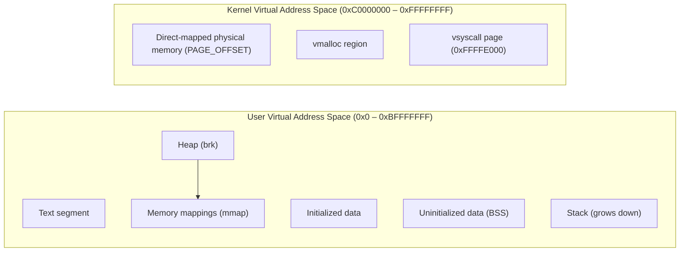
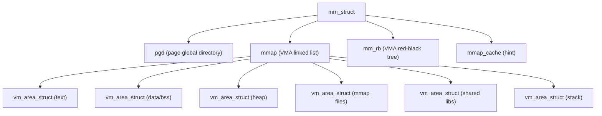
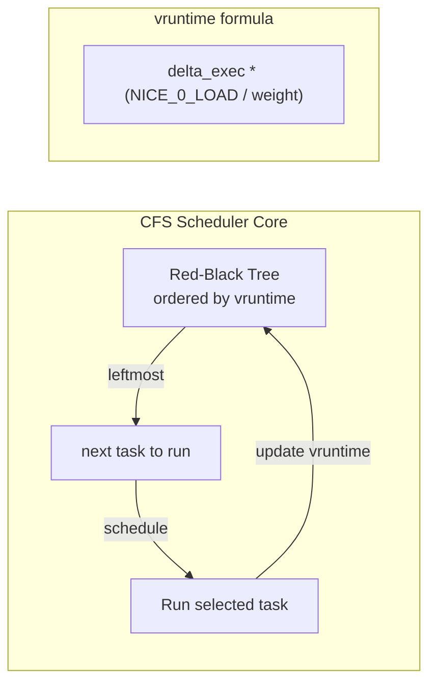
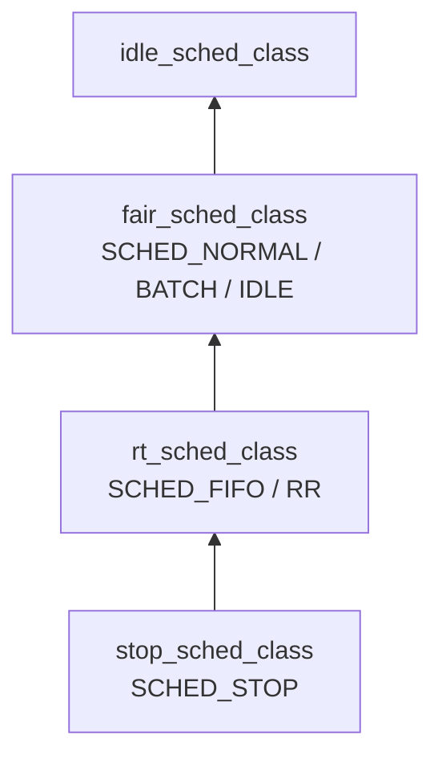
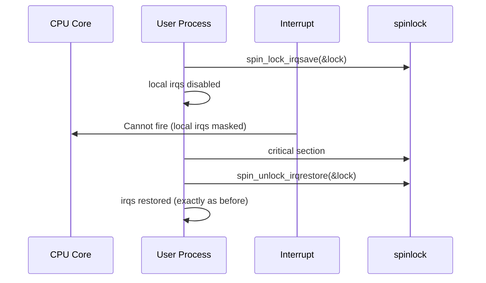
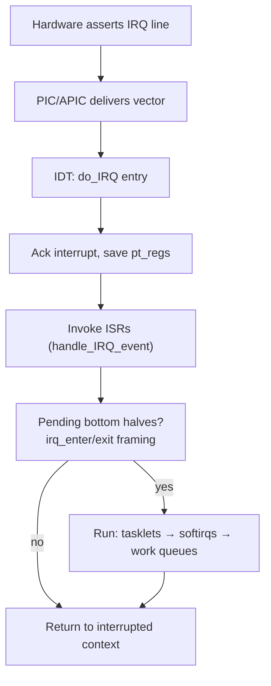
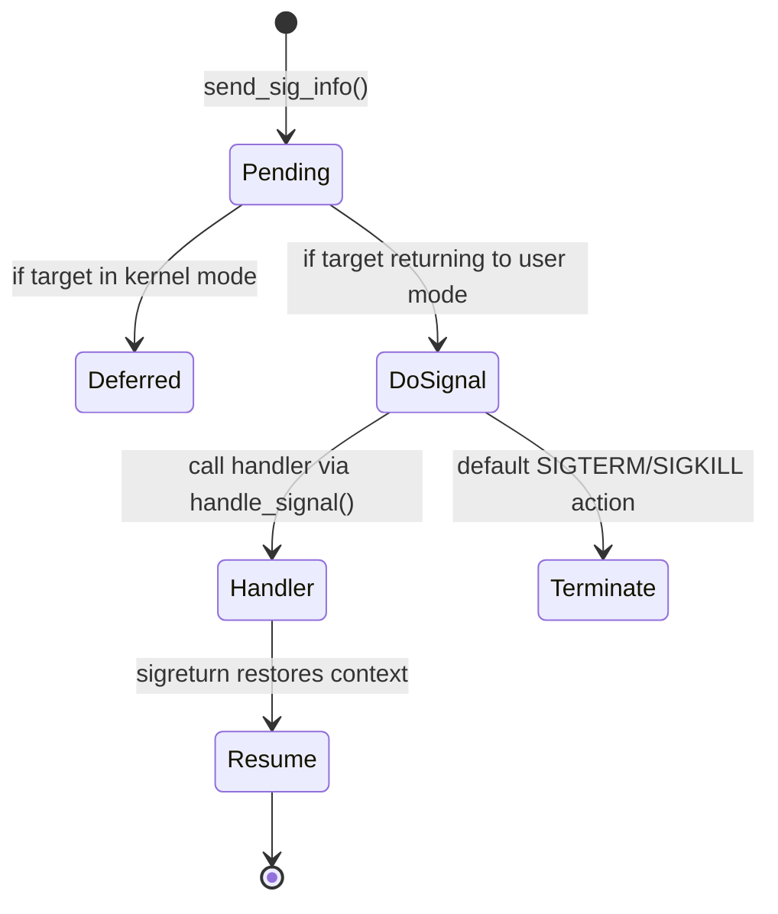
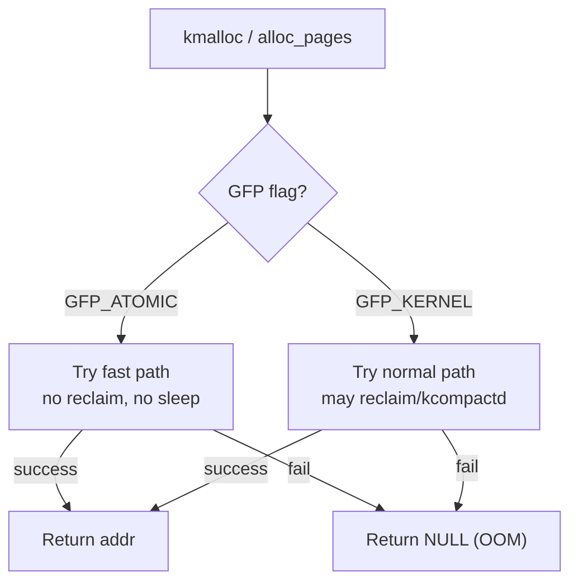
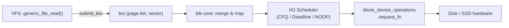

## Kernel Architecture and Memory Layout

### The Kernel's Virtual Address Space

On 32-bit x86 with 4 GB of virtual address space per process, Linux splits the range into two halves. User processes occupy 0x00000000–0xBFFFFFFF (the lower 3 GB); the kernel lives permanently mapped at 0xC0000000–0xFFFFFFFF (the upper 1 GB). Every process switch swaps the page-table base register (CR3), but the upper 1 GB is never replaced — it is the same physical pages mapped the same way in every process's virtual address space. This is the single most important layout fact in the book.



The kernel's own memory is further partitioned. The early 896 MB (from `PAGE_OFFSET` = 0xC0000000) is the direct-mapping region (`phys_to_virt()` / `virt_to_phys()` are simple arithmetic here). Above that (starting around 0xC8000000 by default) lies `vmalloc` space, where the kernel virtually coalesces physically discontiguous pages into a contiguous address range — `vmalloc()` allocates from here.

> On 32-bit x86 with CONFIG_HIGHMEM, pages above the 896 MB physical RAM ceiling live in the ZONE_HIGHMEM pool and cannot be permanently mapped. `kmap()` and `kmap_atomic()` pin them temporarily, which is why every HIGHMEM access carries a mapping overhead invisible on 64-bit where all physical memory is directly mapped.

---

## Process Model: task_struct, Threads, and mm_struct

### task_struct: The Process Descriptor

Every Linux task — every process and every thread — is represented by a single `task_struct`. This structure lives in kernel memory (never swapped) and holds: scheduling class, open file descriptors, signal handlers, address-space pointer (`mm`), credentials, namespaces, and over a hundred other fields organized by subsystem. Reading `task_struct` is reading the entire process model.

Notably, a kernel thread is simply a `task_struct` with `mm = NULL`. When the scheduler picks such a task, it copies the `active_mm` of the previous task into the memory registers rather than performing a full page-table walk. This shortcut avoids loading a non-existent page table and saves cycles for kernel-only workers like ksoftirqd, kswapd, and kthread.

### Processes vs Threads: The clone() Perspective

Linux does not distinguish "process" and "thread" at the kernel object level. What userspace calls a thread is a `task_struct` that shares its `mm_struct` with a sibling group. The unifying syscall is `do_fork()`, reached through `fork()`, `vfork()`, and `clone()`. What differs among them is the flag mask:

| Flag | Effect |
|------|--------|
| `CLONE_VM` | Share address space (nmakes a thread, not a process) |
| `CLONE_FS` | Share filesystem info (umask, root, cwd) |
| `CLONE_FILES` | Share open file descriptor table |
| `CLONE_SIGHAND` | Share signal handlers |
| `CLONE_THREAD` | Place in same thread group (PID = TGID) |
| `CLONE_PARENT_SETTID` | Write child TID to parent-provided address |

A kernel thread's `clone()` flags typically specify `CLONE_VM | CLONE_FS | CLONE_FILES | CLONE_SIGHAND | CLONE_THREAD` along with `CLONE_SYSVSEM` and a NULL `mm` — deliberately creating a task that can be scheduled but has no user address space.

### mm_struct and the Virtual Memory Area (VMA)

The `mm_struct` is the process's memory descriptor. Its fields include:

- `mmap`: a doubly-linked `vm_area_struct` list in ascending address order
- `mm_rb`: a red-black tree of the same VMAs for fast lookup by address
- `total_vm`, `locked_vm`, `shared_vm`, `exec_vm`: counters by VMA type
- `mmap_cache`: the most recently accessed VMA, cached for repeated `mmap` lookups
- `pgd`: the page global directory (top-level page table)

Each `vm_area_struct` describes one contiguous virtual region and records its start (`vm_start`), end (`vm_end`), protections (`vm_page_prot`), flags (`VM_IO`, `VM_DONTEXPAND`, etc.), and the backing file or anonymous-private status. The VMA list is the canonical description of a process's address space; the kernel does not maintain a separate bitmap.



---

## Linux Scheduler: CFS and Scheduling Classes

### The CFS Design

The Completely Fair Scheduler replaced the O(1) scheduler in 2.6.23 and remains the core of `SCHED_NORMAL` (time-shared, non-real-time) scheduling in 2.6. CFS models an ideal, perfectly fair CPU: given N equal-weight tasks, each gets 1/N of the CPU. vruntime tracks how much virtual time a task has consumed; the ideal next task to run is the one with the smallest vruntime.

The core data structure is a red-black tree of `sched_entity` objects (one per runnable task or task group), ordered by vruntime ascending. The leftmost node — smallest vruntime — is always selected next. There are no fixed time slices; the "time a task runs" is `delta_exec = now − last_run`, and its vruntime increments by `delta_exec * NICE_0_LOAD / task_weight`.

```
vruntime_new = vruntime_old + delta_exec * (NICE_0_LOAD / task_weight)
```

Tasks with `nice = 0` have weight = 1024; `nice = −20` weight = 88761; `nice = +19` weight = 19. This logarithmic scaling means a +19 task runs only ~0.2% of a nice-0 task — not zero, but very small.



### Scheduling Classes

Linux 2.6 uses a pluggable class-based architecture. Each class implements an `enqueue_task`, `dequeue_task`, `pick_next_task`, and `set_curr_task` function pointer pair and registers a `sched_class` struct. The classes form a priority chain:

| Class | Policy | Priority Range (rt_priority) | Notes |
|-------|--------|------------------------------|-------|
| `stop_sched_class` | `SCHED_STOP` | highest | CPU hotplug, migration |
| `rt_sched_class` | `SCHED_FIFO` / `SCHED_RR` | 1–99 | Real-time, FIFO or round-robin within priority |
| `fair_sched_class` | `SCHED_NORMAL` / `SCHED_BATCH` / `SCHED_IDLE` | dynamic | CFS for normal; batch for throughput; idle for background |
| `idle_sched_class` | `SCHED_IDLE` | lowest | Runs only when no other task is ready |



---

## System Calls: The Bridge Between User and Kernel

The kernel exposes its services through a fixed syscall table (`sys_call_table`), an array of function pointers indexed by a small integer called the syscall number. On x86-32, the entry mechanism is `int $0x80` (older, software interrupt) or the `syscall` instruction (introduced in later CPUs). The number is passed in `%eax`; arguments up to six are passed in `%ebx`, `%ecx`, `%edx`, `%esi`, `%edi`, `%ebp`.


Important conventions: negative return values from the kernel represent `-errno`; glibc's syscall stubs translate them before setting `errno` and returning `−1`. The `sys_call_table` is shared between read-only and writeable pages in 2.6 (no read-only enforcement until 3.x), making it an attractive kernel-rootkit target even in 2.6.

---

## Kernel Synchronization Primitives

### The Primitive Ladder

The kernel provides synchronization primitives ordered from "lightest" to "heaviest." Choosing the wrong one for the context you are in is a common source of deadlocks and oopses.

| Primitive | Context allowed | Blocking | Overhead | Use when |
|-----------|----------------|----------|----------|---------|
| `atomic_t` / `cmpxchg()` | Any | Never | Lowest | Simple counters, reference counts, bit ops |
| `spin_lock()` | Atomic only | Never | Very low | Short critical section in IRQ-safe context |
| `spin_lock_irqsave()` | Atomic with IRQs | Never | Low | Lock shared with bottom-half code |
| `rwlock_t` | Atomic only | Never | Low | Mostly-read, rarely-write shared data |
| `seqlock_t` | Atomic only | Writer: never; Reader: retry loop | Very low | Data where writers are rare and readers frequent (e.g., time, jiffies, gettimeofday) |
| `mutex` | Process context | Yes (sleepable) | Medium | Lock held across blocking I/O or schedule |
| `completion` | Process context | Yes | Low | Wait for a one-shot event from another task |
| `RCU (Read-Copy-Update)` | Reader: any; Writer: RCU-safe | Writer: via `synchronize_rcu()` grace period | Reader: near-zero | Read-mostly linked data where updates are rare |

### Why spin_lock_irqsave Exists

A classic deadlock: an interrupt handler acquires `spin_lock(&my_lock)` and is then interrupted by a user process running on the same CPU that also tries to acquire `spin_lock(&my_lock)`. Because the lock is already held (by the top half, interrupted mid-hold) and the CPU won't run the top half again until the interrupt returns, the process blocks forever on the same CPU. `spin_lock_irqsave()` disables local interrupts before acquiring, preventing a bottom half on the same CPU from re-entering. The saved flags word is passed to `spin_unlock_irqrestore()` to restore them exactly.



### RCU Read-Side Critical Sections

RCU exploits the fact that readers vastly outnumber writers in many kernel data structures (e.g., routing tables, module lists). Reader-side RCU is free: `rcu_read_lock()` is a compiler barrier with no atomic; `rcu_read_unlock()` likewise. The kernel knows a reader is in a critical section and blocks writers from completing `synchronize_rcu()` until all such sections finish. Writers instead allocate a new copy, swap the pointer, wait one grace period, then free the old version.

---

## Interrupt Handling: Top Half, Bottom Half, Work Queues

### The IRQ Entry Path

When an interrupt arrives:

1. CPU pushes minimal state (`pt_regs`) and jumps to the IDT entry.
2. The generic IRQ entry (`do_IRQ`) acknowledges the APIC/8259 PIC and looks up the `irq_desc` for that vector.
3. `handle_IRQ_event` invokes the driver's ISR (interrupt service routine).
4. If the IRQ was shared, multiple ISRs are called sequentially in a mask/unmask loop.
5. After all ISRs return, the kernel checks for pending bottom halves.



### Bottom-Half Options

| Mechanism | Scheduling | Context | Can Sleep? | Use in 2.6 |
|-----------|-----------|---------|------------|------------|
| Tasklets | Softirq with one-shot BH | Atomic (bottom half) | No | Common for NIC Rx, block |
| Softirqs | Raise via `raise_softirq_irqoff()` | Atomic (bottom half) | No | Network, scheduler, timers, block |
| Work queues | Schedule on kthread worker pool | Process context | Yes | Deferrable I/O, policy work |

Tasklets are the highest-level bottom half: easy to use, serialized per-CPU (a given tasklet never runs on two CPUs simultaneously), but they extend atomic context. Work queues run in the context of `kthread` workers and may call `schedule()`, `mutex_lock()`, or `copy_to_user()` — but schedule latency is higher than tasklets.

---

## Timers and Timekeeping

### jiffies and HZ

`jiffies` is a 32-bit unsigned counter incremented by the periodic timer interrupt at `CONFIG_HZ` rate. Defaults to 1000 Hz on most x86 kernels, meaning one increment every 1 ms. At this rate it wraps (wraps to 0) every ~50 days: `2^32 / 1000 / 86400 ≈ 49.7 days`.

The kernel provides comparison macros to avoid wrap bugs:

```c
if (time_after(now, deadline))   // now > deadline even across wrap
if (time_before(now, deadline))
```

`gettimeofday()` fills a `struct timeval` by reading the wall-clock offset from boot plus elapsed jiffies, corrected by a periodic NTP synchronization. The higher-resolution `ktime_t` (64-bit nanosecond scalar) and the `hrtimer` subsystem provide sub-millisecond timers used by POSIX timers, nanosleep, and high-resolution timeouts in networking.

---

## Signals: Delivery, Blocking, and Real-Time

Signals are the kernel's asynchronous notification mechanism. Linux 2.6 supports 32 standard signals (SIGTERM = 15, SIGKILL = 9, etc.) and 33–64 are real-time signals, delivered in order and queued.

Signal delivery steps (simplified):

1. `send_sig_info()` puts the signal on the target's pending bitmask / queue.
2. If the target is non-interrupted, return; the signal is handled at the next safe return.
3. At return-to-userspace (from syscall, trap, or interrupt), `do_signal()` walks the `pending` and `shared_pending` bitmasks dequeuing one signal at a time.
4. The handler from `action->sa.sa_handler` or `sigaction` is called via `handle_signal()`, which sets up the alternate signal stack if `SA_ONSTACK` is set and restores the user context with `sigreturn`.



`sigprocmask()` / `pthread_sigmask()` controls the thread's blocked mask. Real-time signals (`SIGRTMIN` through `SIGRTMAX`) carry an integer or pointer payload via `sigqueue()` and are queued — multiple instances of the same signal are delivered in order, unlike standard signals which collapse to a single pending bit.

---

## Memory Management: Zones, Buddy, Slab, and kmalloc

### Physical Memory Zones

On 32-bit x86, physical RAM that kernel code can access at any time is limited by the direct-mapped 896 MB ceiling. RAM above that (if the system has > 896 MB) resides in ZONE_HIGHMEM and must be mapped into kernel virtual memory on demand via `kmap()`. The three zones are:

| Zone | Range | Access |
|------|-------|--------|
| ZONE_DMA | First ~16 MB | ISA DMA-safe addresses (< 16 MB physical) |
| ZONE_NORMAL | 16 MB – 896 MB | Directly mapped; unrestricted kernel use |
| ZONE_HIGHMEM | Above 896 MB | Temporary `kmap()` mapping required |

On 64-bit x86 and most non-x86 architectures, ZONE_HIGHMEM does not exist; all physical memory is in ZONE_NORMAL and all of it is directly mapped.

### Buddy Allocator

The buddy system manages pages within each zone. Physical memory is divided into `struct page` arrays (the `mem_map`). Free pages are organized into `free_area[0]` through `free_area[MAX_ORDER]`, where `MAX_ORDER` is typically 11 (page groups of 2^11 = 2048 pages). A buddy of order *N* is two buddies of order *N−1*; splitting a higher-order block produces two lower-order buddies.

```
alloc_pages(GFP_KERNEL, 3)  →  2^3 = 8 contiguous pages
free_pages(addr, 3)          →  return 8 pages; try buddy merge
```

### kmalloc, vmalloc, and GFP Flags

`kmalloc(size, GFP_KERNEL)` returns a physically contiguous, virtually contiguous block. It is the right choice for DMA-capable memory for device drivers. `vmalloc(size)` returns virtually contiguous but physically fragmented pages — fast and unbounded in size but unsuitable for DMA and slightly slower on TLB due to additional page-table entries.

`GFP_GFP` flags control the allocation's behavior and zone constraints:

| Flag | Meaning |
|------|---------|
| `GFP_KERNEL` | May sleep; can reclaim cached pages; ZONE_NORMAL |
| `GFP_ATOMIC` | Never sleeps; only emergency reserves; any zone |
| `GFP_DMA` | Restricts to ZONE_DMA (physical < 16 MB) |
| `GFP_HIGHUSER` | Like GFP_KERNEL but only from ZONE_HIGHMEM |
| `__GFP_NOWARN` | Suppress allocation failure warnings |
| `__GFP_COMP` | Compound page (huge page building) |



---

## The Virtual Filesystem (VFS)

### The Four Core Objects

VFS is the abstraction layer that lets ext2, ext3, NFS, procfs, sysfs, and tmpfs all share the same `open()` / `read()` / `write()` / `mmap()` paths. It models four objects:

```mermaid
graph BT
  FILE["file<br/>(open-instance in fd table)"]
  DENTRY["dentry<br/>(directory entry / name cache)"]
  INODE["inode<br/>(filesystem object on disk)"]
  SB["super_block<br/>(filesystem type and mount state)"]
  FILE -->|f_dentry| DENTRY
  DENTRY -->|d_inode| INODE
  DENTRY -.->|d_parent (for dirs)| DENTRY
  INODE -->|i_sb| SB
```

- **super_block**: created at mount time; holds the filesystem-type (`s_type` → `super_operations`), root dentry, mount options, and block device. One per mounted filesystem.
- **inode**: one per filesystem object; stores mode, uid, gid, size, timestamps, block pointers, and `i_fop` (file_operations). Identified by an inode number; survives file renames because names are in dentries, not inodes.
- **dentry**: a (name, inode) pairing for one component of a path. Dentries are cached in a dcache hash table and an LRU list; walking `/usr/bin/python3` resolves one dentry per path component.
- **file**: created at `open()`; lives in the per-process opened-file descriptor table. Holds `f_pos` (read/write offset), `f_flags` (O_RDONLY, etc.), and `f_op` (the file_operations for this open).

### The file_operations and inode_operations Layers

Each object type exposes an ops table with function pointers:

- `inode_operations`: `lookup`, `create`, `link`, `unlink`, `mkdir`, `rmdir`, `rename`, `symlink`, `readlink`
- `file_operations`: `open`, `release`, `read`, `write`, `aio_read`, `aio_write`, `mmap`, `ioctl`, `poll`, `llseek`, `fsync`, `flock`

When you call `read(fd, buf, n)`, the VFS checks `f_pos`, calls `file->f_op->read(file, buf, n, f_pos)`, advances `f_pos`, and returns. The underlying implementation is ext2's `file_read` or ext3's, or a socket's `sock_read`, or procfs's `proc_file_read` — the caller never knows.

---

## Block Device Layer and ext2/ext3

### The bio and request Queue

The block layer converts higher-level I/O requests into `struct bio` structures. A bio carries one or more `bio_vec` segments — page, offset, length tuples — describing the scatter-gather memory. Bios are queued on `request_queue` structures and processed by an I/O scheduler.



### ext2 Indirect Blocks

ext2 divides the disk into block groups, each with its own inode table, block bitmap, inode bitmap, and data blocks. An inode stores 15 block pointers: 12 direct, 1 singly indirect, 1 doubly indirect, 1 triply indirect.

```
Direct blocks (0–11): data blocks pointed to directly by inode
Singly indirect (12): one block of block addresses → up to 256 more data blocks (4 KB block = 1024 entries)
Doubly indirect (13): address block → address blocks → data blocks
Treby indirect (14): address → address → address → data
```

For a 4 KB block size, maximum single-file size is approximately:
```
12 + 256 + 256^2 + 256^3  ≈  16 GB
```
This fixed constant is why ext2's file size limit is so clean, but also why large sparse files waste inode pointer space.

### ext3 Journaling Modes

ext3 adds a journal (hidden file, typically `.journal`) and three consistency modes selected at mount time:

| Mode | `data=` | Journal Scope | Crash Recovery | Performance |
|------|---------|---------------|----------------|-------------|
| journal | `journal` | Data + metadata | Full replay | Slowest |
| ordered | `ordered` | Metadata only; data flushed before metadata commit | Metadata + data ordered guarantee | Fast (default) |
| writeback | `writeback` | Metadata only | Metadata only, data may be inconsistent | Fastest |

ext4 later replaced ext3's indirect block trees with extent trees (a range descriptor "start, len, physical" instead of 256 pointer blocks), dramatically reducing metadata overhead for large contiguous files. The 3rd edition of this book covers ext3 extensively; ext4 extent support was merged around the same window but this text treats it as emerging rather than central.

---

## Networking: The sk_buff and Protocol Stack

The socket buffer (`struct sk_buff`, universally called "skb") is the fundamental packet carrier in the Linux network stack. Every received packet is wrapped in an skb at the device driver; every transmitted packet exits the stack as one.

```mermaid
flowchart TB
  NIC["Network device driver"] -->|NAPI poll| SKB_RX["alloc_skb() + netif_receive_skb()"]
  SKB_RX -->|protocol demux| IP["ip_rcv() — IP layer"]
  IP -->|ip_forward / ip_local_deliver| TCP["tcp_rcv() — TCP layer"]
  TCP -->|sock_queue_rcv_skb| SOCK["struct sock receive queue"]
  SOCK -->|recvfrom()| USER["User process"]
```

An skb has three pointers carving it into head, data, and tail regions:

- `skb->head`: start of backing buffer (always true linear memory backed by `struct page`)
- `skb->data`: offset from head to current protocol header
- `skb->tail`: offset from head to end of current payload
- `skb->end`: offset from head to end of backing buffer capacity

Manipulating these is the primary skb API:

```c
skb_reserve(skb, NET_IP_ALIGN);    // push data forward for alignment
skb_put(skb, len);                 // extend tail for payload
skb_pull(skb, len);                // advance data (consume header)
skb_push(skb, len);                // prepend to data (add L2 header)
```

The `sk_buff` is singly or doubly referenced using `atomic_t skb_users`; `kfree_skb()` decrements and frees on zero. `skb_clone()` creates a shared-copy reference (clone) for fan-out to multiple subscribers (e.g., tcpdump and the protocol handler), while `pskb_copy()` creates a deep physical copy.
