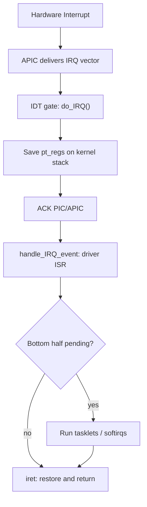
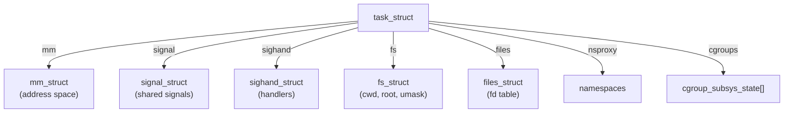
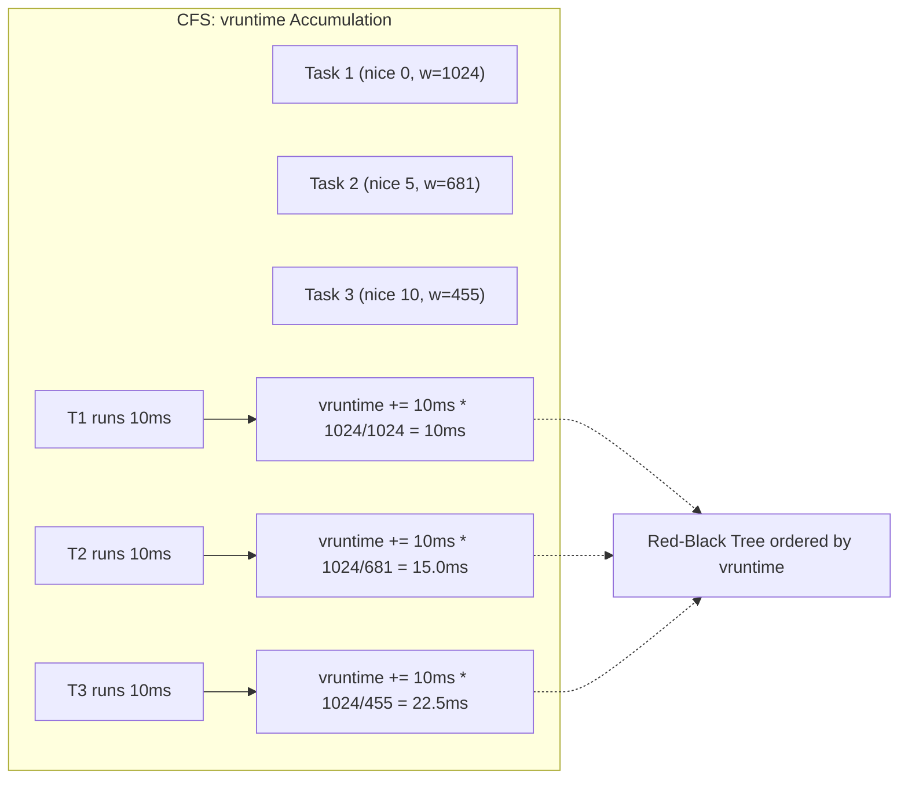
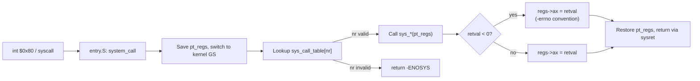
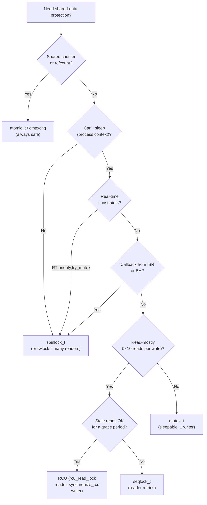
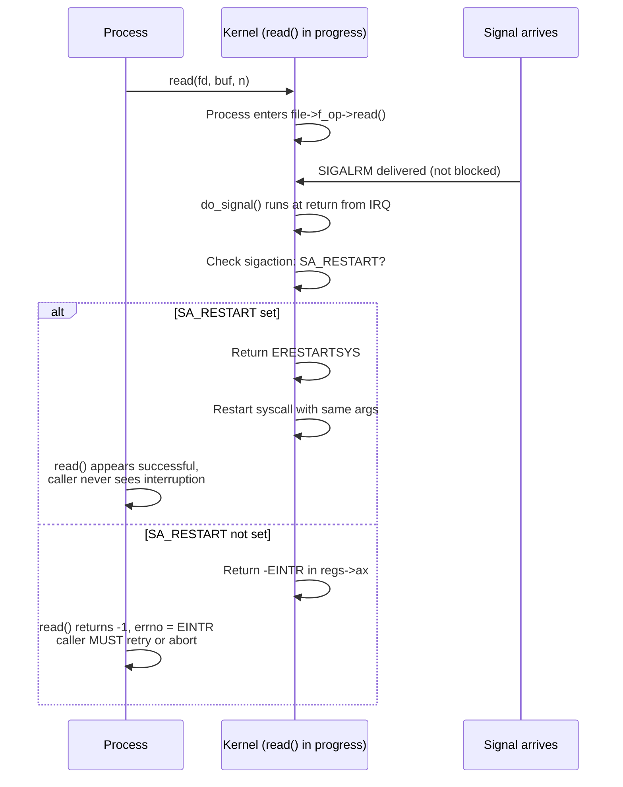
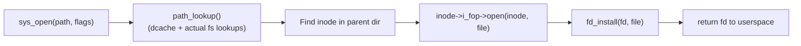

## The Hardware-to-Software Pipeline: Understanding the Full Stack

The most distinctive contribution of this book is its insistence that kernel software cannot be fully understood without the hardware substrate it runs on. Bovet & Cesati trace the complete chain: from the moment a physical interrupt asserts an IRQ line, through the APIC delivery, the IDT lookup, the push of `pt_regs`, the ISR running with interrupts disabled at the local CPU, to the deferred bottom half making its way through the softirq vector — and then show exactly how `do_signal()` walks `task_struct->signal->shared_pending` to decide whether the interrupted `read()` call should be restarted or fail with `EINTR`.

This complete-stack view is what makes this book different from every other kernel text. Love tells you that `copy_from_user()` handles page faults; Bovet & Cesati show you the page-walk path (CR3 → PDE → PTE → present bit check → `do_page_fault()` → `find_vma()` → `expand_stack()` → `__do_page_fault()`), with the exact invalidate-opcode exception that fires on a write to a read-only VMA.



---

## task_struct and the Process Model: One Struct to Rule Them All

The `task_struct` is 1.2–2.4 KB on 32-bit and larger on 64-bit. It dwarfs most userspace a process would allocate. The kernel pays that price because it needs per-task state for everything: the scheduler, the filesystem, the signal layer, the namespaces, the audit subsystem, the cgroup controller, the keys, the perf events, and more.

Key insight from the book: reading `task_struct` field-by-field teaches you which kernel subsystem "owns" which resource. For example:

- `mm` and `active_mm` → memory management / scheduler
- `signal` and `blocked` → signal layer
- `fs` → filesystem info (root, cwd, umask; shared if CLONE_FS)
- `files` → open file descriptor table (shared if CLONE_FILES)
- `sighand` → signal handlers (shared if CLONE_SIGHAND)
- `real_parent`, `parent`, `children`, `sibling` → process tree
- `pgrp`, `session`, `tgid` → POSIX process group and session
- `nsproxy` → namespaces (PID, network, mount, UTS, IPC, user)
- `cgroups` → control group hierarchy
- `ptrace` → debugger attachment



When you see a kernel bug involving leaking file descriptors across a `fork()`, look at whether `CLONE_FILES` was set. When you see signal handlers unexpectedly shared between threads, look at `CLONE_SIGHAND`. The clone flags are the switchboard that determines which fields are shared; everything else follows mechanically.

---

## CFS Scheduler: vruntime Mechanics and Why It's Fair

CFS's mathematical fairness is not an aesthetic choice; it is a direct solution to the problem of weighted fair queuing without weighted round-robin overhead. Here is the intuition Bovet & Cesati make explicit:

1. Every task has a weight `w_i` derived from its nice value via a 40-entry lookup table (`prio_to_weight[]`).
2. Per unit of real CPU time `t`, task `i` accumulates `t * (NICE_0_LOAD / w_i)` units of vruntime.
3. The task with the smallest vruntime gets to run next (leftmost in the red-black tree).
4. A task that runs uninterrupted accumulates vruntime until it becomes the heaviest, then naturally falls to the right side of the tree and is preempted by lighter tasks.

This means CFS has **no timeslice** as a first-class concept. The timeslice is whatever time is "left over" before the vruntime inequality reorders the tree. In practice, `sched_min_granularity_ns` and `sched_wakeup_granularity_ns` sysctl tunables add accounting minimums to prevent pathological thrashing.



In practice: an interactive shell session where you press keys and get immediate `read()` responses is not being artificially preferred. Its vruntime stays low because every keypress blocks on I/O, resetting its `vruntime` in `dequeue_entity()` with `update_curr()`. Background CPU-bound jobs run steam ahead in vruntime and get preempted automatically. This is why `nice +19` processes do not steal CPU from your terminal even without a real-time policy.

---

## System Calls: The int $0x80 to syscall Path

The x86-32 syscall path is two distinct entry points that converged over time:

| Mechanism | Instruction | Registers | Condition |
|-----------|------------|-----------|-----------|
| Old path (all 2.6) | `int $0x80` | `%eax`=NR, `%ebx/ecx/edx/esi/edi/ebp`=args | Universal, always available |
| New path (CONFIG_SYSCALL64) | `syscall` | `%eax`=NR, `%edi/esi/edx/ecx/ebx`=args | CPU supports SYSENTER/SYSCALL |

Both entry points enter `system_call` in `arch/i386/kernel/entry.S`. The entry stub saves `%eax`–`%edx`, `%esi`, `%edi`, `%ebp`, and `%ds`/`%es` segment registers onto the kernel stack, builds a `pt_regs` frame, then calls the C `sys_*` function via `sys_call_table[nr]`.

Critical implementation detail: `sys_call_table` is **not** read-only on standard 2.6 kernels. It is in the `.data` section, not `.rodata`. This means a root-level attacker can overwrite any syscall pointer and redirect it to arbitrary kernel code. SELinux and LSM hooks partially mitigate this, but `CONFIG_DEBUG_RODATA` (read-only kernel text/data) was not the default in 2.6. This is a historical kernel security fact worth knowing when auditing old embedded 2.6 deployments.



---

## Kernel Synchronization: When to Use What — A Practical Decision Tree

One of the book's most lasting contributions is its explicit primitive comparison. A developer writing `read()` for a new block device driver or a `procfs` seq_file iterator needs to answer: *which lock or atomic primitive covers my exact case?*



A specific real-world example: a driver's `open()` method initializes a per-file context and stores a pointer in `filp->private_data`. This assignment is not raced by multiple opens on the same inode (VFS already serializes that at `->open()`), but a parallel `ioctl()` that frees the context while `read()` is using it **is** a race. Here, `mutex` is the right choice because `read()` can sleep on I/O.

The common anti-pattern: using a `spin_lock` in `file_operations.read` because the author assumed "the VFS is fast, this doesn't sleep." But `vfs_read()` → `file->f_op->read()` calls into the filesystem's `->readpage`, which may map a page fault, which calls `__lock_page()`, which can schedule. Holding a spinlock across `copy_to_user()` (which page-faults) is a guaranteed `BUG: scheduling while atomic`.

---

## Memory Management: The Three-Zone Model in Practice

On a 32-bit x86 machine with 2 GB of RAM, `ZONE_DMA` (first 16 MB) is allocated for ISA DMA device buffers. `ZONE_NORMAL` holds the bulk of kernel allocations including page cache, slab caches, and the `vmalloc` virtual area backing. The ~1.1 GB not directly mapped (above `high_memory` start) is `ZONE_HIGHMEM`.

```mermaid
graph BT
  subgraph "Physical RAM Layout on 32-bit x86"
    DMA["ZONE_DMA<br/>(0 – 16 MB)"]
    NORM["ZONE_NORMAL<br/>(16 MB – 896 MB)"]
    HIGH["ZONE_HIGHMEM<br/>(896 MB – 2 GB)"]
  end
  DMA -->|GFP_DMA| KMALLOC["kmalloc(GFP_DMA)"]
  NORM -->|GFP_KERNEL| KMALLOC
  HIGH -->|kmap() needed| KMALLOC
  subgraph "Kernel Virtual Address Space (0xC0000000)"
    KVMAP["Direct-mapped region<br/>(PAGE_OFFSET – PAGE_OFFSET+896MB)"]
    KVMAP2["vmalloc region"]
    KVMAP3["vsyscall / fixmaps"]
  end
```

The practical consequence: a driver for a legacy ISA card that must DMA below 16 MB must use `GFP_DMA | GFP_KERNEL` with `kmalloc()`. Forgetting this on a machine with > 896 MB of RAM causes the allocator to silently fall back to `ZONE_HIGHMEM`, which cannot DMA — the device sees uninitialized or stale memory. This bug is intermittent, platform-dependent, and nearly impossible to reproduce on x86-64, making it especially treacherous when a driver is ported across architectures.

---

## Signals: The Restart Problem

Chapter 7 covers signal handlers well but underplays the `SA_RESTART` and `ERESTARTSYS` interaction. Here is the practical impact:



The decision is per-syscall and per-signal-handler. `read()` and `write()` are restartable by default if `SA_RESTART` is set. `poll()`, `select()`, `ioctl()`, and `nanosleep()` are **not** restartable regardless. Engineers writing event loops or polling daemons must always check for `EINTR` — a signal received during `poll()` causes it to return `−1` with `errno = EINTR`, and the fd list is lost.

---

## VFS as the Kernel's Design Pattern Library

The VFS's value as a design pattern is best demonstrated by what does not change when you add a new filesystem. To add a new in-memory filesystem (call it "testfs"), you implement:

```c
struct inode_operations testfs_dir_iops = {
  .lookup  = testfs_lookup,
  .create  = testfs_create,
  .mkdir   = testfs_mkdir,
  .rmdir   = testfs_rmdir,
  .unlink  = testfs_unlink,
  .rename  = testfs_rename,
};

struct inode_operations testfs_file_iops = {
  .getattr = testfs_getattr,
  .setattr = testfs_setattr,
};

struct file_operations testfs_fops = {
  .owner    = THIS_MODULE,
  .open     = testfs_open,
  .read     = testfs_read,
  .write    = testfs_write,
  .mmap     = testfs_mmap,
  .fsync    = testfs_fsync,
  .llseek   = generic_file_llseek,
};

struct super_operations testfs_sops = {
  .statfs   = simple_statfs,
  .drop_inode = generic_delete_inode,
};

struct file_system_type testfs_type = {
  .name      = "testfs",
  .get_sb    = testfs_get_sb,
  .kill_sb   = kill_litter_super,
};
```

Then call `register_filesystem(&testfs_type)`. The VFS core handles path resolution (`*_lookup`), file descriptor allocation (`*_open`), mmap/munmap (`*_mmap`), and every other filesystem operation by dispatching through these tables. No new syscall. No change to `open()`. A mount option and a new filesystem name suffice.



---

## What Changes After You Read This Book

The clearest shift in a developer after finishing Bovet & Cesati is how they read kernel oops messages and `dmesg` output. An engineer who knows that the IDT entry for IRQ 14 (page fault) calls `do_page_fault()` and that `do_page_fault()` calls `find_vma(vaddr)` to get the VMA will read:

```
BUG: unable to handle kernel paging request at ffffffff
IP: [<ffffffff810a1b2c>] copy_from_user+0x4c/0x70
PGD 203067 PUD 0
Oops: 0002 [#1] SMP
```

And immediately know: `copy_from_user()` was called with a user-space pointer pointing at `0xFFFFFFFF`, which is past the end of the user address space (kernel address space is 0xC0000000–0xFFFFFFFF). The `0002` error code bit 1 = write access attempted, so this was a `copy_to_user()` or a write fault, not a read. The fault likely came from a driver passing a user pointer back to a syscall without validating it.

That ability to read kernel error messages as hardware-and-subsystem problems rather than opaque strings is exactly what this book delivers. No other text comes close.

**Rating: 9.5/10** — The most thorough and hardware-grounded Linux kernel book in existence. x86-32 focus and 2005 publication date mean parts are dated (eBPF, cgroups v2, io_uring, and ext4 in full are all post-book), but the underlying principles — page tables, CFS vruntime, RCU grace periods, VMA lifecycle, signal semantics — are as relevant on a 2024 RISC-V Linux 6.x system as they were on a 2.6 Pentium 4 in 2005.
