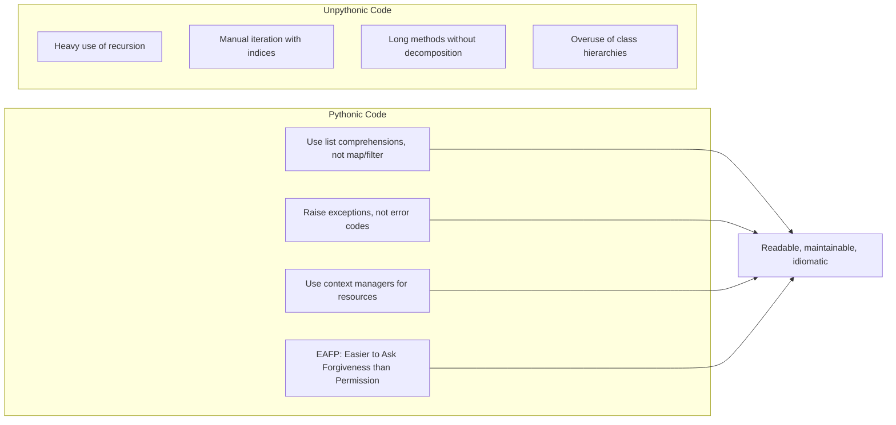
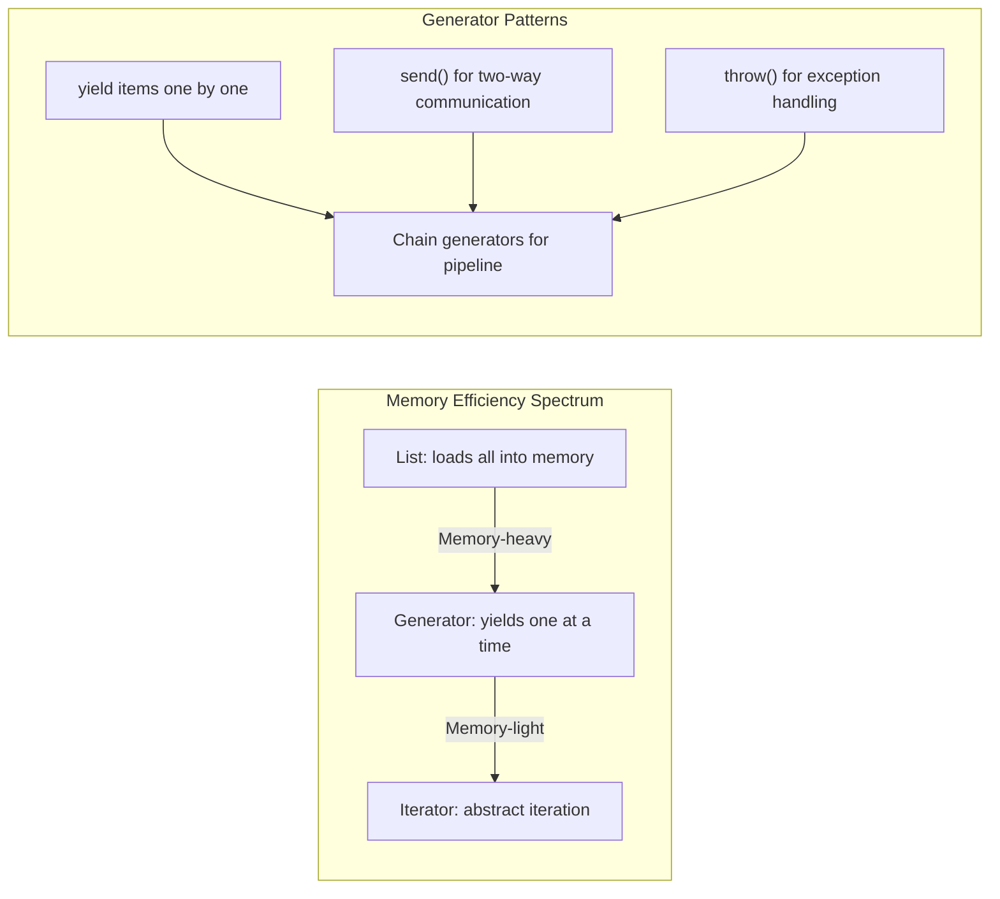

## The Pythonic Mindset

Slatkin's overarching theme: write code that reads naturally in
Python, not code translated from another language.

---

## Functions and Comprehensions

Some of the most impactful patterns from the book:

| Item | Pattern | Why It Matters |
|------|---------|----------------|
| Item 9 | Use `for` loops over `range(len(...))` | Cleaner, less error-prone |
| Item 10 | Prefer `enumerate` over `range` | Access index and value |
| Item 11 | Use `zip` for parallel iteration | Built-in, handles uneven lengths |
| Item 14 | Sort by complex criteria with `key` | Flexible, readable sorting |
| Item 16 | Prefer `get` and `setdefault` for dicts | Avoid key errors |
| Item 27 | Use `@classmethod` for alternative constructors | Clean factory pattern |

---

## Generators and Iterators

**Key insight:** Use generators whenever you process large data.
They transform O(n) memory usage into O(1).

---

## Concurrency

| Model | Best For | GIL Impact | Example Use Case |
|-------|----------|------------|------------------|
| Threading | I/O-bound tasks | GIL limits CPU work | Web scraping, file I/O |
| asyncio | I/O-bound, high concurrency | Not affected | Web servers, APIs |
| multiprocessing | CPU-bound tasks | Separate processes | Data processing, ML |
| concurrent.futures | Simple parallelism | Depends on executor | Map-reduce patterns |

Slatkin's guidance: default to asyncio for I/O, multiprocessing for
CPU, and threads only for wrapping existing blocking libraries.

---

## Metaclasses and Decorators

Advanced patterns for when you need them:

| Pattern | Use Case | Example |
|---------|----------|---------|
| `@property` | Controlled attribute access | Validation on set |
| `__getattr__` | Dynamic attribute lookup | Proxy objects |
| Metaclasses | Class creation customization | ORMs, validators |
| Descriptors | Reusable attribute behavior | Type-checked fields |

**Warning:** Slatkin recommends metaclasses only when simpler
patterns (decorators, descriptors, `__init_subclass__`) do not
suffice.

---

## Key Lessons

- **Write code for readers, not computers.** Python's clarity
  advantage is lost when you write clever one-liners.
- **Use the standard library.** Before writing a utility, check
  `itertools`, `collections`, `functools`, and `contextlib`.
- **Prefer generators over lists.** They compose well, use less
  memory, and handle infinite sequences.
- **Type annotations are not optional.** They catch bugs and
  document intent. Use `mypy` or `pyright`.
- **Test behavior, not implementation.** Use `unittest.mock`
  sparingly. Test through public APIs.

---

## Action Plan

1. **Read the book front to back once** to build awareness of what
   Python can do.
2. **Keep it as a reference.** When you face a specific problem,
   look up the relevant item.
3. **Adopt two items per week.** Introduce patterns gradually into
   your codebase.
4. **Set up type checking.** Add `mypy --strict` to your CI
   pipeline.
5. **Review code with the items.** Use the 90 items as a code
   review checklist.
