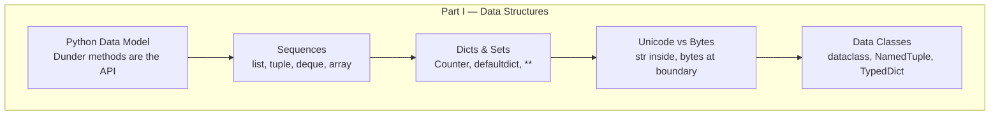

## Introduction

Welcome to BookAtlas. Today: *Fluent Python: Clear, Concise, and
Effective Programming* by Luciano Ramalho. The second edition,
2022. O'Reilly Media. Approximately 1000 pages.

This is a book about thinking in Python instead of transcribing habits
from other languages into Python syntax. If you write Python and have
ever looked at a senior developer's code and thought "I do not
understand what that does," this book is for you.

---

## Who Luciano Ramalho Is

Luciano Ramalho is a Brazilian Pythonista, a Principal Consultant at
ThoughtWorks São Paulo, a Fellow of the Python Software Foundation,
and a co-founder of Garoa Hacker Clube — Brazil's first hackerspace.

He has been teaching Python since the late 1990s. He came to Python
from Perl and Java in 1998 and never looked back. He has taught
thousands of developers through Python.br, PyCon Brasil, and corporate
trainings at ThoughtWorks. That background matters: the book is shaped
by someone who has watched thousands of students make the same
mistakes.

---

## The Central Thesis

**Engineer:** Python deceptively simple. The surface is small. You can
become productive in a few days. That simplicity is honest — Python
does not hide its internals from you.

**Skeptic:** If it is so simple, why is this book a thousand pages?

**Engineer:** Because Python's surface simplicity conceals real depth.
The language exposes its design. The data model is not hidden. The
iterator protocol is not obfuscated. But most developers who come from
Java, C++, or JavaScript never look below the surface. They write
Python syntax with non-Python habits.

The book's job is to show you what is under the surface and then teach
you to use it. Every chapter is an application of the ideas in the
first chapter.

---

## Part 0 — The Python Data Model

The first chapter is the spine of the entire book. Ramalho's key
insight: Python's data model is the contract between your objects and
the language.

When you write `len(x)`, Python calls `x.__len__()`. When you write
`for item in x`, Python calls `x.__iter__()`. When you write `x + y`,
Python calls `x.__add__(y)`.

This is not hidden magic. It is an API. The book's message: **implement
the API, get the language construct for free.**

The must-implement list is small. `__repr__`, `__str__`, `__eq__`,
`__hash__`, `__len__`, `__bool__`, `__iter__`, `__getitem__`,
`__contains__`, `__call__`, `__enter__` / `__exit__` — about a dozen
methods. Implement them on your class and your class works with `len()`,
`for`, `in`, `print()`, `repr()`, `==`, with-statements, and more —
without any of those constructs knowing anything about your class.

---

## Part I — Data Structures

**Skeptic:** What is there to say about lists and dicts? They are in
every programming language.

**Engineer:** Python's built-in types are not naive implementations.
They are carefully designed data structures with specific performance
characteristics. The book treats each one as the structure it actually
is.

**Sequences** — `list`, `tuple`, `str`, `bytes`, `deque` — all support
the same protocol. The book's guidance on when to reach for each is
immediately practical: `deque` for FIFO, `tuple` for fixed records,
`array.array` for compact numeric storage, `str` for text. Most
developers reach for `list` by default. The book helps you reach for
the right tool.

**Dictionaries and sets** are the most-used structures in the
language. The 2nd edition highlights three techniques: `defaultdict`
for eliminating `if key not in d` boilerplate, `Counter` for
one-line counting, and the `**` unpacking syntax for clean merging.
Regular dicts are now insertion-ordered since Python 3.7 — `OrderedDict`
is no longer needed.

**The Unicode chapter** is the one most readers say changed how they
write code permanently. The mental model: `str` is text, `bytes` is
binary, `bytearray` is mutable binary. Work in `str` everywhere inside
your program. Encode at the boundary, decode at the boundary, pass
`encoding='utf-8'` explicitly every time.

**Data classes** represent a Python 3.7+ evolution. `@dataclass`
generates `__init__`, `__repr__`, and `__eq__` from annotations. The
book gives you a decision framework: `dataclass` for mutable records,
`NamedTuple` for immutable ones, `TypedDict` for JSON-shaped dicts.

---



---

## Part II — Functions as Objects

**Skeptic:** Functions are functions. What more is there to say?

**Engineer:** In Python, functions are values. Store them in dicts,
pass them to other functions, return them from factories, inspect their
`__name__`, `__doc__`, `__defaults__`, `__annotations__` at runtime.
This is the foundation of decorators, dependency injection, the
strategy pattern, and most of Python's standard library.

**List comprehensions over map/filter.** The book's position is clear:
```python
# Preferred
squares = [x * x for x in range(10) if x % 2 == 0]
# Less clear
squares = list(map(lambda x: x * x, filter(lambda x: x % 2 == 0, range(10))))
```

**Decorators and closures** get three full chapters. The late-binding
bug in loops:
```python
# Bug — all functions return 4
funcs = [lambda: i for i in range(5)]
# Fix — capture current value as default argument
funcs = [lambda i=i: i for i in range(5)]
```

Parameterized decorators are a three-level function: factory takes
parameters, returns a decorator, takes the function, returns the
wrapper. `functools.wraps` is non-negotiable.

**Type hints** are treated as metadata for static analysis and
documentation. They have no runtime effect unless you call
`typing.get_type_hints()` or use Pydantic. The book recommends hints
where they clarify intent and skips them where names are obvious.

---

## Part III — Object-Oriented Idioms

**Skeptic:** I know OOP. Classes, inheritance, methods. Why do I need
a whole part on this?

**Engineer:** Because most developers who come to Python from Java or
C++ bring their language's OOP habits. And those habits are wrong for
Python.

**References and mutability.** Variables in Python are *references* to
objects, not boxes. `==` calls `__eq__` (value equality). `is` checks
identity (same object). Default equality falls back to `is`. For mutable
types, default equality is almost never what you want.

`copy.copy` gives you a new outer container with the same inner objects.
`copy.deepcopy` gives you a new everything. When in more doubt, make
your objects immutable.

**Protocols over inheritance.** `typing.Protocol` gives you structural
typing — `isinstance(x, Sized)` is True if `x` has a `__len__` method,
regardless of whether `Sized` is in its inheritance chain. This is duck
typing that your type checker understands.

The guidance: use Protocols by default. Use ABCs when you need to share
implementation through abstract methods.

**Operator overloading has rules.** `+` should be addable. If `a + b`
works, `a += b` should too. Commutative operations should be
commutative. Implement `__repr__` as unambiguous, `__str__` as
human-friendly. The `Vector2d` class in the book is a masterclass.

---

## Part IV — Control Flow

**Skeptic:** Control flow is loops and conditionals. How do you fill a
whole part of a book on this?

**Engineer:** Python has multiple control-flow abstractions that most
developers never fully connect.

**Iterators and generators.** The iterator protocol is two methods:
`__iter__` and `__next__`. `for` loops, `sum()`, `any()`, `all()`,
`map()`, `filter()`, `zip()` — all of them use the protocol.
Generators make lazy sequences trivial:
```python
def fibonacci():
    a, b = 0, 1
    while True:
        yield a
        a, b = b, a + b
```

Memory efficient. Infinite sequences are fine. Composable with
`itertools`.

**Context managers.** `with` guarantees cleanup. `@contextmanager`
lets you write one as a generator:
```python
@contextmanager
def timer(label):
    t0 = time.perf_counter()
    try:
        yield
    finally:
        print(f'{label}: {time.perf_counter() - t0:.3f}s')
```

**Coroutines and async/await.** The book traces the evolution:
generator-based coroutines (`@asyncio.coroutine`, `yield from`) to
native coroutines (`async def`, `await`). The guidance is sober:
asyncio is for I/O-bound concurrency with many simultaneous connections.
Not for CPU-bound work. Not a speedup for a single operation.

**concurrent.futures** is the simpler option for many "do N things
concurrently" problems. `ThreadPoolExecutor` is often the right answer
when you are bridging to legacy I/O-bound libraries.

---

## Part V — Metaprogramming

**Skeptic:** Metaprogramming sounds like wizardry. Is it practical?

**Engineer:** For most developers, no. The book agrees. Its rule of
thumb: use metaprogramming only when simpler tools fail.

**Properties.** `@property` turns a method into a computed attribute.
Use it for computed values and validation. Not for hiding expensive
computation — that is `functools.cached_property`'s job.

**Descriptors.** The mechanism behind `property`, `classmethod`,
`staticmethod`, and method binding. Once you understand descriptors, you
understand how Python attributes really work — and you can build your
own descriptor-based APIs. This is the foundation of ORMs like
SQLAlchemy.

**Class decorators and `__init_subclass__`.** The 2nd edition's big
shift: class decorators and PEP 487 hooks replace metaclasses for most
practical purposes. Metaclasses are now the tool of last resort,
reserved for framework authors who need to enforce creation policies
across many user classes.

---

## The Narrative Through-line

The book's argument is cumulative. The data model chapter gives you the
primitives. Parts I through III apply those primitives to increasingly
complex problems: data structures, functions, objects. Part IV shows
you how the same ideas extend to control flow. Part V shows you how to
customize the language itself.

The unspoken message: Python is a coherent language. The same design
principles apply from the simplest list comprehension to the most
complex metaclass.

---

## The Practical Impact

Reading this book changes how you read other people's Python code.
Suddenly `__getitem__` in a library is not mysterious — it is the
sequence protocol. `@property` is not magic — it is a descriptor with
a nice syntax. `await` is not obscure syntax — it is a coroutine
yielding control to an event loop.

The developers who need this book most are the ones writing Python
fluently but not *idiomatically*. Their code works. It is just longer,
more verbose, and more fragile than it needs to be.

---

## The Verdict

Fluent Python is not a beginner book. It is not a quick reference. It
is the book that takes you from "I can write Python" to "I understand
Python." The 2nd edition is substantially better than the first —
expanded, reorganized, updated for modern Python.

**Rating: 9.5/10** — The single best book for becoming a fluent Python
programmer. Essential if you write Python professionally.

---

This has been a BookAtlas narration of Fluent Python by Luciano
Ramalho. Thanks for listening.
