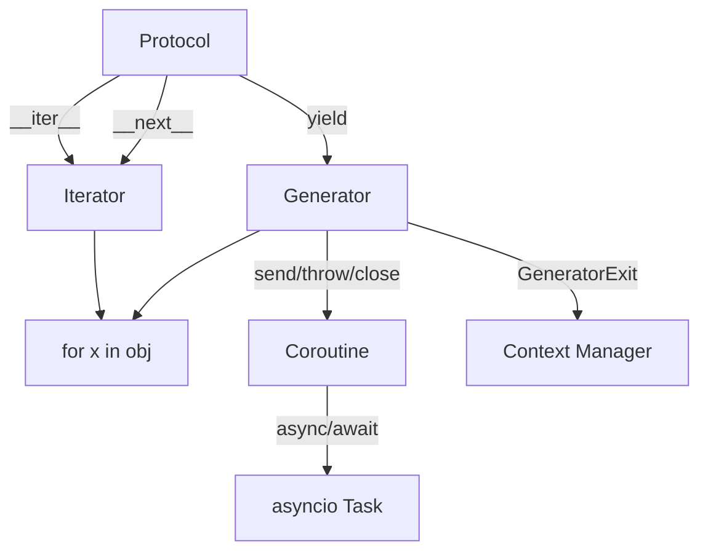
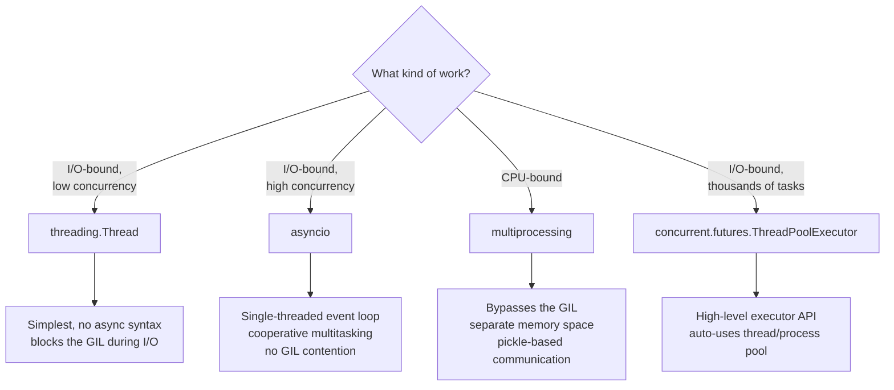

## The Recipe Format

Every recipe in *Python Cookbook* follows the same three-part
template: **Problem**, **Solution**, **Discussion**. This is not
a stylistic choice — it is the book's central design decision, and
it shapes how you read the book.

| Section | Length | Purpose |
|---|---|---|
| Problem | 1-3 sentences | A concrete, real-world task ("You need to read a CSV with a mixed encoding") |
| Solution | 5-30 lines of code | A runnable, self-contained, idiomatic answer |
| Discussion | 1-2 pages | The mechanism, the alternatives, the gotchas, the cross-references |

The format means the book does not flow like a textbook. It
*indexes* like one. The recipes are grouped by chapter
(data structures, strings, I/O, classes, metaprogramming,
concurrency...), but within a chapter they are loosely ordered by
difficulty and loosely cross-referenced. You read it the way you
read a dictionary: not cover to cover, but topically, in
chunks.

This is also why the book ages well. Recipes about
`collections.deque`, `heapq`, `itertools.groupby`, and the
descriptor protocol do not change between Python 3.3 and 3.13.
Recipes that use the deprecated `@asyncio.coroutine` syntax do.
The book is therefore *mostly* timeless, with a small set of
recipes that need translation to the modern idiom.

---

## Chapter Map

The book has 15 chapters, split into two halves: the language
and standard library, then application domains.


Three chapters form the "spine" of the book: **Iterators and
Generators (Ch 4)**, **Data Encoding (Ch 6)**, and **Classes
and Objects (Ch 8)**. Most other chapters reference these
repeatedly. If you read only three chapters, read those three.

---

## Data Structures: The Right Tool for the Job

Chapter 1's recurring theme: **the default `list` is rarely
the best tool**. Python's standard library gives you a typed
data structure for almost every shape of problem, and the
*Cookbook* spends an entire chapter showing when to reach for
which.

| Structure | Use for | Why not `list` |
|---|---|---|
| `collections.deque` | FIFO queues, sliding windows | O(1) `appendleft`/`popleft`; `list.insert(0, x)` is O(n) |
| `heapq` (with `list`) | Priority queues, top-N from a stream | O(log n) push/pop; no extra class to maintain |
| `collections.OrderedDict` | Insertion-ordered maps (pre-3.7) | Equality compares order too; moves to end on update |
| `collections.Counter` | Tallying, multisets | `Counter.most_common(n)` is the canonical "top N" idiom |
| `collections.defaultdict` | Grouping, accumulating | No `KeyError` for first access; set the factory once |
| `array.array` | Compact numeric storage | C-type-sized elements; ~4x memory savings over `list` of ints |
| `dict` with `setdefault` | Sparse data, per-key accumulation | Avoids the `if key in d` / `d[k] = ...` dance |
| `bisect` (with `list`) | Sorted insertion, membership in sorted data | O(log n) lookup; keeps the list sorted for you |

### The "Top N from a Stream" Recipe

The most-cited recipe in the chapter. You have a stream of items
(log lines, sensor readings, search results) and want the
largest 10, but you cannot fit the stream in memory:

```python
import heapq

class PriorityQueue:
    def __init__(self):
        self._heap = []

    def push(self, item, priority):
        heapq.heappush(self._heap, (-priority, item))

    def pop(self):
        return heapq.heappop(self._heap)[1]

def top_n(items, n=10):
    """Largest n items from an iterable, in O(n log n) time,
    O(n) memory — does not sort the whole stream."""
    pq = PriorityQueue()
    for item in items:
        pq.push(item, item)  # for Orderable items
    return [pq.pop() for _ in range(n)]
```

The book's version is more general (it accepts any priority
function and any item), but the trick is the same: a min-heap of
size N gives you "the largest N so far" in O(N log N) time and
O(N) space, regardless of the total stream size.

### The "Group Adjacent by Key" Recipe

`itertools.groupby` is one of the most-misused functions in
Python. The *Cookbook* shows the canonical pattern:

```python
from itertools import groupby
from operator import itemgetter

rows = [
    {'city': 'NYC', 'temp': 72},
    {'city': 'NYC', 'temp': 68},
    {'city': 'LA',  'temp': 85},
    {'city': 'LA',  'temp': 90},
]

# Groupby requires sorted input. The book is emphatic about this.
rows.sort(key=itemgetter('city'))
for city, group in groupby(rows, key=itemgetter('city')):
    temps = [r['temp'] for r in group]
    print(f'{city}: avg={sum(temps)/len(temps):.1f}')
```

The gotcha: `groupby` does not buffer or sort. It only groups
*adjacent* equal keys. If the input is not pre-sorted, you get
silently wrong answers.

---

## Strings and Text: Unicode Is the Whole Game

Chapter 2's most important lesson: **in Python 3, `str` is
text and `bytes` is binary. They do not mix. Encode at the
boundary, decode at the other end.**

The recipes cover:

- **Matching with `re`**: named groups, lookaheads, verbose
  mode, `re.compile` reuse.
- **String normalization**: `unicodedata.normalize('NFC', s)`
  for comparing accented characters; `casefold()` for
  case-insensitive matching.
- **`str.translate`**: faster than regex for single-character
  substitutions, with `str.maketrans` for table construction.
- **Tokenizing vs. parsing**: split on whitespace with
  `re.split(r'\s+', s)`, but for quoted delimiters use
  `re.findall` with a properly-built pattern.
- **`textwrap` and `string.Template`**: when you do not need
  Jinja2.

The "sanitize and normalize filenames" recipe is the most
copied code in the chapter:

```python
import unicodedata
import re

def clean_filename(name):
    # Strip non-ASCII, normalize accents, replace whitespace.
    cleaned = unicodedata.normalize('NFKD', name)
    cleaned = cleaned.encode('ascii', 'ignore').decode('ascii')
    cleaned = re.sub(r'[^\w\s-]', '', cleaned).strip().lower()
    return re.sub(r'[-\s]+', '-', cleaned)
```

The discussion explains why each step exists — the NFKD
decomposition separates base characters from combining marks,
the ASCII encode-then-decode drops the marks, and the regex
chain produces a filesystem-safe slug.

---

## Iterators and Generators: The Spine of the Language

Chapter 4 is the heart of the book. The recipes show that
generators, iterators, and (later) coroutines are the *same
idea* in different costumes: a producer that yields values
lazily, with the consumer pulling at its own pace.



### Delegating Generators: `yield from`

The "delegating to a subgenerator" recipe is the most-cited
in the chapter:

```python
def flatten(items):
    """Flatten an arbitrarily nested list."""
    for item in items:
        if isinstance(item, (list, tuple)):
            yield from flatten(item)  # delegate to recursive call
        else:
            yield item
```

Before `yield from` (added in 3.3), this required a
`for`-loop wrapper around a recursive `yield`. The PEP 380
change made generator delegation a single keyword.

### Itertools Recipes

The chapter ends with a block of `itertools` recipes that
became so influential they were re-published as a separate
document ("Itertools Recipes" in the Python docs). Highlights:

- `take(n, iterable)` — first n items, no slicing.
- `tabulate(func, start=0)` — `0, f(0), 1, f(1), 2, f(2), ...`.
- `first(predicate, default)` — first item matching predicate.
- `all_equal(iterable)` — true if all items are equal (uses
  `groupby`).
- `consume(iterator, n)` — advance an iterator n steps without
  pulling values.
- `chunked(iterable, n)` — yield successive n-sized chunks.
- `nth_combination(iterable, n, r)` — the nth combination.

The book's `pairwise` recipe (`s -> (s0,s1), (s1,s2), (s2,s3),
...`) was eventually added to the standard library as
`itertools.pairwise` in Python 3.10.

---

## Data Encoding: Encode at the Boundary

Chapter 6's central rule: **parse the wire format once into
native Python objects, then operate on those**. The
alternative — letting JSON, CSV, or XML leak into your business
logic — is the most common source of messy code in real
codebases.

The chapter covers the four formats you will encounter most:

| Format | Reader | Writer | Notes |
|---|---|---|---|
| CSV | `csv.reader`, `csv.DictReader` | `csv.writer`, `csv.DictWriter` | Handle dialect sniffing; open files with `newline=''` |
| JSON | `json.load`, `json.loads` | `json.dump`, `json.dumps` | Custom encoders for `datetime`, `Decimal`; `object_hook` for parsing |
| XML | `xml.etree.ElementTree` | `xml.etree.ElementTree`, `xml.dom.minidom` | XPath via `tree.findall('.//tag')`; iteration via `tree.iter()` |
| Binary | `struct.pack(fmt, ...)`, `pickle` | `struct.unpack`, `pickle.dump` | Pickle is not secure; never unpickle untrusted input |

The "decoding and encoding custom JSON" recipe is the
workhorse:

```python
import json
from datetime import datetime, date

class CustomEncoder(json.JSONEncoder):
    def default(self, obj):
        if isinstance(obj, (datetime, date)):
            return obj.isoformat()
        if isinstance(obj, complex):
            return {'__complex__': True, 'real': obj.real, 'imag': obj.imag}
        if isinstance(obj, set):
            return {'__set__': True, 'values': list(obj)}
        return super().default(obj)

def custom_decoder(dct):
    if '__complex__' in dct:
        return complex(dct['real'], dct['imag'])
    if '__set__' in dct:
        return set(dct['values'])
    return dct

# Round-trips datetime, complex, and set
text = json.dumps({'when': datetime.now(), 'n': 1+2j}, cls=CustomEncoder)
obj = json.loads(text, object_hook=custom_decoder)
```

The discussion is unusually careful: it warns that this is a
*demo*, not a recommendation. In production code, prefer
standard formats (ISO 8601 for datetimes) and a schema
validation step (Pydantic, attrs, or `jsonschema`) at the
boundary.

---

## Classes and Objects: The Protocols That Make It Python

Chapter 8 is where the book's "stdlib-first" stance pays off
the most. The recipes show that Python's most powerful
language features are not *new syntax* — they are *protocols
already in the standard library*, available for your classes
to opt into.

The chapter organizes protocols by what they unlock:

- **Container protocols** (`__len__`, `__getitem__`,
  `__setitem__`, `__delitem__`, `__contains__`, `__iter__`)
  — make your class work with `len()`, indexing, slicing,
  `in`, and `for`.
- **Numeric protocols** (`__add__`, `__mul__`, `__lt__`, etc.)
  — operator overloading.
- **Context-manager protocol** (`__enter__`, `__exit__`) —
  resource lifecycle.
- **Descriptor protocol** (`__get__`, `__set__`,
  `__delete__`) — attribute access (this is the one that
  powers `@property`).
- **Callable protocol** (`__call__`) — make instances
  callable.

### Context Managers from Generators

The most elegant recipe in the chapter: write a context
manager as a *single generator with one `yield`*:

```python
import contextlib

@contextlib.contextmanager
def timer(label):
    start = time.perf_counter()
    try:
        yield  # the body of the `with` runs here
    finally:
        elapsed = time.perf_counter() - start
        print(f'{label}: {elapsed:.3f}s')

with timer('load_data'):
    data = load_big_file()
```

`contextlib.contextmanager` rewrites the generator into a
proper context manager. The book's discussion is explicit:
this is the right tool for *most* context managers. The
class-based form (`__enter__`/`__exit__`) is for cases where
you also need to implement the context-manager protocol on
something that has other state.

### Properties: Computed Attributes

The "computed attribute" recipe is the most-reused piece of
Python code in any codebase:

```python
class Product:
    def __init__(self, base_price, tax_rate):
        self.base_price = base_price
        self.tax_rate = tax_rate

    @property
    def price(self):
        return self.base_price * (1 + self.tax_rate)

    @price.setter
    def price(self, value):
        self.base_price = value / (1 + self.tax_rate)
```

The discussion is where the *Cookbook* shines. It explains
that `@property` is just a *descriptor* — a callable stored
on the class that intercepts attribute access. The same
mechanism powers `@classmethod`, `@staticmethod`, and method
binding. Understanding descriptors unlocks most of Python's
"magic."

---

## Metaprogramming: The Last Resort

Chapter 9 is the book's most opinionated. The thesis: most
metaprogramming problems have simpler solutions. Reach for
the simple tool first.

| Tool | Use when | Avoid when |
|---|---|---|
| Decorators | Wrapping a function with cross-cutting behavior (timing, logging, retry) | You need to inspect the function's signature in detail |
| Class decorators | Modifying a class after `class` statement (registering, adding methods) | The modification is structural (inheriting from a different base) |
| `__init_subclass__` | Hooking subclass creation; the modern metaclass replacement | You also need to control instance creation |
| `__set_name__` (3.6+) | Descriptors that need to know the attribute name | You do not need the attribute name |
| `importlib` import hooks | Custom module loading (e.g., loading from a database) | You could put the loading logic in a regular function |
| Metaclasses | You are building a framework where subclasses are *expected* to customize class creation (Django models, SQLAlchemy declarative) | You control all the classes in question (use a class decorator) |

The book's metaclass recipe is unusually careful. It builds
a debugging metaclass that prints class creation events —
not because you should use it, but because seeing class
creation in action makes the mechanism concrete. The
discussion is unambiguous: most code never needs a
metaclass, and reaching for one is usually a sign you are
designing at the wrong level.

---

## Concurrency: Three Different Problems

Chapter 12 is the book's most practically valuable chapter
for working developers. Its core argument: **concurrency is
three different problems, and they have three different
solutions**.



The book's "picking the right primitive" recipe is a
decision tree:

- **I/O-bound, blocking libraries available, low concurrency
  (≤100 connections)**: use a thread pool. It is the simplest
  and works with anything.
- **I/O-bound, many connections (thousands+), can write
  non-blocking code**: use `asyncio`. The event loop scales
  because there is no thread per connection.
- **CPU-bound, embarrassingly parallel, <32 cores**: use
  `concurrent.futures.ProcessPoolExecutor`. The pool
  manages the workers; you submit callables and get futures
  back.
- **CPU-bound, fine-grained, must run in the main process**:
  use C extensions or NumPy/Numba. The GIL is real, and no
  amount of Python code can dodge it for CPU-bound work.

The `concurrent.futures` API is the book's preferred
interface for both threads and processes. It hides the
plumbing and gives you `submit()`, `map()`, and `as_completed()`.

---

## Network and Web Programming

Chapter 11's key insight: **the modern Python network
programmer does not write socket code**. The recipes
progress from raw `socket` (for understanding) to
`socketserver` (for simple servers) to `asyncio` (for
high-concurrency servers) to third-party libraries (for
production HTTP).

The "high-concurrency HTTP server with `asyncio`" recipe is
the most-cited in the chapter:

```python
import asyncio

async def handle_client(reader, writer):
    data = await reader.read(100)
    message = data.decode()
    addr = writer.get_extra_info('peername')
    print(f'Received {message!r} from {addr}')
    writer.write(data)
    await writer.drain()
    writer.close()

async def main():
    server = await asyncio.start_server(
        handle_client, '127.0.0.1', 8888)
    addr = server.sockets[0].getsockname()
    print(f'Serving on {addr}')
    async with server:
        await server.serve_forever()

asyncio.run(main())
```

The discussion is where the book's value shows: it
explains that `asyncio.start_server` is a *callback-based*
API wrapped in coroutine sugar. The actual work is in the
`handle_client` coroutine, which is awaited by the event
loop. The pattern (await, await, close) is the same for
every high-concurrency I/O program.

---

## C Extensions: The Escape Hatch

Chapter 15 is for the rare case where the standard library
and the third-party ecosystem cannot deliver. The recipes
cover, in order of increasing investment:

1. **`ctypes`**: call into existing C shared libraries
   without writing any C. Type signatures as strings, function
   pointers loaded with `CDLL`. Fast to write, slow at
   runtime.
2. **`cffi`**: same as `ctypes`, but with a more ergonomic
   Python-side API. Faster to develop, comparable speed.
3. **SWIG**: generate bindings for a C/C++ library given
   annotations. Beazley wrote SWIG, so this section is
   authoritative.
4. **Boost.Python**: write C++ that exposes itself to
   Python. Powerful but heavyweight.
5. **Cython**: write annotated Python that compiles to C.
   The recipe is a sketch; the book is honest that Cython
   is its own book.
6. **Hand-rolled extension**: write the C code, build it
   with the Python C API, ship the `.so`. Most expensive
   in time, fastest at runtime, full control.

The book's stance: prefer Cython or `cffi` for new work;
use SWIG when you have an existing C library; write hand-
rolled extensions only when nothing else will do.

The discussion is unusually grounded. It includes
timing benchmarks for the Fibonacci sequence, showing
that `ctypes` is 10x slower than the Python loop (because
of the call overhead), while a hand-rolled C extension is
100x faster. The cost/benefit is the book's focus, not
the technique itself.
