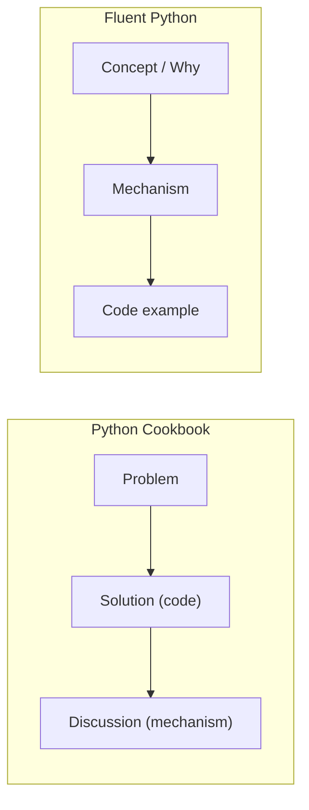

## Strengths

- **The recipe format is precisely what working developers
  need.** Most Python problems are small and well-bounded:
  "I have this list, I need that output." A reference that
  maps problem -> solution -> discussion in three pages is
  faster to use than any tutorial, and faster than any
  single-narrative book. The format is also forgiving — you
  can skip whole chapters without losing thread.

- **The standard-library coverage is unmatched.** No other
  book in print covers `collections`, `itertools`,
  `functools`, `contextlib`, `pathlib`, `concurrent.futures`,
  and the rest with this density of practical, working
  examples. The book is, in part, a guided tour of the
  modules most developers only know partially.

- **The data-structures chapter is a masterclass.** The
  recipes for priority queues, sorted insertion, multiset
  operations, and grouping are the cleanest explanations
  available. The discussion of *why* `list` is rarely the
  right answer is more persuasive than any blog post on the
  same topic.

- **The iterators-and-generators chapter is the spine of
  the book.** It connects generators, coroutines, context
  managers, and the basis of `asyncio` under one
  conceptual roof. If you read only one chapter, read
  this one. The `itertools` recipes at the end became the
  canonical reference (and were eventually absorbed into
  the Python docs).

- **The concurrency chapter is the clearest decision tree
  available.** Threads vs. processes vs. `asyncio` is a
  question every working Python developer eventually
  faces. The *Cookbook*'s treatment — when to use which,
  with measured benchmarks and a clear preference for
  `concurrent.futures` — is more useful than any single
  blog post on the topic.

- **The metaprogramming chapter is unusually honest.** It
  treats metaclasses as a last resort, not a badge of
  honor. The recipes build up from decorators to class
  decorators to `__init_subclass__` to metaclasses, and
  the discussion at each level is explicit about when
  the simpler tool is enough. The book is one of the few
  that does not encourage the reader to over-engineer.

- **David Beazley's authority is real and relevant.** The
  SWIG chapter is the most authoritative SWIG tutorial in
  print, because Beazley wrote SWIG. The C extensions
  chapter benefits from his deep familiarity with the
  Python C API. The author's expertise in the trickiest
  corners of the language is a feature, not a bug.

---

## Weaknesses

- **Ages out of date in measurable ways.** The 3rd edition
  is from 2013. It predates structural pattern matching
  (`match`/`case`), the `int | None` union syntax,
  `typing.Protocol` (in its modern form), `asyncio.TaskGroup`,
  the post-3.10 type-hint changes, and most of the
  modern `asyncio` API. The `asyncio` recipes use the
  deprecated `@asyncio.coroutine` and `yield from` syntax,
  which was deprecated in 3.8 and removed in 3.11. None
  of this makes the book wrong, but it does require
  translation work for modern readers.

- **The recipe format is not for everyone.** Some readers
  want a coherent narrative — a book that takes you from
  "what is Python?" to "I understand the language." The
  *Cookbook* is not that book. It assumes you already
  understand Python; it just answers specific questions.
  If you read it cover to cover, you will find the
  chapters repetitive and the transitions awkward. The
  book is at its best as a *reference* you consult, not a
  *narrative* you read.

- **The treatment of modern Python is thin.** No coverage
  of `dataclasses` (added in 3.7), `typing.Protocol` and
  the structural typing story, `pathlib`'s modern form,
  `asyncio.Queue`, `contextvars`, or `zoneinfo` (replaced
  `pytz`). For developers writing modern Python 3.10+
  code, the book needs to be supplemented with a more
  recent text — most commonly *Fluent Python* 2nd edition
  (2022), which is the spiritual successor.

- **The data-encoding chapter is not security-aware
  enough.** The `pickle` recipe says "never unpickle
  untrusted input" and moves on. By 2026 standards, the
  discussion of `yaml.load` (which executes arbitrary
  code) is too brief. The book is also pre-dates the
  widespread adoption of `pydantic` and `attrs` for
  schema validation; the boundary-encoding discussion
  would benefit from these tools.

- **Some chapters are denser than they need to be.** The
  C extensions chapter includes a from-scratch C
  extension for the Fibonacci sequence. The point is
  clear, but the recipe is too long for a reference; a
  shorter sketch with the full code in a downloadable
  archive would be more practical. The same critique
  applies to the SWIG chapter, which is thorough enough
  to be a small book on its own.

- **The testing chapter is thin by 2026 standards.** No
  coverage of `pytest` (the de facto standard), `hypothesis`
  for property-based testing, or modern mocking patterns.
  The `unittest.mock` recipes are correct but represent a
  pre-`pytest` approach to testing. Developers joining a
  modern codebase will need a separate testing book.

---

## Controversy: Recipes vs. Pedagogy

### Recipes Are Not Tutorials

The *Cookbook*'s central design decision — problem -> solution
-> discussion — is also its most contested. Luciano Ramalho
(*Fluent Python*) explicitly positions his book as the
pedagogical alternative: he explains *why* the idioms work
before showing *how*. The *Cookbook* inverts the order: it
shows the idiom first, then explains.

Neither approach is wrong; they serve different readers.
A developer who already knows Python and needs a quick
answer prefers the *Cookbook* format. A developer who wants
to understand the language deeply prefers *Fluent Python*.
The *Cookbook* is more useful as a *desk reference*;
*Fluent Python* is more useful as a *teaching text*.

### The Standard Library Is Enough (Usually)

The book is dogmatic about not reaching for external
packages. Most recipes solve the problem with the standard
library, even when a third-party package would be simpler.
This is a feature for some readers (no dependency
management) and a bug for others (no `pandas` for tabular
data, no `requests` for HTTP).

The book's stance is principled: if you cannot solve a
problem with the standard library, you may not understand
the problem yet. By 2026, this stance is harder to defend
in every case. The HTTP recipes, in particular, are
overshadowed by `requests` and `httpx`. The data-encoding
recipes are overshadowed by `pydantic`. The book is
correct that you should *understand* the standard library
solutions before reaching for the third-party ones — but
in production code, the third-party libraries are usually
the right choice.

### Beazley on Async (Then vs. Now)

The `asyncio` chapter was written against a moving target.
`asyncio` was provisional in 2013; the `async`/`await`
syntax (PEP 492) was not added until 2015. The book's
recipes use `@asyncio.coroutine` and `yield from` — the
syntax that was deprecated in 3.8 and removed in 3.11.
Modern readers must mentally translate the recipes before
applying them. The conceptual content (when to use `asyncio`,
how the event loop works, what coroutines are) is still
correct; the syntax is not.

This is the book's most concrete example of the
"timeless standard library recipes, dated language syntax"
pattern. It is also why no 4th edition has appeared: the
changes between 2013 and 2026 (pattern matching, new typing,
`asyncio.TaskGroup`, structural typing, modern union syntax)
would amount to a substantial rewrite.

---

## Comparison to Similar Books

| Book | Difference |
|---|---|
| *Fluent Python* (Ramalho, 2nd ed. 2022) | More pedagogical, more modern. Read *Fluent Python* for the *why*; reach for the *Cookbook* for the *how*. The two complement each other more than they compete. |
| *Effective Python* (Slatkin, 2nd ed. 2019) | 90 short items. Less depth, more breadth. Useful as a desk reference alongside the *Cookbook*; covers some of the same ground in a different format. |
| *Python Tricks* (Bader, 2017) | Gentler, shorter, intermediate-level tour. A good first book; the *Cookbook* is the second book most Pythonistas should own. |
| *High Performance Python* (Gorelick & Ozsvald, 2020) | Focused on performance. The *Cookbook*'s C extensions and concurrency chapters are a foundation for it. |
| *Architecture Patterns with Python* (Percival & Gregory, 2020) | Higher-level: domain-driven design, event-driven architectures, CQRS. Uses some of the *Cookbook*'s metaprogramming and concurrency recipes as building blocks. |
| *The Python Language Reference* (python.org) | The official specification. The *Cookbook*'s discussions reference it, but the spec is not a teaching text. |
| *Python Essential Reference* (Beazley, 4th ed. 2009) | Beazley's own desk reference. Covers the language more exhaustively but with less problem-solving focus. Now out of date; the *Cookbook* is the modern Beazley reference. |
| *Python in a Nutshell* (Martelli, Ravenscroft, Holden, 3rd ed. 2017) | Similar to *Essential Reference*. A more complete language reference; the *Cookbook* is more focused on recipes. |

---

## The Standard Library: A Mental Map

The book's "first reach for the standard library" stance
is supported by the actual shape of the library. A working
Python developer who knows the right module for each
problem is dramatically more productive than one who
reaches for `pandas` first.

| Problem domain | First-reach standard library module |
|---|---|
| Data structures | `collections`, `array`, `heapq`, `bisect` |
| Iteration | `itertools`, `functools` |
| Text | `re`, `string`, `textwrap`, `unicodedata` |
| Dates/times | `datetime`, `time`, `zoneinfo` |
| Files / paths | `pathlib`, `os`, `shutil`, `tempfile` |
| Serialization | `json`, `csv`, `xml.etree.ElementTree`, `struct`, `pickle` |
| Networking | `socket`, `socketserver`, `asyncio`, `http.server` |
| Concurrency | `threading`, `multiprocessing`, `concurrent.futures`, `asyncio` |
| Processes / shell | `subprocess`, `argparse`, `shlex` |
| Configuration | `configparser`, `logging`, `argparse` |
| Testing | `unittest`, `unittest.mock`, `doctest` |
| Debugging / profiling | `traceback`, `inspect`, `cProfile`, `timeit`, `pdb` |
| Type hints | `typing`, `dataclasses`, `abc` |
| C interop | `ctypes`, `cffi`, `struct` |

Most working Python developers know maybe a third of these
modules well. The *Cookbook*'s coverage of the rest is the
book's most enduring contribution.

---

## Final Assessment

| Dimension | Rating | Notes |
|---|---|---|
| Originality | 8/10 | The recipe format is well-executed; the stdlib-first stance is a deliberate editorial choice |
| Practical Utility | 9/10 | The book you reach for most often when you know Python but forgot the exact idiom |
| Readability | 7/10 | Recipe format is dense; discussions are excellent but require focused reading |
| Timeliness | 5/10 | 2013 edition; `asyncio` chapter needs translation; pre-Python 3.7 |
| Authority | 10/10 | Beazley wrote SWIG and *Python Essential Reference*; few authors know the corners as well |
| Standard Library Coverage | 10/10 | The most complete treatment of the stdlib in print |
| **Overall** | **8/10** | The reference most Python developers will use most often, with the caveat that it needs supplementation for modern Python |

*If you write Python professionally, keep this on your
desk. Read the iterators/generators, data structures, and
concurrency chapters even if you skip the rest. Pair it
with *Fluent Python* 2nd edition for the modern idiom and
with *Effective Python* 2nd edition for the 90-item
highlights. The three together are the most useful Python
library you can own.*
