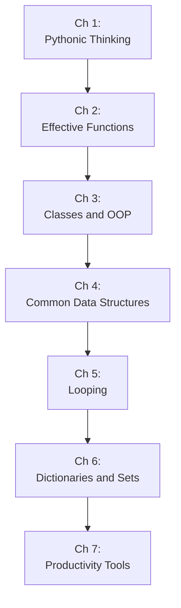

## The Trick Format

Each "trick" in *Python Tricks* is a self-contained essay of roughly
five to ten pages. The format is consistent:

| Element | Purpose |
|---|---|
| Statement | One sentence declaring the pattern or pitfall |
| Example | Runnable Python code, usually 5–30 lines |
| Discussion | Why the pattern works, what alternatives exist, when to use it |
| Gotcha | The one thing most developers get wrong the first time |

The book is arranged in *seven informal sections*, ordered by
difficulty. The difficulty does not mean the later tricks are
harder — it means they build on earlier ones. Read sequentially and
the patterns accumulate naturally.



---

## Pythonic Thinking: The Idioms Every Developer Misses

The opening tricks establish a baseline: *this is how experienced
Python developers think about common situations*. Most of these
idioms are not in beginner tutorials because they are not syntax —
they are habits.

### Chained Comparisons Map to Math

Python's chained comparison operator is one of the language's most
elegant features, and most developers under-use it.

```python
# If x, y, z are numbers:
if 0 < x < 10 < y <= 20:
    ...

# Is not parsed as:
# (0 < x) and (x < 10) and (10 < y) and (y <= 20)
# — which would evaluate x, y, z, and 10 each twice.
# It is parsed as: 0 < x and x < 10 and 10 < y and y <= 20
# — evaluating each value at most once, left to right, short-circuiting.
```

The practical advantage: bounds checks without duplication, and a
mathematical form that reads the way you say it out loud.

### Truthiness as a Feature, Not a Bug

Python's truthiness model is consistent and well-defined. Embracing
it is the first step toward Pythonic code.

```python
def get_user(user_id):
    user = db.get(user_id)
    if user is None:           # explicit, safe
        return None
    if not user:               # uses __bool__ or __len__
        return None
    if user == {} or user == [] or user == "":  # anti-pattern
        return None
```

The canonical pattern: check for `None` explicitly (when zero/empty
is a valid value), and use truthiness everywhere else.

### Zen of Python as a Design Filter

```python
import this
```

The Zen of Python (PEP 20) is 19 aphorisms printed to the REPL. The
most practically useful ones for daily coding:

- *Explicit is better than implicit* — avoid magic that hides behavior.
- *Simple is better than complex* — the one-liner is a prize only if
  it is also readable.
- *There should be one — and preferably only one — obvious way to do
  it* — if you are writing code that only a Python expert would
  recognize, you are probably being clever, not Pythonic.

---

## Effective Functions: The Building Blocks

Functions are the unit of Python. These tricks cover the patterns
professional Python developers use to make functions composable,
safe, and expressive.

### Context Managers and the `with` Statement

Context managers guarantee resource cleanup — files are closed,
locks are released, connections are returned to the pool — even if an
exception is raised inside the block.

The class-based form (`__enter__` / `__exit__`) is verbose for
simple cases. `@contextlib.contextmanager` turns a generator into a
full context manager:

```python
import contextlib
import time

@contextlib.contextmanager
def timer(label):
    start = time.perf_counter()
    try:
        yield
    finally:
        elapsed = time.perf_counter() - start
        print(f'{label}: {elapsed:.3f}s')

# Usage:
with timer('load_data'):
    data = load_big_file()
```

The trick is the mental model: `yield` is the boundary. Everything
before it is setup (entering the context); everything after it is
teardown (exiting the context). The `with` body runs *at* the `yield`.

### Decorators: Higher-Order Functions

A decorator is a function that receives a function and returns a
function. The `@` syntax is sugar for `fn = decorator(fn)`.

```python
import functools
import time

def timer_decorator(fn):
    @functools.wraps(fn)
    def wrapper(*args, **kwargs):
        start = time.perf_counter()
        result = fn(*args, **kwargs)
        elapsed = time.perf_counter() - start
        print(f'{fn.__name__} ran in {elapsed:.3f}s')
        return result
    return wrapper

@timer_decorator
def slow_function():
    time.sleep(0.5)
```

Three rules:
1. Always use `@functools.wraps(fn)` on the wrapper — without it,
   decorated functions lose their `__name__`, `__doc__`, and
   `__module__` (and show up as `wrapper` in every stack trace).
2. Use `*args, **kwargs` on the wrapper when the decorator is generic.
3. A parameterized decorator requires three levels of nesting
   (factory → decorator → wrapper).

### Generators: Lazy Iterators

A function containing `yield` returns a generator object — a lazy
iterator that produces values on demand, never holding the entire
sequence in memory.

```python
def fib():
    a, b = 0, 1
    while True:
        yield a
        a, b = b, a + b

# No infinite loop — the caller pulls values:
fib_gen = fib()
first_10 = [next(fib_gen) for _ in range(10)]
# [0, 1, 1, 2, 3, 5, 8, 13, 21, 34]
```

Generators are the basis of `for`-loops, `itertools`, `sum()`,
`max()`, and `asyncio`. They are also the most memory-efficient way
to process large or infinite sequences.

---

## Classes and OOP: Dunder Methods and Data Classes

Python's object model is defined by protocols — special methods
(dunder methods) that classes implement to integrate with the
language. Understanding these is the difference between using classes
and mastering them.

### `__repr__` and `__str__`

```python
class Book:
    def __init__(self, title, author):
        self.title = title
        self.author = author

    def __repr__(self):
        return f'Book(title={self.title!r}, author={self.author!r})'

    def __str__(self):
        return f'{self.title} by {self.author}'
```

- `__repr__` is for developers: unambiguous, ideally eval-able.
  `repr()` is used in the REPL and in logging.
- `__str__` is for users: human-readable.
- Always implement `__repr__`. Implement `__str__` only when the
  human-readable form differs.

### Data Classes: Boilerplate Removal

```python
from dataclasses import dataclass, field
from typing import List

@dataclass
class Book:
    title: str
    author: str
    year: int = 0
    tags: List[str] = field(default_factory=list)
    isbn: str = ""

# Automatically generates:
# __init__(title, author, year=0, tags=None, isbn="")
# __repr__(self), __eq__(self, other), __hash__ (optional)
```

`@dataclass` generates `__init__`, `__repr__`, `__eq__`, and
`__hash__` from the field annotations. `field(default_factory=list)`
is the correct way to set a mutable default — using `tags: List[str] =
[]` would share the list across all instances.

---

## Looping: Iterators, Iterables, and Comprehensions

The `for`-loop is the workhorse of Python. Its efficiency depends on
understanding the iterator protocol (`__iter__` and `__next__`) and
choosing the right abstraction for the iteration shape.

### `enumerate` and `zip`: The Pairing Tools

```python
# enumerate: index + value, starting at 0 by default
for i, title in enumerate(book_titles, start=1):
    print(f'{i}. {title}')

# zip: parallel iteration over multiple iterables
for title, author in zip(titles, authors):
    print(f'{title} — {author}')

# zip longest (3.10+): fill missing with a sentinel
for left, right in itertools.zip_longest(left_list, right_list, fillvalue=None):
    ...
```

### `for`-`else` and `while`-`else`

The `else` clause on a loop runs *only if the loop completed without
a `break`*. This is the Pythonic "search and report if not found":

```python
def find_first_even(numbers):
    for n in numbers:
        if n % 2 == 0:
            print(f'Found: {n}')
            break
    else:
        print('No even numbers found')
```

This is not a mistake in the language. It is a deliberate design
choice — the `else` clause belongs to the `for`, not to an `if`. The
analogy: `try`/`else` runs the `else` only if no exception occurred.
`for`/`else` runs the `else` only if no `break` occurred.

### Comprehensions: Lists, Sets, Dicts

List comprehensions are the idiomatic way to build a list from an
iterable. Set and dict comprehensions use the same syntax with
`{}`.

```python
# List comprehension
squares = [x**2 for x in range(10)]
evens = [x for x in range(20) if x % 2 == 0]

# Set comprehension (unique, unordered)
unique_lengths = {len(s) for s in strings}

# Dict comprehension
title_by_author = {b.author: b.title for b in books}

# Nested: flatten a matrix
flat = [item for row in matrix for item in row]
```

Rule: if the comprehension is longer than one line, or requires
nested `if`/`else`, use a `for`-loop. Comprehensions are for
*direct transformation*, not for complex logic.

---

## Dictionaries and Sets: The Workhorses

Dicts are the most versatile data structure in Python. Sets are
dicts without values — use them for membership testing and deduplication.

### `dict.setdefault` and `defaultdict`

```python
from collections import defaultdict

# Imperative grouping:
grouped = {}
for item in items:
    key = item['category']
    if key not in grouped:
        grouped[key] = []
    grouped[key].append(item)

# Idiomatic with defaultdict:
grouped = defaultdict(list)
for item in items:
    grouped[item['category']].append(item)
```

`defaultdict(factory)` creates the value on first access using the
factory. `setdefault(key, default)` returns the value if present,
inserts the default if not — useful when the factory is expensive or
stateful.

### Set Operations: The Algebra of Membership

```python
a = {'python', 'ruby', 'javascript'}
b = {'ruby', 'go', 'python'}

a & b   # {'python', 'ruby'}  — intersection
a | b   # {'python', 'ruby', 'javascript', 'go'} — union
a - b   # {'javascript'}  — difference (in a, not in b)
a ^ b   # {'javascript', 'go'} — symmetric difference
```

Sets are O(1) for membership testing. Convert a list to a set to
deduplicate: `unique = list(set(items))` — but only do this when
order does not matter (sets are unordered).

---

## Productivity Tools: Code That Writes Itself

The closing tricks are about tooling — the ecosystem around Python
that makes writing, distributing, and running code faster.

### f-strings: The Formatting Standard

```python
name = "Dan Bader"
count = 47

# Old (% formatting) — avoid:
msg = "%s has %d Python tricks" % (name, count)

# str.format() — avoid in new code:
msg = "{} has {} Python tricks".format(name, count)

# f-string — always prefer in Python 3.6+:
msg = f'{name} has {count} Python tricks'

# f-strings support arbitrary expressions:
msg = f'{name.upper()} has {count ** 2} ({count * count}) tricks'
```

f-strings are faster than both `%` formatting and `str.format()`,
and they are the most readable for expressions of any complexity.
The one security caveat: do not use f-strings with untrusted input
as the format spec (use `str.format` with positional args, or template
libraries, for that case).

### The Walrus Operator (`:=`, Python 3.8+)

PEP 572 added the assignment expression, colloquially the "walrus
operator." It assigns inside an expression, reducing repeated
lookups.

```python
# Without walrus — calls len() twice
if len(items) > 10:
    print(f'Processing {len(items)} items')

# With walrus — call len() once, bind result
if (n := len(items)) > 10:
    print(f'Processing {n} items')

# The canonical loop pattern:
while (line := f.readline()):
    process(line)

# Not valid without parentheses — grammar rule:
if n := len(items) > 10:  # SyntaxError — must parenthesize
if (n := len(items)) > 10:  # Correct
```

The walrus operator is for reducing duplication when a value is used
twice — not for replacing all assignments. If the assignment is
needed later but not immediately, use a regular `=` assignment.

### Structural Pattern Matching (`match`/`case`, Python 3.10+)

PEP 634 added `match`/`case` — Python's most significant control-flow
addition since list comprehensions. It is not just a `switch`
statement. It is a structural *unpacking* mechanism.

```python
def handle_response(resp):
    match resp:
        case {"status": 200, "body": data}:
            return process(data)
        case {"status": 404}:
            return handle_not_found()
        case {"status": code, "error": msg} if code >= 500:
            return handle_server_error(code, msg)
        case {"status": code}:
            return handle_unknown(code)
        case _:
            return handle_malformed()
```

```python
# Sequence matching:
match point:
    case (0, 0):
        return "Origin"
    case (0, y):
        return f"Y-axis at {y}"
    case (x, 0):
        return f"X-axis at {x}"
    case (x, y):
        return f"Point at ({x}, {y})"

# Class pattern matching:
match command:
    case Create(title=t, body=b):
        create_entry(t, b)
    case Update(id=i, title=t):
        update_title(i, t)
    case Delete(id=i):
        delete_entry(i)
    case _:
        raise ValueError(f"Unknown: {command!r}")
```

Use `match`/`case` when routing on type or structure — command
handlers, AST walking, API response dispatch. Use `if`/`elif` for
simple value routing. Do not convert every `if`-`elif` chain into a
`match`.
