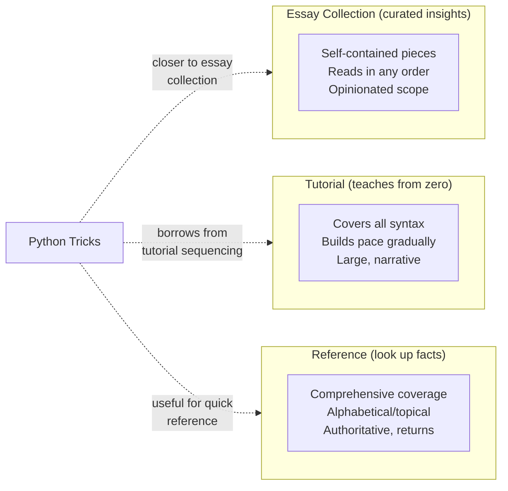

## Strengths

- **The "trick" format is perfectly calibrated for its audience.** Each
essay is five to ten pages, self-contained, and focused on one pattern.
You can read *Python Tricks* in a long weekend and apply the patterns
the next day. This is the correct shape for a developer who knows the
language but not the idioms.

- **The curatorial judgment is strong.** Dan Bader did not include
every feature. He included the 15–20 patterns that actually matter for
daily coding: the iterator protocol, context managers, decorators,
generators, `for`-`else`, chained comparisons, truthiness, `@dataclass`,
f-strings, type hints, the walrus operator, and `match`/`case*. The
exclusions are as important as the inclusions: there is no metaclass
chapter, no C extension chapter, no deep-dive on memory management.

- **The progression is logical.** The book opens with Pythonic thinking
(idioms you can use immediately), moves through functions and classes
(the structures you build with), then data structures and looping (how
you process data), then the productivity tools that make writing Python
faster. Each section builds on the last, so a cover-to-cover read
produces coherent understanding.

- **The code examples are clean and copied directly into real projects.**
The timer context manager, the `@functools.wraps` decorator, the
`for`-`else` search pattern, and the `@dataclass` class definition are
all short enough to memorize and reuse. The book earns its place on the
desk by being a source of snippet-ready code.

- **The standalone scope is a feature, not a bug.** *Fluent Python* is
1018 pages and demands months. *Python Cookbook* is 706 pages and a
reference. *Python Tricks* is 296 pages and a bridge. The developer who
asks "what book should I read after my beginner tutorial?" gets three
excellent answers covering three different needs. This book is the one
you can actually finish.

- **Dan Bader's voice makes the difference.** A trainer and podcaster,
Bader writes with the patience of someone who has explained these
patterns to hundreds of developers in workshops. The explanations are
opinionated without being preachy, example-driven without being dumbed
down. The "Gotcha" callouts in each trick are where the book earns its
price — they are the thing you would only learn from a senior engineer
pairing with you.

- **The productivity tools chapter (packaging, CLI, linters) is
unique on the Python bookshelf.** Almost no Python language book covers
`pyproject.toml`, `flake8`/`pyflakes`, `Click`/`Typer`, and `poetry`
in a single chapter. This is the section most working developers
underestimate until they have to package or ship a tool.

---

## Weaknesses

- **The 1st edition is age-visible in its most forward-looking tricks.**
The 1st edition (2017) predates `dataclasses` (PEP 557, 3.7), the
walrus operator (PEP 572, 3.8), and `match`/`case` (PEP 634, 3.10).
The trick format is resilient — the conceptual content of context
managers and decorators has not changed — but the surface syntax of
the newest tricks needed a rewrite. The 2nd edition brought the
collection up to date; the 1st edition shows its age in those three
chapters.

- **It is not a reference — trying to use it as one is a mismatch.**
*Python Tricks* is curated, not comprehensive. If you need to
look up the exact signature of `heapq.merge` or the available flags
for `re.compile`, this book will not help. That is a design
choice, not a flaw — but developer readers who skip the "book"
meta-commentary and treat it like a cookbook will be frustrated.

- **The type-hint coverage is too thin for 2026.** The book introduces
type hints in the productivity tools section and stops at
`from typing import List, Dict, Optional`. Modern Python — especially
PEP 604 union syntax (`int | None`), `typing.Protocol`, and
`from __future__ import annotations` — is the default in professional
codebases. The 2nd edition expands this, but it is still a surface
treatment compared to Slatkin's *Effective Python* or the *Python
Cookbook*.

- **Metaclasses and advanced metaprogramming are absent by design.**
This is a strength for most readers, but it means the book does not
help when you need to understand how Django's ORM, SQLAlchemy's
declarative base, or Pydantic's model metaclass work. For that,
*Fluent Python* and the *Python Cookbook* remain the references.

- **The coverage of testing is thin.** The book mentions `pytest` in a
footing-it note but does not devote a trick to testing patterns. For
a book that includes packaging and CLI tools, the absence of a testing
chapter is an odd editorial decision, given that a modern `pyproject.toml`
workflow almost always includes `pytest` configuration.

- **The packaging chapter is out of date by 2026 standards.** The 1st
edition's discussion of `setup.py`, `requirements.txt`, and virtual
environment tools has been superseded by `pyproject.toml`, `flit`,
`poetry`, and `pipx`. The 2nd edition updated this, but the
landscape continues to evolve rapidly.

---

## Controversy: Tutorial vs. Essay Collection vs. Reference

### What Kind of Book Is This?

*Python Tricks* resists easy classification, and that produces recurring
reader confusion. The three categories it straddles:

The label "trick" creates expectations of the *Cookbook* — problem →
solution → discussion. The *Python Tricks* format is closer to an
essay collection: statement → example → discussion → gotcha. Both
patterns are valid. The confusion arises when a reader expecting a
problem-solution reference opens to a prose essay and puts the book
back.

**The right mental model**: *Python Tricks* is a curated set of short
chapters you read to acquire patterns, not a reference you consult to
solve a specific problem. Use it as a weekend read that changes how
you write code on Monday. Use *Fluent Python* and *Python Cookbook* as
the references you keep on the shelf.

### Is 296 Pages Enough?

The criticism: "the book is too short to be comprehensive." The
response: comprehensiveness was never the goal. The 15–20 patterns
selected cover 80% of daily Python coding. A developer who internalizes
these patterns is dramatically more productive than one who has read
every page of *Fluent Python* but has not yet internalized context
managers and decorators.

The 296-page length is the book's strategic advantage: you can finish
it, and you will remember what you read. A 700-page book that you
read 30 pages of is less valuable than a 300-page book that you read
all of.

---

## Comparison to Similar Books

| Book | Difference |
|---|---|
| *Fluent Python* (Ramalho, 2nd ed., 1018 pp) | The deep dive. Same territory, 3x the depth. Read *Fluent Python* for the *why*; read *Python Tricks* for the *what* and *how*. |
| *Effective Python* (Slatkin, 2nd ed., 90 items) | Similar shape — short items. Less narrative, more direct. Useful as a desk complement. |
| *Python Cookbook* (Beazley & Jones, 706 pp) | Problem-solution reference for the stdlib. The book you reach for after *Python Tricks*. |
| *Automate the Boring Stuff with Python* (Sweigart) | Beginner-compatible, automation-focused. This is a step up in abstraction. |
| *Python Design Patterns* (various) | GoF patterns implemented in Python; this book covers the built-in Python patterns that make GoF unnecessary in most cases. |

---

## The Standard Library Quick Reference: What Each Trick Assumes

The book's most useful side effect: it creates a shared vocabulary
among the idioms. Here is the map of which trick depends on which
standard library feature:

| Trick | Key stdlib module |
|---|---|
| Context managers | `contextlib.contextmanager` |
| Decorators | `functools.wraps`, `functools.lru_cache` |
| Generators | `yield`, `itertools` |
| Named tuples | `collections.namedtuple`, `typing.NamedTuple` |
| Default dict | `collections.defaultdict` |
| Counter | `collections.Counter` |
| Data classes | `dataclasses.dataclass` |
| Heap queue | `heapq` |
| f-strings | `str` methods, `!r` / `!s` conversion |
| Type hints | `typing.List`, `typing.Optional`, `typing.Protocol` |
| Walrus operator | Assignment expressions in `while` / `if` |
| Pattern matching | `match`/`case` syntax (3.10+) |
| Linters | `flake8` / `pyflakes` |
| CLI | `click` or `typer` |
| Packaging | `pyproject.toml`, `flit`, `poetry` |

---

## Final Assessment

| Dimension | Rating | Notes |
|---|---|---|
| Originality | 8/10 | Essay/trick format is distinctive; the curated scope is a strong editorial choice |
| Practical Utility | 9/10 | Snippet-ready code in a format you can finish in a weekend |
| Readability | 9/10 | Short tricks, consistent shape, conversational tone |
| Timeliness | 7/10 | 2nd edition covers walrus and match/case; type-hint discussion is still thin |
| Scope | 7/10 | Deliberately narrow — no metaclasses, no testing, no stdlib deep dives |
| Authority | 8/10 | Bader is a respected trainer and educator; code examples are production-grade |
| Accessibility | 9/10 | The fastest path from "I know Python" to "I write Pythonic Python" |
| **Overall** | **8/10** | The best single investment an intermediate developer can make in their Python education |

*If you write Python every day and have not yet internalized context
managers, decorators, generators, `for`-`else`, f-strings, and
`@dataclass`, this is the book to read next. Pair it with *Effective
Python* for briefer coverage of the same ground, and with *Fluent
Python* when you are ready to understand why these patterns work the
way they do. The three together are the most efficient Python education
you can get from books.*
