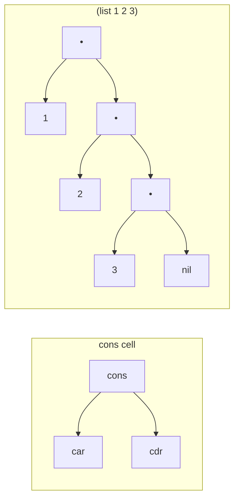
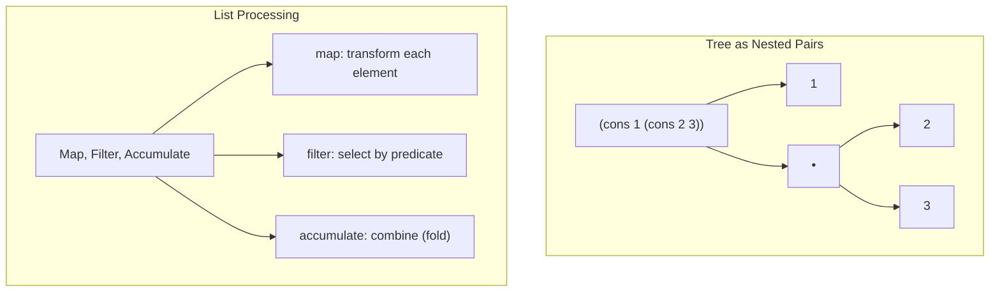
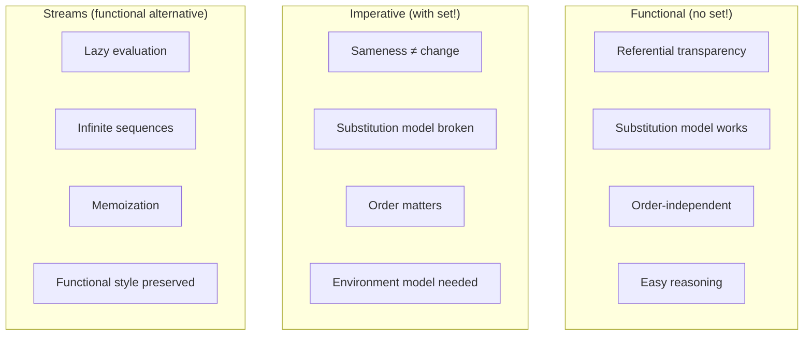
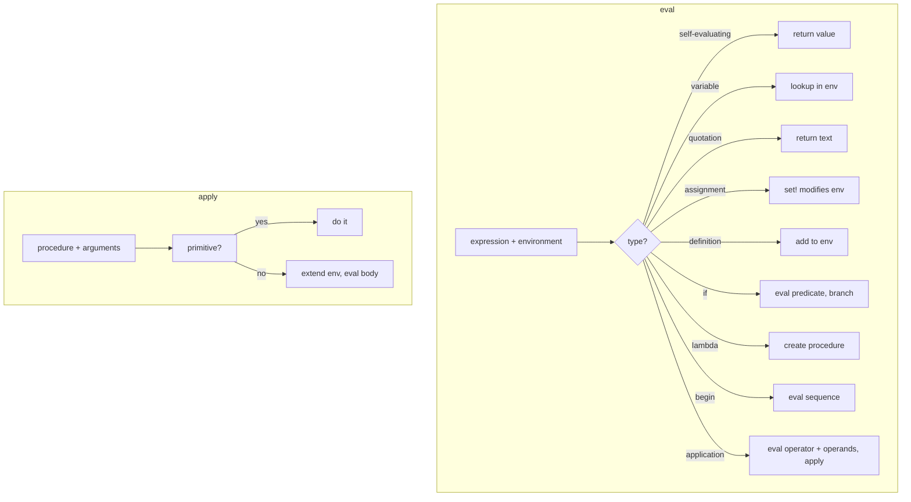
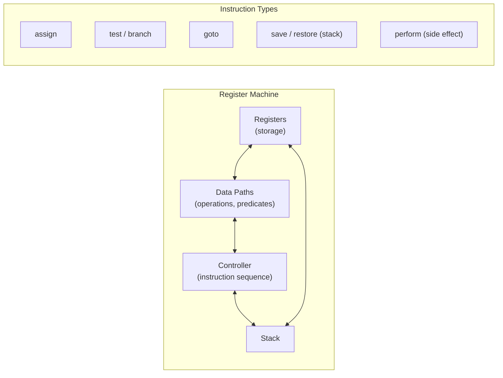

## Chapter 1: Building Abstractions with Procedures

The book opens with the elemental unit of computation: the procedure.
No data structures, no mutation — just functions and the substitution
model.

### The Substitution Model

```scheme
(define (square x) (* x x))
(define (sum-of-squares x y) (+ (square x) (square y)))
```

Evaluation reduces expressions until only primitives remain. The
substitution model (applicative order) explains how procedure
application works — and why it fails when assignment enters.

### Recursion and Iteration

A critical distinction: recursive *processes* vs. recursive *procedures*.

```mermaid
graph TD
    subgraph Recursive["Recursive Process (linear recursion)"]
        F1["factorial(5)"] --> F2["5 * factorial(4)"]
        F2 --> F3["5 * 4 * factorial(3)"]
        F3 --> F4["5 * 4 * 3 * factorial(2)"]
        F4 --> F5["5 * 4 * 3 * 2 * factorial(1)"]
        F5 --> F6["5 * 4 * 3 * 2 * 1"]
    end

    subgraph Iterative["Iterative Process (tail-recursive)"]
        I1["fact-iter(1, 1, 5)"] --> I2["fact-iter(1, 2, 5)"]
        I2 --> I3["fact-iter(2, 3, 5)"]
        I3 --> I4["fact-iter(6, 4, 5)"]
        I4 --> I5["fact-iter(24, 5, 5)"]
        I5 --> I6["120"]
    end
```



The recursive procedure grows and shrinks (deferred operations). The
iterative procedure maintains fixed state. Thanks to Scheme's tail-
call optimization, recursive syntax can describe iterative processes.

### Higher-Order Procedures

Procedures that take procedures as arguments or return them:

```scheme
(define (sum term a next b)
  (if (> a b) 0
      (+ (term a) (sum term (next a) next b))))
```

From this single abstraction, you can define summation, integration,
and countless other patterns. The section culminates in Newton's method
and fixed-point finding, showing that mathematical computation is
procedure composition.

### Lambda and Lexical Scoping

```scheme
(lambda (x) (* x x))
```

Lambda creates anonymous procedures. Lexical scoping means free
variables in a lambda refer to bindings in the enclosing environment —
the foundation of closures.

**Key examples:** The picture language (a small embedded DSL for
graphics), the half-interval method, and the fixed-point finder.

---

## Chapter 2: Building Abstractions with Data

Having built the function layer, the book adds data abstraction.

### Compound Data — Pairs and Lists



The data abstraction barrier: use `cons`, `car`, `cdr` without knowing
their implementation. The famous exercise shows that even pairs can be
implemented as procedures:

```scheme
(define (cons x y) (lambda (m) (m x y)))
(define (car z) (z (lambda (p q) p)))
```

### Hierarchical Data and Closure

The closure property of `cons` — elements of pairs can themselves be
pairs — enables trees, sequences, and arbitrary hierarchical structures.



### Symbolic Data

Symbols (`'foo`), quotation, and the `memq`/`assoc` utilities.
Symbolic differentiation is the chapter's centerpiece:

```scheme
(define (deriv exp var)
  (cond ((number? exp) 0)
        ((variable? exp) (if (same-variable? exp var) 1 0))
        ((sum? exp) (make-sum (deriv (addend exp) var)
                              (deriv (augend exp) var)))
        ...))
```

### Generic Operations

Data-directed programming and dispatch tables. The chapter builds a
full generic arithmetic system: complex numbers (rectangular/polar),
polynomials, and rational functions, all dispatching on type tags.

---

## Chapter 3: Modularity, Objects, and State

The watershed chapter. Assignment (`set!`) is introduced, and with it,
the substitution model breaks.

### Mutable Data

```scheme
(define (make-withdraw balance)
  (lambda (amount)
    (if (>= balance amount)
        (begin (set! balance (- balance amount)) balance)
        "Insufficient funds")))
```

Each call to `make-withdraw` creates an object with local state.
The environment model replaces the substitution model.

### The Costs of Assignment

Assignment introduces time-dependence. The same expression evaluated
at different times gives different results. Sameness and change become
tangled — `(eq? a b)` vs. `(equal? a b)`.



### Streams

An elegant functional alternative: represent sequences as delayed
evaluation. `(cons-stream a b)` is syntactic sugar for
`(cons a (delay b))`. Streams enable infinite data structures
and decouple computation order from expression order.

**Key examples:** Monte Carlo simulation, digital circuit simulator
(wire propagation with agendas), constraint propagation system.

---

## Chapter 4: Metalinguistic Abstraction

The heart of the book. The reader builds a Scheme interpreter in Scheme
— the metacircular evaluator — then modifies it to create new languages.

### The Metacircular Evaluator



The evaluator is just ~100 lines of code. It reveals that language
semantics are a defined algorithm operating on syntactic forms.
Every `if`, `lambda`, and `define` is reducible to a procedure.

### Variations on a Scheme

| Variant | Mechanism | Key Idea |
|---------|-----------|----------|
| Lazy evaluator | `delay`/`force`, normal-order | Arguments evaluated only when needed; infinite lists |
| Nondeterministic evaluator | `amb` operator, backtracking | Search-based computing — try alternatives, `fail` |
| Logic programming | Unification, `query` | Declarative: what, not how. Embedded Prolog |

The logic programming section implements a full query system with
pattern matching, unification, and rule-based deduction.

---

## Chapter 5: Computing with Register Machines

The final chapter descends to the hardware level.

### Register Machine Simulator



### The Explicit-Control Evaluator

A register-machine implementation of the metacircular evaluator.
Every Scheme construct is compiled to explicit register-machine
instructions. The evaluator uses registers for `exp`, `env`, `val`,
`continue`, and `argl`.

### Compilation

The capstone: a Scheme-to-register-machine compiler that translates
Scheme expressions into machine instructions. With a simple peephole
optimizer (open-coding primitives, removing redundant saves/restores),
the compiled code runs significantly faster than interpreted.

```scheme
;; Source
(define (factorial n)
  (if (= n 1) 1 (* n (factorial (- n 1)))))

;; Compiled (register machine)
;; assign n (op =) (reg n) (const 1)
;; branch (label =base-case)
;; ...
```

### Storage Allocation and Garbage Collection

The final sections address memory management: vector-based storage,
pointer representation, and stop-and-copy garbage collection.

---

## Key Lessons

- **Abstraction is the only tool that matters.** Every complexity
  is managed by building a new language layer.
- **Syntax is cheap.** The evaluator shows how surface syntax maps
  to semantics. You can always design better syntax for your domain.
- **State is a design choice, not a given.** Functional programming
  is not a religion — it is a trade-off with different engineering
  consequences than imperative programming.
- **Languages are implementable.** The metacircular evaluator proves
  that language design is not magic. It is engineering.
- **The machine is simple.** Beneath all abstractions, a register
  machine just moves data, tests conditions, and jumps.

---

## Practical Applications

### For Any Programmer

- Higher-order functions and closures are not Lisp curiosities — they
  are available in every modern language. Use them.
- The substitution model (and later the environment model) is how to
  *think* about what your code does. Trace execution mentally.
- Data abstraction and wishful thinking: design the interface first,
  implement later.

### For Language Designers

- The metacircular evaluator is a template. Any language feature
  (lazy evaluation, logic programming, type systems) can be added by
  modifying the evaluator.
- Syntax matters less than semantics. A clean core language can
  support arbitrary surface syntax through macros or transformation.

### For Architects

- Streams provide a functional model for event-driven systems and
  reactive programming.
- The constraint propagation system models dependency management and
  spreadsheet-like recomputation.

---

## Action Plan

1. **Read with a Scheme interpreter open.** MIT/GNU Scheme, Racket
   (`#lang sicp`), or Chicken Scheme. Type every example.

2. **Do the exercises.** They are not optional. At minimum, work the
   starred exercises. The metacircular evaluator and register-machine
   simulator must be built, not read about.

3. **Skim nothing.** Every sentence carries weight. SICP is dense
   but never wasteful.

4. **Trace the environment model.** When `set!` appears, draw the
   environment diagrams. It is the only way to truly understand
   lexical scoping and mutable state.

5. **Build the evaluator from memory.** If you can recreate the
   metacircular evaluator without the book open, you have absorbed
   the core lesson.
