## Part 1: Ruby Foundations — Objects, Methods, and Local Variables

### The Object in Motion

Ruby's first principle: everything is an object. An integer `5` is an
instance of `Integer`. A class `String` is an instance of `Class`. The
message-passing model means you send messages to objects with `.`:
`"hello".upcase` sends `upcase` to the string object `"hello"`.

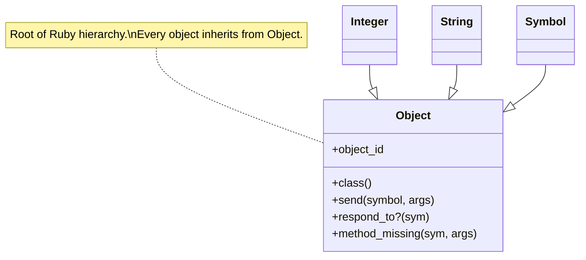

Local variables are markers in a scope table. Method parameters are
initialized local variables. Instance variables (`@x`) look up the
ancestor chain. Class variables (`@@x`) are shared up the inheritance
tree — use cautiously.

---

### Method-Call Mechanics

Ruby resolves a method call in this order:
`singleton_class → eigenclass → class → included_modules → superclass`

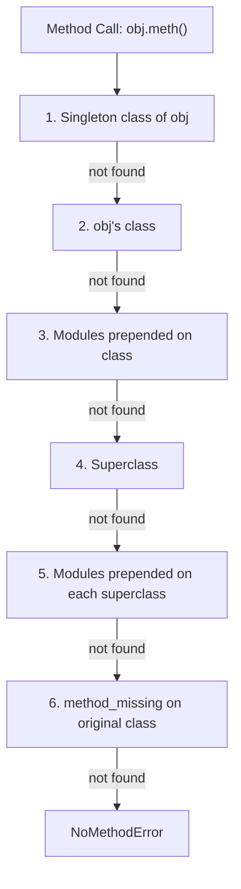

---

## Part 1: Classes, Modules, and the Object-Lookup Path

### Class Definitions Are Open

In Ruby, a class definition is executable code. You can reopen a class
anywhere and add methods. This is used by Rails monkey-patching core
classes, but should be used carefully.

```mermaid
flowchart LR
  A["class String\n  def shout\n    upcase + '!!!'\n  end\nend"]
  B["'hello'.shout\n=> 'HELLO!!!'"
  A -->|opens class| B
```

---

### Creating a Class and Adding Methods

`attr_reader`, `attr_writer`, and `attr_accessor` are shorthand for
defining getter/setter methods. They are method calls at the class level
that define instance methods dynamically.

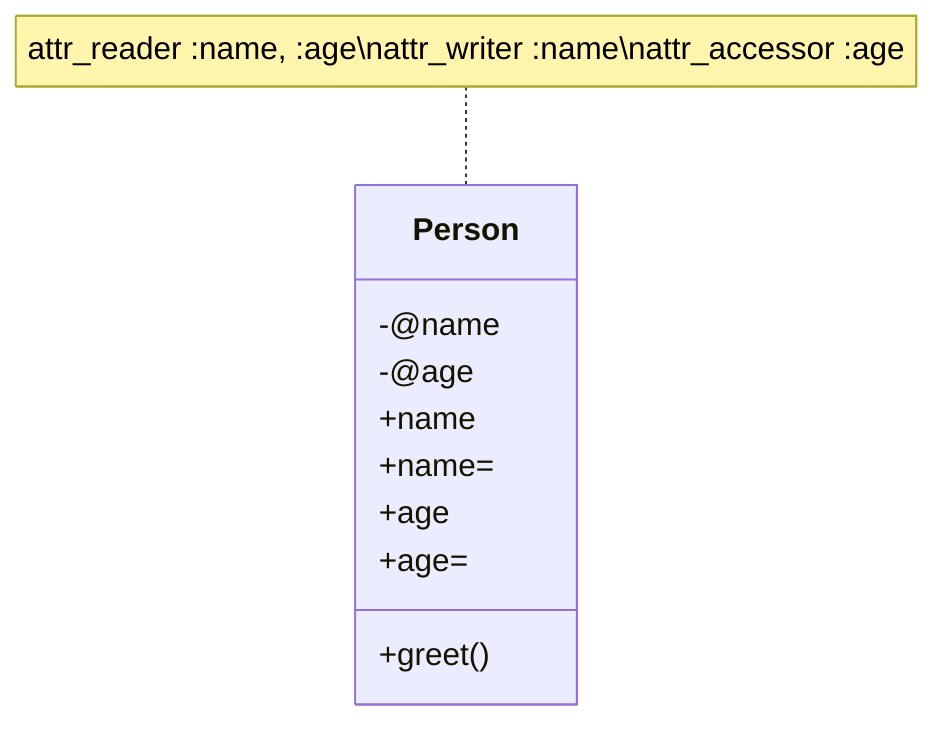

---

### Modules: Namespaces and Mixins

Modules serve two distinct roles:
1. **Namespace**: group related constants (`Math::PI`, `JSON::Parser`)
2. **Mixin**: share behavior across unrelated classes via `include` or
   `extend`

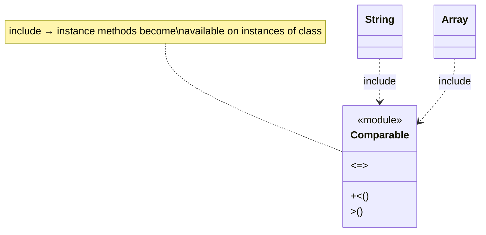

`extend` adds module methods to the object itself (singleton methods),
making them available only on that object, not its class instances.

---

### The Method-Lookup Path in Practice

When Ruby resolves `obj.foo`, it traverses:

```
singleton class
obj's class
modules prepended by prepend
superclass chain
modules prepended at each level
method_missing
```

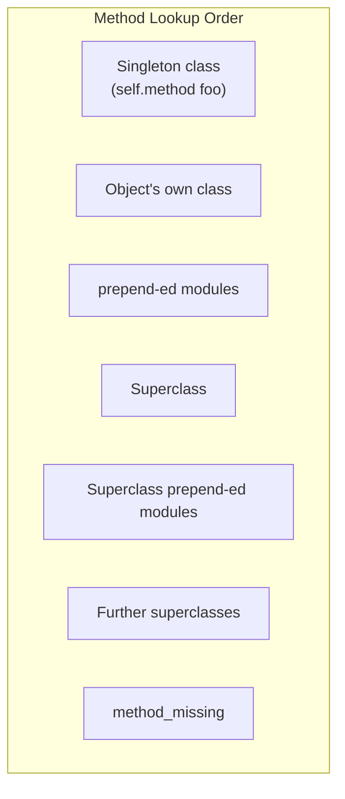

---

### Introduction to Mixins

Mixins let unrelated classes share behavior:

```ruby
module Walkable
  def walk
    "#{name} is walking"
  end
end

class Person
  include Walkable  # instance method
  def name; "Alice"; end
end

class Robot
  extend Walkable   # singleton method on the class itself
end
```

```mermaid
classDiagram
  class Person {
    +walk()
    +name()
  }
  class Robot

  <<module>> Walkable
  Walkable : +walk()

  Person ..> Walkable : include
  Robot  ..> Walkable : extend
```

`include` → instance methods. `extend` → class/eigenclass methods.
`prepend` (Ruby 2.0+) → methods inserted *before* class methods in the
lookup chain, allowing wrapper-style overriding.

---

## Part 2: Blocks, Procs, and Lambdas

### Blocks: The Heart of Ruby Iteration

Blocks are anonymous function literals attached to method calls, using
`do...end` or `{...}` syntax. They are the primary iteration mechanism:

```ruby
[1, 2, 3].each { |n| puts n * 2 }
# or
File.open("data.txt") do |f|
  f.each_line { |line| puts line }
end
```

The block talks to the method via `yield`:

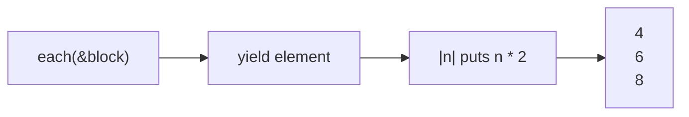

---

### Converting Blocks to Procs and Lambdas

Calling `method(&block)` converts a `Proc` to a block. Calling `Proc.new`
inside a method captures the current block. Explicit block-to-proc: `->`
or `lambda` syntax.

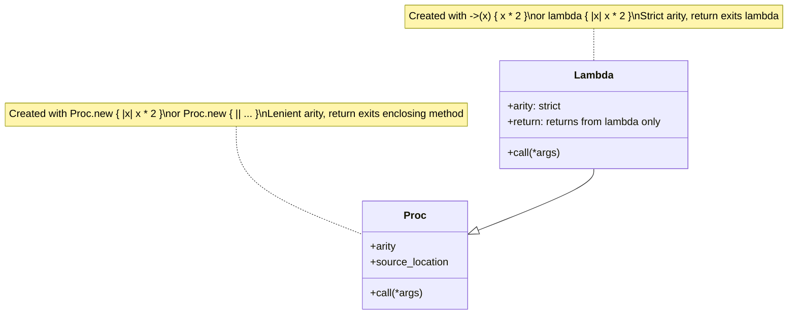

| | `Proc.new` | `lambda` (`->`) |
|---|---|---|
| Arity enforcement | Lenient (extra args dropped) | Strict (raises ArgumentError) |
| `return` behavior | Returns from enclosing method | Returns from lambda itself |
| Creation | `Proc.new { }`, `proc { }` | `->(x) { }`, `lambda { }` |

---

### Closures: Capturing the Surrounding Environment

Every block, proc, and lambda carries its **binding** — the local variable
bindings from when it was created:

```ruby
def counter
  n = 0
  -> { n += 1 }
end

c1 = counter  # captures n = 0
c2 = counter  # captures ANOTHER n = 0

c1.call # => 1
c1.call # => 2
c1.call # => 3
c2.call # => 1  (independent binding!)
```

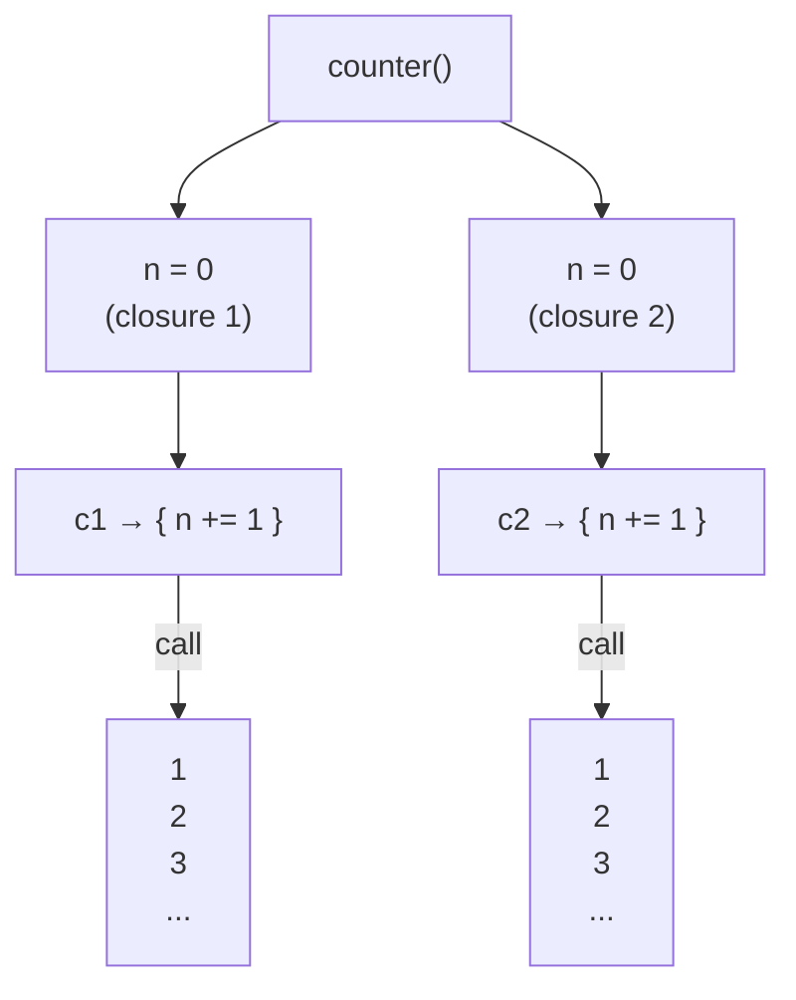

---

## Part 3: Metaprogramming and Reflection

### Reflection: Examining Objects at Runtime

Ruby gives you full access to its object model at runtime:

```ruby
Person.ancestors     # => [Person, Walkable, Object, Kernel, BasicObject]
Person.instance_methods(false)  # => [:greet, :name=, ...]
Person.new.respond_to?(:walk)  # => true
"hello".methods.grep(/case/)   # => [:upcase, :downcase, :swapcase, ...]
```

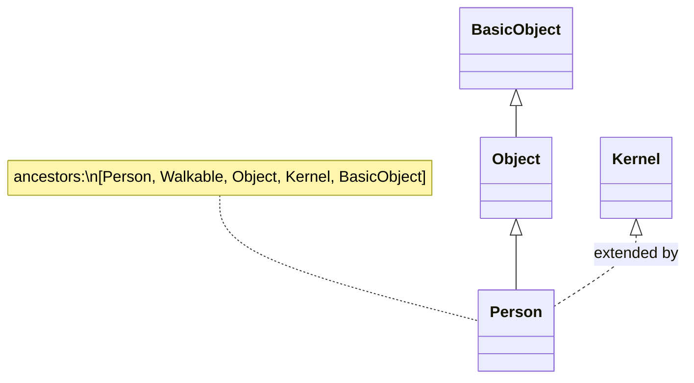

---

### Dynamic Method Definition

`define_method` defines a method by name at class-definition time or runtime:

```ruby
class Person
  [:name, :age, :email].each do |attr|
    define_method(attr) do
      instance_variable_get("@#{attr}")
    end

    define_method("#{attr}=") do |val|
      instance_variable_set("@#{attr}", val)
    end
  end
end
```

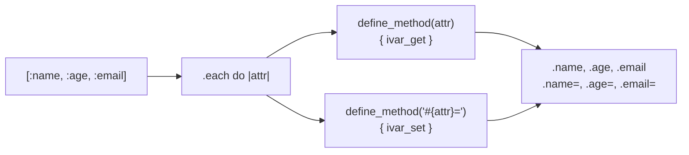

---

### `method_missing`: The Safety Net and DSL Builder

`method_missing` is called when Ruby cannot find a method in the lookup
chain. Used carefully, it is powerful. Used carelessly, it hides bugs:

```ruby
class DynamicGreeter
  def method_missing(name, *args)
    if name.to_s.start_with?("greet_")
      "Hello from #{name.to_s.sub('greet_', '')}!"
    else
      super
    end
  end

  def respond_to_missing?(name, include_private = false)
    name.to_s.start_with?("greet_") || super
  end
end

DynamicGreeter.new.greet_alice  # => "Hello from alice!"
```

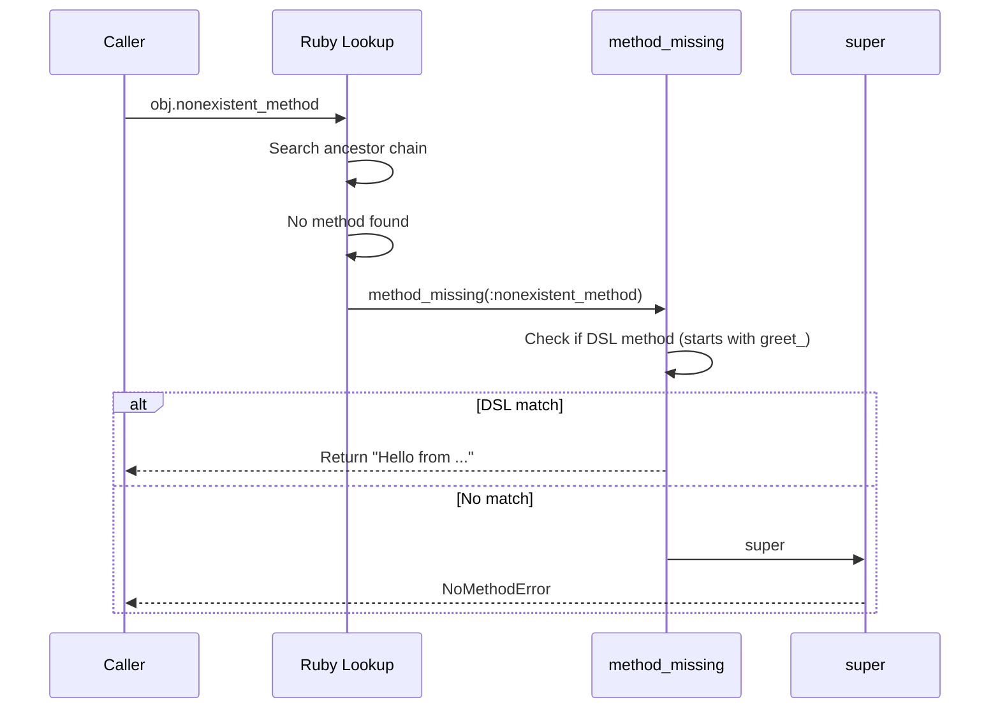

---

### `class_eval` and `instance_eval`

`class_eval` (or `module_eval`) evaluates code in the context of a class,
giving access to instance methods and class methods. `instance_eval` evaluates
in the context of a specific object, giving access to instance variables:

```ruby
Person.class_eval do
  def greet
    "Hi, I'm #{@name}"
  end
end

Person.new.instance_eval do
  @greeting = "hello"
end
```

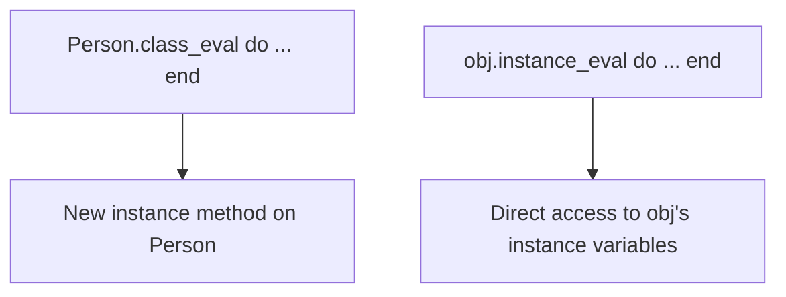

---

## Part 4: Concurrency and Fibers

### Threads vs Fibers

Ruby provides two concurrency primitives: **Threads** (preemptively
scheduled by the interpreter) and **Fibers** (cooperatively scheduled by
you). Under MRI, a native thread holds the GIL, so CPU-bound threads do
not run in parallel. I/O-bound threads yield the GIL.

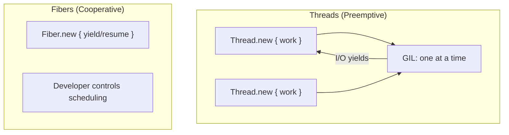

---

### Synchronization Primitives

Shared mutable state requires synchronization:

```mermaid
classDiagram
  class Mutex {
    +lock()
    +unlock()
    +synchronize { block }
  }
  class Queue {
    +push(obj)
    +pop(n = nil)
    +empty?
    +size
  }
  class ConditionVariable {
    +wait(mutex)
    +signal
    +broadcast
  }

  Mutex --> ConditionVariable : pairs with
  note for Mutex "Only one thread inside\nsynchronize block at a time"
  note for Queue "Thread-safe producer/consumer\npreferred over shared state"
```

```ruby
mutex = Mutex.new
count = 0

10.times.map do
  Thread.new do
    mutex.synchronize { count += 1 }
  end
end.each(&:join)
```

---

## Part 4: Standard Library Essentials

### File I/O and Iterators

Ruby's standard library handles I/O with consistent, elegant interfaces:

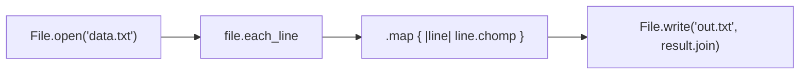

File operations support blocks that auto-close the file:

```ruby
File.open("data.txt", "r") do |f|
  lines = f.each_line.map(&:chomp)
end
# file auto-closed here
```

---

### Enumerators: Lazy and Infinite Sequences

Lazy enumerators allow working with infinite or very large sequences
without loading all data into memory:

```ruby
infinite_primes = (1..Float::INFINITY).lazy.select do |n|
  (2..Math.sqrt(n)).all? { |d| n % d != 0 }
end

infinite_primes.first(5)  # => [2, 3, 5, 7, 11]
```

```mermaid
flowchart TD
  RANGE["(1..Float::INFINITY)"]
  LAZY[".lazy"]
  FILTER[".select { is_prime? }"]
  MAP2[".map { ... }"]
  FIRST[".first(5)"]
  DONE["[2, 3, 5, 7, 11]"]

  RANGE --> LAZY --> FILTER --> MAP2 --> FIRST --> DONE
  note for FIRST "Stops after 5 items\ncomplete sequence never built"
```

---

## Part 4: RSpec and Testing

### BDD with RSpec

RSpec provides executable, readable specifications that double as
documentation:

```ruby
RSpec.describe Person do
  let(:person) { Person.new("Alice") }

  it "has a greet method" do
    expect(person.greet).to include("Alice")
  end

  it "raises when name is missing" do
    expect { person.validate! }
      .to raise_error(ArgumentError)
  end
end
```

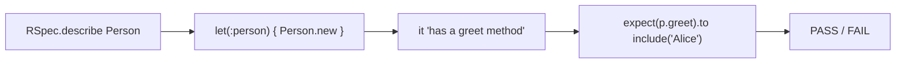

RSpec matchers read as English: `eq`, `include`, `raise_error`,
`match_array`, `satisfy`, `be_empty`. They form a natural specification
language.

---

## Part 4: Rails Integration Context

### Rails as a Ruby Object System

Rails (ActiveRecord) is built on the same Ruby object model covered in
the book. Understanding Ruby's object model makes Rails conventions clear:

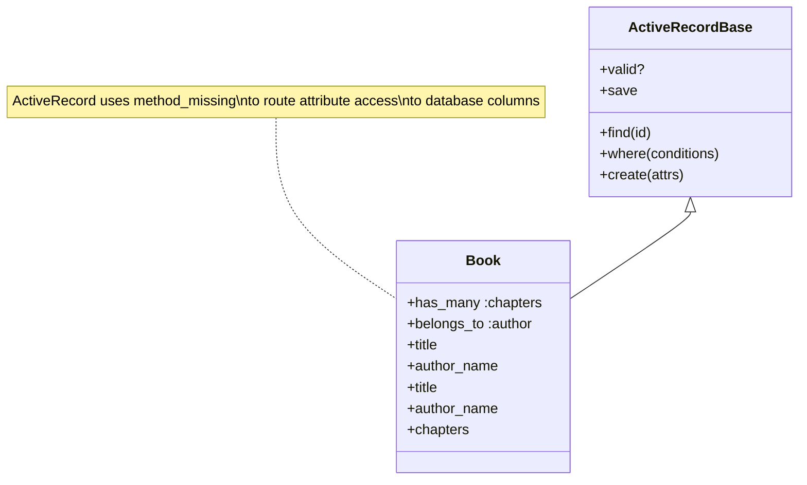

Rails leans heavily on modules (`ActiveModel`, `ActiveSupport`) and
method_missing (`dynamic attribute access`). Understanding those Ruby
idioms from *The Well-Grounded Rubyist* makes Rails transparent rather
than mysterious.
