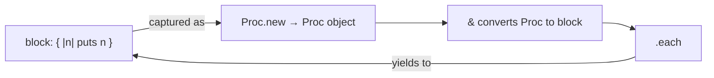

## Introduction

Welcome to BookAtlas. Today: *The Well-Grounded Rubyist* by David A.
Black and Joseph Leo III. Manning, 2009 (1st ed.), 2014 (2nd ed.),
and 2021 (4th ed.). The book that takes you from `puts "Hello"` to
`method_missing` without skipping a beat.

**Engineer:** Before we start — what is this book's single sentence?

**Skeptic:** A definitive tutorial on Ruby from first program to
metaprogramming.

**Engineer:** Exactly. It is not a reference book. It is not a
cookbook. It is a tutorial with one goal: to make you *understand*
Ruby. Not just write it. Understand it.

---

## The Author Who Shaped the Community

**Skeptic:** David A. Black. I know the name but cannot place him.

**Engineer:** Black co-founded Ruby Central in 2001 — the organization
that runs RubyConf and RailsConf. He was involved in Ruby's formative
years in the US, when Ruby was still a Japan-only language. He has been
teaching Ruby professionally since before Rails existed. He brings that
history and that teacher's instinct to every chapter.

**Skeptic:** And Joseph Leo III?

**Engineer:** Leo is a New York-based developer and consultant. He
co-leads the Gotham Ruby Conference (GoRuCo). He joined for the 2nd
edition to bring the perspective of a working Ruby developer who
teaches the language professionally at Def Method.

---

## The Philosophy: Ruby the Right Way

**Skeptic:** Why start this book with the installation and filesystem
instead of just teaching `puts` and variables?

**Engineer:** Because Black wants you to understand *where* Ruby lives.
Chapters 1 and 4 of the first edition always struck me as unique.
He explains the Ruby installation directory, `RbConfig`, `irb`, `ri`,
`gem`, `rake` — tools that every Ruby developer uses daily but few
understand.

**Skeptic:** That is practical knowledge.

**Engineer:** It is. And it is unusual. Most Ruby books jump straight
to syntax. Black makes you understand the ecosystem first. When you
later encounter a `load` vs `require` error, you know exactly where
to look instead of StackOverflowing it.

---

## The Object Is the Atom

**Skeptic:** Every chapter starts from the premise: everything is an
object. They say that about Ruby. But you said `5` is an object? The
number 5?

**Engineer:** In Ruby, yes. `5.class` returns `Integer`. `5.methods`
returns over 100 methods. You can call `5.times { |n| puts n }` and it
iterates from 0 to 4. That is not a number in a mathematical
sense — it is an object that happens to behave like the number 5.

```ruby
5.class        # => Integer
5 + 3          # => 8  (calls .+(self) on 5)
5.send(:+, 3)  # => 8  (same thing, explicit message send)
5.times { |n| puts n }  # prints 0 1 2 3 4
```

**Skeptic:** So the `+` operator is just a method call. You are telling
me `5 + 3` and `5.+(3)` are the same thing.

**Engineer:** They are literally the same. Ruby's `+` is not special
syntax — it is the method `+` called on the object `5`.

**Skeptic:** That changes how I think about the language. `5` is not
a number — it is an actor that receives messages.

**Engineer:** That is the mental model. And once you have it, the rest
of Ruby makes sense.

---

## The Method-Lookup Path

**Skeptic:** The ancestor chain. I have heard of it. But I never had
it diagrammed.

**Engineer:** Here is how Ruby resolves `obj.foo`:

```
singleton class (if obj has singleton methods)
obj's class (e.g., Person)
modules prepended with prepend
superclass (e.g., Walker, Object)
modules prepended on each superclass
Kernel (extended into Object by default)
BasicObject
```

The key insight: Ruby searches *from the most specific* (the object
itself) *to the least specific* (BasicObject). The first match wins.

**Skeptic:** So `include` inserts a module into the ancestor chain of
the instances. `extend` inserts it into the singleton class of the
specific object. And `prepend` (new in Ruby 2.0) inserts *before* the
class's own methods?

**Engineer:** You have it. That is why `prepend` is powerful for
decorators — a prepended module's `super` calls the original method,
creating a chain of wrappers.

---

## Blocks: The Most Important Ruby Concept

**Skeptic:** I use `.each` all the time. But I never understood the
block as an object.

**Engineer:** A block in `{ |n| puts n }` is anonymous. It has no
name. It cannot be stored in a variable. But you can wrap it in a Proc:

```ruby
my_block = Proc.new { |n| puts n }
[1, 2, 3].each(&my_block)  # & converts Proc → block
```



**Skeptic:** And a lambda?

**Engineer:** A lambda is a specific kind of Proc. Two differences:
lambdas enforce arity (right number of arguments), and `return` inside
a lambda returns from the lambda itself, not the enclosing method.
A `return` inside a regular Proc exits the method that called it:

```ruby
def test_proc
  p = Proc.new { return "from proc" }
  p.call
  "after proc"
end

def test_lambda
  l = lambda { return "from lambda" }
  l.call
  "after lambda"
end

test_proc    # => "from proc"  (method exited!)
test_lambda  # => "after lambda" (method continued)
```

---

## Metaprogramming: Not Magic, Just Ruby

**Skeptic:** `method_missing` scares me. I have heard it used in
DSLs like Rails ActiveRecord. But also that it can hide bugs.

**Engineer:** `method_missing` is the definitive Ruby metaprogramming
tool. The classic pattern:

```ruby
class Person
  attr_accessor :name

  def method_missing(method_name, *args)
    if method_name.to_s.start_with?("find_by_")
      field = method_name.to_s.sub("find_by_", "")
      # ... look up by field
      "Found: #{field} = #{args.first}"
    else
      super
    end
  end

  def respond_to_missing?(method_name, include_private = false)
    method_name.to_s.start_with?("find_by_") || super
  end
end
```

Always implement `respond_to_missing?` alongside `method_missing`. This
keeps `respond_to?` accurate.

```mermaid
sequenceDiagram
  participant Client as Code calling p.find_by_name("Alice")
  participant Ruby as Ruby Method Lookup
  participant MM as method_missing
  participant Super as super (NoMethodError)

  Client->>Ruby: p.find_by_name("Alice")
  Ruby->>Ruby: Search ancestor chain
  Ruby-->>Ruby: No method found
  Ruby->>MM: method_missing(:find_by_name, "Alice")
  MM->>MM: Extract "name" from method name
  MM-->>Client: "Found: name = Alice"

  note at right: With respond_to_missing?\nrespond_to?(:find_by_name) is true
```

**Skeptic:** That makes sense. You intercept unknown method calls and
decide whether to handle them or raise the standard error.

**Engineer:** Precisely. Rails `ActiveRecord::Base` uses this to
convert `Person.find_by_name("Alice")` into a SQL query on the `name`
column. That is not magic — it is `method_missing` with a SQL backend.

---

## Duck Typing: Trust the Behavior

**Skeptic:** Duck typing is the phrase that keeps coming up. What does
it actually mean for writing code?

**Engineer:** In a statically typed language, you would express "this
object must be a `List`." In Ruby, you say "this object must respond to
`:each`." The object's class is irrelevant; its behavior is all that
matters.

```ruby
def process_all(collection)
  collection.each do |item|
    puts "#{item.class} processed"
  end
end

process_all([1, 2, 3])          # Array
process_all("abc")               # String (each_char)
process_all({a: 1, b: 2}.keys)  # Hash keys
```

**Skeptic:** The function does not care what the object is — just that
it can do what is needed.

**Engineer:** That is duck typing. And it is the reason Ruby is so
flexible. An object that behaves like a duck is accepted wherever a
duck is required.

---

## Mixins in Practice: The Module as Design Tool

**Engineer:** The book's modules chapter changed how I write Ruby.
Previously I thought `include` was just for sharing utility methods.
But the real insight is that modules let you express a *behavior* and
apply it to any class that needs it:

```ruby
module Walkable
  def walk
    "#{name} moves forward one step"
  end
end

module Talkable
  def talk
    "#{name} says: #{greeting}"
  end
end

class Person
  include Walkable
  include Talkable
  def name; "Alice"; end
  def greeting; "Hello"; end
end

class Robot
  include Walkable
  def name; "R2D2"; end
  def greeting; "Beep boop"; end
end
```

```mermaid
classDiagram
  class Person
  class Robot

  <<module>> Walkable
  <<module>> Talkable
  Walkable : +walk()
  Talkable : +talk()

  Person ..> Walkable : include
  Person ..> Talkable : include
  Robot  ..> Walkable : include
  Robot  ..> Talkable : include
  Person  : +name()
  Person  : +greeting()
  Robot   : +name()
  Robot   : +greeting()
```

---

## The Closure Deep Dive

**Skeptic:** I use blocks daily but never thought about exactly what
is captured.

**Engineer:** Every block carries its **binding** — the local variables
from the surrounding scope at the moment the block was created:

```ruby
def filter_maker(min_val)
  ->(n) { n >= min_val }
end

f1 = filter_maker(10)  # captures min_val = 10
f2 = filter_maker(50)  # captures min_val = 50
numbers = [5, 15, 25, 35, 45, 55]

numbers.select(&f1)  # => [15, 25, 35, 45, 55]
numbers.select(&f2)  # => [55]
```

Each closure is independent. `f1` and `f2` captured different `min_val`
bindings. They can evolve on their own without interfering.

---

## Concurrency: Threads, Fibers, and the GIL

**Engineer:** Ruby's concurrency story is nuanced. The fourth edition
updates this heavily for `Fiber::Scheduler` (Ruby 3.0+), but the 2nd
edition laid the groundwork:

```ruby
# Producer-consumer with Queue
queue = Queue.new

producer = Thread.new do
  10.times { |i| queue << i }
  queue.close
end

consumer = Thread.new do
  queue.each { |n| puts "Processing #{n}" }
end

[producer, consumer].each(&:join)
```

```mermaid
flowchart LR
  P["Producer Thread\nqueue << item"]
  Q[["Queue (thread-safe)"]]
  C["Consumer Thread\nqueue.pop"]

  P --> Q --> C
  note for Q "Pushes are synchronized\nby Queue internal Mutex"
```

**Skeptic:** Why not just share a variable?

**Engineer:** Shared mutable state is where bugs hide. `Queue`
communicates by passing ownership of data. Each thread owns its data
access. Far fewer race conditions.

---

## RSpec: The BDD Workflow

**Skeptic:** Why RSpec over Minitest?

**Engineer:** RSpec's advantage is the specification-as-documentation
aspect. RSpec reads like English:

```ruby
RSpec.describe Person do
  subject { Person.new("Alice", 30) }

  describe "#greet" do
    it "includes the person's name" do
      expect(subject.greet).to include("Alice")
    end

    it "raises without a name" do
      expect { Person.new(nil).greet }
        .to raise_error(ArgumentError)
    end
  end
end
```

The `describe`/`it`/`expect` structure is natural language. A business
stakeholder can read these specs and understand what the system does.

---

## The Verdict: Why This Book Endures

**Engineer:** There are three reasons The Well-Grounded Rubyist
remains relevant a decade after its 2nd edition:

First, the concepts it teaches — objects, blocks, metaprogramming — are
core Ruby concepts. They have not changed. What changed is Ruby's
minor version. The thinking model is stable.

Second, Black's teaching style. He does not lecture. He explains,
draws diagrams, and shows the mechanics. He makes you aware of what
is happening under the hood without making you feel lost.

Third, the book is honest about where Ruby's design decisions come from
and how they shape your programs. You do not just learn *how* to use
`method_missing`. You understand *why* Ruby put it there and *when*
you should reach for it.

**Skeptic:** What is the one criticism I should know before buying?

**Engineer:** The 2nd edition is now a decade behind current Ruby. Buy
the 4th edition for Ruby 3.x content. But the core of this book — the
object model, blocks, procs, modules, metaprogramming — is identical in
every edition. If you found a used copy of the 2nd edition, read it.
The knowledge transfers completely.

**Skeptic:** Who is this book NOT for?

**Engineer:** Absolute beginners who have never written a program. You
need at least a few weeks of basic OO experience. Someone completely
new to programming will bounce off the pace. And Ruby experts — people
who have been writing Ruby for five years and contributed gems — will
not find much new here. But for everyone in between, this is the book.

---


---

## Final Thoughts

**Engineer:** The Well-Grounded Rubyist is the book I recommend to
every developer who comes to me and says "I know Rails but I do not
really know Ruby." It takes two to three weeks of focused study. At
the end of it, you will look at Ruby code and understand *why* it
works the way it does — not just that it does.

**Skeptic:** That sounds like the difference between a tourist and a
resident.

**Engineer:** Precisely. A tourist writes Ruby syntax. A resident
understands the neighborhood. This book moves you from tourist to
resident.

**Skeptic:** One more question: the Joseph Leo co-authorship for the
2nd edition. Does his contribution make it meaningfully different from
the 1st edition?

**Engineer:** Yes. The structure and voice remain Black's, but Leo's
contributions to the `Module#prepend`, keyword arguments, and lazy
enumerable chapters reflect a working developer's day-to-day concerns.
The book is honest about the gaps: it says where Ruby 2.x introduced
new patterns that required changing the chapter content entirely. That
intellectual honesty is rare in technical books.
