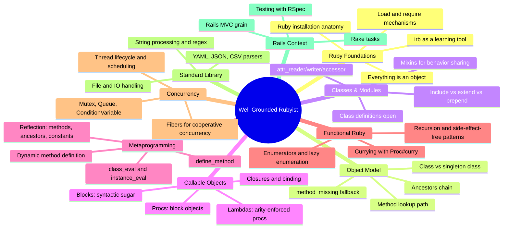

## Overview

*The Well-Grounded Rubyist* (2009 first ed., 2014 second ed.) by David A.
Black and Joseph Leo III — the definitive intermediate-to-advanced tutorial
on Ruby. Manning Publications, ~536 pages, ISBN 9781617293656 (2nd), updated
for Ruby 2.1. Teaches Ruby from first program through metaprogramming,
threading, and reflection in a conversational, rigorous style.

---
{}
------|-------|--------|
| **Part 1: Ruby Foundations** | Objects, methods, local variables, classes, modules | Read and write idiomatic Ruby confidently |
| **Part 2: Organizing with Classes and Modules** | Inheritance, modules, mixins, namespaces | Structure complex programs with clean separation |
| **Part 3: Reflection, Metaprogramming, and Callable Objects** | Blocks, procs, lambdas, `define_method`, `method_missing` | Control how your code creates and manipulates itself |
| **Part 4: Beyond the Basics** | Threading, fibers, file I/O, RSpec, Rails integration | Apply Ruby in real systems and libraries |

---

## Key Takeaways

1. **Everything in Ruby is an object.** Integers, classes, modules, even
   `nil` are objects. Understanding this eliminates surprises.

2. **The method-lookup path is your map.** Knowing where Ruby searches for
   a method (singleton class → class → included modules → superclass →
   `method_missing`) makes inheritance and mixins predictable.

3. **Blocks, procs, and lambdas are distinct but related.** Blocks are
   syntactic sugar; procs are object-wrapped blocks; lambdas enforce
   arity and `return` behavior. Each has a purpose.

4. **Modules are for namespace AND behavior sharing.** Use modules for
   namespacing when you need organization, and for mixins when you need
   to share behavior across unrelated classes.

5. **Duck typing beats class hierarchy.** Ruby trusts behavior, not label.
   If an object responds to the right messages, it works — no inheritance
   check required.

6. **Metaprogramming is not magic.** Techniques like `define_method` and
   `class_eval` are tools for writing DRY code, not puzzles to impress
   coworkers. Use them when they clarify, not obscure.

7. **Threading requires discipline.** Ruby has threads and fibers.
   Understand the GIL, use `Mutex` for shared state, and prefer
   `Queue`-based communication over shared memory.

8. **Test with RSpec, but understand the tool.** BDD with RSpec produces
   readable, executable specifications — but specs only help if they
   reflect real behavior, not implementation details.

---

## Core Concepts Map

---

## Who Should Read

| Reader Type | Why |
|---|---|
| New Ruby developers | The most thorough first-to-deep tutorial on Ruby available |
| Intermediate Ruby developers | Fills gaps in object-model understanding |
| Rails developers who "know Ruby" | Deepens the Ruby knowledge underpinning Rails |
| Engineers transitioning from Java/C#/Python | Explains Ruby idioms clearly without assuming prior scripting-language experience |
| Software architects exploring Ruby's capabilities | Reliable reference for metaprogramming and standard library |

---

## Who Should Skip

- Absolute programming beginners with no OOP experience (learn OO basics
  first)
- Developers who only need a quick syntax reference (pick a cheat sheet)
- Those already well-versed in Ruby metaprogramming and internals (read
  *Metaprogramming Ruby* or Ruby source instead)
- Engineers who want a framework-first tutorial (this book strictly
  focuses on the language)

---

## Why This Book Matters

The Well-Grounded Rubyist occupies a unique position. Beginner Ruby books
teach syntax. Advanced metaprogramming books teach tricks. This book
teaches *understanding*. Black and Leo take the time to explain the
reasoning behind Ruby's design decisions — why Ruby has no interfaces, why
blocks matter, why the object model is the way it is.

The result is a book that produces Rubyists, not just Ruby programmers.
Developers emerge with an intuition they can apply to any Ruby codebase.

---

## Related Books

| Book | Author(s) | Connection |
|---|---|---|
| **Programming Ruby (Pickaxe)** | Dave Thomas et al. | The classic Ruby reference; pair as reference + tutorial |
| **Metaprogramming Ruby** | Paolo Perrotta | Direct follow-up on metaprogramming techniques |
| **Eloquent Ruby** | Russ Olsen | Approachable style, covers similar ground at a shorter length |
| **Practical Object-Oriented Design in Ruby** | Sandi Metz | POOD is the design-focused complement — apply Ruby OO to real systems |
| **The Ruby Programming Language** | Flanagan, Matsumoto | The "K&R of Ruby" — authoritative language specification |
| **Agile Web Development with Rails** | Sam Ruby et al. | For readers who want to continue to Rails after this book |

---

## Final Verdict

The Well-Grounded Rubyist is the single best book for understanding Ruby
as a language and as a design tool. It is rigorous without being dry,
detailed without being overwhelming, and accurate in a way that only
developers with a deep personal investment in the language can achieve.

The second edition (used here) adds coverage of `Module#prepend`, lazy
enumerators, keyword arguments, and updated RSpec material. Read it cover
to cover, then keep it on your shelf as a reference you will return to.

**Rating: 9.5/10** — The definitive Ruby tutorial. Indispensable for
anyone serious about writing idiomatic Ruby.
