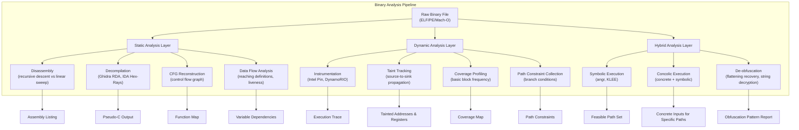
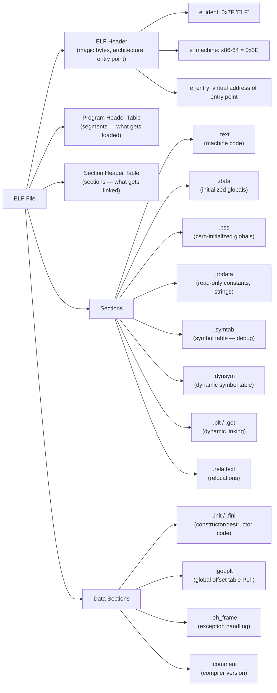
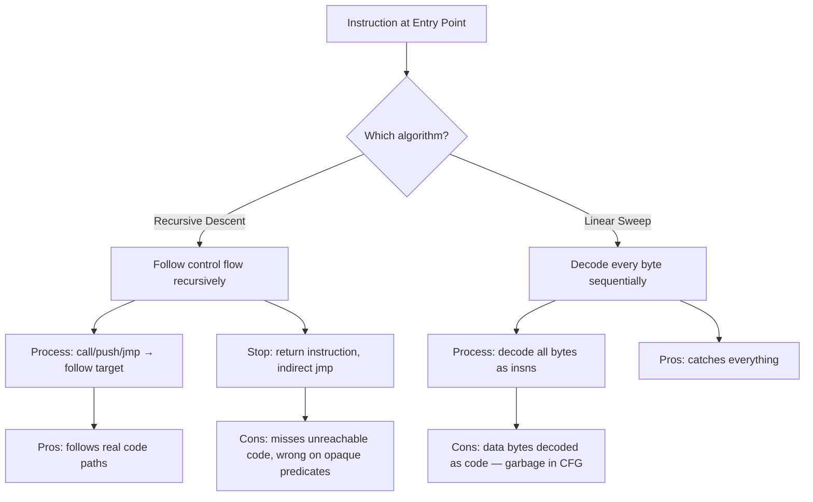
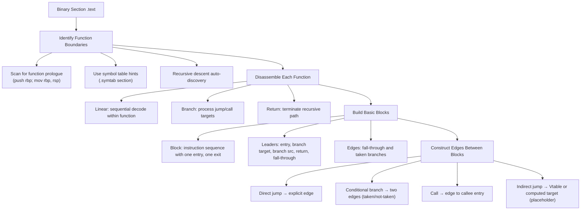
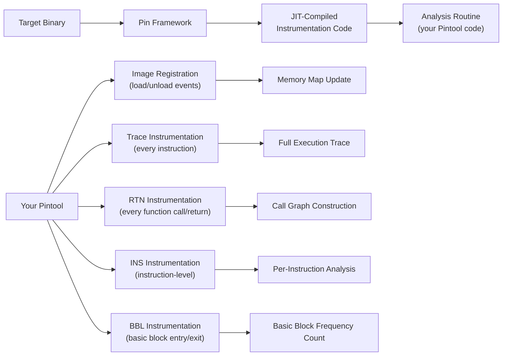
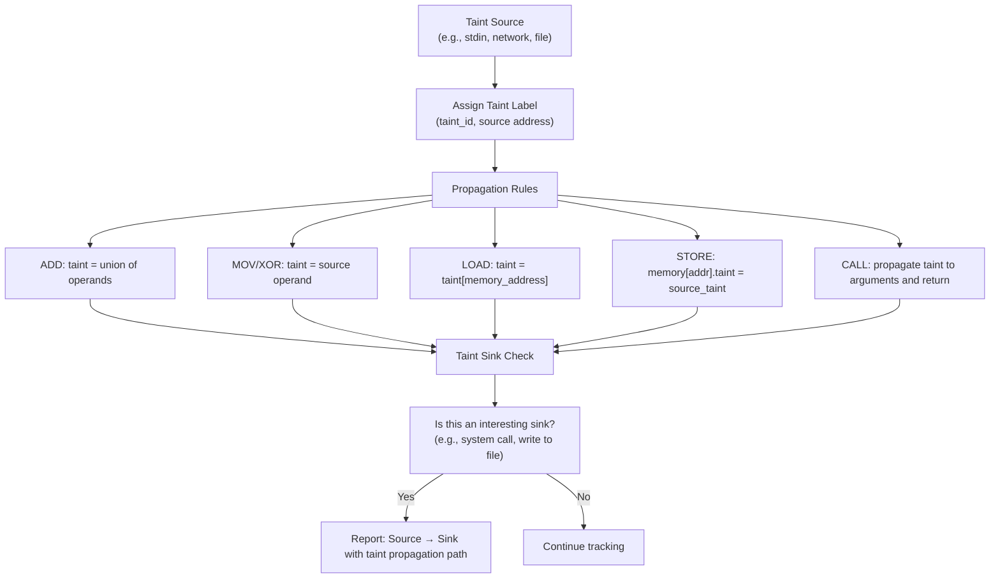
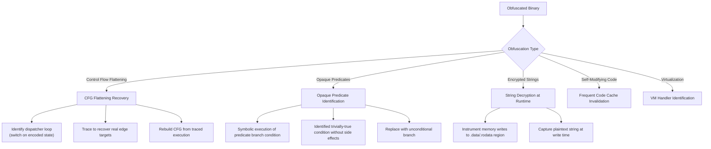
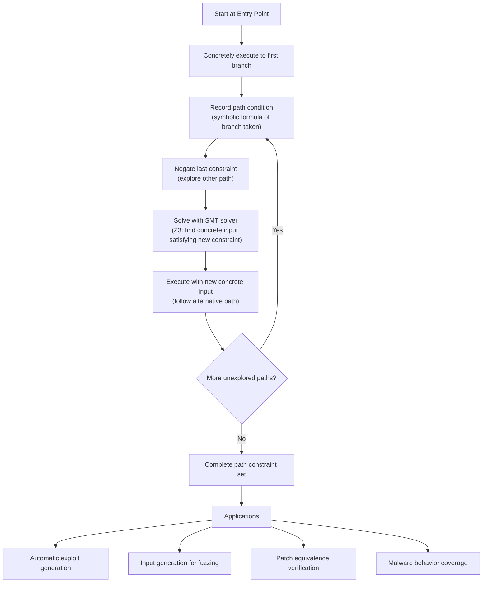

---

## ELF Binary Format: The Linux Target

Andriesse's book operates primarily on ELF (Executable and Linkable Format) binaries, the standard executable format on Linux. Understanding ELF is the prerequisite for everything else in the book. ELF files are structured into segments (loaded into memory at runtime) and sections (used by the linker and tools).

### ELF File Layout

---

## Disassembly vs Decompilation: Two Complementary Representations

A core conceptual distinction running through the book is between **disassembly** (converting machine code bytes into assembly language text) and **decompilation** (attempting to convert machine code into a higher-level language like C).

| Property | Disassembly | Decompilation |
|----------|------------|----------------|
| Input | Raw machine code bytes | Disassembly output (assembly text) |
| Output | x86-64 assembly | Pseudo-C |
| Determinism | Semi-deterministic (depends on algorithm) | Non-deterministic (ambiguous) |
| Confidence | High (every byte has a unique most-likely encoding) | Variable (many C constructs share one assembly form) |
| Tool examples | objdump (linear sweep), IDA Pro (recursive descent) | Ghidra RDA, Hex-Rays Decompiler, Binary Ninja |
| Primary use case | Verification, manual analysis, patch creation | Behavioral understanding, vulnerability hunting |
| Failure mode | Decoding errors, wrong function boundaries | Compiler variation, optimization artifacts, type loss |

Andriesse implements both a recursive descent disassembler and a basic block extraction layer — the essential first step before any higher-level analysis.

---

## Disassembly Algorithms: Recursive Descent vs Linear Sweep

The two primary algorithms for disassembly represent a fundamental trade-off between completeness and accuracy. Understanding when each fails is as important as understanding how they work.

- **Recursive descent** (IDA Pro): follows control flow by recursively processing branch targets. Faithful to actual execution paths but misses code reachable only through indirect jumps.
- **Linear sweep** (GNU objdump): decodes every byte in `.text` as an instruction. Catches everything but generates a noisy CFG because data embedded in code is misinterpreted.

---

## Control Flow Analysis: Building the CFG

The Control Flow Graph (CFG) is the backbone of most binary analysis. Andriesse's approach constructs it incrementally:

---

## x86-64 Assembly: The Hardware Foundation

The book begins with a thorough review of x86-64 — the instruction set architecture (ISA) all tools target. Critical concepts include:

- **Register naming**: 16 general-purpose registers (RAX through R15), each accessible as 64-bit, 32-bit, 16-bit, or 8-bit sub-registers
- **Calling convention (System V AMD64 ABI)**: first six integer/pointer arguments in RDI, RSI, RDX, RCX, R8, R9; return value in RAX; caller-saved vs. callee-saved register conventions
- **Operand modes**: immediate, register, memory (with complex addressing modes: `[base + index*scale + displacement]`)
- **Instruction categories**: data movement (mov, push, pop), arithmetic (add, sub, imul, idiv), logical (and, or, xor, not), control flow (jmp, je, call, ret), string operations (movs, cmps, scas), SIMD (SSE, AVX)

---

## Dynamic Analysis: Intel Pin Instrumentation

The heart of the practical tool-building in the book is Intel Pin — a dynamic binary instrumentation (DBI) framework from Intel that injects analysis code into running processes via Just-In-Time (JIT) compilation.

Pin's instrumentation levels give fine-grained control:

| Level | Granularity | Use Case |
|-------|-------------|---------|
| Image | Whole loaded library/executable | Detect which modules load, initialization |
| RTN | Function call and return | Build call graphs, hook specific functions |
| BBL | Basic block (sequence ending in control transfer) | Coverage profiling, block frequency counting |
| INS | Individual instruction | Taint propagation, register tracking |
| TRACE | All instructions in a thread | Full execution trace for path reconstruction |

---

## Dynamic Taint Tracking: Source-to-Sink Analysis

The book's most substantial tool-building chapter implements a full taint tracker in Pin. Taint analysis marks data derived from a source (e.g., user input, network socket) and tracks how it propagates through computation.

Taint tracking is critical for exploit detection: if attacker-controlled input reaches a sensitive sink (e.g., a function pointer write, a syscall), the taint report reveals the exploit chain without needing to understand the bug semantically.

---

## Data Dependencies: Reaching Definitions and Liveness

Before taint analysis, and before any compiler-like optimization, Andriesse covers data flow analysis — the mathematical framework that answers "what values could this variable hold at this point in the program?"

- **Reaching definitions**: Given a program point, which assignments to a variable could have executed and not yet been overwritten?
- **Live variable analysis**: At a program point, which variables hold values that will be used in the future?
- **Very busy expressions**: Which expressions will definitely be re-evaluated before being overwritten?

These analyses are used in de-obfuscation, dead code elimination detection, and as preprocessing for symbolic execution.

---

## Binary File Formats Beyond ELF

Andriesse covers PE (Portable Executable) and Mach-O (Mach Object) alongside ELF, enabling cross-format analysis. Each format has distinct structures relevant to analysis:

| Format | Used On | Key Sections | Analysis Relevance |
|--------|---------|--------------|-------------------|
| ELF | Linux, BSD | `.text`, `.data`, `.bss`, `.got.plt`, `.symtab` | SysV ABI, dynamic linking, symbol tables |
| PE | Windows | `.text`, `.rdata`, `.data`, `.idata` | Import Address Table, export table, Rich header |
| Mach-O | macOS, iOS | `__TEXT`, `__DATA`, `__LINKEDIT` | Dyld shared cache, rebasing, binding |

---

## De-obfuscation: Recovering Obfuscated Control Flow

A significant portion of the advanced analysis section addresses de-obfuscation — reversing the techniques malware authors use to make static and dynamic analysis difficult.

---

## Rootkit Detection: Kernel-Level Binary Analysis

The final advanced topic shifts lens from user-space analysis to kernel-space. Andriesse introduces rootkit detection as the application of binary analysis techniques to the operating system kernel itself.

| Rootkit Technique | Binary Analysis Method |
|-------------------|----------------------|
| System call table hooking | Compare sys_call_table pointers in memory vs. `/proc/kallsyms` |
| Direct Kernel Object Manipulation (DKOM) | Scan kernel memory for hidden process/list structures |
| LKM (Loadable Kernel Module) hiding | Enumerate loaded modules via `list_head` traversal; compare to `/proc/modules` |
| Interrupt descriptor table (IDT) modification | Read IDT base from IDTR; compare handler pointers to known-good values |
| Hooking via function pointer overwrite | Compare function body hash against known-good disassembly |

---

## Symbolic Execution: Getting Precise Path Constraints

Static disassembly gives you all possible paths but cannot tell you which are feasible. Dynamic taint tells you what *did* happen. Symbolic execution — and its practical cousin, concolic execution — gives you the precise input constraints needed to make specific paths happen.

The chapter on angr shows why pure symbolic execution is impractical on real binaries: path explosion is inevitable without selective instrumentation and concretization strategies. (End of file - total 231 lines)