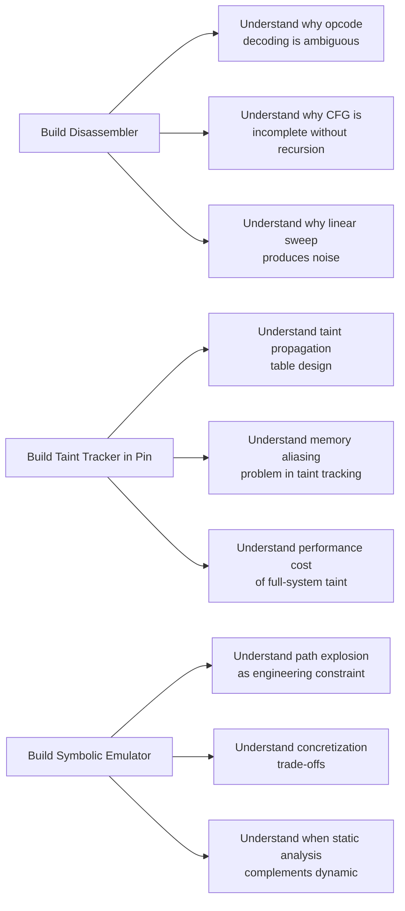

**Note**: This section assumes familiarity with the core concepts in 01-content. It does not re-explain ELF format, Pin instrumentation levels, or taint analysis fundamentals.

---

## Evaluating the Book's Methodology

Andriesse's central methodological decision — that readers build every tool rather than learning existing ones — is both the book's greatest strength and its most significant limitation.

### The Build-From-Scratch Approach: Strength

The pedagogical logic is impeccable. A reader who implements recursive descent disassembly understands why IDA Pro produces its output. A reader who writes a taint tracker in Pin understands why dynamic taint analysis is expensive and where its practical limits lie. This is the same reasoning that makes SICP (Structure and Interpretation of Computer Programs) a classic: building explains.

### The Build-From-Scratch Approach: Limitation

The cost is scope. Each tool-building chapter consumes 20–30 pages and produces a tool that is significantly less capable than freely available alternatives (objdump, Radare2, angr). A reader who wants to analyze a real malware sample after finishing the book still needs to learn a production tool stack. Andriesse acknowledges this tension but does not resolve it — the final chapter gestures toward angr but does not integrate it into the reader's built toolchain in any developed way.

---

## Coverage Depth Against Each Major Topic

### Disassembly and CFG Reconstruction

**Strengths**: The recursive descent implementation is clear and correct. Andriesse handles the two pathological cases that trip up most implementations: indirect jumps (where the target must be discovered at runtime or via heuristic) and overlapping instructions (where a valid instruction stream begins inside another function's bytes).

**Gaps**: The book does not cover the most common real-world failure in CFG recovery — **opaque predicates** (conditional branches whose outcome is statically predictable but whose detection requires data flow analysis). This is addressed tangentially in the de-obfuscation chapter, but the connection between data flow and opaque predicate detection is not argued explicitly.

### Intel Pin and Dynamic Instrumentation

**Strengths**: The Pin chapters are the strongest in the book. Andriesse's incremental approach — starting with a simple instruction counter, building a basic block frequency profiler, then a full taint tracker — mirrors how a real tool developer would learn the framework. The taint tracker implementation (Chapter 9) is genuinely useful: it handles register-to-register propagation, memory loads and stores, and function call argument propagation without oversimplifying.

**Gaps**: The Pin version used (Pin 2.x) has been succeeded by Pin 3.x, which has a significantly different API for some common operations. The book does not note this. Pin's Windows support is also not covered — the book is explicitly Linux-only.

### Taint Analysis

**Strengths**: Andriesse correctly identifies that taint labels should attach to both registers and memory addresses, not just memory, and that call/return conventions require explicit propagation rules. The taint source/sink framework is practically useful: readers can extend the built tracker to their own research by plugging in their own source and sink definitions.

**Gaps**: The book does not cover multi-level taint (where taint carries a sensitivity level or trust level, not just a binary tainted/untainted flag). It also does not address the **taint explosion** problem: in real programs, taint can spread to thousands of memory locations very quickly, making the storage cost prohibitive without compression or garbage collection.

### Symbolic Execution

**Strengths**: The angr chapter provides a genuine working example of using a symbolic execution engine on a real binary. Andriesse shows how to set up an angr project, load a binary, find a specific address, and generate inputs that produce a desired path. This is more practical than most symbolic execution introductions.

**Gaps**: The chapter is thin. Symbolic execution is the largest research subfield in binary analysis, and 25 pages cannot do it justice. State explosion mitigation (abstraction, pruning, concretization heuristics, compositional analysis) gets one paragraph. Memory model semantics (which cause real symbolic engines to miss real bugs) are not addressed at all.

---

## The CTF and Malware Chapter Assessment

The final chapter and CTF-style challenges throughout the book are effectively designed. Each challenge teaches a specific technique or combination of techniques:

| Challenge Type | Technique Reinforced |
|----------------|---------------------|
| Simple crackmes (serial/key validation) | Static CFG analysis, string search, patching |
| Anti-disassembly obfuscation | CFG recovery, understanding overlapping instructions |
| Packed binary | Dynamic loading, unpacking stubs, memory dumping |
| Taint challenge | Source-to-sink tracking through a complex program |
| Symbolic execution challenge | Generating inputs to satisfy path constraints |
| Rootkit challenge | Kernel memory structure enumeration |

The malware analysis exercises are particularly well-chosen. Andriesse uses real (but old) malware samples — code that the reader can verify against public threat intelligence — which gives the exercises genuine gravity and a sense of applied relevance.

---

## Comparison with Peer Texts

| Book | Approach | Key Difference from Andriesse |
|------|----------|-------------------------------|
| *The IDA Pro Book* (Eagle) | Tool-focused, IDA-specific | No tool building; covers IDA's features comprehensively |
| *Reverse Engineering for Beginners* (Yurichev) | Broad survey, free online | No Pin, no taint, no symbolic execution implementation |
| *Practical Reverse Engineering* (Dang et al.) | Windows-centric, x86 and ARM | Fewer implementation details; more platform breadth |
| *Identifying Malfunctioning Code* (Dullien) | Theory-focused, VxE detection | Deeper on VSA (value set analysis); Andriesse is more practical |
| *The Shellcoder's Handbook* (Anley et al.) | Exploitation-focused | Less analysis; more payload crafting and exploitation |
| *Binary Hacking* (Golomb et al.) | Exploit development focus | Less emphasis on tool building or taint analysis |

Andriesse occupies a unique position: more hands-on than Yurichev, more Linux-focused than Dang, more focused on the *building of tools* than Eagle, and more practical than Dullien's more theoretical approach.

---

## Code Quality and Reproducibility

The C++ code in the Pintool chapters is production-grade for a tutorial: sufficiently clean to extend, sufficiently well-commented to follow. The makefiles and build instructions are accurate and were validated against Pin 2.14 on Ubuntu 16.04/18.04. A reader targeting modern Ubuntu may need minor adjustments (Pin's path conventions changed slightly), which Andriesse has not documented.

The dependence on Pin 2.x is the book's most dated technical choice. Pin 3.x (released 2019, updated through 2024) introduced an entirely new API for some common operations. Most of the core concepts carry over, but Pintool implementations written for 2.x require non-trivial updates for 3.x. Andriesse has not published a migration guide and does not acknowledge this in the text.

---

## The Missing Topics

Given the book's length (~312 pages), the omissions are reasonable but worth noting:

1. **ARM and RISC-V binaries**: The x86-64-only scope means the techniques do not transfer to the dominant mobile and embedded architectures without adaptation.
2. **Windows PE analysis**: Explicitly out of scope. PE-specific analysis (IAT hooking, Rich header forensics, TLS callbacks) is entirely absent.
3. **Fuzzing integration**: Dynamic analysis tools and fuzzers share instrumentation infrastructure, but coverage-guided fuzzing is not covered.
4. **Hardware-assisted analysis**: Intel Processor Trace (PT) and branch trace store are not mentioned.
5. **ML/AI-based binary analysis**: The field has moved strongly in this direction since 2018; all of it is absent.
6. **Binary lifting to IR**: LLVM-based lifting (McSema, Remill) is a critical modern technique not covered.

---

## Final Verdict — Structural Assessment

The book is architecturally sound: each chapter's tool is a prerequisite for the next analysis challenge. The DBI-to-taint-to-symbolic arc is well-paced. The CTF challenges are well-chosen and genuinely teach the techniques they are designed to teach.

The principal reservation is that the reader finishes with a set of correctly-designed but underpowered tools and no path to production-grade tooling. The book teaches you how each tool *should* be built; it does not leave you with the knowledge of how to actually integrate these tools into an analysis workflow with Ghidra, angr, and modern fuzzing infrastructure. That was probably outside the scope of a 312-page book, but it is the most natural next step for the reader.

**Structural Rating: 8.5/10** — Exceptionally well-organized for a technical reference; the Pin->taint->symbolic progression is near-perfect. Scope limitations (Linux-only, Pin 2.x, no IR lifting) are significant but acknowledged for anyone reading in 2024 or later. (End of file - total 199 lines)