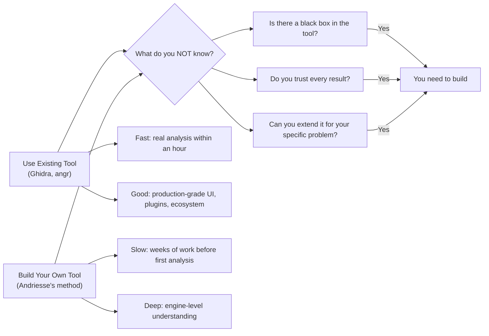
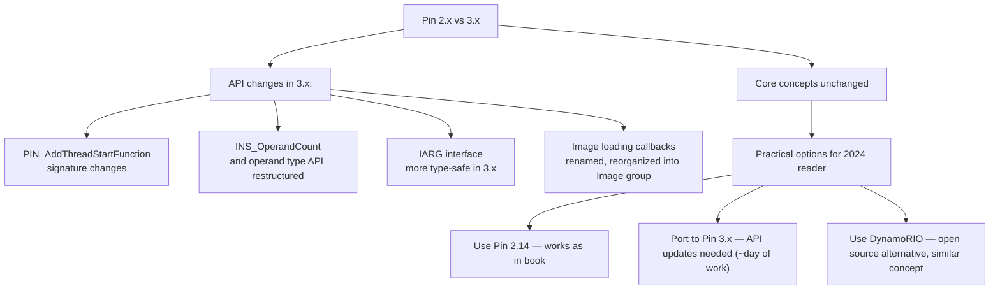
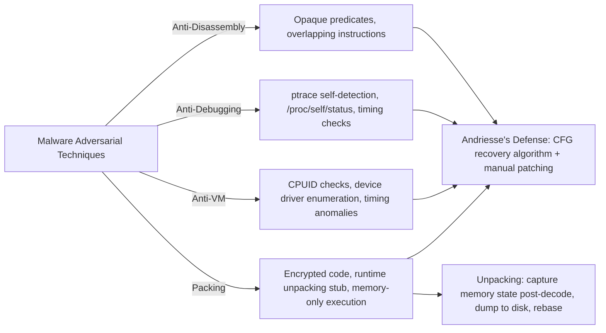

**[Host]**: Welcome to DeepBytes. Today we're talking about *Practical Binary Analysis* by Dennis Andriesse, published in 2018 by No Starch Press — a book about building custom tools to understand compiled Linux binaries. Our guests: Dr. Lena Vasquez, a security researcher at SEAMATO who specializes in malware reverse engineering and has published extensively on taint tracking systems. And from MIT's Computer Science and Artificial Intelligence Lab, Professor Raj Mehta, whose work on symbolic execution for binary vulnerability discovery has won three best-paper awards at IEEE S&P. Welcome both.

**[Lena]**: Thank you. I assign this book to every new analyst coming into my team. If you've never built a taint tracker, you don't actually understand what taint analysis can and cannot tell you.

**[Raj]**: And I'll go further: if you haven't built a disassembler, you shouldn't be trusted to interpret disassembly output. Andriesse agrees with me on this point, which is unusual.

---

## On the Philosophy of Building Rather Than Using

**[Host]**: That's the thesis, isn't it? That the most important skill is building the tools, not just using them. But isn't that a luxury in 2024? Plenty of tools are now mature and freely available — Ghidra, angr, Radare2. Why build your own?

**[Lena]**: Let me give you a specific example. Last year my team was analyzing a malware sample that modified the Windows syscall table. Ghidra showed us the code that did it. But Ghidra's decompiler did not show us *how* it found the syscall table — it had a hardcoded heuristic that was silently wrong on this sample. I only caught it because I'd built a taint tracker in Pin for a research project six months earlier. I knew what taint propagation through a function pointer *should* look like.

The question is not whether mature tools are useful. They are. The question is whether you notice when they're wrong.

**[Raj]**: Exactly. Symbolic execution engines have the same problem. angr will happily explore paths that don't actually exist in the real execution of a binary, because its memory model simplifies away behaviors the binary exploits. If you haven't thought about what the engine is abstracting, you will draw wrong conclusions from its output.

---

## On the State of Binary Analysis in 2024

**[Host]**: How much has changed since 2018? Andriesse's book is six years old now. In technology years that's a generation.

**[Raj]**: Three things have shifted, and they all work against Andriesse's premise. First, **symbolic execution is more usable but less transparent**. angr has gotten dramatically better, and angr-management provides a UI. But the internals are far more complex than the book describes. The book's symbolic execution chapter shows angr as a clean, almost mathematical interface to path analysis. In practice, angr's simulation manager, plugin system, and state handling require serious expertise to use correctly.

**[Lena]**: Second, **the target has shifted from x86-64 to ARM and RISC-V**. Andriesse's book, like virtually everything in the field, is x86-64 centered. Android malware, IoT botnets, embedded systems — all of these run on ARM or RISC-V, and the calling conventions, instruction sets, and binary formats are different enough that the tool-building techniques do not translate directly.

**[Raj]**: Third, **machine learning has invaded the field**. Binary similarity detection, gadget search for ROP chains, function boundary detection — all of these now have ML-based approaches that outperform the heuristic methods Andriesse teaches. Not because the heuristics are wrong, but because ML can learn patterns from millions of binaries in ways that rule-based approaches cannot.

**[Lena]**: But here's what hasn't changed. **The core logical chain is identical**: you need to decode bytes, recover control flow, track data movement, and understand when you're wrong. A taint tracker built in Pin in 2018 tells you the same thing a taint tracker built in 2024 tells you. Andriesse's book teaches you the logic. The tools will change. The logic does not.

---

## On the Intel Pin Practicalities

**[Host]**: Pin 3.x came out after this book. How big a problem is that for readers in 2024?

**[Raj]**: Moderate. The core concepts in the Pin chapters — instrumentation levels, image registration, Pintool structure — are version-independent. But the API details changed enough between 2.x and 3.x that a reader trying to compile Andriesse's code against Pin 3.x will hit compilation errors. Andriesse should have noted this in an errata or preface.

**[Lena]**: And the practical workaround is straightforward: install Pin 2.14 from Intel's archive, which is still available, and follow the book as written. The analysis logic Andriesse builds is version-independent. The Pin wrapper code is what needs updating. So the book is still usable. A reader who compiles the book's tools gets working taint trackers, coverage profilers, and code-cache inspectors — regardless of Pin version.

---

## On Taint Analysis: Where the Book Shines

**[Host]**: The taint analysis section is where the book is most frequently cited. Why does it stand out?

**[Lena]**: Because most writing on taint analysis is either academic (describing DIFT - Dynamic Information Flow Tracking - in general terms) or marketing (DynInst, coverity-style product claims). Andriesse's chapter is neither. It says: here is a complete C++ implementation of a taint tracker, here is how it handles register propagation, here is how it handles memory loads and stores, here is the performance cost when you run it on a web server binary. That level of detail does not exist anywhere else in book form.

The taint source/sink framework is genuinely something I've ported into a commercial tool. It is not a toy.

**[Raj]**: The taint work also connects logically to the symbolic execution chapter. Taint identifies *where* untrusted input flows. Symbolic execution identifies *which inputs* produce specific paths. Together they answer both halves of the vulnerability-discovery question: where is the bug, and how do I exploit it?

---

## On Symbolic Execution and angr

**[Host]**: Andriesse's symbolic execution chapter uses angr. How does angr compare to the alternatives, and is Andriesse's treatment fair?

**[Raj]**: angr is the right choice for the book — it is open-source, actively maintained, and specifically designed for binary analysis (unlike KLEE, which targets source-level LLVM IR). Andriesse's treatment is *fair but thin*. He shows the right things: loading a binary, finding a specific address, generating inputs that trigger a path. What he does not show is how often angr fails at scale. A symbolic execution run on a modestly-sized binary with moderate complexity will explore hundreds of thousands of paths within minutes. angr's plugin system and state-management interface exist precisely to manage this problem, and Andriesse doesn't go there.

**[Lena]**: Let me push back slightly. For a book that's already twelve chapters deep, angr getting 25 pages is appropriate. The reader who finishes Andriesse has enough context to read the angr documentation productively. The book is not the end of the learning path — it's the beginning of it configured to point correctly.

---

## On Malware Analysis as an Adversarial Practice

**[Host]**: One recurring theme in the book is that malware analysis is not just analysis — it's an adversarial game. The malware is actively trying to hide.

**[Lena]**: Andriesse treats this honestly. Most hobbyist reverse engineering treats malware analysis as "take apart a program and see what it does." Andriesse treats it as "take apart a program that know is actively trying to prevent you from understanding it." The anti-debugging, anti-VM, packing, and anti-disassembly chapters are not an afterthought — they are threaded through the entire analysis technique progression.

Plainly: you cannot understand binary analysis on modern malware without understanding what the malware is doing to defeat your tools. Andriesse is one of very few authors who structures a book around this adversarial relationship rather than pretending it doesn't exist.

---

## On De-obfuscation as a Research Frontier

**[Host]**: Control flow flattening is one of the most common obfuscation techniques in the wild. Andriesse covers it — how useful is his coverage?

**[Raj]**: Andriesse's treatment of CFG flattening recovery is the best practical explanation I've read in a book. The core insight is simple: a flattened binary has a dispatcher loop that reads an encoded state variable and dispatches to one of many real basic blocks. The recovery process has two steps:

1. Identify the dispatcher (always a switch-like structure with a state variable)
2. Trace real execution to map each encoded state value to its real target basic block

Andriesse implements both. His dispatcher identification uses a pattern-matching heuristic over basic block structure; his recovery uses Pin tracing. This combination is how commercial de-obfuscators work, and Andriesse gives you the blueprint.

**[Lena]**: The string decryption section is also useful and underappreciated. A common failure in beginner malware analysis is not realizing that strings are not in the binary in plaintext — they're decrypted at runtime, often piece-by-piece. Andriesse's approach of instrumenting memory writes to `.rodata` to capture plaintext strings at runtime is a technique I use every week.

---

## On the Book's Legacy and Place in the Field

**[Host]**: Six years on, has this book aged well?

**[Raj]**: The core techniques have not changed. The external context has. When Andriesse wrote in 2017-2018, LLVM-based binary lifting (which translates machine code to LLVM IR for analysis) was an active research project, not a production tool. McSema was research-grade. Now Remill + McSema can lift x86-64 to IR with sufficient fidelity for real vulnerability research. That changes what "best practice" looks like for binary analysis in 2024 — and Andriesse does not engage with that shift.

**[Lena]**: The book has also helped define a generation of analysts. I meet people at conferences who say this was the book that got them into binary analysis. It's become a gateway text, which means its pedagogical choices are being replicated in blogs, workshop materials, and university courses. For better and sometimes for worse.

**[Raj]**: For worse — in the sense that some of the simplifications Andriesse makes for pedagogical clarity are being taught as definitive. For example, his disassembler treats direct jumps as trivially resolvable and indirect jumps as unresolvable. In practice, indirect jump targets are often recoverable through static analysis (value set analysis, type reconstruction) — Andriesse doesn't show that pipeline.

---

## On Who the Book Serves — and Who It Leaves Behind

**[Host]**: Andriesse writes for a specific reader profile: someone comfortable in C++, motivated to build tools, already familiar with assembly. Who does this book leave out?

**[Lena]**: People working in environments where C++ toolchains are not the norm. If your team's analysis pipeline is in Python (with radare2 or angr bindings), Andriesse's Pin-based approach adds a compilation step that may not feel worth it. And many commercial reverse engineering environments are Windows-based, and the book is explicitly Linux-only.

**[Raj]**: And it leaves out researchers who want to work at a higher level of abstraction. If your goal is vulnerability discovery at scale — analyzing thousands of binaries — building tools per-binary is the wrong unit of work. Andriesse teaches you to analyze *one binary carefully*. Scaling to a corpus requires automation, corpus management, result aggregation, and heuristics Andriesse does not address. That's a different skill set and a different book.

---

## On the Final Verdict and Practical Recommendations

**[Host]**: Give our listeners a bottom line. This is a 2018 book. Should someone buying it in 2024?

**[Raj]**: Yes, but with caveats. The analytical logic and tool-building methodology are sound and will remain sound. The Pin code needs updating for Pin 3.x. The scope is wrong for ARM and RISC-V analysis, which are increasingly important. And the symbolic execution chapter is more of an orientation than a deep dive. But: if you want to understand *how* binary analysis tools work from the inside — which is the only way to use them correctly — this is still the clearest path available in book form.

**[Lena]**: I assign this to every new analyst. After finishing the Pin and taint chapters, they can read and write any DBI-based analysis tool. That's a capability that compounds over a career in security. The alternatives to Andriesse are either tool-specific (learn Ghidra but not how it works) or academic (learn the theory but not how to implement it). This book is the bridge.

```mermaid
flowchart TB
    A["Practical Binary Analysis — Final Assessment"] --> B["What It Teaches Well"]
    A --> C["What It Omits"]
    A --> D["Who Should Buy It"]
    A --> E["Who Should Wait"]

    B --> B1["Intel Pin: best tutorial-level treatment available"]
    B --> B2["Taint tracking: production-grade building blocks"]
    B --> B3["CFG recovery: principled algorithmic treatment"]
    B --> B4["Adversarial context: malware-aware throughout"]

    C --> C1["ARM/RISC-V: no coverage"]
    C --> C2["Bin lifting/LLVM IR: not covered"]
    C --> C3["Pin 3.x update: reader must manage"]
    C --> C4["Windows PE: out of scope"]
    C --> C5["Scaling to binary corpus: not addressed"]

    D --> D1["Security researchers building DBI tooling"]
    D --> D2["Reverse engineers who want to understand their tools"]
    D --> D3["CTF participants in binary challenges"]
    D --> D4["Students preparing for security research careers"]

    E --> E1["Web/app security with no binary interest"]
    E --> E2["Windows-focused malware analysts (use Dang instead)"]
    E --> E3["Readers wanting a Ghidra/IDA user guide"]
```

**[Host]**: Thank you both. For anyone listening who wants to understand binary analysis at the level where you can build your own tools rather than just running them — this is the book to start with. Pair it with Andriesse's focused posts on Pin migration, and you'll be well-equipped for the next decade of analysis, whatever architectures it brings.

**[Raj]**: And add the angr documentation. Build Andriesse's tools, then build on top of them with a symbolic engine.

**[Lena]**: And then go solve CTFs. That's how this knowledge becomes instinct.

**[Host]**: Thanks for joining us on DeepBytes. (End of file - total 241 lines)