## Overview

*Practical Binary Analysis* (2018, No Starch Press) is a rigorous, hands-on technical reference for security researchers, reverse engineers, and advanced developers who need to understand, analyze, and manipulate compiled Linux binaries at a low level. Written by security researcher Dennis Andriesse, the book focuses on building custom binary analysis tooling rather than relying on existing platforms — a deliberate pedagogical choice that produces readers capable of writing their own instrumentation frameworks.

The book walks the reader through the complete stack: from reading raw ELF binaries and x86-64 assembly, through static disassembly and decompilation, to dynamic binary instrumentation (using Intel Pin), control flow reconstruction, taint tracking, and symbolic execution. Each tool is built incrementally across twelve chapters, with every chapter culminating in a real CTF-style puzzle or a malware analysis challenge.

---

## Executive Summary

```mermaid
graph TD
    A["Practical Binary Analysis"] --> B["Binary Foundations"]
    A --> C["Static Analysis"]
    A --> D["Dynamic Analysis"]
    A --> E["Advanced Analysis"]
    A --> F["CTF and Malware Challenges"]
    A --> G["Tool Building Philosophy"]

    B --> B1["ELF Binary Format<br/>(sections, segments, headers)"]
    B --> B2["x86-64 Assembly Review<br/>(instructions, calling conventions)"]
    B --> B3["Disassembly vs Decompilation<br/>(what each produces and when)"]
    B --> B4["Control Flow Graphs<br/>(CFG construction from raw bytes)"]
    B --> B5["Data Flow Analysis<br/>(reaching definitions, liveness)"]

    C --> C1["Static Disassembly<br/>(recursive descent, linear sweep)"]
    C --> C2["Function Boundary Detection<br/>(frame analysis, signatures)"]
    C --> C3["Control Flow Recovery<br/>(direct vs indirect branches)"]
    C --> C4["Decompilation Frameworks<br/>(Ghidra, IDA Pro comparison)"]
    C --> C5["Code Cross-References<br/>(data refs, call targets, jumps)"]

    D --> D1["Intel Pin Framework<br/>(JIT instrumentation model)"]
    D --> D2["Dynamic Instrumentation<br/>(trace, trace-level, image-level)"]
    D --> D3["Basic Block Profiling<br/>(execution frequency, coverage)"]
    D --> D4["Dynamic Taint Tracking<br/>(propagating taint through registers/memory)"]
    D --> D5["Path Constraint Collection<br/>(gathering branch conditions)"]

    E --> E1["Taint Analysis Deep Dive<br/>(source-to-sink tracking)"]
    E --> E2["Symbolic Execution<br/>(angr, concretization strategies)"]
    E --> E3["De-obfuscation<br/>(control flow flattening recovery)"]
    E --> E4["Rootkit Detection<br/>(syscall table hooks, DKOM)"]
    E --> E5["PE/Mach-O Coverage<br/>(cross-format analysis)"]

    F --> F1["CTF Binary Puzzles<br/>(crackmes, keygens, protections)"]
    F --> F2["Malware Static Analysis<br/>(packed samples, unpacking)"]
    F --> F3["Real-World Reverse Engineering<br/>(commercial software analysis)"]
    F --> F4["Anti-Debug and Anti-VM<br/>(detection and bypass)"]
```

---

## Book Structure

| Part | Chapters | Focus |
|------|----------|-------|
| I: Binary Foundations | 1–3 | ELF format, x86-64 assembly primer, tools setup and environment |
| II: Static Analysis | 4–6 | Disassembly algorithms, CFG construction, decompilation concepts |
| III: Dynamic Analysis | 7–8 | Intel Pin framework, writing first Pin tools, code coverage |
| IV: Taint and Symbolic Execution | 9–10 | Dynamic taint tracking, Pin-based taint tracker implementation |
| V: Advanced Topics and Challenges | 11–12 | Symbolic execution with angr, de-obfuscation, rootkit detection, final CTF |

---

## Key Takeaways

1. **Building tools beats using tools**. The book's central thesis is that a researcher who understands how to build a disassembler can use any disassembler. Andriesse does not teach Ghidra or IDA — he builds his own, from scratch, so you understand every decision those tools make.

2. **Disassembly is not deterministic**. There are two canonical algorithms — recursive descent (used by IDA Pro) and linear sweep (used by objdump) — and they produce different results on the same binary. Understanding this distinction is essential for any analyst who has ever seen a tool "miss" a function.

3. **Control flow recovery is the hardest unsolved problem in binary analysis**. Indirect branches, computed jumps, and overlapping instructions make CFG reconstruction fundamentally ambiguous. The book treats this not as a solved problem but as an ongoing research problem.

4. **Intel Pin is the best entry point for dynamic binary instrumentation**. Pin's JIT model, rich API, and platform support make it the preferred framework for building custom analysis tools on Linux. Andriesse builds a full taint-tracking system inside Pin.

5. **Taint analysis answers "where did this value come from?"**. Dynamic taint tracking propagates metadata (the taint) through registers and memory as the program executes, enabling source-to-sink analysis — critical for understanding how user input reaches sensitive operations.

6. **Symbolic execution scales poorly without strategy**. Pure symbolic execution (as in early KLEE) hits path explosion within minutes on real binaries. Andriesse demonstrates concretization and selective symbolic execution as practical solutions.

7. **De-obfuscation is reverse engineering of reverse engineering**. Obfuscators reshape control flow (flattening), encrypt strings, and insert opaque predicates. The book shows how to detect and recover each pattern algorithmically.

8. **ELF is more complex than most engineers assume**. The Executable and Linkable Format has an intricate internal structure: program headers, section headers, symbol tables, relocation entries, dynamic linking metadata, and note segments — each of which can hide analysis-relevant data.

9. **Malware analysis is an adversarial game**. Packed binaries, anti-debugging tricks, and VM-aware code are not edge cases — they are the baseline in modern malware. Andriesse treats each anti-analysis technique as a puzzle to be systematically bypassed, not an inconvenience to be worked around.

10. **CTFs are not just games — they are a training ground**. The book uses CTF-style crackmes throughout. These puzzles are deliberately designed to teach specific analysis skills, and the techniques discovered solving them transfer directly to real-world reverse engineering tasks.

---

## Who Should Read

| Reader Type | Why |
|---|---|
| Security researchers and malware analysts | The single most thorough practical guide to building binary analysis tooling |
| Reverse engineering practitioners | Deep treatment of CFG, taint, and symbolic execution at the implementation level |
| Compiler and tools developers | Understands what happens to your output at the machine level |
| CTF participants | Directly applicable to all binary exploitation and reversing categories |
| OS kernel and systems programmers | Low-level understanding of ELF, calling conventions, and calling conventions |
| Graduate students in computer security | Excellent foundation for binary analysis research projects |
| Software security auditors | Techniques for fuzz target preparation and coverage analysis |

---

## Who Should Skip

- Programmers without any assembly language background — the x86-64 content is dense and assumed
- Managers and non-technical decision-makers looking for a survey — this is pure engineering
- Developers who only work with managed languages (Java, C#, Go) at a high level
- Web application security specialists with no binary focus
- Readers looking for a quick-start guide — each chapter builds on the previous implementation

---

## Historical Context

| Date | Event |
|------|-------|
| 2005 | Intel releases Pin framework (open-source at v2.0) |
| 2006 | BitBlaze project at UC Berkeley pioneers taint tracking for binary analysis |
| 2008 | DARPA CGC (Cyber Grand Challenge) catalyzes automated binary analysis |
| 2011 | angr symbolic execution framework released (UC Santa Barbara) |
| 2014 | NSA releases Ghidra reverse engineering suite (declassified) |
| 2016 | Dennis Andriesse publishes *The Image Scarper* paper on binary analysis |
| 2018 | *Practical Binary Analysis* published by No Starch Press |
| 2020 | Ghidra gains mainstream adoption after NSA open-sources remaining components |
| 2023–24 | AI-assisted reverse engineering tools emerge; Pin remains the foundation |

Reverse engineering as a discipline has matured rapidly since 2005. Where it was once largely an art practiced by a small community of anti-virus and military analysts, it has become a critical skill in CTFs, vulnerability research, and malware analysis. Andriesse's book captures the discipline at a moment when the foundational tooling (Pin, angr, radare2) was mature enough to build real analysis pipelines, but the high-level abstraction had not yet obscured the internals.

---

## Core Themes

| Theme | Description |
|------|---|
| Tool Building Over Tool Using | Understanding comes from building, not just running |
| Static vs Dynamic Complementarity | Each analysis mode reveals what the other conceals |
| CFG Reconstruction as Research Problem | The central unsolved challenge in binary analysis |
| Taint Analysis for Exploit Detection | Tracking untrusted input flow through binary execution |
| Symbolic Execution Trade-offs | Completeness vs. performance in automated analysis |
| ELF Internals as Attack Surface | Binary format metadata is a source of hidden information |
| De-obfuscation as Systematic Process | Each obfuscation technique has a structured reversal |
| Malware as a Moving Target | Adversarial binary analysis requires continuous adaptation |
| CTFs as Pedagogical Tool | Structured puzzles develop practical analysis instincts |
| Linux-Centric Analysis | Focuses on ELF/Intel Pin, not Windows/PE-centric tooling |

---

## Why This Book Matters

*Practical Binary Analysis* fills a specific and important gap in the security literature. Most binary analysis books fall into one of two categories: academic texts that describe algorithms without implementation detail, or practical cookbooks that show how to use existing tools (IDA, Ghidra, Radare2) without explaining what they do internally. Andriesse's book is the rare volume that does both at once: it teaches the theory and implements it.

The Intel Pin sections are particularly valuable. Pin has excellent official documentation, but it is reference-level, not tutorial-level. Andriesse's chapter-by-chapter construction of a taint tracker, memory profiler, and coverage tool is the most accessible Pin tutorial available as of 2024.

The book also stands out for its focus on adversarial analysis: anti-debugging, anti-disassembly, and the cat-and-mouse game between obfuscators and de-obfuscators. This material is rarely taught in a structured way, and Andriesse's treatment of control flow flattening recovery is among the clearest available.

---

## Related Books

| Book | Author | Connection |
|------|--------|-----------|
| **The IDA Pro Book** | Chris Eagle | Companion to Andriesse; focuses on mastering IDA rather than building from scratch |
| **Reverse Engineering for Beginners** | Dennis Yurichev | Free, broader coverage; less depth on Pin and taint analysis |
| **Malware Analyst's Cookbook** | Michael Hale Ligh et al. | Practical malware analysis with more platform breadth, less tool-building |
| **Identifying Malfunctioning Code** | Thomas Dullien / Halvar Flake | Theoretical foundation; Andriesse applies these ideas practically |
| **Reversing: Secrets of Reverse Engineering** | Eldad Eilam | Earlier treatment of the field; outdated tooling but solid fundamentals |
| **Practical Reverse Engineering** | Bruce Dang et al. | Windows-focused counterpart; covers x86-64 and ARM with a different format emphasis |
| **The Shellcoder's Handbook** | Chris Anley et al. | Exploitation-focused; Andriesse's book covers the analysis side that precedes exploitation |
| **Fuzzing: Brute Force Vulnerability Discovery** | Michael Sutton et al. | Overlap on coverage analysis and dynamic analysis techniques |
| **angr: A VSA-Based Binary Analysis Framework** | Auditing & Research | Official angr documentation; pairs well with Andriesse's symbolic execution chapter |
| **Intel Pin User's Guide** | Intel Corporation | Official Pin reference; Andriesse provides the tutorial layer above it |

---

## Final Verdict

*Practical Binary Analysis* is a genuinely excellent technical book. Andriesse's commitment to building every tool from first principles means the reader finishes not just knowing how binary analysis works, but being able to build a binary analysis system. That is a rare and valuable outcome.

The book's limitations are mostly ones of scope and currency: it is Linux-only, and the Pin-based code shown is in C++ for Pin 2.x — the Pin 3.x API changes are significant enough that some code requires adaptation. The symbolic execution chapter is necessarily shallow compared to the full angr documentation, and Windows PE analysis is deliberately excluded. These are conscious authorial choices that make the book's achievement more, not less, impressive.

For its stated scope — Linux binary analysis via hands-on tool building — this is the best book available in 2024.

**Rating: 9/10** — Required reading for anyone serious about binary analysis. The Linux-only scope and aging Pin code are minor limitations against a remarkably clear and well-structured instructional text. (End of file - total 212 lines)