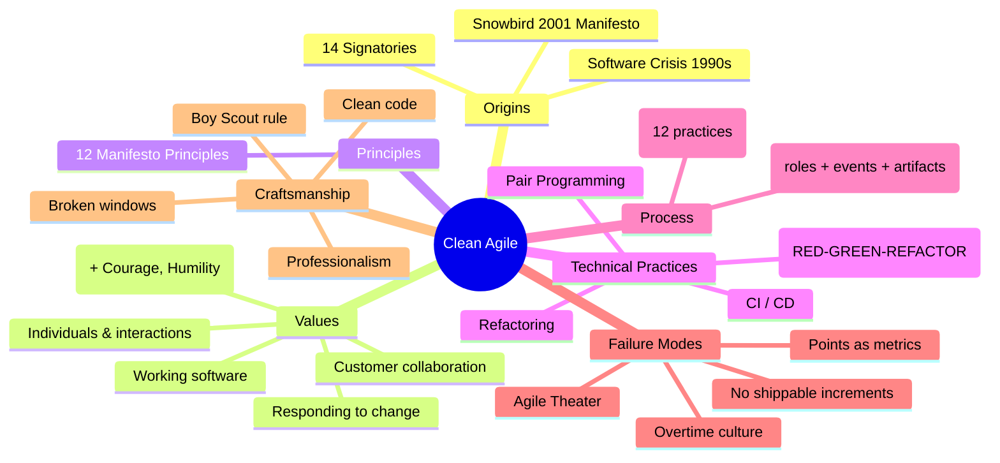

export const bookTitle = 'Clean Agile: Back to Basics'
export const bookAuthor = 'Robert C. Martin'
export const bookSlug = 'clean-agile-robert-martin'

export const bookTitle = 'Clean Agile: Back to Basics'
export const bookAuthor = 'Robert C. Martin'
export const bookSlug = 'clean-agile-robert-martin'

# {frontmatter.bookTitle}
**{frontmatter.bookAuthor} · Prentice Hall · 2019 · ~256 pp**
**ISBN-13:** 978-0-13-578419-9 · **ISBN-10:** 0-13-578419-9

---

## Part I — Why Agile?

### Chapter 1 · Introduction to Agile

On February 11–13, 2001, seventeen software developers gathered at the Snowbird resort in Utah. They were frustrated. The software industry was mired in what they called the *Crisis of the 1990s*: projects chronically late, budgets blown, and deliverable code that was buggy, brittle, and resented by users. The waterfall model — documentation-first, sequential phases — had promised precision and produced pain.

Out of Snowbird came the **Agile Manifesto**:

> *Individuals and interactions* over processes and tools  
> *Working software* over comprehensive documentation  
> *Customer collaboration* over contract negotiation  
> *Responding to change* over following a plan

That was the starting point. Clean Agile opens by reminding us that Manifesto was not a methodology. It was a declaration — a set of *values*. Fourteen signatories put their names to it. Robert C. Martin was one of them.

---

## Part II — The Agile Values

### Chapter 2 · The Reasons for Agile

Agile was born of desperation. The 1990s software crisis was real: the Standish Group CHAOS reports consistently found fewer than one-third of software projects succeeded. Cost overruns averaged 189%. The average project was 222% over schedule.

The Agile pioneers did not set out to create a new process. They set out to *destroy* the old one — or at least strip it down to what actually worked. The four Manifesto values are not preferences; they are *rejections* of industrial-era management thinking applied to creative, knowledge-work.

| Value | Rejects |
|---|---|
| Individuals & interactions | Command-and-control hierarchy |
| Working software | Gates, milestones, sign-offs |
| Customer collaboration | Fixed-price, fixed-scope contracts |
| Responding to change | Project-management theater |

---

## Part III — Business Practice

### Chapter 3 · Business Practices

Business practice in Agile means **planning**, **estimating**, and **tracking** — but in a way that serves the team rather than the other way around.

#### Three Project Planning Levels

```
┌─────────────────────────────────────────────────┐
│  RELEASE PLAN  (months — what to ship)           │
│       │                                          │
│       ▼                                          │
│  ITERATION PLAN  (weeks — what to build now)     │
│       │                                          │
│       ▼                                          │
│  TASK PLAN  (hours — who does what today)        │
└─────────────────────────────────────────────────┘
```

Uncle Bob argues that task planning should be *the team's* responsibility, not a manager's. Iteration length should be short — 1–2 weeks — to keep feedback tight. Release plans live at the business level and change with market conditions.

#### Stories and Acceptance Tests

> A story is a *promise for a conversation*, not a specification.  
> — Ron Jeffries

```mermaid
storycard
    title Story Card Lifecycle
    section Backlog
       Idea             : 0: Business
       Roughly sized    : 1: Team
    section Iteration
       Picked up        : 2: Developer
       Coded + tested   : 3: Developer
       Accepted         : 4: Business
    section Done
       Shipped          : 5: Customer
```

Stories have three *C's*: **Card** (written description), **Conversation** (spoken, detailed), and **Confirmation** (acceptance tests). The card is a placeholder; the conversation is the work; the confirmation is the contract.

#### Velocity

Velocity is the average number of story points a team completes per iteration. It is *not* a productivity metric. It is a *capacity-planning* metric. Business people use velocity to answer: *When will this feature be done?* Managers must not use velocity to compare teams or judge individuals.

Velocity is estimated with story points — relative units of effort. The most common scale is **Fibonacci**: 1, 2, 3, 5, 8, 13, 21. A 13-point story is roughly twice as complex as an 8-point story. Points are useful because they absorb uncertainty: two stories both estimated at 5 may actually have very different real-world complexity, and that's OK.

---

## Part IV — Technical Practices

### Chapter 4 · Pair Programming

Pair programming is not two people doing the job of one. It is two people doing the job better than either could alone.

> The driver types. The navigator thinks, reviews, and watches for bugs.  
> Together they produce fewer defects, simpler designs, and better knowledge sharing.

Pairs should rotate frequently — at least once per day, ideally across stories and across disciplines (front-end / back-end / test). Rotation spreads knowledge, prevents information silos, and raises the overall skill level of the team.

Pairing also acts as a continuous, informal code review, which eliminates the need for heavyweight pull-request chains.

```mermaid
pairing
    title Pair Programming Rotation
    section Day 1
       Pair A: Dev1 + Dev2  : Story X
       Pair B: Dev3 + Dev4  : Story Y
    section Day 2
       Pair A: Dev2 + Dev3  : Story Z
       Pair B: Dev1 + Dev5  : Story W
    note over All
       Exhaustive review
       No MR/PR queue needed
    end note
```

---

### Chapter 5 · Test-Driven Development

TDD is arguably the single most important technical practice in Agile. Uncle Bob describes the **Three Laws of TDD** as formulated by Dave Thomas and Andrew Hunt:

1. You may not write *any* production code unless it is to pass a failing unit test.
2. You may not write *more* of a unit test than is sufficient to fail — compilation failures count as failures.
3. You may not write *more* production code than is sufficient to pass the one currently failing test.

The rhythm: **RED → GREEN → REFACTOR**.

```
RED        Write a failing test (describe what you want)
GREEN      Write the minimum code to pass it
REFACTOR   Clean up duplication, improve names
BACK TO RED
```

TDD is not about testing. It is about **design**. The tests are a side-effect of thinking through what the code should do. Tests become a comprehensive *executable specification* that lives alongside the production code forever.

---

### Chapter 6 · Refactoring

Refactoring is changing the structure of code *without* changing its behavior. It is the hygiene practice that keeps a codebase from accumulating debt until it collapses.

> Any fool can write code that a computer can understand.  
> Good programmers write code that *humans* can understand.  
> — Martin Fowler (quoted in Clean Agile)

Refactoring must be *incremental* and *near-constant*. It should happen at almost every step of the red-green-refactor cycle. Waiting until "later" is equivalent to never doing it.

Common refactorings Uncle Bob identifies:
- Rename variable / method / class
- Extract method
- Extract class / interface
- Move method
- Replace conditional with polymorphism
- Introduce parameter object
- Remove dead code

---

### Chapter 7 · Continuous Integration and Continuous Delivery

CI means that all developers merge their work to a shared trunk *at least daily*. Every merge triggers an automated build and test suite. If the build breaks, the team's highest priority is fixing it.

CD goes further: the software is always in a deployable state. Releasing is a trivially frequent, automated process — potentially multiple times per day.

```
Developer A  ─┐
Developer B ─┤   Shared Trunk
Developer C ─┤        │
Developer D ─┘        ▼
                 CI Server (build + tests)
                        │
                 PASS │
                        ▼
                   Staging (auto-deploy)
                        │
                   PASS │
                        ▼
                   Production (one-click)
```

---

## Part V — The Agile Manifesto in Practice

### Chapter 8 · The Five Values of Agile

The Manifesto expresses four values, but Uncle Bob draws out *five* that the Agile community typically lives by:

1. **Communication** — face-to-face conversations beat documentation walls.
2. **Simplicity** — the art of maximizing the amount of work *not* done.
3. **Feedback** — the shorter the loop, the cheaper the correction.
4. **Courage** — to refactor, to throw away code, to say no, to change direction.
5. **Humility** — admit when you don't know, ask for help, accept criticism.

---

### Chapter 9 · The Twelve Principles

The Manifesto was accompanied by twelve *principles* that flesh out the values:

1. Customer satisfaction through early and continuous delivery
2. Welcome changing requirements, even late in development
3. Deliver working software frequently, from a couple of weeks to a couple of months
4. Business people and developers must work together daily
5. Build projects around motivated individuals; give them the environment and support they need
6. The most efficient and effective method of conveying information is face-to-face conversation
7. Working software is the primary measure of progress
8. Agile processes promote sustainable development; sponsors, developers, and users should be able to maintain a constant pace indefinitely
9. Continuous attention to technical excellence and good design enhances agility
10. Simplicity — the art of maximizing the amount of work not done — is essential
11. The best architectures, requirements, and designs emerge from self-organizing teams
12. At regular intervals, the team reflects on how to become more effective, then tunes and adjusts its behavior accordingly

---

### Chapter 10 · The Relationship Between Craftsmanship and Agility

> Software craftsmanship is the discipline of writing clean, well-structured, well-tested code by professionals who take pride in their work.

Uncle Bob makes the central argument of the book: **Agility and craftsmanship are the same thing, viewed from different angles.**

```
Agility         ↔         Craftsmanship
  │                         │
  Responding to change   Clean, tested code
  Customer feedback      Professional discipline
  Short cycles           Incremental improvement
  Working software       No broken windows
```

Without craftsmanship, Agile collapses into *Agile theater* — sprints without quality, stand-ups without purpose, and velocity charts that measure speed but not health.

- **Broken windows theory:** one sloppy module begets more sloppiness. Clean code begets clean code.
- **Boy Scout rule:** leave the code better than you found it.
- **Professionalism:** being a software developer is a licensed, regulated profession in many countries. Uncle Bob argues it should be everywhere.

---

## Part VI — The Process Methodologies

### Chapter 11 · Extreme Programming (XP)

XP is the methodology that most directly connects Agile values with technical practices. Uncle Bob argues XP is the *purest* form of Agile. It was born at Chrysler in 1996 when Kent Beck took over the C3 payroll project.

#### The Twelve XP Practices (Original)

| Practice | Description |
|---|---|
| Planning game | Business sets priority; team estimates; negotiate scope |
| Small releases | Ship to real users as often as possible |
| Metaphor | Shared vision of what the system is |
| Simple design | YAGNI — build only what is needed now |
| Test-first | Write tests before production code (TDD) |
| Refactoring | Improve design without changing behavior |
| Pair programming | Two people, one keyboard |
| Collective ownership | Anyone can change any code anywhere |
| Continuous integration | Merge to mainline at least daily |
| 40-hour week | Sustainable pace; no overtime |
| On-site customer | Business representative embedded with team |
| Coding standards | Shared conventions for consistent code |

```mermaid
xp-cycle
    title XP Engineering Cycle
    section Inner Loop (hours)
       Test           : RED
       Code           : GREEN
       Refactor       : Clean
    section Outer Loop (days)
       Pair           : Two minds
       Integrate (CI) : Build passes
    side note  All done sustainably
```

---

### Chapter 12 · Scrum

Scrum is the dominant Agile framework today. Uncle Bob's take: Scrum is an *organizational* framework, not a *technical* one. It provides the skeleton — the events, roles, artifacts — but it intentionally says nothing about how to write code. That gap is where craftsmanship must fill in.

#### Scrum Roles, Events, and Artifacts

```
┌───────────────────────────────────────────────────┐
│                   SCRUM                            │
│  ┌──────────┐                                     │
│  │  Product  │  Owns Backlog, defines priority    │
│  │  Owner   │                                     │
│  └──────────┘                                     │
│       │                                           │
│  ┌──────────┐  Facilitates, removes blockers     │
│  │ Scrum    │                                     │
│  │ Master   │                                     │
│  └──────────┘                                     │
│       │                                           │
│  ┌──────────┐                                     │
│  │  Dev     │  Self-organizing, cross-functional  │
│  │  Team    │                                     │
│  └──────────┘                                     │
│                                                   │
│  Events: Sprint, Planning, Daily Standup,        │
│          Review, Retrospective                   │
│                                                   │
│  Artifacts: Product Backlog, Sprint Backlog,     │
│             Increment                            │
└───────────────────────────────────────────────────┘
```

**Sprint cadence:**
- **Sprint Planning** (time-boxed): team selects items from product backlog
- **Daily Standup** (15 min): what did you do, what will you do, what blocks you
- **Sprint Review** (2 hr for 2-week sprint): demonstrate working increment to stakeholders
- **Sprint Retrospective** (90 min): inspect and adapt the *process*

Scrum says *when* you plan, review, and adapt. It does not say *how* you write code. TDD, pairing, refactoring, and CI are necessary to make the Sprint Increment actually shippable.

---

## Part VII — Failure Modes of Agile

### Chapter 13 · Why Agile Fails

Agile theater is when an organization adopts the *form* of Agile without the *substance*.

Agile theater symptoms:

- Managers still dictate tasks and assign work top-down
- Story points are used as individual performance metrics or team rankings
- Sprints become death marches with unpaid overtime
- Stand-up meetings are status reports to the boss, not team coordination
- Refactoring is deferred indefinitely ("we'll do it next sprint")
- The word "agile" is used as a verb to justify cutting corners
- Software is not delivered at the end of each iteration
- Continuous integration is absent; integration is a quarterly trauma

```mermaid
agile-theater
    title Agile Theater vs Real Agile
    section Agile Theater
       Manager assigns tasks  : → Top-down control
       Story points = ranking  : → Individual metrics
       No production code      : → Sprint = report only
       Cut testing to meet date : → Technical debt
    section Real Agile
       Team pulls from backlog : → Self-organizing
       Points = capacity       : → Planning input
       Potentially shippable   : → Working software
       TDD + CI every day      : → Zero debt
```

---

### Chapter 14 · Technical Excellence

> The first responsibility of an Agile team is to not make a mess.  
> — Robert C. Martin

Agile without technical excellence is not Agile — it's just faster failure. Uncle Bob quotes Kent Beck: *"Make it work, make it right, make it fast — in that order."*

The practices that enforce technical excellence and their dependencies:

```
Professionalism
    ├─ TDD (write tests first)
    ├─ Refactoring (clean up continuously)
    ├─ Pair Programming (two sets of eyes)
    ├─ CI/CD (always shippable)
    └─ Simple Design (YAGNI, no speculative generality)
```

**The Craftsman's Oath (from Clean Coders):**
> I will not produce harmful code.  
> I will produce, with every release, a tested and working increment.  
> I will practice relentlessly to keep my skills sharp.  
> I will defend these principles regardless of cost or consequence.

---

## Summary Map



---

## Key Takeaways

1. Agile was a *technical revolution*, not a business-process reformulation.
2. The four Manifesto values are *rejections* of bad management habits.
3. Five values, twelve principles — not more, not less.
4. XP is the purest Agile methodology; Scrum is the most popular organizational container.
5. TDD is a *design* discipline, not a QA discipline.
6. Pairing is continuous informal review — eliminates PR queues.
7. Velocity is capacity-planning only; never a performance metric.
8. Agile theater is the biggest threat to Agile's long-term credibility.
9. Technical excellence is not optional — it is the *foundation* of agility.
10. Craftsmanship and agility are two faces of the same coin.
