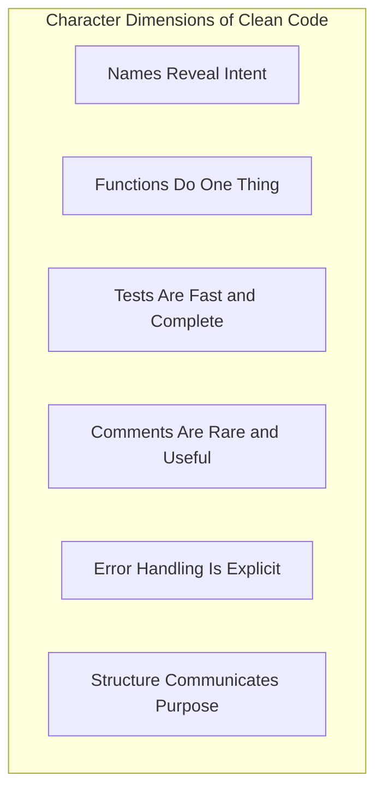
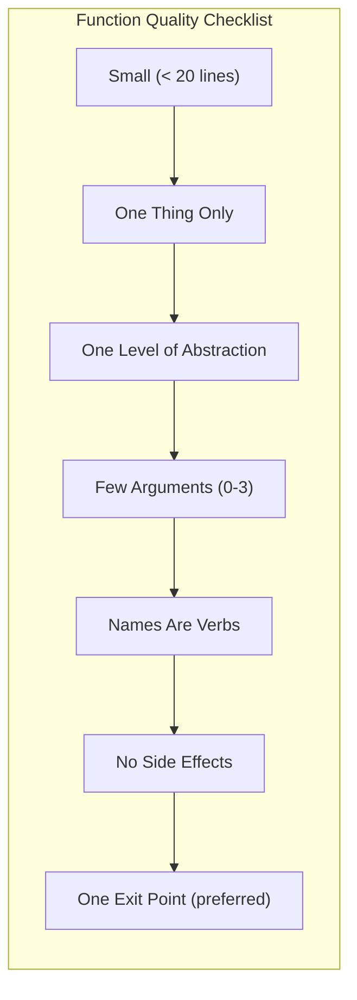
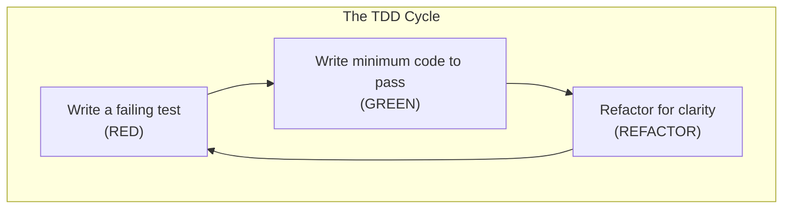

## What Clean Code Is



Clean code is not a checklist you can satisfy by compliance. It is code that:

- **Looks professional** — well-formatted, consistently styled, well-organized
- **Communicates intent** — a reader understands what it does without guessing
- **Does one thing** — each function, class, and module has a single, well-defined responsibility
- **Is tested** — the behavior is documented and guaranteed by a fast, maintainable test suite
- **Is simple** — no unnecessary complexity, no speculative generality
- **Has good names** — every name reveals why the variable, function, or class exists

---

## Meaningful Names

```mermaid
mindmap
  root("Naming Principles")
    Reveal Intent
      "Use 'numberOfActiveUsers', not 'n'"
      "The name should answer: why it exists, what it does, how it is used"
    Avoid Disinformation
      "Do not use 'accountList' if it is not a List"
      "Avoid words with strong meaning (hp, Unix, sco)"
    Make Distinctions Meaningful
      "Do not use 'a', 'the', 'data', 'variable'"
      "Distinguish 'moneyAmount' from 'money'"
    Use Pronounceable Names
      "Use 'generationTimestamp' not 'genymdhms'"
    Use Searchable Names
      "Single-letter names only for loop counters"
      "Constants have names, not values"
    Encode Scope
      "Private members: '_' or no prefix, but consistent"
      "Global scope: qualify with namespace or package"
    Choose Conventions
      "Follow language standard naming conventions"
      "Be consistent within a project"
```

Names are the primary way programmers communicate intent. A good name eliminates the need for a comment. The cost of a bad name is paid every time someone reads the code:

| Problem | Example | Fix |
|---|---|---|
| Non-revealing | `int d;` | `int elapsedTimeInDays;` |
| Disinformative | `List<String> accountList` | `List<String> accounts` |
| Inconsistent scoping | Same name, different scopes | Encode scope in name |

---

## Functions



Functions are the first line of organization in code. Every function should:

**Be small.** Under 20 lines is ideal. A function that fits on a single screen is easy to understand. If you need to scroll to see it, it is doing too much.

**Do one thing.** The hardest principle in the book. A function does one thing if every statement in the function is at the same level of abstraction and could be replaced by a single description. Martin uses the "step down" rule: the code should read like a newspaper article — each section provides more detail.

**Have few arguments.** Zero arguments is ideal. One argument is good. Two is acceptable. Three or more means you should consider whether to wrap them in an object. Flag arguments (a boolean that changes behavior) should be avoided entirely.

| Argument Count | Assessment |
|---|---|
| 0 | Ideal — niladic |
| 1 | Monadic — natural, common |
| 2 | Dyadic — acceptable but requires careful naming |
| 3 | Triadic — requires justification, consider abstraction |
| 4+ | Polyadic — refactor, eliminate flags, use parameter object |

**Have no side effects.** A function that promises to do one thing but also modifies external state is lying to its caller. Martin gives the example of `initializeUser()` that silently sends an email — a hidden side effect that creates confusion and bugs.

**Use command-query separation.** A function should either do something (command) or return something (query), not both. `set(name)` that also returns `name` violates this principle.

---

## Comments

```mermaid
mindmap
    root("The Comment Problem")
        "The proper use of comments is to compensate for our failure to express ourselves in code"
        "Every comment represents a failure to write self-documenting code"
        Legal
          "Copyright, license headers — required, must be maintained"
        Explanatory
          "Explain the intent behind a non-obvious algorithm"
          "Mathematical proofs, invariants"
        Warning
          "TODO (with name and date)"
          "Why this code is wrong intentionally"
        Deprecated
          "Mark obsolete APIs clearly with @deprecated"
    Warning
        Redundant
          "getWidth() // returns the width"
        Obvious
          "i++ // increment i"
        Noise
          "Default constructor"
        Required
          "Because the expression was unclear"
        Mandated
          "Do not comment out code, delete it"
```

Comments are fundamentally a failure of expression. The code itself should be the primary documentation. Martin's rule: **if you feel compelled to write a comment, ask whether you can make the code clearer instead.**

When comments are genuinely needed:
- **Legal comments** — copyright notices, license headers (required, must be kept current)
- **Explanatory comments** — why a non-obvious algorithm was chosen, mathematical invariants the code cannot express
- **Warning comments** — why a piece of code appears wrong but is correct ("this ignores timezone because the spec says so")
- **TODO comments** — with name and date; used sparingly and cleaned regularly

Anti-patterns:
- Comments that restate what the code already says (`i++ // increment i`)
- Commented-out code (version control exists; delete it)
- "Noise" comments like `/* Fill the tank */` before `gas = getGas();`

---

## Formatting

Formatting is about communicating structure to the reader. Martin advocates for vertical formatting as the primary tool:

**Vertical formatting rules:**
- **Variable declarations** should be close to their first use
- **Instance variables** should be declared at the top of the class
- **Dependent functions** should be close together — the caller near the callee
- **Conceptual affinity** — functions that operate on the same concept should be grouped together
- **The newspaper metaphor** — the highest-level concepts (names, summary) at the top; details below

**Horizontal formatting rules:**
- Keep lines short — under 120 characters is the practical limit
- Use white space to associate related ideas and separate unrelated ones
- Indentation should follow the language standard strictly

| Direction | Tool | Purpose |
|---|---|---|
| Vertical | Spacing, grouping | Communicates conceptual structure and distance |
| Horizontal | Indentation, alignment | Communicates scoping and relationship |

---

## Error Handling

Error handling should not obscure the main logic of the code. Martin's guidelines:

| Guideline | Explanation |
|---|---|
| Use exceptions, not return codes | Exceptions separate error handling from normal flow |
| Write tests for error paths | Error handling code is code — test it too |
| Do not return null | Null references are a major source of bugs; use Optional or exceptions |
| Do not pass null | Passing null forces every caller to check and creates fragile APIs |
| Consider the caller | What exceptions will the caller need to handle? Document them |

Martin argues that error handling should be a **separate concern** in the code. If you use checked exceptions (Java-specific) or Error Objects, the handling code should be wrapped in its own function so the happy-path logic reads cleanly.

---

## Unit Testing and TDD



The book treats TDD as foundational to clean code. Without fast, reliable tests, you cannot safely refactor — and without refactoring, code decays.

**The three laws of TDD (from Beck):**
1. You may not write production code until you have written a failing unit test
2. You may not write more of a test than is sufficient to fail
3. You may not write more production code than is sufficient to pass the currently failing test

**FIRST principles for unit tests:**
- **Fast** — tests must run quickly (under 10 seconds for the full suite)
- **Independent** — tests should not depend on each other or on execution order
- **Repeatable** — tests should pass in every environment
- **Self-validating** — tests should return a boolean (pass/fail), not require interpretation
- **Timely** — write tests just before the production code they test

---

## Classes

Classes are the primary organizational unit in object-oriented systems. Martin's rules for classes:

**Keep classes small.** Martin uses a naming convention as a proxy: a class name should not require more than a few words. If you need `CsvParserWithHeaderAndFooter` the class is doing too much.

Each class should have **one responsibility** — a single reason to change. Not "database access" or "user management" — those are vague. The reason to change is the responsibility.

**Organize for readability.** Martin recommends the **step-down rule** for class structure:
1. Public constants
2. Private static variables
3. Private instance variables (lowest level of abstraction)
4. Public methods — grouped by their level of abstraction (highest level first)
5. Private utility methods — near where they are called, at the bottom

**Classes should be closed for modification, open for extension.** Use inheritance, polymorphism, and dependency injection to allow behavior extension without modifying existing code.

**Dependency Injection** is the pattern that separates construction from use. Machines (factories) build the dependency graph; objects receive their dependencies rather than creating them. This allows the system to be assembled in different configurations for testing and production.

---

## Concurrency

Concurrency is the hardest topic in the book. Martin emphasizes that **concurrency is not just a performance optimization — it is a fundamental change in how a program executes.**

**Why concurrency is hard:**
- It is non-deterministic — different thread interleavings produce different results
- Threads share mutable state — threads interleave in ways that violate assumptions
- Race conditions, deadlocks, and stale data are hard to reproduce and hard to test

**Mental models for correct concurrency:**
- **Single Responsibility Principle applies** — separate concurrency concerns from business logic
- **Limit the scope of shared data** — the less shared mutable state, the simpler the concurrency
- **Use immutable data where possible** — immutable objects need no synchronization
- **Keep the synchronized sections small** — lock granular, lock briefly, lock late
- **Test thread safety rigorously** — write tests that run thousands of iterations to surface race conditions

**Concurrency key principles:**
| Principle | Application |
|---|---|
| Single responsibility | Isolate concurrency from business logic |
| Limit mutable shared data | Reduce lock scope and contention |
| Immutability preferred | Threads cannot corrupt what they cannot change |
| Keep synchronization local | Lock only what needs locking, for as briefly as possible |
| Test systematically | Race conditions are non-deterministic — tests must force them |
