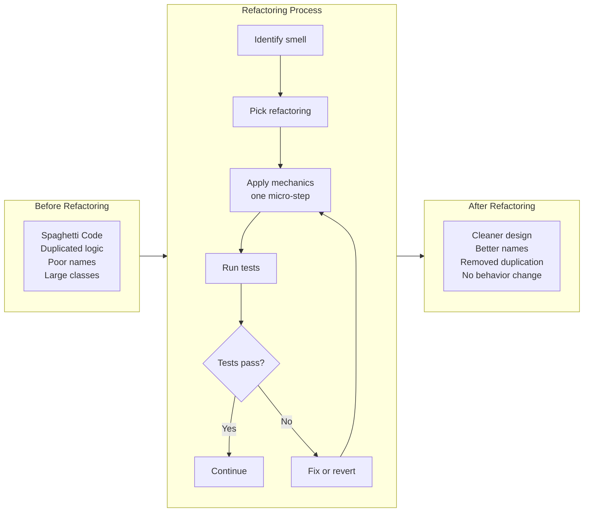
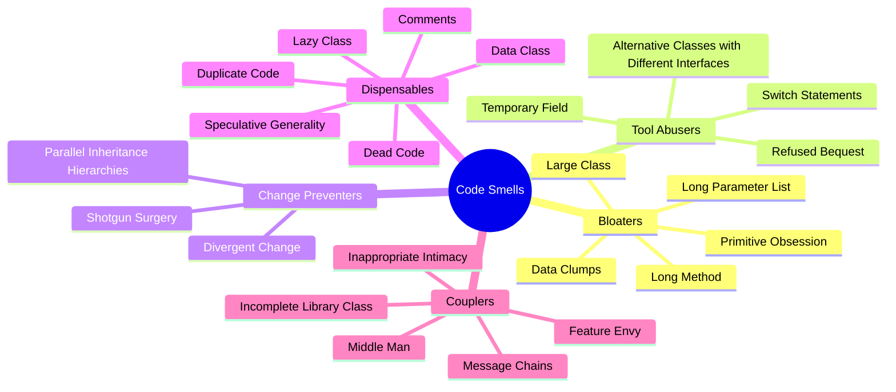
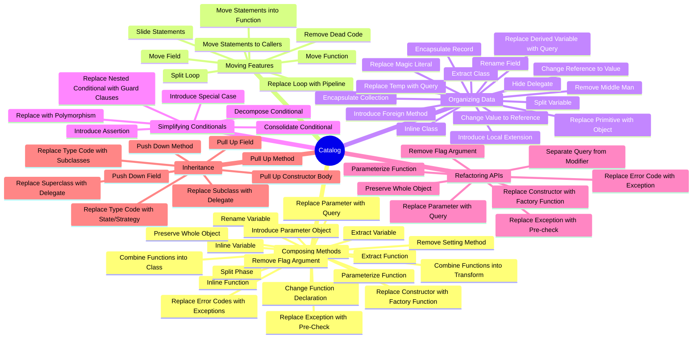

## What Refactoring Is

The central definition: **refactoring is the process of changing a
software system in such a way that it does not alter the external
behavior of the code, yet improves its internal structure.**

This is not rewriting, re-architecting, or optimizing. It is a
disciplined technique where each transformation is so small that
the risk of introducing errors is minimal, and the cumulative
effect over many steps is a significantly better design.

---

## Why Refactoring Matters

| Reason | Explanation |
|--------|-------------|
| Keeps code cheap to modify | Messy code costs exponentially more to change |
| Makes code understandable | Clean structure reveals intent |
| Helps find bugs | Understanding the code surface helps you see defects |
| Accelerates development | A clean codebase allows faster feature delivery |
| Prevents software decay | All code degrades without continuous maintenance |

---

## When to Refactor

- **The Rule of Three:** When you do something three times, refactor
- **When adding a feature:** Refactor first to make the change easy,
  then make the easy change
- **When fixing a bug:** The bug reveals insufficient understanding of
  the code — refactor to clarify before fixing
- **During code review:** Smells spotted in review should be refactored
  before the code is merged

### When NOT to Refactor

- **The code is too messy to refactor safely** — it may be cheaper to
  rewrite (Fowler calls this the "sunk cost" decision)
- **You are past a deadline** — refactoring should not delay shipping
- **The code will be replaced soon** — don't polish what will be
  thrown away

---

## Code Smells: The 24 Types (2nd Edition)

### Bloaters — things that have grown too large

| Smell | Description | Common Refactoring |
|-------|-------------|-------------------|
| Long Method | A method that has too many lines | Extract Function |
| Large Class | A class trying to do too much | Extract Class, Extract Subclass |
| Primitive Obsession | Using primitives instead of small objects | Replace Primitive with Object |
| Long Parameter List | Hard to understand and call | Introduce Parameter Object |
| Data Clumps | Groups of data that appear together | Extract Class, Introduce Parameter Object |

### Tool Abusers — misuse of object-oriented mechanisms

| Smell | Description | Common Refactoring |
|-------|-------------|-------------------|
| Switch Statements | Duplicated switch/case or if/else chains | Replace Conditional with Polymorphism |
| Temporary Field | Fields that are only set in some circumstances | Extract Class, Introduce Special Case |
| Refused Bequest | Subclass rejects what the parent gives | Replace Inheritance with Delegation |
| Alternative Classes with Different Interfaces | Classes that do the same thing differently | Rename Function, Move Function |

### Change Preventers — making changes harder

| Smell | Description | Common Refactoring |
|-------|-------------|-------------------|
| Divergent Change | One class changed for multiple reasons | Extract Class |
| Shotgun Surgery | One change requires many small edits across many classes | Move Function, Inline Class |
| Parallel Inheritance Hierarchies | Adding a subclass requires adding a parallel subclass elsewhere | Move Function, Remove Hierarchy |

### Dispensables — things that could be removed

| Smell | Description | Common Refactoring |
|-------|-------------|-------------------|
| Comments | Comments used to explain confusing code | Extract Function, Rename Variable |
| Duplicate Code | The same code appears in multiple places | Extract Function, Slide Statements |
| Lazy Class | A class that does too little to justify its existence | Inline Class, Collapse Hierarchy |
| Data Class | Classes with only fields and accessors, no behavior | Move Function, Encapsulate Field |
| Dead Code | Code that is never executed | Remove Dead Code |
| Speculative Generality | Hooks and abstractions for features that never materialize | Collapse Hierarchy, Inline Class |

### Couplers — excessive coupling

| Smell | Description | Common Refactoring |
|-------|-------------|-------------------|
| Feature Envy | A method that cares more about another class than its own | Move Function |
| Inappropriate Intimacy | Two classes that know too much about each other | Move Function, Change Bidirectional to Unidirectional |
| Message Chains | Long chains of method calls (a.b.c().d()) | Hide Delegate, Extract Function |
| Middle Man | A class that does nothing but delegate | Remove Middle Man, Inline Function |
| Incomplete Library Class | A library that doesn't do what you need | Introduce Foreign Method, Introduce Local Extension |

---

## The Refactoring Catalog (2nd Edition — 63 Refactorings)

---

## The Opening Example

The book's signature example: a program that calculates and prints
a statement of a theater company's bill. The code works but is a
mess — one long function with duplicated logic, unclear names, and
conditional spaghetti.

Fowler walks through the refactoring step by step:

1. **Identify the entry point** — the `statement()` function is too
   long and does too much
2. **Build the test suite** — capture current behavior in tests
3. **Extract Function** — pull the `amountFor()` calculation into its
   own function
4. **Rename Variable** — improve clarity at each extraction point
5. **Move Function** — the calculation belongs on the performance
   data, not in the statement logic
6. **Replace Conditional with Polymorphism** — different play types
   should compute their own cost
7. **Split Phase** — separate calculation from formatting

Each step is a few lines of change, followed by a test run.
The cumulative result: a clean, understandable, extensible design.
Adding a new play type becomes a matter of adding a new subclass,
not editing a switch statement.

---

## The Role of Tests

Testing is not an afterthought in refactoring — it is the prerequisite:

- **Tests must be self-checking.** Run them with a single command
- **Tests must be fast.** If tests take hours, you won't run them
  after each micro-step
- **Tests cover the interface, not the internals.** Testing
  implementation details makes refactoring harder (tests break when
  they should not)
- **Imperfect tests are better than no tests.** Even incomplete tests
  catch most regressions
- **Write tests for the behavior you want to preserve.** Not for the
  current implementation

---

## Key Lessons

- Refactoring changes structure, not behavior. If behavior changes,
  it is not refactoring — it is a rewrite or a bug
- The catalog is a reference — learn the mechanics, then internalize
  them until they are automatic
- Code smells are the diagnostic; the refactoring catalog is the
  treatment. Apply them together
- Design is not a phase — it emerges through continuous refinement
- Test-driven refactoring (test → small change → test → commit) makes
  large-scale redesign safe and predictable
- The 2nd edition's shift from classes to functions reflects the
  evolution of programming paradigms beyond pure OOP

---

## Practical Applications

### For Individual Developers

- Practice the opening example by hand — do not use IDE automation
- Learn the most common refactorings: Extract Function, Rename
  Variable, Move Function, Inline Function
- Apply one smell-detection pass per week to your codebase
- Build the habit of running tests after every change, no matter how
  small

### For Teams

- Adopt the "Refactoring first" rule: when adding a feature, refactor
  the code to make the change easy, then add the feature
- Make refactoring a standard part of code review — flag smells and
  suggest catalog refactorings
- Include refactoring time in estimates — it is not overhead, it is
  maintenance

### For Technical Leads

- Protect refactoring time from feature pressure
- Ensure the test suite is robust enough to support refactoring
- Invest in CI/CD so tests run automatically after every commit
- Use static analysis tools that detect code smells automatically

---

## Action Plan

1. **Read Chapter 1** — the opening example is the fastest way to
   understand what refactoring feels like
2. **Practice the mechanics** — do the opening example manually
   (without IDE refactoring tools)
3. **Memorize the code smells** — learn to see them in your own code
4. **Pick one smell** and eliminate it from your codebase this week
5. **Build your test suite** — you cannot refactor code you cannot test
6. **Commit to the process** — refactor for 30 minutes every day
   before starting new features
