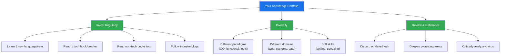
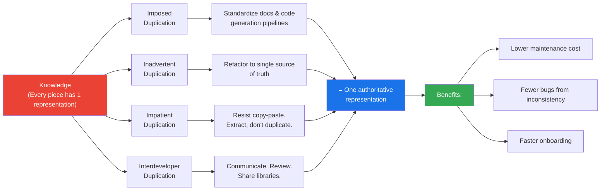
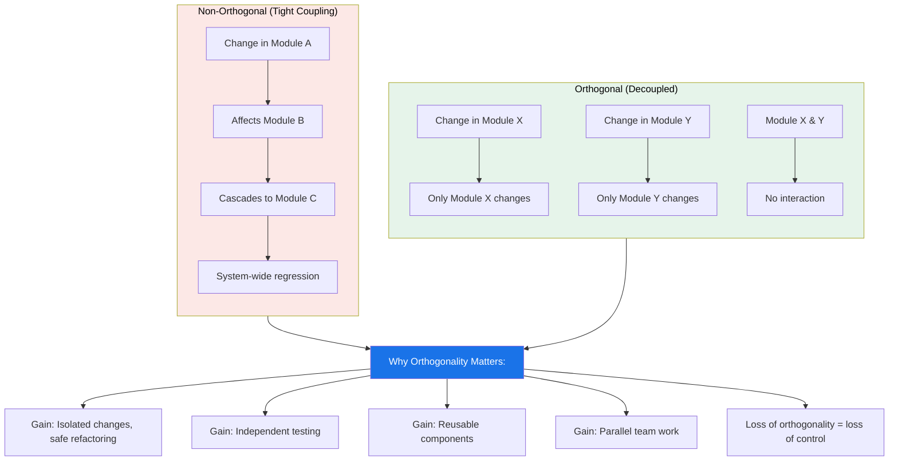
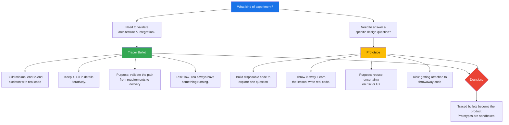
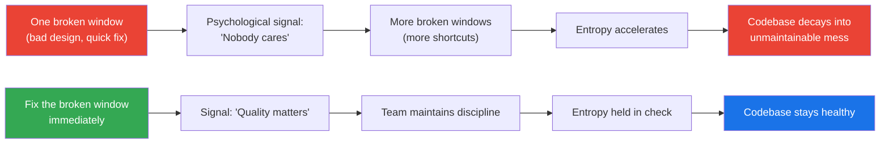
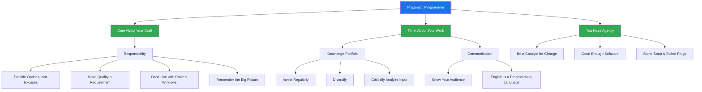

## Conceptual Models

### The Knowledge Portfolio

### DRY - Don't Repeat Yourself

### Orthogonality

### Tracer Bullet vs Prototype

### Software Entropy & Broken Windows

### Pragmatic Philosophy Framework

## Chapter Breakdowns

### Chapter 1: A Pragmatic Philosophy

The foundation. The authors argue that being a pragmatic programmer
starts with attitude, not technology. Key ideas:

- **It's Your Life (Tip 3).** You have agency over your career, your
  tools, and your code. Don't wait for others to make decisions for you.
- **The Cat Ate My Source Code (Tip 4).** Take responsibility. When
  things go wrong, offer solutions not excuses.
- **Software Entropy (Tip 5).** The "Broken Window Theory" borrowed
  from criminology: visible neglect encourages more neglect. Fix
  problems as soon as you find them.
- **Stone Soup and Boiled Frogs (Tip 6, 7).** Be a catalyst for change
  by making success visible. Watch for gradual degradation — the frog
  doesn't notice the water heating.
- **Good-Enough Software (Tip 8).** Perfect is the enemy of shipped.
  Involve users in quality trade-offs.
- **Your Knowledge Portfolio (Tip 9, 10).** Treat your skills like a
  financial portfolio. Invest regularly. Diversify. Review and rebalance.
- **Communicate! (Tip 11, 12, 13).** Know your audience. Choose your
  moment. Good writing and speaking are force multipliers.

**Example:** When a project deadline slips, the pragmatic programmer
doesn't say "we need more time." They say "we can deliver features
A and B by Friday, or A through D by next Wednesday. Which do you
prefer?"

### Chapter 2: A Pragmatic Approach

The tools of thought. This chapter introduces the core design
principles that the book is famous for.

- **The Essence of Good Design (Tip 14).** "Good design is easier to
  change than bad design." All other principles serve this goal.
- **DRY — Don't Repeat Yourself (Tip 15).** The book's most famous
  principle. Every piece of knowledge must have a single,
  unambiguous representation. DRY is about *knowledge* duplication,
  not just code duplication.
- **Orthogonality (Tip 17).** When two things are orthogonal, changes
  to one don't affect the other. Strive for independent, cohesive
  modules.
- **Reversibility (Tip 18).** "There are no final decisions." Build
  systems that can survive change. Avoid irreversible commitments.
- **Tracer Bullets (Tip 20).** Build a single, end-to-end skeleton
  with real code. Use it to validate architecture, get user feedback,
  and establish a rhythm.
- **Prototypes and Post-it Notes (Tip 21).** Prototypes answer
  specific questions. They are disposable by nature. Do not confuse
  them with tracer bullets.
- **Domain Languages (Tip 22).** Program close to the problem domain.
  Mini-languages and DSLs improve communication and reduce gaps
  between specification and code.
- **Estimating (Tip 23, 24).** Estimate to avoid surprises. Break
  problems into components. Use your intuition, then validate with
  data. Iterate your estimates as the project progresses.

**Example:** DRY in practice means extracting a business rule —
say, "orders over $100 get free shipping" — into exactly one place.
A configuration file, a service, or a function. Not inlined across
five controllers.

### Chapter 3: The Basic Tools

Your working environment. The authors argue that tool mastery is a
multiplier on everything else.

- **The Power of Plain Text (Tip 25).** Plain text is the most
  universal, durable, and debug-able format. Use it for config,
  data interchange, and documentation where possible.
- **Shell Games (Tip 26).** Master your command shell. GUI tools
  are slower and less composable than the command line.
- **Power Editing (Tip 27).** Achieve editor fluency. Know your
  editor's shortcuts, macros, and extensions. You should not need
  a mouse for common operations.
- **Version Control (Tip 28).** "Always use version control." This
  was controversial in 1999. Now it is universal. Treat everything
  — code, config, docs, build scripts — as versioned artifacts.
- **Debugging (Tip 29–34).** Fix the problem, not the blame. Don't
  panic. Write a failing test before fixing code. Read the error
  message. "select" isn't broken. Don't assume, prove.
- **Text Manipulation (Tip 35).** Learn a text manipulation language
  (Perl, Python, awk, sed). Automate repetitive transformations.
- **Engineering Daybooks (Topic 22).** Keep a written log of what
  you do, why you do it, and what you discover.

**Example:** The debugging mindset: instead of assuming "the database
is corrupt," write a test that proves your hypothesis. If the test
passes, your assumption was wrong. This avoids wild goose chases.

### Chapter 4: Pragmatic Paranoia

You can't trust your own code. Build defenses.

- **Design by Contract (Tip 37).** Every module has a contract:
  what it guarantees (postconditions), what it requires
  (preconditions), and what it maintains (invariants). Document
  and enforce these.
- **Dead Programs Tell No Lies (Tip 38).** Crash early rather than
  corrupt data. A crash is noisy and noticeable; corruption is
  silent and deadly.
- **Assertive Programming (Tip 39).** Use assertions to prevent the
  impossible. If something *cannot* happen, prove it with an
  assertion. When it fires, you saved yourself debugging time.
- **How to Balance Resources (Tip 40, 41).** Finish what you start.
  Deallocate in the reverse order of allocation. Use RAII or
  try-finally patterns.
- **Don't Outrun Your Headlights (Tip 42, 43).** Take small steps.
  You cannot predict the future, so stop pretending you can. Stay
  within the cone of uncertainty.

**Example:** A function that reads a file must guarantee it closes
the file even on error. In C#: `using (var f = OpenFile()) { ... }`.
In Python: `with open(path) as f: ...`. Always.

### Chapter 5: Bend, or Break

Write code that bends under pressure rather than shattering.

- **Decoupling (Tip 44–48).** Decoupled code is easier to change.
  Tell, Don't Ask. Don't chain method calls (Law of Demeter).
  Avoid global data. Wrap globals in an API.
- **Juggling the Real World (Topic 29).** Event-driven architectures,
  publish/subscribe patterns, and callback management.
- **Transforming Programming (Tip 49, 50).** Think of programs as
  data transformation pipelines. Programming is about code, but
  programs are about data. Don't hoard state; pass it around.
- **Inheritance Tax (Tip 51–54).** Inheritance couples classes
  tightly. Prefer interfaces, delegation, and mixins. Has-A
  trumps Is-A.
- **Configuration (Tip 55).** Parameterize your application using
  external configuration. Never hardcode values that may change.

**Example:** Instead of `order.ShippingAddress.State`, ask the order:
`order.CanShipTo(state)`. The order owns the logic, not the caller.
This is the "Tell, Don't Ask" principle.

### Chapter 6: Concurrency

Coping with parallel execution.

- **Breaking Temporal Coupling (Tip 56).** Analyze workflow to find
  concurrency. Don't impose sequential ordering when it isn't needed.
- **Shared State Is Incorrect State (Tip 57).** Shared mutable state
  is the root of most concurrency bugs. Minimize it.
- **Actors and Processes (Tip 59).** Use actors for concurrency
  without shared state. Each actor is an independent process with
  its own state, communicating via messages.
- **Blackboards (Tip 60).** Use a blackboard (shared data space) to
  coordinate workflow among independent agents.

**Example:** A web server handling requests is naturally concurrent.
Each request is an independent actor. If you need to share a
cache, use a dedicated cache service — don't let requests share
mutable state directly.

### Chapter 7: While You Are Coding

The discipline of writing code deliberately.

- **Programming by Coincidence (Tip 62).** "It works" is not enough.
  Understand *why* it works. Rely on intention, not accident.
- **Algorithm Speed (Tip 63, 64).** Estimate the order of your
  algorithms. Test your estimates with real data. Big-O matters.
- **Refactoring (Tip 65).** Refactor early, refactor often. Code
  decay is inevitable; small, continuous improvements beat
  massive rewrites. Know when to stop refactoring.
- **Testing to Code (Tip 66–71).** Testing is not about finding
  bugs — it's about verifying contracts, documenting behavior,
  and enabling change. Build end-to-end, design to test, and use
  property-based tests.
- **Stay Safe Out There (Tip 72, 73).** Security is everyone's
  problem. Keep it simple, minimize attack surfaces, apply
  patches quickly.
- **Naming Things (Tip 74).** Name well; rename when needed. Good
  names are the cheapest form of documentation.

**Example:** A method that works but you can't explain why should be
rewritten. "I don't know why, but it works" is the enemy of
reliable software.

### Chapter 8: Before the Project

Understanding what to build before building it.

- **The Requirements Pit (Tip 75–80).** No one knows exactly what
  they want. Your job is to help them discover it. Requirements
  are learned in a feedback loop. Use a project glossary.
- **Solving Impossible Puzzles (Tip 81).** Don't think outside the
  box — find the box. Recognize constraints before trying to
  escape them. Sometimes the box is the solution.
- **Working Together (Topic 47).** Pair programming, mob
  programming, and collective code ownership. Don't go into the
  code alone.
- **The Essence of Agility (Tip 83).** "Agile is not a noun; agile
  is how you do things." Agility is the ability to respond to
  change, not a process checklist.

**Example:** When a client says "build me a CRM," the pragmatic
developer asks "what does a day in your life look like?" and
iterates from there. The requirements emerge from the conversation.

### Chapter 9: Pragmatic Projects

Teams and process.

- **Pragmatic Teams (Tip 84–88).** Maintain small, stable, fully
  functional teams. Do what works, not what's fashionable.
  Deliver when users need it.
- **Coconuts Don't Cut It (Tip 50).** Beware of process theater —
  adopting the *form* of Agile without the *substance*. A coconut
  is not a true nut.
- **Pragmatic Starter Kit (Tip 89–95).** Version control drives
  builds, tests, and releases. Test early, test often, test
  automatically. Use saboteurs to test your testing. Test state
  coverage, not code coverage. Find bugs once.
- **Delight Your Users (Tip 96).** Don't just deliver code. Delight
  users. Understand what they value and exceed those expectations.
- **Pride and Prejudice (Tip 97–100).** Sign your work. Take pride
  in your code. First, do no harm. Don't enable scumbags.

**Example:** A truly pragmatic team has automated CI/CD that runs
tests on every commit. Deployments are routine, not events. The
team ships small, frequent releases and measures user satisfaction,
not just lines of code.
