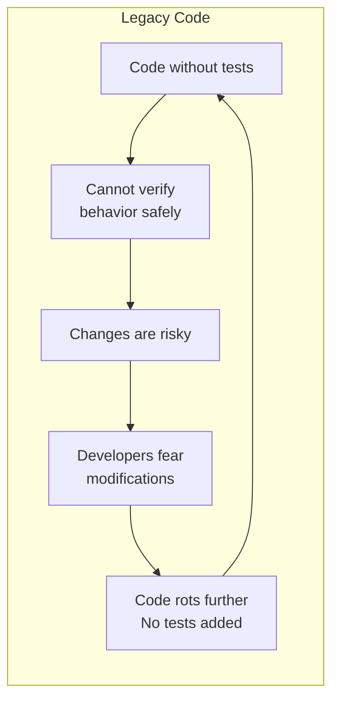
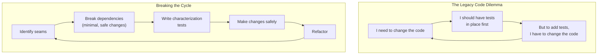
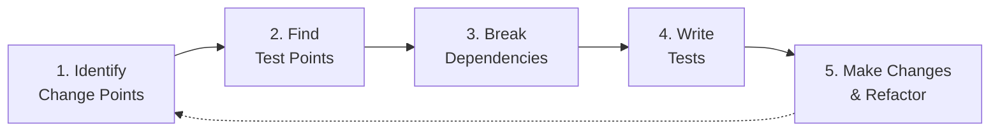
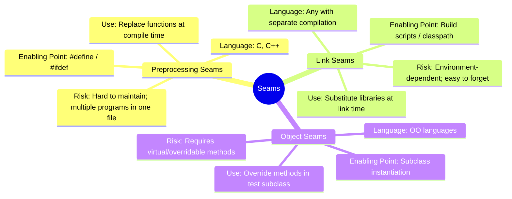
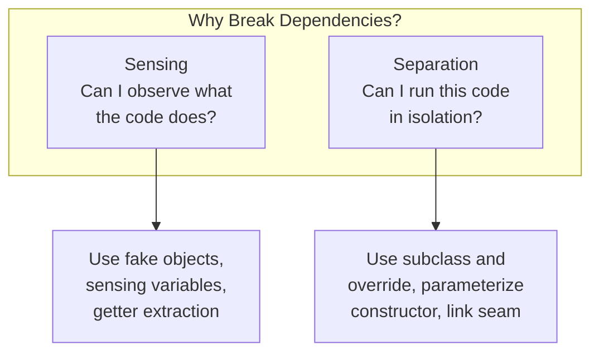
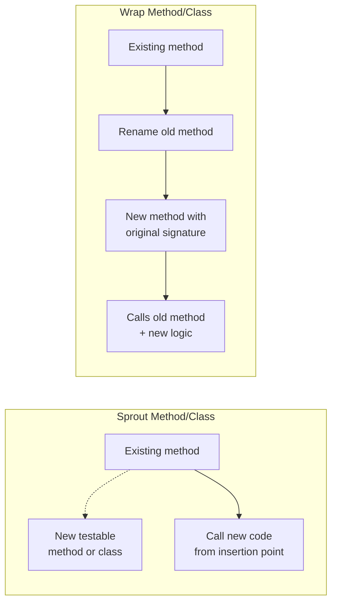
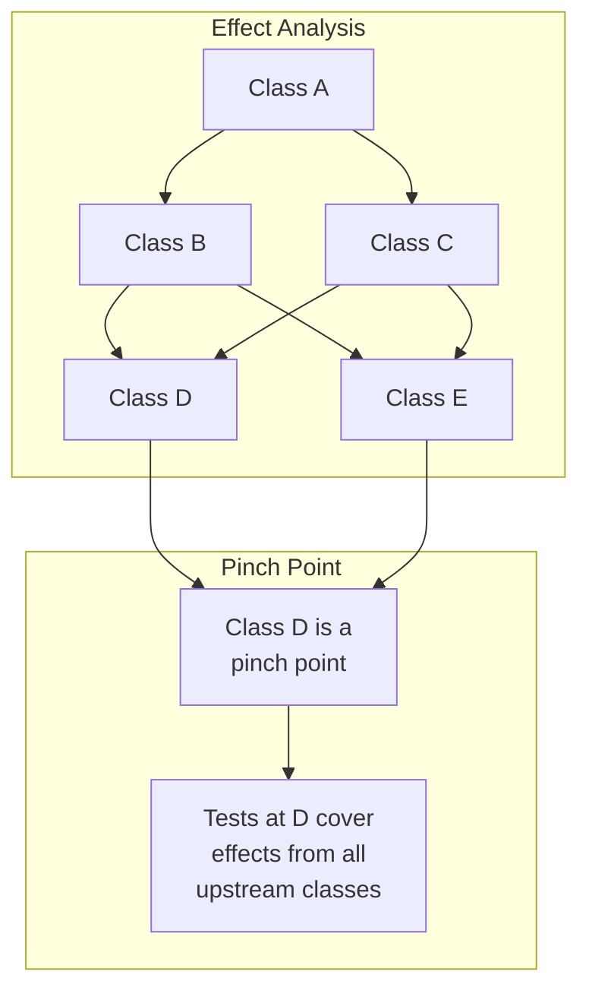

## The Definition

Feathers' central definition: **legacy code is code without tests.**
This is not about age, language, or architecture. Code with tests can be
changed confidently. Code without tests is legacy — regardless of how
well it is written.

---

## The Legacy Code Dilemma

The fundamental problem: **to change code safely you need tests, but to
add tests you often need to change code.** The book teaches how to make
the smallest, safest possible changes to get code into a test harness
— even if those changes temporarily make the design worse.

---

## The Legacy Code Change Algorithm

This is the canonical process for every modification to legacy code:

1. **Identify change points** — where in the code must you modify to
   add the feature or fix the bug?

2. **Find test points** — where can you observe the behavior to verify
   your changes? Look for narrow interfaces (pinch points) that channel
   many effects.

3. **Break dependencies** — use the dependency-breaking techniques to
   get the target code into a test harness. Break only what is needed
   for sensing (observing results) and separation (isolating the code).

4. **Write tests** — characterization tests first (capturing actual
   behavior), then more targeted tests as understanding improves.

5. **Make changes and refactor** — now you have a safety net. Make the
   feature change, then clean up with confidence.

---

## The Seam Model

A **seam** is a place where you can alter behavior in your program
**without editing in that place**. Every seam has an **enabling point**
— the place where you decide which behavior to use (the subclass
instantiation, the `#define` directive, the link configuration).

The goal: find existing seams, or introduce new ones, so you can
substitute test-friendly behavior (fakes, mocks, stubs) without
modifying the production code.

### Preprocessing Seams

In C and C++, the preprocessor provides seams through `#define` macros
and conditional compilation. Replace a function call with a macro that
redirects to a test stub. The enabling point is the `#define` or
compiler flag.

### Link Seams

Substitute an entire library at link time. Create a test library with
the same function signatures but no side effects. The enabling point is
the build script or classpath. Useful when dependencies are pervasive.

### Object Seams

The most common and maintainable seam in OO languages. Add a virtual
method that delegates to a global/dependency, then subclass and override
it in tests. The enabling point is the place where you instantiate the
object — use a test subclass instead of the production class.

---

## Sensing and Separation

**Sensing**: Can you verify the behavior? If the code writes to a
database or calls a remote service, you cannot sense the result in a
test. Break the dependency — inject a fake collaborator that records
the call so you can assert on it.

**Separation**: Can you even run the code? If the constructor opens a
network socket or reads a configuration file that does not exist in CI,
you cannot run it at all. Break the dependency — extract the
construction into an overridable method, then override in a test
subclass.

---

## Characterization Tests

When you do not know what a piece of code should do, write a
**characterization test**:

1. Run the code with a set of inputs
2. Capture the actual output as the expected result
3. Write an assertion against that captured result

The test now documents and protects the current behavior. Once you
have a safety net, you can refactor toward the *desired* behavior.

| Technique | Name | Description |
|-----------|------|-------------|
| Capture current output | Characterization Test | Assert on what the code actually does now |
| White-box input discovery | Effect Analysis | Trace code paths to find relevant inputs |
| Broad safety net | Test Covering | A set of tests that create an invariant on a code region |

---

## Sprout and Wrap Techniques

### Sprout Method

When adding a feature to an untested method:

1. Write the new code in a **new method** (tested via TDD)
2. Identify the insertion point in the legacy code
3. Call the new method from the insertion point
4. You have added tested functionality without modifying untested code

### Sprout Class

When a class is too tangled to even sprout a method:

1. Create a whole new class containing the new behavior
2. Test it thoroughly in isolation
3. Use the new class from the legacy code with minimal changes

### Wrap Method

When new behavior must happen before or after existing logic:

1. Rename the original method (e.g., `postEntries` → `postEntriesAndLog`)
2. Create a new method with the original name and signature
3. The new method calls the old method plus your new code
4. Test the new behavior in isolation

### Wrap Class (Decorator)

The class-level version. Create a new class that implements the same
interface, delegates to the legacy class, and adds your new behavior.
This is the Decorator design pattern.

---

## Effect Analysis and Pinch Points

**Effect analysis**: Trace the ripple effects of a change through the
system. Draw a directed graph where nodes are classes/functions and
edges mean "changing this affects that."

**Pinch point**: A narrow interface where many effects converge. If you
can test at a pinch point, you cover the behavior of many upstream
classes with a single test suite. Find pinch points — they are your
most valuable test targets.

---

## Dependency-Breaking Techniques (Chapter 25)

| Technique | When to Use | Mechanism |
|-----------|-------------|-----------|
| Parameterize Constructor | Dependency created inside constructor | Pass dependency as parameter instead |
| Parameterize Method | Dependency created inside a method | Pass dependency as method parameter |
| Extract and Override Call | Hard-coded call to a dependency | Extract call to virtual method, override in test subclass |
| Extract and Override Factory Method | Hard-coded `new` in constructor | Extract object creation to factory method, override |
| Extract and Override Getter | Dependency accessed via property | Extract access to virtual getter, override |
| Break Out Method Object | Monster method with local dependencies | Extract method into its own class, test that class |
| Extract Interface | Class has too many dependencies | Define interface, implement, test through interface |
| Extract Implementer | Need to separate interface from implementation | Extract concrete class from abstract, test the extract |
| Adapt Parameter | Parameter has wrong interface | Create adapter to translate between test and production types |
| Expose Static Method | Method uses no instance state | Make it static, test without instantiation |
| Encapsulate Global Reference | Global variables are dependencies | Wrap globals in a class with getter/setter, swap in tests |
| Introduce Static Setter | Singleton is the dependency | Add `setInstance` for test substitution (use with caution) |
| Introduce Instance Delegator | Static methods are the dependency | Create non-static wrapper, swap in tests |
| Link Substitution | Dependency is a linked library | Link against a test stub library instead |
| Definition Completion | Missing definitions in test environment | Provide stub definitions for undefined symbols |
| Primitivize Parameter | Object parameter has too many dependencies | Pass primitive values instead of the full object |
| Pull Up Feature | Feature buried deep in hierarchy | Pull desired behavior into abstract base, test through test subclass |
| Push Down Dependencies | Base class drags in too many dependencies | Make base abstract, push deps to concrete, test abstract through test subclass |
| Subclass and Override Method | Need to replace a single method | Subclass, override the problematic method, use test subclass |
| Replace Function with Function Pointer | C-style function dependencies | Use function pointer as seam |
| Wrap Method | Need to add behavior around existing | Rename old, create new that calls old + new logic |
| Wrap Class | Need to add behavior around existing class | Decorator pattern: implement same interface, delegate |
| Sprout Method | Adding new behavior to a method | Add new method, call from insertion point |
| Sprout Class | Adding new behavior to a class | Create new class, use from legacy code |

---

## Key Lessons

- Legacy code is defined by the absence of tests, not by age or quality
- The Legacy Code Change Algorithm is universal — every change follows
  this pattern
- Seams are everywhere once you train yourself to see them
- Break dependencies only enough to get the code into a test harness
- Characterization tests are better than no tests — they document and
  protect current behavior
- Sprout and Wrap techniques minimize changes to untested code
- Pinch points are the most efficient places to test — they cover
  multiple classes with a single test suite
- Temporary design degradation (broken encapsulation) is acceptable if
  it enables testing
- The compiler is your friend — lean on it during dependency-breaking
- Big rewrites fail; incremental test coverage compounds

---

## Practical Applications

### For Individual Developers

- Identify one class you are afraid to change and apply the Legacy Code
  Change Algorithm to it this week
- Practice finding seams: look at the hardest-to-test class and
  identify three places you could substitute behavior
- Use Sprout Method for your next feature addition instead of modifying
  existing code
- Run effect analysis on your most-changed module to find its pinch
  points

### For Teams

- Adopt "no change without test coverage around the change point"
- Establish a dependency-breaking technique catalog
- Use code reviews to identify seams and test points, not just
  correctness
- Create a shared vocabulary: seams, enabling points, sensing,
  separation, pinch points, characterization tests

### For Technical Leads

- Protect the time needed to break dependencies and add tests before
  feature work
- Measure progress by the growth of test-covered regions, not by lines
  of test code
- Push back on rewrites — incremental coverage compounds; rewrites
  often fail
- Train the team to think in seams and effects, not just features

---

## Action Plan

1. **Pick one method** you need to change and have been avoiding
2. **Find the seams** — what can you override, substitute, or wrap?
3. **Break one dependency** using Parameterize Constructor or Extract
   and Override
4. **Write a characterization test** that captures current behavior
5. **Make your change** with the test as a safety net
6. **Refactor** the covered code toward cleaner design
7. **Repeat** — one method at a time, every time you touch it
