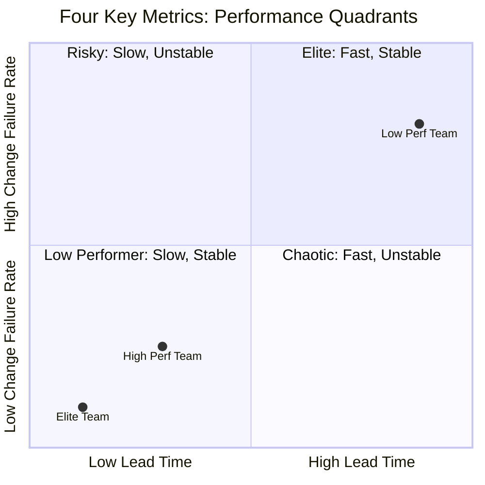
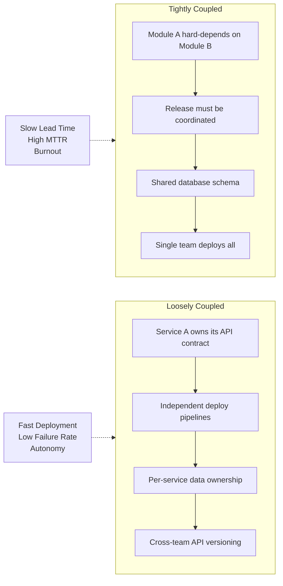
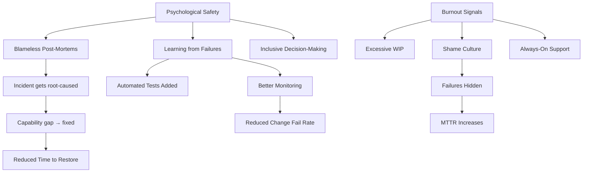

## The Four Key Metrics

This book's defining contribution is the **Four Key Metrics** framework —
four leading indicators, validated with annual survey data from 2014–2017,
that reliably predict both software delivery performance and organizational
outcomes. They emerged from the DORA research group at Google and later at
Microsoft.

### Metric Definitions

| Metric | Definition | Elite Threshold |
|--------|------------|-----------------|
| **Deployment Frequency** | How often production deployments occur | On-demand, multiple per day |
| **Lead Time for Changes** | Code commit → production for on-demand deploys | < 1 hour |
| **Mean Time to Restore (MTTR)** | Avg. time to restore after production incident | < 1 hour |
| **Change Failure Rate** | % of deploys causing outage or degraded service | 0–15% |

The metrics feature a critical tension: **speed vs. stability**. Low
performers conflate them ("fast teams break things"). Elite performers
achieve both simultaneously. The correlation to business outcomes (revenue
growth, profit, NPS, mission-critical system usage) holds at **p < 0.001**.

---

## The 24 Technical Capabilities

The DORA research identified **24 capabilities** that statistically predict
high performance. They cluster into five categories.

```mermaid
graph TD
    Root["24 Technical Capabilities"] --> CI["Continuous Integration"]
    Root --> CD["Continuous Delivery"]
    Root --> ARCH["Architecture"]
    Root --> MON["Monitoring & Observability"]
    Root --> CULT["Culture & Lean Mgmt"]

    CI --> CI1["CI used by all teams"]
    CI --> CI2["Trunk-based development"]
    CI --> CI3["High CI coverage of tests"]

    CD --> CD1["Automated deployment pipeline"]
    CD --> CD2["Feature flags / toggle"]
    CD --> CD3["Database integrated in release"]
    CD --> CD4["Automated acceptance tests"]

    ARCH --> A1["Loosely coupled architecture"]
    ARCH --> A2["Empowered, autonomous teams"]
    ARCH --> A3["Clarity of mission / goals"]

    MON --> M1["Real-time monitoring of systems"]
    MON --> M2["Monitoring used to drive action"]
    MON --> M3["Proactive alert management"]
    MON --> M4["Application performance monitoring"]

    CULT --> C1["Blameless post-mortems"]
    CULT --> C2["Psychological safety"]
    CULT --> C3["Supportive culture"]
    CULT --> C4["Learning culture from failures"]
```

**Trunk-based development** is among the highest-signal capabilities.
Short-lived branches (< 1 day before merging to trunk) sharply correlate
with high deployment frequency and low lead time. Long-lived feature
branches create merge hell and block change flow.

---

## DORA Research Findings: Elite vs. Low Performers

| Dimension | Elite Teams | Low Performers |
|-----------|------------|----------------|
| **Deploy Frequency** | On-demand (multiple/day) | < 1/month or quarterly |
| **Lead Time** | < 1 hour | 1–6 months |
| **MTTR** | < 1 hour | 1 week–1 month |
| **Change Fail Rate** | 0–15% | 31–45% |
| **Business Impact** | Top 25% in revenue, NPS, productivity | Bottom quartile |
| **Burnout Risk** | Low | High — due to long recovery cycles |

Elite teams **operate with near-zero burnout** because changes are small,
reversible, and incidents recover in under an hour. Low performers face
a vicious cycle: long lead times crowd work, change failures crowd
incident queues, and shame-driven post-mortems prevent root-cause fixes.

---

## Architecture: Tightly vs. Loosely Coupled

The strongest architectural predictor of delivery performance is
**loosely coupled architecture** — meaning teams can design, test, and
deploy their services with little cross-team coordination.

Tightly coupled systems require coordination meetings, big-bang releases,
and create single points of failure. Loosely coupled systems allow
autonomous teams to ship independently, test in production, and recover
with one-head-down rollouts. Conway's Law is not a constraint —
it is a design lever.

---

## Culture: Psychological Safety and Burnout

Culture is not a "soft" factor in Accelerate — it is **the most powerful
predictor** of high performance. Psychological safety (Google's Project
Aristotle finding) enables the behaviors that drive the Four Key Metrics.

Burnout in low-performing teams is not a sign of effort — it is a signal
of systemic dysfunction. Leaders should measure team health (anonymous
surveys, pto coverage) as a **lagging indicator** alongside the Four
Key Metrics.
