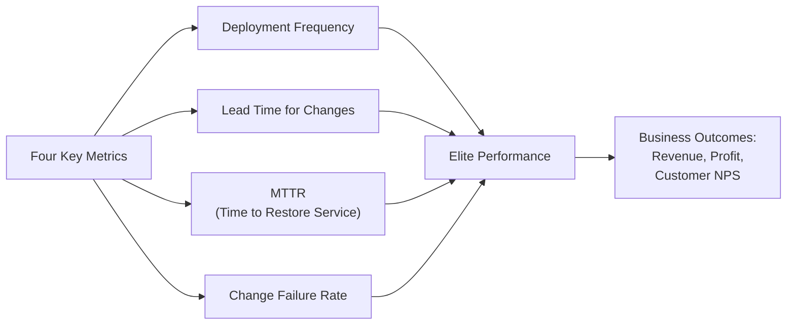

## Overview

*Accelerate: The Science of Lean Software and DevOps* (IT Revolution Press,
March 2018) by Nicole Forsgren, Jez Humble, and Gene Kim is the landmark
empirical work that validated the DORA (DevOps Research and Assessment)
research program with four years of data, 23,000+ survey responses, and
statistical rigour rarely applied to the DevOps movement.

- **Nicole Forsgren**: PhD in Organizational Systems, lead data science at
  DORA, later joined Microsoft and then Google as VP of Research & Strategy
  for GitHub
- **Jez Humble**: co-author of *Continuous Delivery* (Addison-Wesley, 2010),
  Distinguished Engineer at DTO (DevOps Tranformation) group, thought leader
  in continuous delivery and trunk-based development
- **Gene Kim**: author of *The Phoenix Project* (IT Revolution Press, 2013),
  founder of the DevOps Enterprise Summit, researcher in IT operations and
  technology management

ISBN **978-1-942788-33-5** (hardcover), ISBN **978-1-942788-34-2** (paperback).
Approximately 288 pages. IT Revolution Press.

---

## Executive Summary

The book's central thesis: **software delivery performance is measurable,
predictable, and improvable** — and it is the single strongest predictor of
organizational success in the technology age. Four key metrics index that
performance.

| Tier | Deploy Freq | Lead Time | MTTR | Change Fail Rate |
|------|------------|-----------|------|-----------------|
| **Elite** | On-demand | < 1 hour | < 1 hour | 0–15% |
| **High** | Weekly–Monthly | 1 week–1 mo | < 1 day | 16–30% |
| **Medium** | Monthly–6 mo | 1 mo–6 mo | 1 day–1 week | 31–45% |
| **Low** | < 6 mo/year | > 6 mo | > 1 week | > 46% |

Elite performers deploy **200× more frequently** than low performers, with
**2,555× faster lead times** and **7× lower change failure rates — the
findings that shocked the industry and became the foundation of every modern
DevOps maturity framework.

---

## Structure Overview

| Part | Theme | Approx Pages |
|------|-------|-------------|
| **I** | The Measurements that Matter | Chs 1–4 |
| **II** | The Science of Lean Software and DevOps | Chs 5–9 |
| **III** | Measuring What Matters | Chs 10–12 |
| **IV** | Make It Easy to Do the Right Thing | Chs 13–15 |
| **V** | Ideas for Further Research | Chs 16–17 |
