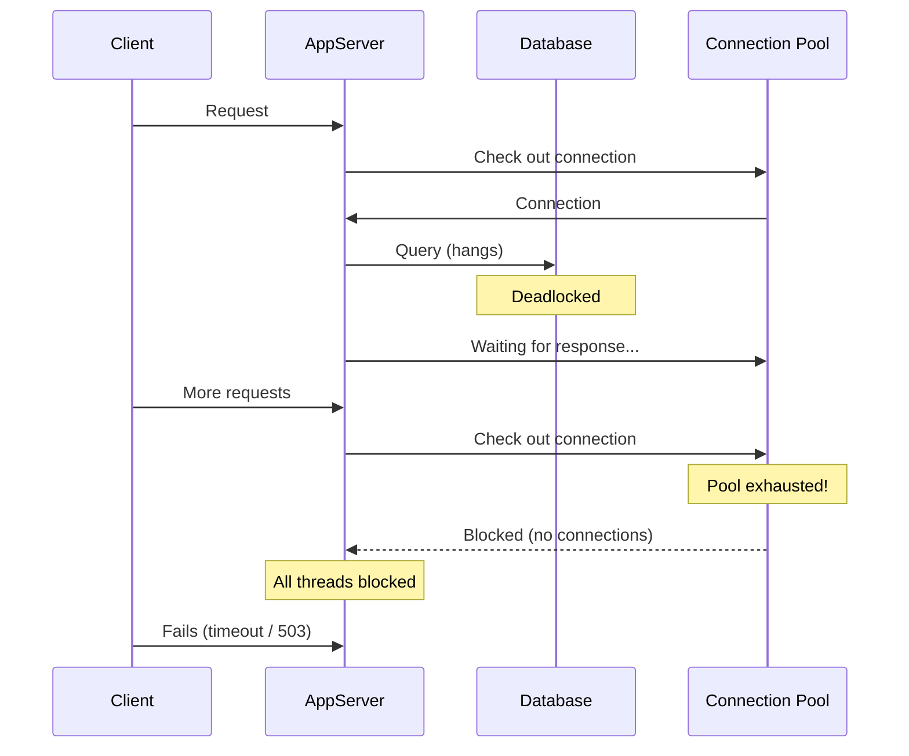
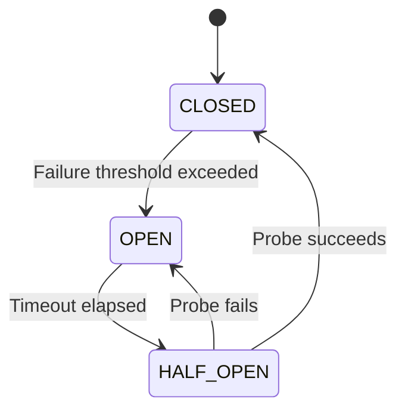
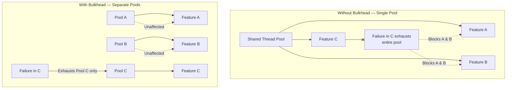
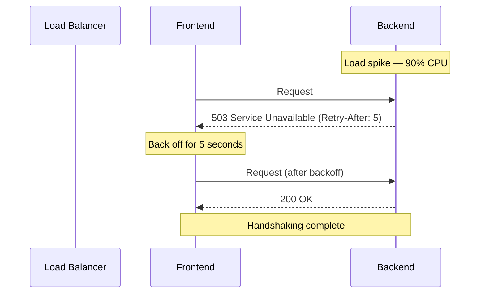

## The Philosophy: Cynical Software

Nygard's central architectural stance: **software must be cynical.**
Cynical software expects bad things to happen and is never surprised
when they do. It doesn't trust itself, its dependencies, or its
operators — so it builds barriers against all of them.

The book draws a sharp distinction between three concepts most
engineers conflate:

| Term | Definition | Example |
|---|---|---|
| **Fault** | A component misbehaving | A database node crashes |
| **Error** | Incorrect system state | An in-memory counter diverges from ground truth |
| **Failure** | The user sees a problem | Checkout page returns 500 |

Good architecture tolerates faults and detects errors before they
become failures.

---

## Stability Antipatterns

Nygard catalogs recurring failure modes — things software does
to destroy itself:

### Integration Points

Every call to another system — database, API, filesystem — is an
integration point and the single largest source of production failures.
Default behavior (wait forever for a response) is the worst possible
strategy.

### Cascading Failures

The most dangerous failure accelerator. A failure in one layer
propagates upward through resource exhaustion:

### Chain Reactions

In a load-balanced cluster, one failed node increases load on the
remaining nodes, making them more likely to fail — a positive feedback
loop that kills the entire cluster.

### Blocked Threads

The proximate cause of most outages. Threads block on connection pools,
synchronized blocks, or I/O. When they never unblock, the pool drains
and the system freezes.

### Slow Responses

A system that takes 30 seconds to respond is worse than one that
rejects the request immediately. Slow responses hold resources hostage
and cascade into downstream pool exhaustion.

### SLA Inversion

Your system's effective availability equals the lowest availability
among its dependencies — unless you decouple from them.

### Self-Denial

A system consuming its own resources (e.g., monitoring polling the same
app server it is monitoring, making its own performance worse) — a
feedback loop of self-harm.

### Unbalanced Capacities

When a front-end scales independently of its back-end, a flash mob
can direct traffic to the back-end at rates it was never designed to
handle.

---

## Stability Patterns

Nygard proposes a set of countermeasures. Each pattern prevents one
or more antipatterns.

### Circuit Breaker

Wraps an integration point and monitors failures. When failures exceed
a threshold, the breaker "trips" (opens) and subsequent calls fail
fast without reaching the target. After a cooldown, it transitions to
half-open to test recovery.

| State | Behavior | Resource Impact |
|---|---|---|
| **CLOSED** | Calls pass through normally | Normal |
| **OPEN** | Calls fail immediately | Minimal |
| **HALF_OPEN** | Probe call allowed through | Minimal until recovery |

### Bulkhead

Named after watertight compartments in ships. Partition system
resources (thread pools, connections, servers) so that a failure in
one compartment cannot sink the whole ship.

### Timeouts

The simplest and most cost-effective stability pattern. Every outbound
call must have a timeout. Without one, a slow dependency becomes a
blocked thread, which becomes an exhausted pool, which becomes a
cascading failure.

| Scope | Recommended Approach |
|---|---|
| Network connect | Connect timeout (e.g., 500ms — fail fast if unreachable) |
| Network read | Read timeout (e.g., 5s — fail if response takes too long) |
| Pool checkout | Acquisition timeout (e.g., 500ms — don't queue forever) |
| Transaction | Overall deadline (e.g., 30s — hard upper bound) |

### Handshaking

When a server is overloaded, it signals clients to slow down rather
than accepting requests it cannot serve. Implemented via HTTP 503
(Service Unavailable) with a Retry-After header, or load-shedding at
the protocol level.

### Fail Fast

Validate inputs, check dependency health, and reserve resources
*before* committing to processing a request. If the system cannot
serve the request, reject it immediately — don't waste resources
on a doomed operation.

### Steady State

Design systems that reach a stable equilibrium under normal load and
return to it after disturbances — rather than systems that
progressively accumulate state (logs, connections, memory) until
they crash.

### Decoupling Middleware

Insert asynchronous intermediaries (queues, message brokers) between
components so that a failure in one component does not directly
impact the other. The trade-off: higher latency and complexity in
exchange for resilience against transient failures.

---

## Capacity Antipatterns

Nygard also covers capacity failure modes:

| Antipattern | Description |
|---|---|
| O(N) in the wrong place | Querying the database per-user instead of in batch |
| Pointless pooling | Holding resources that are cheap to recreate |
| Caching for caching's sake | Adding cache layers that increase complexity without measurable benefit |
| Premature optimization | Optimizing CPU when bottlenecks are in I/O or network |

---

## Operations Design

The later parts of the book cover the operational dimension:

**Transparency** — Every component must expose metrics, health checks,
and internal state. Nygard advocates for an "OpsDB": a centralized
store for operational data (not log files, structured metrics).

**Zero-Downtime Deployments** — Blue-green deployments and rolling
upgrades are mandatory for continuous delivery. Script everything.

**Disaster Simulations** — The precursor to chaos engineering. Run
simulated failures (kill a server, saturate a network link, corrupt
data) in a staging environment to test recovery procedures.

---

## Key Lessons

- **Timeout everything.** Unbounded waits kill systems.
- **Use Circuit Breakers at every integration point.** Fail fast beats
  fail slowly.
- **Partition your resources.** Bulkheads limit blast radius.
- **Accept that failures will happen.** The goal is not zero failures
  but zero cascading failures.
- **Apply backpressure.** Handshaking prevents overload death spirals.
- **Design for operations.** Transparency, automation, and
  zero-downtime deploys are architectural concerns, not ops concerns.
- **Run disaster drills.** Chaos engineering exposes blind spots.
- **Cynical software survives.** Trust nothing. Verify everything.
