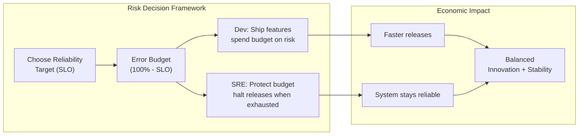
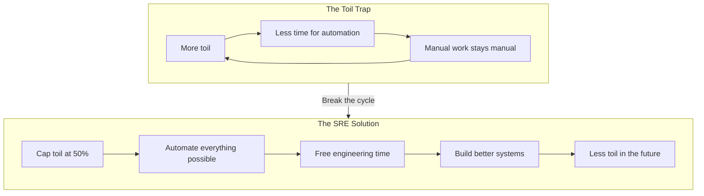

## What Is SRE?

Site Reliability Engineering is what happens when you ask a software
engineer to design an operations function. Ben Treynor Sloss, Google's
VP for 24/7 Operations, coined the term in 2004. The core thesis:

> Software engineering is a discipline focused on designing and
> building software systems. SRE is a discipline focused on the
> entire lifecycle — from inception through deployment, operation,
> and refinement.

In practice, SRE means: **write code to solve operational problems.**

---

## Embracing Risk

The most counterintuitive SRE principle: 100% reliability is the wrong
target. The "three nines" (99.9%) vs. "five nines" (99.999%) decision
is an economic trade-off.

The cost of adding one "nine" of reliability (99.9% → 99.99%) is
roughly 10x infrastructure cost. At some point, users cannot perceive
the difference and the money is better spent on features.

---

## SLOs, SLIs, and SLAs

The measurement foundation of SRE:

| Term | Meaning | Example |
|------|---------|---------|
| **SLI** | Service Level Indicator — what you measure | Latency at p99, error rate, throughput |
| **SLO** | Service Level Objective — target value | 99.9% of requests complete in < 200ms |
| **SLA** | Service Level Agreement — contractual obligation | If below SLO, pay credits |

Key insight: **always measure SLIs as a proportion of good events
over total events.** Uptime is a poor metric for global services —
partial degradation rarely means "down."

---

## Error Budgets

The error budget is the most important innovation in the book. It
resolves the structural conflict between development and operations:

- **Devs want:** fast releases, new features
- **Ops wants:** stability, no changes

Without a framework, every outage becomes a blame war. The error
budget changes the conversation:

1. Set an SLO (e.g., 99.9% availability)
2. The error budget is 100% − SLO = 0.1% (≈ 43 min/month)
3. Dev teams can spend this budget on risky changes
4. When the budget is exhausted, releases freeze until reliability
   recovers

An outage is no longer a "bad thing." It is an expected cost of
innovation, managed and accounted for.

---

## Eliminating Toil

Toil is work that is: **manual, repetitive, automatable, tactical,
and devoid of enduring value.** Examples: restarting services by
hand, manually scaling, triaging the same alert pattern daily, data
entry.

The 50% rule: **SREs must spend at least 50% of their time on
engineering work** — automation, tooling, architecture improvements.
If ops work exceeds 50%, the excess is pushed back to product teams.
This creates a powerful feedback loop: product teams learn to build
operable systems because they must do the operations themselves.

---

## Monitoring Distributed Systems

The **four golden signals** that every monitoring system should track:

### Latency

Time to serve a request. **Measure successful and failed requests
separately** — failures can complete fast (quick rejection) while
the system is broken. High latency on successes is the real signal.

### Traffic

Volume of demand on the system. Web: HTTP requests/second.
Streaming: bytes/second. Databases: reads/writes per second.

### Errors

Rate of failed requests. Explicit (500s), implicit (200 with wrong
content), or policy violations (slow response).

### Saturation

How "full" the system is. CPU, memory, I/O, network. The most
important metric: **saturation often causes latency and errors.**

---

## Release Engineering

Google's approach to reliable releases:

- **Hermetic builds:** reproducible, isolated from the environment
- **Canary releases:** roll out to a tiny subset of users first
- **Feature flags:** decouple deployment from release
- **Automatic rollback:** when SLO degrades, revert immediately

---

## Incident Response and Postmortems

### Incident Management

Four phases:
1. **Detection** — monitoring or user reports
2. **Triage** — assess severity, assemble responders
3. **Mitigation** — stop the bleeding (rollback, blackhole traffic)
4. **Resolution** — fix root cause, deploy fix

### Blameless Postmortems

The postmortem asks: **what can we improve, not who to blame.**
Every incident gets a written postmortem with:
- Timeline of events
- Root cause(s)
- Contributing factors
- Action items

Blameless culture is essential because blame drives failure
underground. If people fear punishment, they hide errors — and
you lose the opportunity to fix systemic weaknesses.

---

## Capacity Planning

SREs approach capacity as an engineering problem, not a guessing game:

1. Collect organic growth data (natural traffic increase)
2. Add estimated demand from planned launches
3. Build a model with clear assumptions
4. Provision with a safety margin
5. Load-test against the planned capacity

The goal: **never let capacity be the reason for an outage.**

---

## The Borg System

Google's cluster management system that inspired Kubernetes. Borg
schedules containers across data centers, handles failures,
load-balances, and manages resource allocation. Key design
decisions:

- **Declarative state:** users declare what they want, Borg makes
  it happen
- **Automatic failure recovery:** dead tasks are rescheduled
- **Resource isolation:** tasks don't interfere with each other
- **Rate limiting and QoS:** prevent noisy neighbors

---

## Key Lessons

- **Reliability is a feature, not a property.** It must be designed,
  budgeted, and maintained like any other system capability.
- **Measure everything that matters.** If you cannot measure it,
  you cannot improve it.
- **Automation is your only path to scale.** Manual operations do
  not scale linearly — they scale super-linearly (more systems =
  more interactions = more failures).
- **Incidents are learning opportunities.** A well-run postmortem
  improves the system more than a month of careful development.
- **Simplicity is the ultimate sophistication.** Every line of code
  you delete is a line of code that cannot break.
- **Change is the leading cause of outages.** Release engineering
  and canary deployments are not optional.

---

## Practical Applications

### For Your Organization

- Start with SLOs for your most critical service. Measure latency
  and error rate at p99 and p95.
- Implement blameless postmortems for every significant incident.
  Write them down.
- Calculate your error budget. Share it with product teams.
  Freeze releases when it is exhausted.

### For Your Team

- Audit your current toil. Categorize every recurring manual task.
  Automate the top three by time spent.
- Set up monitoring around the four golden signals. Eliminate alerts
  that do not indicate a concrete problem.
- Practice incident response. Run tabletop exercises.

### For Your Career

- Learn to write software that operates itself. Automate before you
  scale.
- Understand distributed systems fundamentals — consensus, load
  balancing, capacity planning.
- Cultivate a blameless mindset. Focus on systems, not people.

---

## Action Plan

1. **Pick one service** and define its SLO with input from product
   management. Start simple — latency p99 < 500ms at 99.9%.

2. **Calculate your error budget.** Share the number with your team.
   Discuss how to spend it.

3. **Audit your monitoring.** Every alert should be: actionable,
   urgent, and directly tied to an SLO. Delete the rest.

4. **Write a blameless postmortem** for the last significant outage.
   Identify three systemic improvements.

5. **Measure your toil.** Track operations time for two weeks.
   Automate the biggest time sink.

6. **Build a capacity plan.** Project traffic growth for the next
   6 months. Identify the first bottleneck you will hit.
