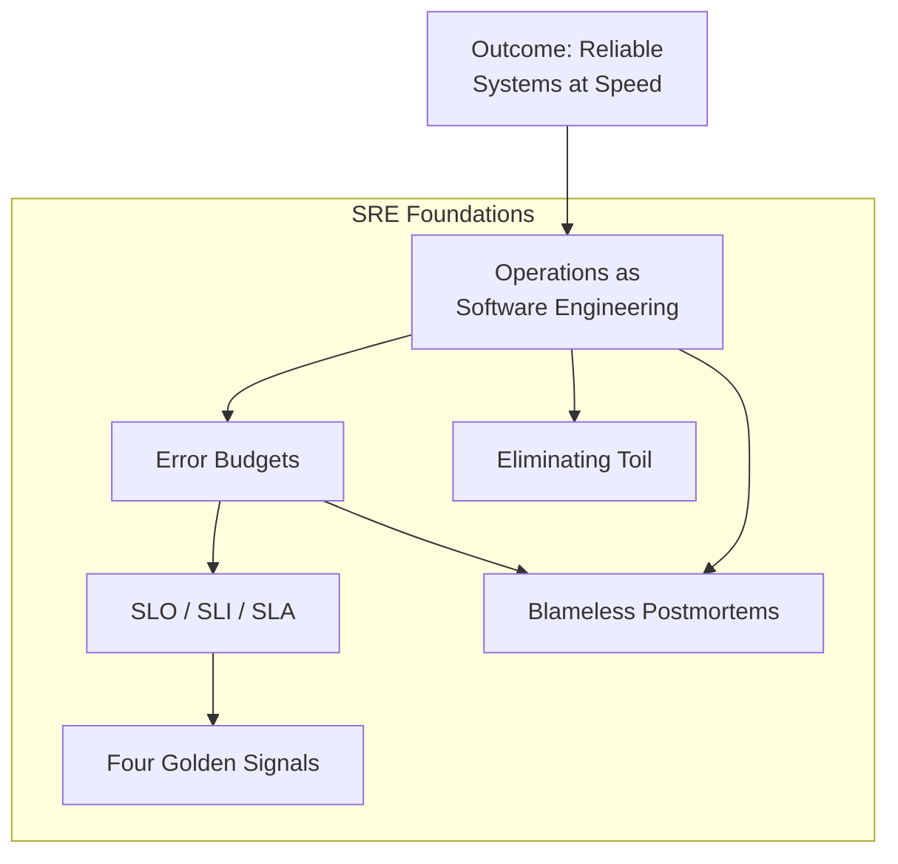

## Overview

*Site Reliability Engineering: How Google Runs Production Systems*
(2016), edited by Betsy Beyer, Chris Jones, Jennifer Petoff, and
Niall Richard Murphy, is the definitive insider account of how Google
builds, deploys, monitors, and maintains some of the largest software
systems in existence. Written by 40+ Google SREs, it codifies the
discipline that Ben Treynor Sloss invented in 2004 when he asked a
software engineer to run operations.

The book is organized in five parts across 34 chapters:

| Part | Title | Focus |
|------|-------|-------|
| I | Introduction | What SRE is, Google's production environment |
| II | Principles | Risk, SLOs, toil, monitoring, automation, simplicity |
| III | Practices | Alerting, on-call, troubleshooting, incidents, postmortems |
| IV | Management | Training, interrupts, engagement models, collaboration |
| V | Conclusions | Lessons from other high-reliability industries |

---

## Executive Summary

SRE is defined by its founding insight: **treat operations as a
software engineering problem**. If a task can be automated, it should
be automated. If a process can be measured, it should be measured.
If a system can break, design it to survive.

The error budget is the book's most powerful concept. It resolves
the fundamental tension between development teams who want to ship
fast and operations teams who want stability. Define an SLO (say
99.9% availability). That leaves an error budget of 0.1% — roughly
43 minutes per month. Dev teams can spend that budget on risky
releases. When the budget is exhausted, releases halt until
reliability improves.

---

## Key Takeaways

1. **Reliability is the most fundamental feature.** A system nobody
   can use is useless regardless of its feature set.

2. **100% reliability is the wrong target.** The pursuit of absolute
   reliability prevents innovation. Choose a target, measure it, and
   accept the remaining risk.

3. **Error budgets align incentives.** They transform the blame game
   ("devs break things") into shared economics ("we have 0.1% budget
   — how shall we spend it?").

4. **Toil must be measured and capped.** Any manual, repetitive,
   automatable work should occupy no more than 50% of SRE time.
   Above that, push work back to product teams.

5. **The four golden signals:** latency, traffic, errors, and
   saturation. Every monitoring system should track these.

6. **Blameless postmortems are non-negotiable.** Without a blameless
   culture, people hide failures and you lose your best learning
   opportunities.

7. **Automation is not optional.** At Google's scale, humans cannot
   keep up. Every manual step is a bottleneck and a failure risk.

8. **Simplicity reduces reliability risk.** Every line of code,
   every configuration flag, every dependency is surface area for
   failure. Remove what you do not need.

9. **Distributed consensus (Paxos) is hard but necessary.** Google's
   experience with Borg, Chubby, and Spanner shows that consensus
   protocols are foundational to reliable distributed systems.

10. **Incident response requires practice.** Effective troubleshooting
    follows a systematic hypothesis-driven process, not winging it.

---

## Who Should Read

| Reader Type | Why |
|---|---|
| Software engineers at any scale | Foundational operations mindset |
| DevOps / infrastructure engineers | The original blueprint for DevOps |
| Engineering managers | Understand the SRE engagement model |
| CTOs and tech leads | Framework for balancing speed vs. stability |
| Anyone running production services | Practical patterns for reliability |

---

## Who Should Skip

- Beginners with no deployment or operations experience — read a
  practical ops book first
- Anyone wanting code-level Kubernetes tutorials — this is
  principles, not recipes
- Readers wanting a single-author narrative — 34 chapters from
  40+ authors means uneven quality

---

## Core Themes

| Theme | Description |
|---|---|
| Operations as software engineering | Apply engineering discipline to operational problems |
| Risk-informed decision making | Choose reliability targets, don't chase perfection |
| Measurement drives improvement | SLOs, SLIs, and error budgets make reliability quantifiable |
| Automation over manual work | Eliminate toil to free SRE capacity for engineering |
| Culture matters as much as tech | Blameless postmortems, collaboration, and on-call practices |
| Simplicity is a feature | Every complexity cost must justify itself |

---

## Why This Book Matters

SRE is the most influential operations framework of the 2010s. It gave
the industry a shared vocabulary — error budgets, SLOs, golden signals,
toil — and a coherent philosophy. Before SRE, operations was perceived
as a cost center staffed by sysadmins. After SRE, it became an
engineering discipline with its own principles, practices, and career
path.

The book's influence extends far beyond Google. It shaped how Netflix,
Amazon, LinkedIn, and thousands of other companies think about
reliability. It inspired the SRE Workbook, the K8s ecosystem, and a
generation of reliability-focused tools and practices.

---

## Related Books

| Book | Author | Connection |
|---|---|---|
| **The Site Reliability Workbook** | Beyer et al. | Hands-on companion with practical exercises |
| **Building Secure and Reliable Systems** | Google | Security + reliability engineering unified |
| **Release It!** | Michael Nygard | Resilience patterns for production systems |
| **Designing Data-Intensive Applications** | Martin Kleppmann | Distributed systems internals SREs must know |
| **The Art of Scalability** | Abbott & Fisher | Organizational scaling alongside SRE |

---

## Final Verdict

The SRE book is simultaneously a technical manual, a management guide,
and a cultural manifesto. Not every chapter is essential — the
multi-author format creates uneven depth — but the core chapters
(SLOs, error budgets, toil, monitoring, postmortems) are must-read
material for anyone running production systems.

**Rating: 8.5/10** — The foundational text of modern production
engineering. Essential reading for the principles, selective reading
for the practices.
