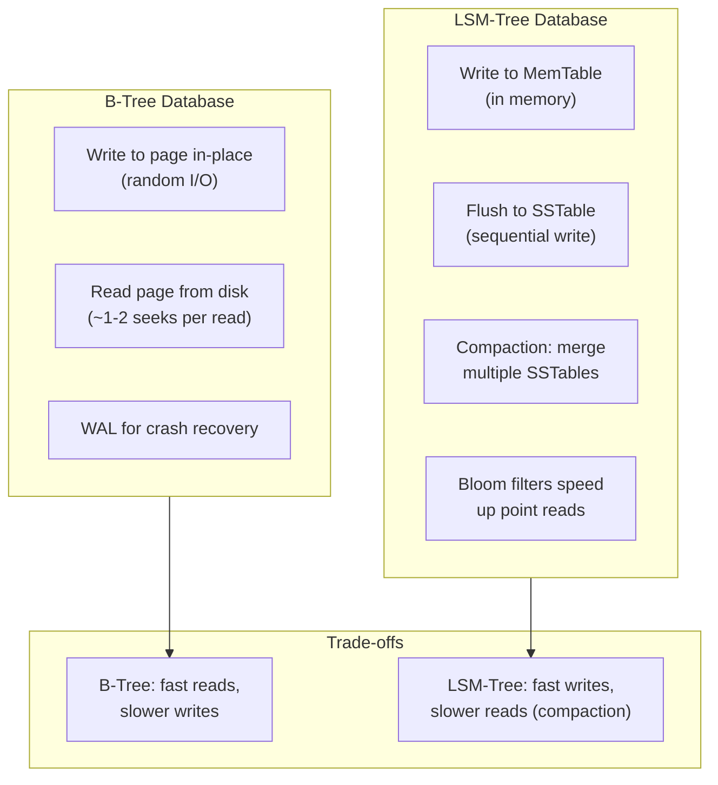
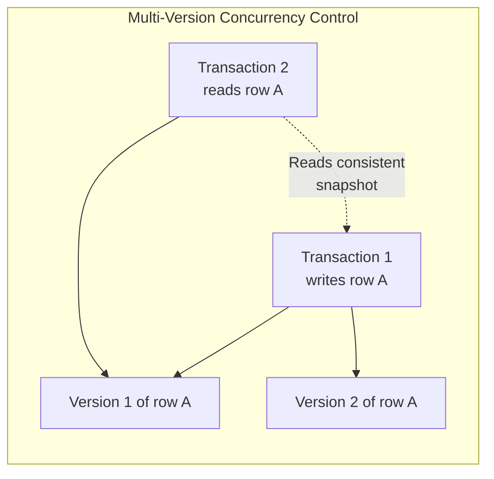
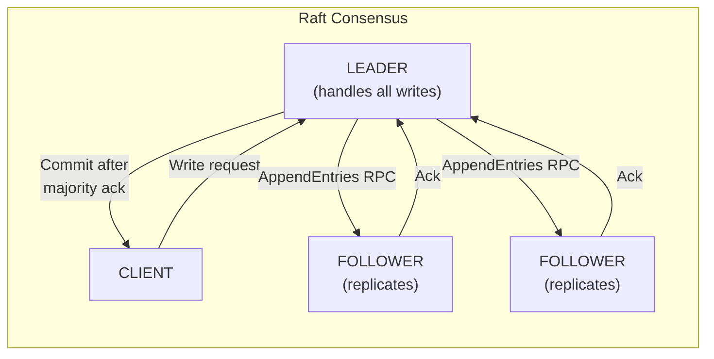

## B-Tree vs LSM-Tree

### B-Tree
- **Read-optimized**: data is organized in fixed-size pages (usually
  4-16 KB), linked in a balanced tree structure
- **Write amplification**: each write may touch multiple pages; WAL
  adds additional write overhead
- **Predictable latency**: reads typically take 2-4 page fetches
- **Used by**: PostgreSQL, MySQL/InnoDB, SQLite, Oracle, DB2

### LSM-Tree
- **Write-optimized**: writes go to an in-memory structure (MemTable)
  first, then flushed to disk in large sequential batches
- **Compaction**: background process merges sorted runs; this causes
  write amplification (10-50x) but enables high throughput
- **Read amplification**: may need to check multiple SSTables
  (mitigated by Bloom filters)
- **Used by**: LevelDB, RocksDB, Cassandra, HBase, BigTable

---

## Transaction Processing and MVCC

MVCC enables concurrent transactions to see a consistent snapshot of
data without locking readers. Each row has multiple versions; each
transaction sees the version that was committed before it began.
Implemented by PostgreSQL, Oracle, MySQL/InnoDB.

---

## Distributed Consensus: Raft

Raft elects a leader through a voting process. The leader handles all
writes, replicated via AppendEntries RPC to followers. A write is
committed when a majority of nodes acknowledge it. Raft guarantees
safety even when up to (N-1)/2 nodes fail.

---

## Key Lessons

- **There is no perfect storage engine.** B-Trees and LSM-Trees make
  fundamentally different trade-offs. Your workload determines which
  is better.
- **Write amplification is the hidden cost.** Every write to a
  database causes 2-50x actual I/O. Understanding this helps explain
  SSD wear and unexpected performance characteristics.
- **Consensus algorithms are the foundation of distributed
  consistency.** Paxos and Raft are not optional theoretical
  curiosities — they are what make systems like etcd, ZooKeeper,
  and Consul work.
- **Concurrency control is where theory meets practice.** Serializable
  isolation is ideal but expensive. Most databases default to
  Read Committed or Snapshot Isolation for a reason.

---

## Practical Applications

### For Database Selection
- Write-heavy workload: LSM-Tree (Cassandra, RocksDB)
- Read-heavy with complex queries: B-Tree (PostgreSQL)
- Mixed workload: consider both or a hybrid approach

### For Schema Design
- B-Tree: create indexes carefully (each index amplifies writes)
- LSM-Tree: wide rows reduce compaction overhead

### For Operations
- Monitor compaction pressure in LSM databases
- Tune checkpoint frequency in B-Tree databases
- Understand that fsync behavior determines crash safety vs
  write performance trade-offs
