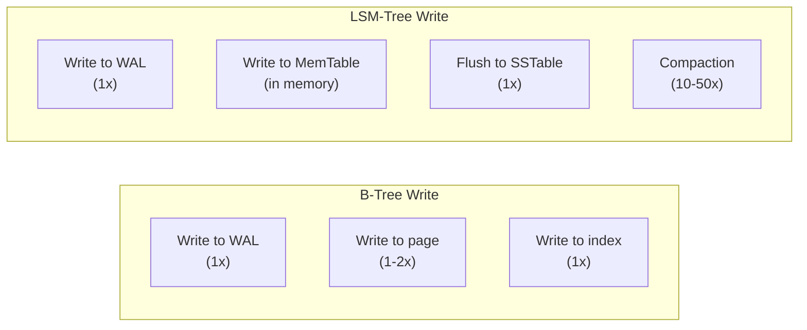

## Introduction

Welcome to BookAtlas. Today: *Database Internals* by Alex Petrov.
Published 2019 by O'Reilly. The book that opens the black box of
databases and shows what is really happening on disk.

Most engineers use databases every day without understanding how they
work internally. Petrov argues that this ignorance has a real cost:
you cannot optimize what you do not understand.

---

## The Two Great Families: B-Trees and LSM-Trees

**Engineer:** At the highest level, every storage engine falls into one
of two families. B-Tree databases — PostgreSQL, MySQL, SQLite — are
read-optimized. LSM-Tree databases — Cassandra, RocksDB, BigTable —
are write-optimized. Understanding this one distinction explains most
of the performance characteristics you encounter.

**Skeptic:** So why does anyone use LSM-Trees? Read performance is
usually what matters.

**Engineer:** Because writes are what limits scale. In a write-heavy
workload — logging, time-series, IoT, analytics ingestion — the
B-Tree's in-place writes become the bottleneck. The LSM-Tree turns
random writes into sequential writes, which is 10-100x faster on hard
drives and significantly better on SSDs too.

---

## The Write Amplification Problem

**Engineer:** Every write to a database causes more I/O than you expect.
A single row insert in PostgreSQL might write 2-3 pages. A single row
insert in RocksDB might eventually rewrite 10-50 copies of that data
through compaction. Understanding write amplification is essential for
predicting SSD lifespan and database performance.

**Skeptic:** 50x write amplification? That sounds terrible.

**Engineer:** It is the price of high-throughput writes. And it is
manageable because the writes are sequential — which is efficient on
modern storage. The real cost is that compaction competes with user
reads for I/O bandwidth. That is why tuning an LSM database is an art.

---

## Distributed Consensus

**Engineer:** The second half of the book covers distributed databases.
The key concept is consensus — multiple nodes agreeing on a value even
when some nodes fail. Raft and Paxos are the two main algorithms.
Raft is designed for understandability: leader election, log
replication, safety guarantees.

**Skeptic:** I have read about Raft. It is for coordination, not for
general data storage. etcd and ZooKeeper use it. But large-scale
databases do not use consensus for every write — it is too slow.

**Engineer:** Correct. Most databases use weaker consistency models
for throughput and reserve consensus for critical metadata (leader
elections, schema changes). The trade-off between consistency and
performance is the central tension in distributed database design.

---

## The Verdict

**Engineer:** Database Internals is not a book for everyone. But if
you are a database engineer, a backend engineer working at scale, or
simply someone who wants to understand how databases actually work,
it is the best resource available.

**Skeptic:** It is also not deep enough to be a reference. When I need
to know exactly how PostgreSQL's MVCC works, I go to the PostgreSQL
documentation, not this book.

**Engineer:** That is true. But Database Internals gives you the map
before you visit the city. You know what questions to ask, what
trade-offs to look for, and how the pieces fit together. That
contextual understanding is what makes it valuable.

---

## Final Thoughts

Database Internals fills an important niche: storage engine internals
for practitioners. It is not the deepest book on any single topic, but
it is the best survey of the area. Read it with Kleppmann's
Data-Intensive Applications for the complete picture.

This has been a BookAtlas narration of Database Internals by Alex
Petrov. Thanks for listening.
