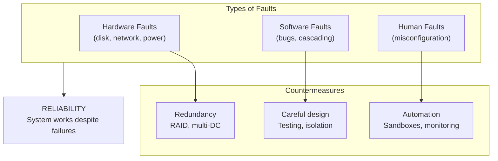
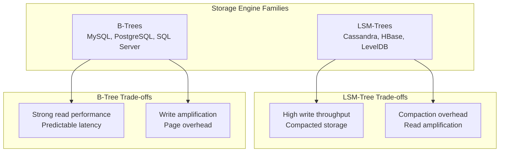
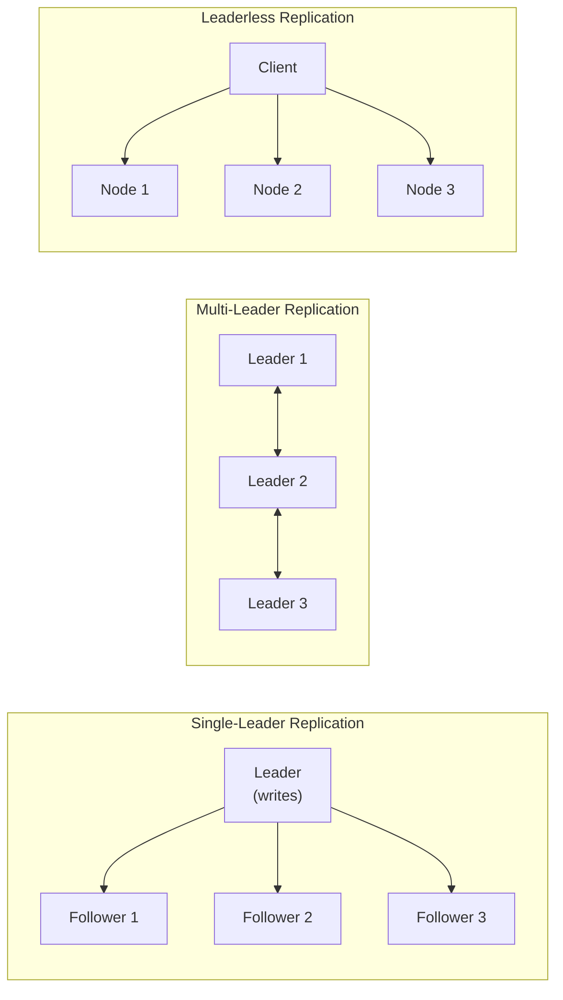
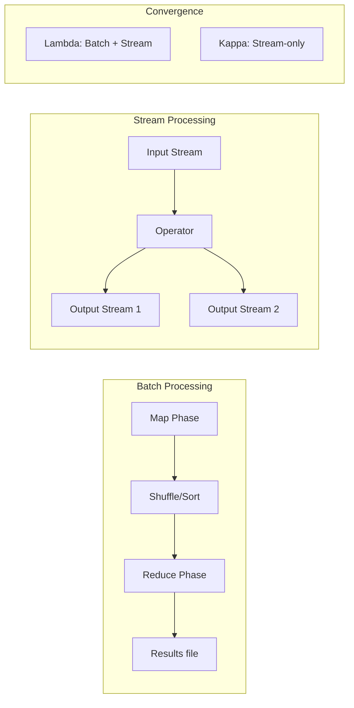

## The Three Pillars

Kleppmann defines three fundamental properties every data system needs:

### Reliability

The system should continue to work correctly even when faults occur.
Faults can be hardware (disk failure, power outage), software (bugs,
cascading failures), or human (misconfiguration).

### Scalability

Ability to handle increased load. Define load parameters (requests per
second, read/write ratio, data volume) and measure performance metrics
(response time, throughput).

### Maintainability

Three design goals: Operability (easy ops), Simplicity (low complexity),
Evolvability (easy to change). Most costs are in maintenance, not
initial development.

---

## Data Models and Query Languages

The choice of data model shapes how you think about your data.

| Model | Strengths | Weaknesses |
|-------|-----------|------------|
| Relational (SQL) | Joins, constraints, standard query language | Rigid schema, impedance mismatch |
| Document (NoSQL) | Schema flexibility, locality | Weak joins, no standard query |
| Graph | Rich relationships, traversal | Complex queries, less mature |

Kleppmann argues that the future is multi-model — using the right model
for the right part of your system.

---

## Storage and Retrieval

Two families of storage engines dominate:

Transactional (OLTP) and analytic (OLAP) workloads require different
storage strategies. Column-oriented storage (for analytics) compresses
better and scans faster than row-oriented storage.

---

## Encoding and Evolution

Systems evolve. Data formats must support both backward compatibility
(new code can read old data) and forward compatibility (old code can
read new data).

| Format | Schema | Compatibility | Speed |
|--------|--------|--------------|-------|
| JSON / XML | No schema | Textual, verbose | Slow parsing |
| Thrift | Required | Binary, compact | Fast |
| Protocol Buffers | Required | Binary, very compact | Fast |
| Avro | Required (writer/reader) | Best for long-term storage | Fast |

Avro's approach is particularly elegant: the writer's schema and
reader's schema can differ, and the system resolves the differences
at read time.

---

## Replication

Keeping copies of data on multiple nodes. Three main approaches:

Single-leader is simplest but has a single point for writes.
Multi-leader works across data centers but requires conflict resolution.
Leaderless (Dynamo-style) offers highest availability but weakest
guarantees.

---

## Partitioning

Splitting data across nodes. Two main strategies:

- **Key-range partitioning:** Simple, supports range queries, but risk
  of hotspots
- **Hash partitioning:** Distributes data evenly, but breaks range
  queries

Skewed partitions (hotspots) can kill performance. The solution is
to partition by a combination of key attributes.

---

## Transactions

ACID in theory vs. practice:

| Isolation Level | Prevents Dirty Reads | Prevents Lost Updates | Prevents Phantom Reads | Performance Cost |
|---|---|---|---|---|
| Read Committed | Yes | No | No | Low |
| Snapshot Isolation | Yes | Yes | No | Medium |
| Serializable | Yes | Yes | Yes | High |

Most applications can tolerate Read Committed or Snapshot Isolation.
Serializable is necessary only for financial transactions and similar
critical operations.

---

## The Trouble with Distributed Systems

This chapter is Kleppmann's most important contribution. Distributed
systems face fundamental challenges that are not fixable:

1. **Unreliable networks:** Packets can be delayed, duplicated, or
   dropped. Timeouts are guesses, not certainties.

2. **Unreliable clocks:** Time-of-day clocks can jump backwards.
   Monotonic clocks measure intervals but not absolute time. Clock
   skew is unbounded.

3. **Process pauses:** Garbage collection, VM pauses, or OS scheduling
   can stop a process for seconds. A node that pauses is
   indistinguishable from a node that crashed.

The only way to build correct distributed systems is to design for
these realities, not to wish them away.

---

## Batch and Stream Processing

Batch (MapReduce) is simpler but has higher latency. Stream processing
(lower latency) is converging on the same programming model. The Kappa
Architecture argues that a well-designed stream system can handle both
batch and streaming workloads.

---

## Key Lessons

- **Always question trade-offs.** There is no free lunch. Every data
  system choice involves trade-offs between consistency, availability,
  performance, and complexity.
- **Understand your access patterns.** OLTP and OLAP are fundamentally
  different. Design storage for your workload.
- **Replication is for durability and availability.** Partitioning is
  for scalability. They solve different problems.
- **Read the research papers.** Most "new" technologies are built on
  decades-old ideas. Understanding the foundations protects you from
  hype.
- **Test with faults.** Chaos engineering validates that your system
  is as reliable as you think.
- **Logs are the foundation.** The log-based architecture underlies
  Kafka, databases, and distributed consensus.

---

## Practical Applications

### For Choosing a Database

- Need strong consistency and complex joins? Use a relational database.
- Need flexible schema and fast iteration? Use a document database.
- Need high write throughput? Consider LSM-tree engines.
- Need rich relationship queries? Use a graph database.

### For System Design

- Define your load parameters before choosing technology.
- Use the simplest replication strategy that meets your needs.
- Plan for partition rebalancing before you need it.
- Instrument everything — you cannot fix what you cannot measure.

### For Distributed Architecture

- Accept that failures will happen. Design for graceful degradation.
- Prefer idempotent operations to simplify retry logic.
- Use bounded queues and backpressure to handle load spikes.
- Monitor at multiple levels — infrastructure, application, business.

---

## Action Plan

1. **Map your current system architecture.** Identify which data models
   and storage engines you use. Determine if they match your access
   patterns.

2. **Document your consistency requirements.** What level of staleness
   can each feature tolerate? This determines your replication strategy.

3. **Load-test critical paths.** Find where your system breaks under
   realistic load. Address hotspots.

4. **Audit your failure-handling code.** Review retry logic, timeouts,
   and circuit breakers. Test them deliberately.

5. **Reduce operational complexity.** Eliminate unnecessary moving
   parts. Simplify deployment and configuration.

6. **Invest in observability.** Distributed tracing, structured logging,
   and metrics dashboards are not optional.
