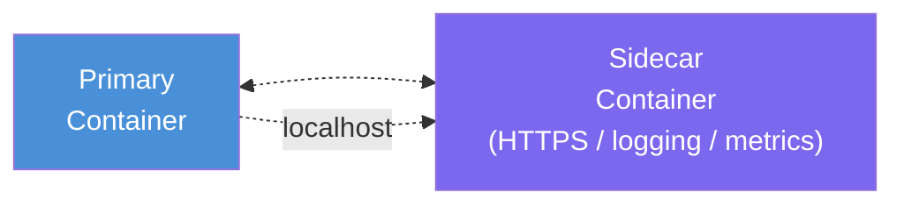
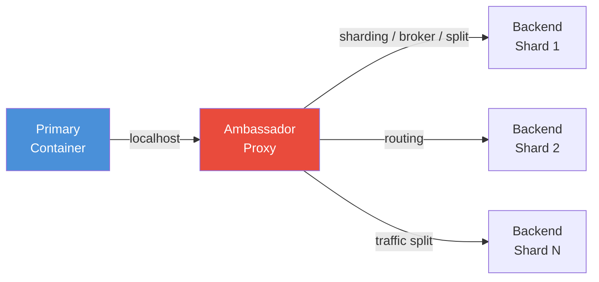
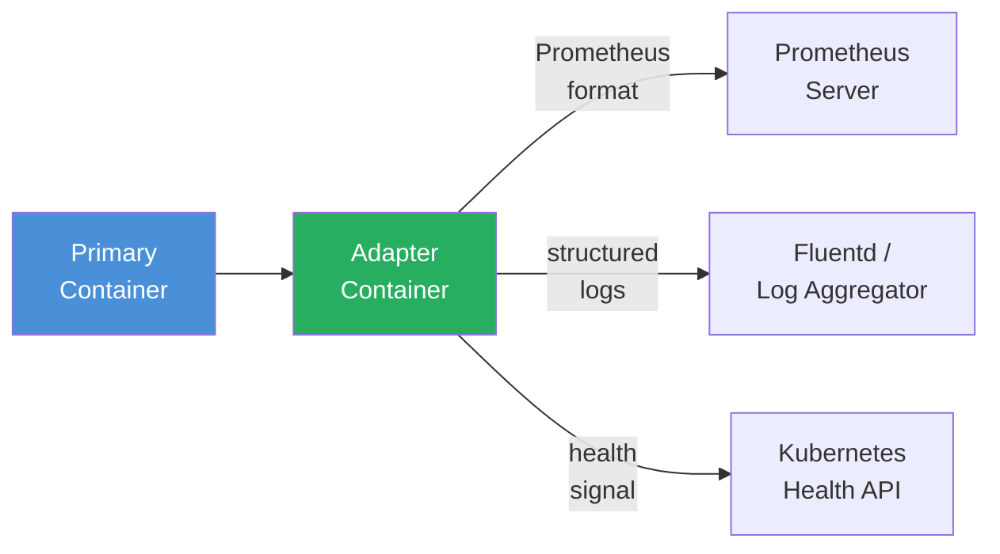
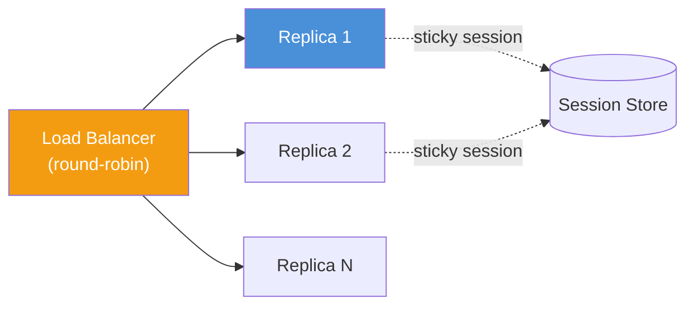
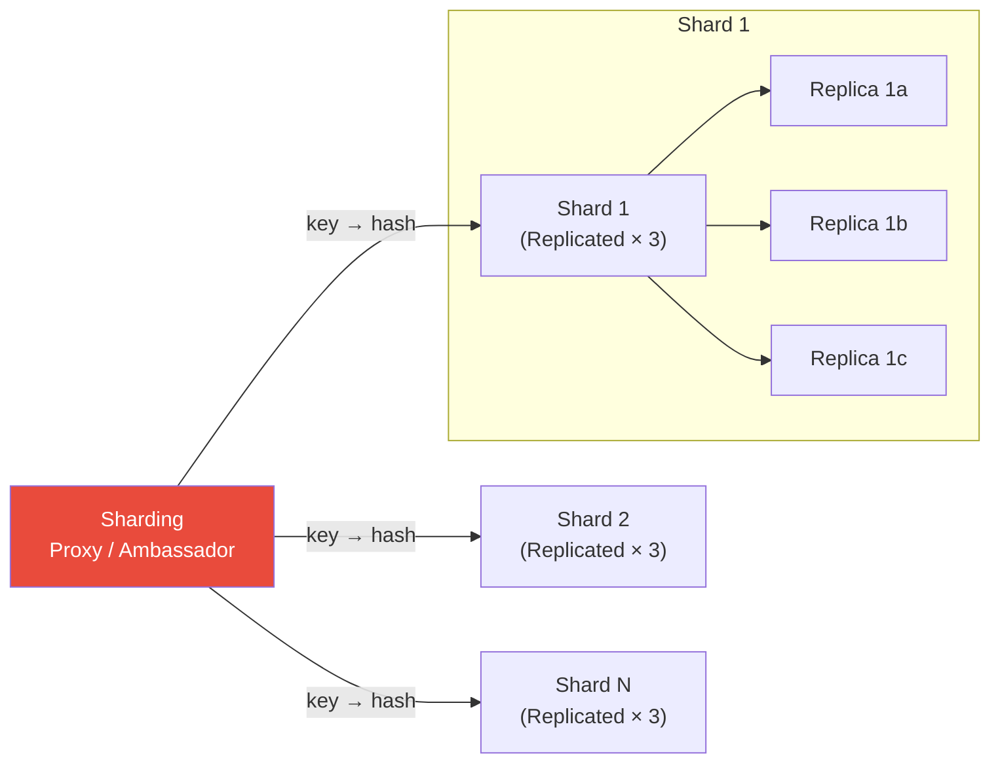
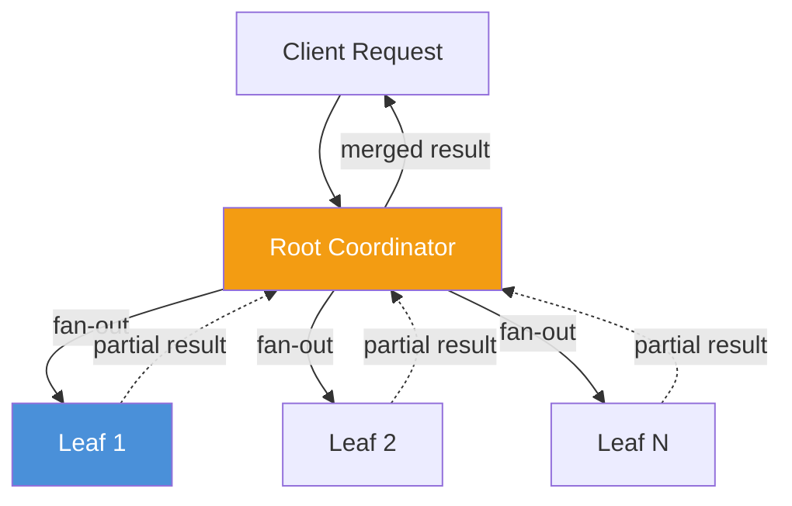
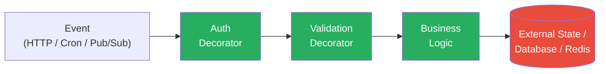
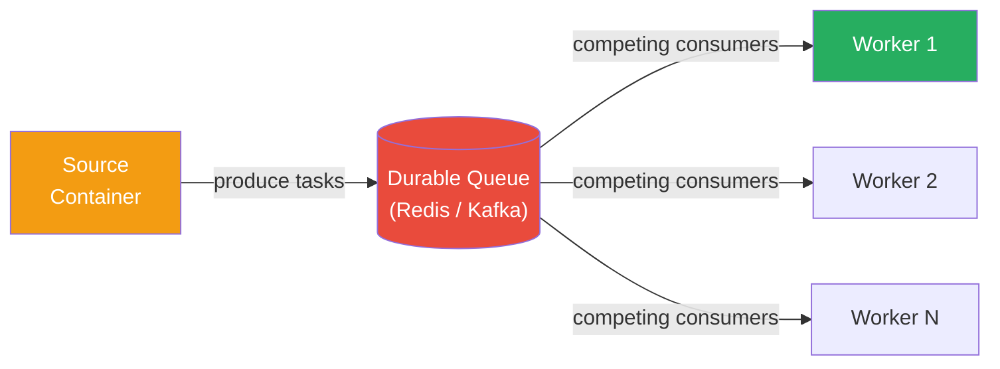
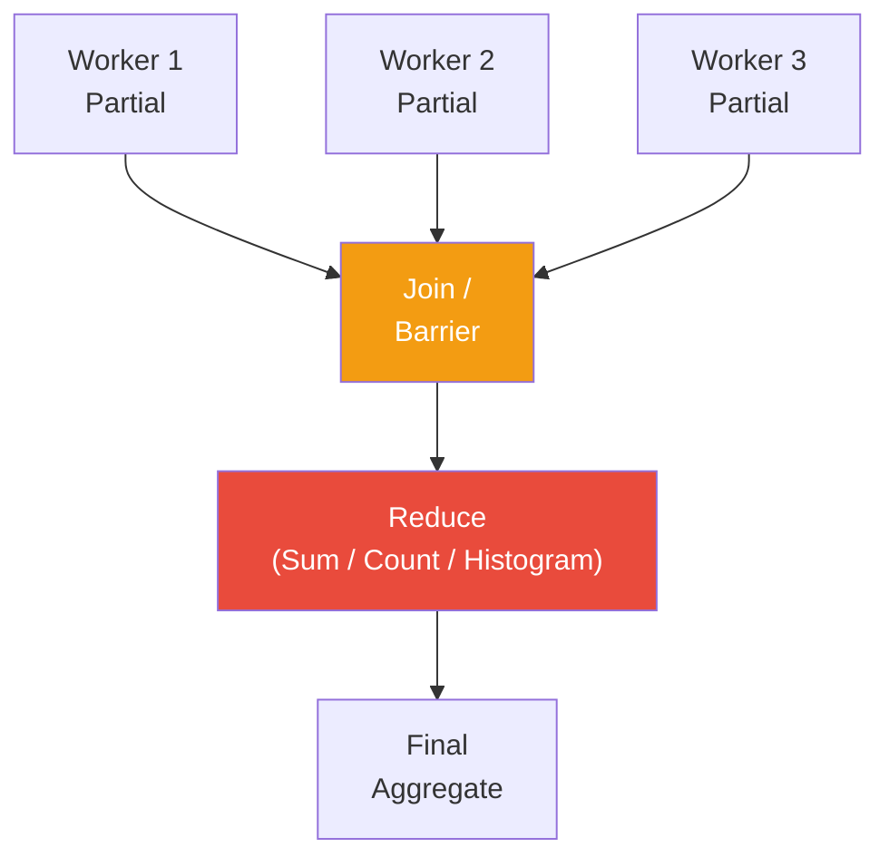

# 02 — Analysis

This document analyses the core design patterns introduced in *Designing Distributed Systems*, their structural rationale, trade-offs, and applicability criteria.

---

## 1. Sidecar Pattern



**Structural rationale.** A Kubernetes pod can hold multiple containers sharing a network namespace and volumes. The sidecar exploits this to extend the primary container's behavior at the network boundary without changing its code. The primary application sees only a localhost endpoint — the sidecar's presence is entirely transparent.

**Trade-offs:**

- ✅ Zero coupling to application code — the same image works unchanged across environments.
- ✅ Sidecars are independently upgradeable, scalable, and replaceable.
- ❌ Pod resource footprint grows with each additional sidecar.
- ❌ Debugging inter-container communication requires Kubernetes-level tooling.
- ❌ More than 2–3 sidecars per pod creates startup and operational complexity.

**Applicability:** Adding HTTPS termination, centralized logging, or metrics collection to a legacy or third-party application. Avoid stacking sidecars beyond practical limits.

---

## 2. Ambassador Pattern



**Structural rationale.** The ambassador intercepts outbound calls from the primary container, applying policies like sharding, service brokering, or A/B traffic splitting transparently. The application uses a stable localhost address regardless of backend changes.

**Trade-offs:**

- ✅ Abstracts network topology; applications are insulated from backend restructuring.
- ✅ Enables canary rollouts and experimentation at the infrastructure layer, not the application layer.
- ❌ Adds a network hop — latency-sensitive workloads may suffer measurable degradation.
- ❌ Ambassador state (shard maps, routing tables) lags behind the backend in eventually consistent systems, causing transient misrouting.
- ❌ Debugging misrouted requests adds layers to trace through.

**Applicability:** Multi-tenant SaaS routing, sharded external APIs, experimentation frameworks. Avoid for performance-critical internal service calls where direct connection is faster.

---

## 3. Adapter Pattern



**Structural rationale.** The adapter performs format translation between the application's native observability output and the format expected by external infrastructure. This keeps business logic cleanly separated from monitoring, logging, and health concerns.

**Trade-offs:**

- ✅ Swap monitoring or logging backends without recompiling or redeploying the application.
- ✅ Treats heterogeneous legacy applications uniformly in a single observability pipeline.
- ❌ Adapter failures silently break observability while the application continues running — a dangerous failure mode.
- ❌ Adapter code must be maintained as a separate artifact with its own release cycle.

**Applicability:** Integrating legacy applications with modern monitoring stacks, normalizing heterogeneous log formats, supplementing Kubernetes health probes. Avoid for new applications that can emit standard formats natively.

---

## 4. Replicated Load-Balanced Services



**Structural rationale.** Identical replicas behind a load balancer distribute incoming requests. Readiness probes prevent the balancer from routing to initializing or failing replicas. Failures are absorbed by surviving replicas.

**Trade-offs:**

- ✅ Near-linear horizontal scalability for stateless workloads.
- ✅ Universally understood by cloud engineers — low cognitive overhead for new team members.
- ❌ Sticky sessions for stateful workloads reduce horizontal scale-out and create hot-spot risk.
- ❌ Caching layers on individual replicas create invalidation complexity; a shared cache tier adds infrastructure cost.
- ❌ Stateless sessions are fine; stateful sessions require careful external state design.

**Applicability:** REST APIs, web frontends, API gateways, any stateless request-serving tier. Avoid for stateful workloads without an externalized session store.

---

## 5. Sharded Services



**Structural rationale.** Partition the dataset by key so each shard holds a disjoint subset. Combined with replication within each shard, the architecture achieves both horizontal capacity and intra-shard fault tolerance. Consistent hashing minimizes key migration when shards are added or removed.

**Trade-offs:**

- ✅ Total capacity scales linearly with shard count; no single-machine limit.
- ✅ Consistent hashing enables elastic resharding with minimal data movement.
- ❌ Uneven key distribution creates hot shards that become throughput bottlenecks — the most common production failure mode.
- ❌ No cross-shard transactions: every operation targets exactly one shard.
- ❌ The sharding proxy/coordinator is itself a potential SPOF unless replicated.

**Applicability:** Large distributed caches (Memcache, Redis clusters), partitioned databases, time-series stores, geo-distributed partitioned datasets. Avoid when the dataset fits on a single node, or when multi-shard atomicity is required.

---

## 6. Scatter/Gather



**Structural rationale.** The root coordinator fans out independent sub-queries to N leaves, each holding a portion of the total dataset, then merges their partial results. Two variants: **root distribution** (full query to every leaf) and **leaf sharding** (keyspace partitioned, partial results merged). Leaf sharding is more efficient for large result sets.

**Trade-offs:**

- ✅ Enables large-scale read aggregation without a centralized global index or store.
- ✅ Leaves are independently scalable and replaceable.
- ❌ Response latency is bounded by the slowest straggling leaf — outlier nodes dominate P99 latency.
- ❌ Partial leaf failures must be handled explicitly: does the merge succeed with degraded results, or does the entire request fail?
- ❌ Too many leaves per root exhausts root threads and saturates network connections (fan-out storm).

**Applicability:** Distributed search (Elasticsearch), parallel aggregations, multi-region reads. Avoid for OLTP requiring strong consistency or sub-millisecond SLA.

---

## 7. Functions as a Service (FaaS)



**Structural rationale.** FaaS decomposes services into ephemeral, stateless functions triggered by events. The platform manages scaling, scheduling, and recovery. The decorator pattern chains middleware functions (auth, validation, transformation) around a core handler, analogous to the sidecar stack.

**Trade-offs:**

- ✅ Zero infrastructure management; automatic scale-to-zero; pay-per-invocation pricing.
- ✅ Natural event-driven microservice decomposition; each function is independently deployable.
- ❌ Cold-start latency (100ms–seconds depending on runtime) rules out latency-sensitive interactive paths.
- ❌ Sustained high-throughput workloads can be more expensive than always-on containers.
- ❌ No local state between invocations — all state must be externalized.
- ❌ SDKs, trigger syntax, and deployment models are vendor-specific — real lock-in risk.

**Applicability:** Background event processing, scheduled batch tasks, bursty API backends, webhook handlers. Avoid for hot-path request processing or streaming workloads.

---

## 8. Ownership Election (Leader Election)

```mermaid
graph TD
    subgraph "Contenders"
    C1["Replica 1"]
    C2["Replica 2"]
    C3["Replica 3"]
    end
    C1 -->|CAS acquire| D[("etcd<br/>(Distributed Lock)"]
    C2 -->|try acquire| D
    C3 -->|try acquire| D
    D -.->|lease held| C1
    style C1 fill:#27AE60,color:#fff
    style C2 fill:#4A90D9,color:#fff
    style C3 fill:#4A90D9,color:#fff
    style D fill:#E94B3C,color:#fff
```

**Structural rationale.** Exactly one replica must coordinate access to a shared resource at any time. etcd provides atomic compare-and-swap and lease primitives: the first contender to CAS a lock key wins; a lease with TTL ensures the lock self-releases if the leader crashes. Replicas watch the key and race to acquire when it becomes available.

**Trade-offs:**

- ✅ Prevents split-brain and conflicting state mutations.
- ✅ Automatic failover on crash — lease expiry triggers a new election within the lease TTL window.
- ❌ Coordination service (etcd) is itself a critical component requiring a 3- or 5-node quorum cluster.
- ❌ The leader is an inherent throughput bottleneck — all writes route through exactly one node.
- ❌ Failover time is bounded by the lease TTL, typically seconds — not instantaneous.
- ❌ The most important design question: *can the problem be solved without any coordination at all?*

**Applicability:** Exactly-once schedulers, primary/replica database failover, singleton cron jobs. Prefer coordination-free alternatives (CRDTs, quorum reads, optimistic concurrency) wherever possible.

---

## 9. Work Queue Systems



**Structural rationale.** A durable queue decouples task production from task execution. Workers compete for tasks in a competing-consumers pattern. Failed tasks are re-queued automatically, making the system naturally fault-tolerant. Queue depth drives dynamic worker scaling.

**Trade-offs:**

- ✅ Natural load leveling; absorbs demand spikes without overwhelming workers.
- ✅ At-least-once delivery; workers must be idempotent, but the system does not lose tasks on failure.
- ❌ Queue is itself a critical HA component — queue failure halts the entire pipeline.
- ❌ Monitoring queue depth, consumer lag, and dead-letter queues adds operational overhead.
- ❌ Exactly-once semantics require idempotency + deduplication logic in the consumer.

**Applicability:** Video/audio transcoding, email delivery, report generation, any asynchronous background processing. Avoid for real-time request/response interaction.

---

## 10. Coordinated Batch Processing (Join / Reduce)



**Structural rationale.** Join (barrier synchronization) ensures all workers complete a stage before any advances. Reduce combines partial worker outputs into a single result. Both are fundamental to parallel batch computation where correctness depends on total ordering or total aggregation.

**Trade-offs:**

- ✅ Horizontal scaling to thousands of workers with linear throughput improvement for embarrassingly parallel sub-tasks.
- ✅ Reduce is associative and commutative — partials can be combined in any order, enabling flexible pipeline topologies.
- ❌ Barrier stages serialize the pipeline — all workers must wait for the slowest completion. Stragglers dominate wall-clock time.
- ❌ Barrier failure (e.g., a worker crashes mid-barrier) requires explicit timeout and recovery logic; without it, the entire pipeline deadlocks.
- ❌ Reduce correctness depends on the operation being truly associative — floating-point addition is not, leading to subtle precision errors at scale.

**Applicability:** MapReduce-style data processing, machine learning training data aggregation, histogram computation, large-scale ETL joins. Avoid when per-record latency is required (use streaming instead).

---

## Cross-Pattern Observations

| Pattern | Coordination Needed | Primary Failure Mode | Key Enabling Technology |
|---------|--------------------|--------------------|-----------------------|
| Sidecar | None | Adapter failure → silent observability loss | Kubernetes pod abstraction |
| Ambassador | Minimal | Stale routing state → transient misrouting | Localhost proxy + shared config |
| Adapter | None | Adapter crash → blind observability gap | Container ephemerality |
| Replicated LB | Stateless: none | Cascading replica failure | Load balancer + readiness probes |
| Sharded Services | Shard map (coordination light) | Hot shard / key skew | Consistent hashing |
| Scatter/Gather | None (logical) | Straggler leaf → high P99 | Asynchronous fan-out + merge |
| FaaS | None (per-invocation) | Cold start / throttling / lock-in | Cloud platform |
| Leader Election | etcd quorum | Split brain (without election) | etcd CAS + lease primitives |
| Work Queue | Queue HA | Queue itself is SPOF | Durable message broker |
| Event Batch Topologies | None (decoupled) | Dead-letter / pipeline stall | Kafka / message bus |
| Coordinated Batch | Barrier + reduce leader | Straggler / deadlock | Distributed barrier + reduce |
