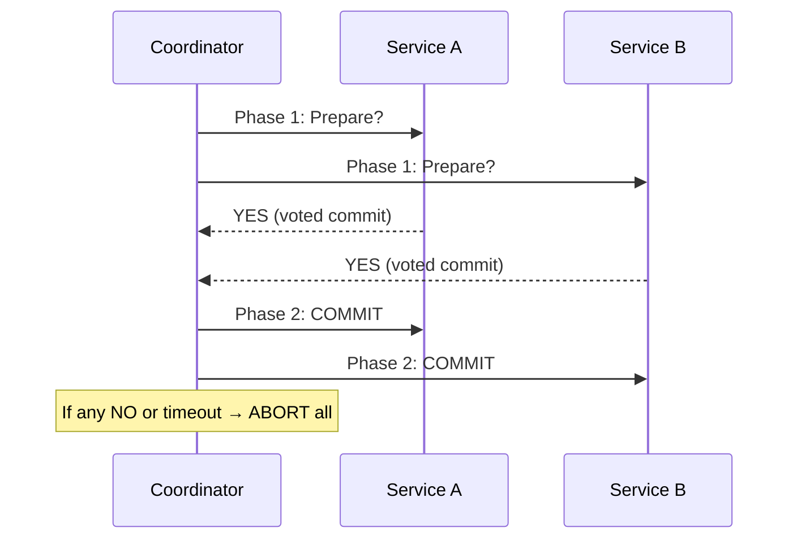
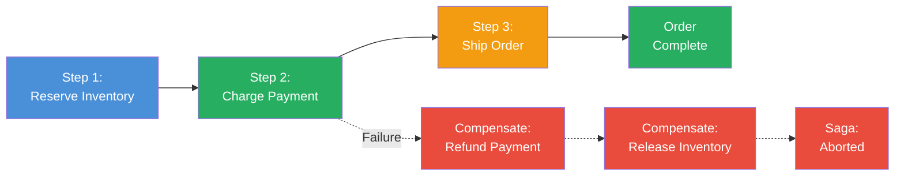

# 01 — Content Summary

*Understanding Distributed Systems* (approx. 280 pages) is a developer-first treatment of the core concepts that every engineer must understand before building software that runs across multiple machines. Vitessia structures the book in four progressive parts, moving from hard mathematical limits through practical failure handling and data management to real-world system composition.

---

## Introduction

Vitessia opens with a simple premise: most developers encounter distributed systems not by design but by accident. A team adds a second service. A database is split across regions. A monolith becomes microservices. Suddenly, assumptions that were safe — "the function call returns the same value for the same inputs," "the clock always moves forward," "if I sent a message, it arrived" — are all broken. This book is the conceptual toolkit for that moment.

The introduction establishes three themes that run through every chapter:

1. **Constraints are real and non-negotiable.** The CAP theorem and FLP impossibility are not academic curiosities — they are boundaries that shape every architectural decision.
2. **Abstractions leak.** Every layer of a distributed system — the network, the OS scheduler, the clock — has failure modes that no abstraction can fully hide.
3. **Trade-offs are the central skill.** There is no universally "correct" design. There is only the design that is correct *for your specific workload, latency requirements, and failure tolerance*.

---

## Part I — The Foundations: Networks, Time, and Ordering

This part establishes the mathematical and physical constraints that make distributed systems fundamentally unlike single-machine programming.

### Chapter 1: Networks Are Unreliable

Networks do not merely fail occasionally — they fail in ways that are impossible to distinguish from slowness. A packet may be dropped, delayed, reordered, or duplicated. There is no signal that unambiguously tells you the difference between "the server is down" and "the network is congested." This is the **asynchronous network model**, and every distributed system must operate within it.

**The CAP Theorem** (Brewer, 2000; proved by Gilbert and Lynch, 2002) formalizes a fundamental constraint. In the presence of a network partition (P), a distributed system must choose between:

- **Consistency (C):** Every read receives the most recent write or an error.
- **Availability (A):** Every request receives a (non-error) response, without guarantee it contains the most recent write.

You cannot have both during a partition. CP systems (e.g., etcd, ZooKeeper, HBase) choose consistency and may refuse writes or reads during a partition. AP systems (e.g., Cassandra, Dynamo, Riak) choose availability and may return stale data. CA systems are a theoretical ideal that does not exist in practice across multiple nodes, because any real multi-node deployment must tolerate partitions.

Vitessia emphasizes that CAP is a *partition* constraint, not a *general* constraint. Under normal operation (no partition), most modern systems can provide both C and A. It is only when the network breaks that the trade-off becomes visible — and network breaks are not rare events; they are inevitable.

**FLP Impossibility** (Fischer, Lynch, Paterson, 1985) extends this further. In an asynchronous distributed system (where there is no bound on message delay), it is *mathematically impossible* to guarantee consensus if even a single process can fail. There is no algorithm that always terminates and always agrees. Practical systems escape this by using timeouts, random backoff, or partially synchronous assumptions — but the impossibility result explains why consensus is always subtle and why every implementation involves design choices that trade safety for liveness.

### Chapter 2: Clocks Are Not Consistent

Time is the silent failure mode in distributed systems. A developer writes code assuming "event A happened before event B" can be determined by comparing timestamps. It cannot, reliably.

**Physical clocks (NTP):** NTP synchronizes clocks across machines to within milliseconds under good conditions. Under congestion, misconfiguration, leap seconds, or virtualized environments, drift can reach seconds or minutes. NTP offers no guarantee — it is a best-effort service. A clock can jump forward or backward without warning. **Never use physical timestamps for event ordering.**

**Logical clocks (Lamport, 1978):** The Lamport clock assigns a monotonically increasing counter to each event. Every message carries the sender's clock value; the receiver sets its clock to max(local, received) + 1 on receiving a message. This gives *happened-before* ordering — if event A's clock is less than event B's clock, then A may have happened before B. But the converse is not true: equal clock values mean the events are *concurrent* — neither happened before the other. Lamport clocks cannot distinguish between concurrent events.

**Vector clocks:** Extend Lamport clocks by maintaining an array of clock values, one per node. Node i maintains `{node_1: t1, node_2: t2, ...}`. On receiving a message from node j, node i updates its entry for j then increments its own. Two events are comparable if one vector is strictly less than another in all entries. If neither vector dominates, the events are concurrent. Vector clocks detect concurrency precisely — critical for conflict detection in replicated data stores. The cost: the vector size grows with the number of nodes. Practically, implementations (Dynamo, Cassandra) use limited-size vector clocks or version vectors with pruning.

**Hybrid Logical Clocks (HLC):** Combine physical time with a logical counter. An HLC consists of a physical timestamp component and a logical counter. When a message arrives with a physical timestamp close to the receiver's current time, the receiver uses the max physical time and increments the counter only if needed. When messages arrive from the distant past or future, the physical portion is adjusted and the counter reset. HLC provides the ordering guarantees of logical clocks while keeping physical times approximately correct — making them useful for conflict resolution and TTL calculations. CockroachDB and MongoDB use HLC-derived mechanisms.

### Chapter 3: Ordering and Coordination

Once clocks are not consistent, a distributed system must answer: how do we reason about the order in which events occurred, and what guarantees can we offer to clients reading and writing shared state?

**Linearizability (strong consistency):** The strongest single-object consistency model. A linearizable system appears as if there is a single copy of the data and every operation (read or write) appears to take effect instantaneously at some point between its invocation and response. Linearizability requires coordination on every write — typically via a consensus protocol — and is expensive in terms of latency. Clients see a total order that respects real-time ordering.

**Sequential consistency:** Weaker than linearizability. All operations appear to execute in some sequential order, and each node's operations appear in program order. But the global order does not need to respect real time. Two clients reading concurrently may see different orders of writes and still be sequentially consistent. Less expensive but provides weaker client guarantees.

**Causal consistency:** Respects causality: if event A causally preceded event B, then every node sees A before B. Concurrent events (no causal relationship) may be observed in different orders by different nodes. This is the strongest consistency model achievable without coordination. Implemented via version vectors or session guarantees (read-your-writes, monotonic reads, monotonic writes). CRDTs (Conflict-free Replicated Data Types) rely on causal consistency to converge without coordination.

**Eventual consistency:** Given enough time with no new writes, all replicas converge to the same state. During convergence, reads may return stale or conflicting values. Dynamo, Cassandra, and Riak offer tunable consistency (quorum reads and writes) that lets developers trade latency for consistency on a per-operation basis.

**Quorum consensus:** The mathematical mechanism behind tunable consistency. With `N` replicas, a write succeeds when `W` replicas acknowledge. A read succeeds when `R` replicas respond. If `W + R > N`, the read quorum must overlap with the most recent write quorum, guaranteeing the read sees at least one up-to-date replica. This is the Dynamo-style `(N, W, R)` parameterization: choose `N` (replication factor), `W` (write quorum), `R` (read quorum). `W + R > N` gives strong per-key consistency; `W + R <= N` gives eventual consistency with lower latency.

**Total order broadcast (atomic broadcast):** A communication primitive delivering every message to every node in the *same order*. Stronger than causal consistency: all nodes agree on a single total sequence of operations. Implemented via consensus protocols (Paxos, Raft). This is the foundation for replicated state machines and partitioned databases that need to agree on a sequence of writes.

**Consensus protocols:** Raft and Paxos are the dominant consensus protocols. Raft is designed for understandability: a leader is elected, all writes go through the leader, entries are replicated to a majority of nodes before acknowledged. If the leader fails, a new election produces a new leader. Paxos is equivalent in power but historically harder to understand, with multiple phases that must complete before a value is decided. Both protocols guarantee safety (no two nodes decide different values) and liveness (under partial synchrony assumptions, some value is eventually decided).

---

## Part II — Handling Failure

A single server fails by crashing. A distributed system fails by doing something unexpected: returning a partial response, writing data that appears to succeed but never arrives, or entering a livelock where two services continuously retry each other's failing operations. This part is the practical operating manual for that environment.

### Chapter 4: Retries and Exponential Backoff

When a request fails, the instinctive response is to try again. But naïve retries are dangerous. Immediate retry during transient overload amplifies the problem. **Exponential backoff** mitigates this by increasing the delay between retries: wait 1 second, then 2, then 4, then 8, up to a maximum. Apply **jitter** (randomize the delay) to prevent thundering herds — when hundreds of clients simultaneously retry after a service recovery, the synchronized retry storm DDoS-es the recovered service.

**Backoff parameters:** `initial_delay_ms`, `multiplier` (typically 2x), `max_delay_ms`, `jitter_factor` (typically 10–20%). A typical configuration: 100ms initial, 2x multiplier, 30s max, 20% jitter. Total retry budget should also be bounded — a request that has retried 5 times over 30 seconds is not likely to succeed on the sixth try.

**When NOT to retry:** Certain errors are not transient. 400-level client errors (bad request, unauthorized, not found) should not be retried. 429 (rate limited) should use the `Retry-After` header. Only retry on 5xx server errors and specific transient network failures (connection reset, timeout, DNS resolution failure).

### Chapter 5: Idempotency

Retries are only safe if the operation can be safely performed multiple times. An operation is **idempotent** if performing it N times produces the same result as performing it once. `PUT /orders/123` with the same payload is idempotent. `POST /orders` that creates a new order with a server-generated ID is not — each call creates a *different* order.

**Achieving idempotency:**
- **Idempotency keys:** The client generates a UUID idempotency key and sends it with the request. The server stores the result keyed by this ID. If the same key arrives again (via retry), the server returns the stored result without re-executing. Stripe uses this pattern for payment processing.
- **Natural idempotency:** `PUT` and `DELETE` are defined as idempotent by HTTP semantics. `GET` is both idempotent and safe.
- **Conditional requests:** `If-Match` with an ETag turns a non-idempotent operation into a conditional one with deterministic outcomes.

### Chapter 6: Circuit Breakers

Retries are the right response to transient failures. But when a service is genuinely unavailable — database is down, upstream API is returning 500s — retries make the problem worse. The **circuit breaker** pattern stops calls from reaching an unhealthy downstream service.

**Three states:**
- **Closed (normal):** Requests flow through. Failures are counted. If the failure rate exceeds a threshold within a time window, the breaker trips to Open.
- **Open (tripped):** Requests fail immediately without being sent. This protects the downstream service and gives it time to recover. After a timeout (recovery period), the breaker moves to Half-Open.
- **Half-Open (testing):** A limited number of test requests are allowed through. If they succeed, the breaker resets to Closed. If they fail, it returns to Open.

**Fault detection parameters:** `failure_threshold` (count or rate), `success_threshold` (for Half-Open recovery), `recovery_timeout`, `half_open_max_requests`. These must be tuned to the service's typical recovery profile. A database restart takes seconds; a degraded service may take minutes.

### Chapter 7: Bulkheads

On a ship, a hull divided into watertight compartments means one breach does not sink the vessel. The **bulkhead pattern** applies this principle: isolate failure domains so that a failure in one component does not consume resources needed by another.

**Thread pool bulkheads:** Each downstream dependency is served by its own thread pool or connection pool. If service A's pool is exhausted by calls to a slow downstream, calls to service B's pool still have threads available.

**Service-instance bulkheads:** Deploy dependent services on separate physical or logical pools — separate node pools, separate Kubernetes namespaces. A memory leak or CPU spike in one service cannot directly consume resources needed by another.

**Timeout bulkheads:** Every inter-service call has a timeout that is a fraction of the parent call's total timeout budget. This prevents the budget deadlock where every level waits for the level below it. A safe rule: spend at most 50% of your budget on any single downstream call.

---

## Part III — Data Management

### Chapter 8: Sharding and Partitioning

**Sharding** distributes data across multiple independent nodes so that no single node must hold the entire dataset. The partition key determines which shard owns each record.

**Partitioning strategies:**
- **Range-based:** Records grouped by key range (e.g., users A–M on shard 1, N–Z on shard 2). Supports range queries but prone to hot spots if key distribution is uneven.
- **Hash-based:** `hash(key) mod N`. Distributes data evenly but does not support range queries (requires fan-out to all shards).
- **Directory-based:** A lookup table maps each key to its shard. Supports arbitrary rebalancing but adds coordination overhead.
- **Consistent hashing:** Keys map to positions on a hash ring; each node owns the arc to its predecessor. Adding a node only migrates keys from the immediate predecessor. Used in Dynamo, Cassandra, Memcached for elastic scaling.

**Key design considerations:**
- Cross-shard operations require distributed coordination — design data models so that common queries are single-shard.
- Hot shards are the primary failure mode — choose keys that distribute access evenly.
- Rebalancing consumes bandwidth and can temporarily reduce availability.

### Chapter 9: Replication Strategies

**Single-leader (primary/replica):** All writes go to the primary; replicas apply the write log asynchronously. Reads can be served from any replica. The standard strategy for PostgreSQL, MySQL, MongoDB.

- **Synchronous:** Primary waits for replica confirmation — durability against primary failure, higher write latency.
- **Asynchronous:** Primary acknowledges immediately — lower latency but risk of data loss on primary failure.
- **Semi-synchronous:** Primary waits for at least one replica — a compromise.

**Multi-leader (multi-primary):** Any replica can accept writes, which are then propagated to others. Useful for multi-datacenter deployments. The challenge: write conflicts. Strategies: last-write-wins (LWW), application merge functions, or CRDTs.

**Leaderless (Dynamo-style):** Every replica accepts writes. Read repair and anti-entropy (Merkle trees) keep replicas converging. Clients use `(N, W, R)` quorum configuration. Used by Cassandra, Riak, DynamoDB.

### Chapter 10: Practical Trade-Offs

Vitessia closes Part III with a structured decision framework. No strategy is universally correct:

| Workload Characteristic | Recommended Strategy |
|-------------------------|---------------------|
| Strong consistency, low partition tolerance | Single-leader, synchronous replication |
| High write throughput, multi-region | Multi-leader with conflict resolution, or leaderless quorum |
| Read-heavy, geographically distributed | Leaderless with read repair + CDN caching |
| Time-series or log data, append-only | Partitioned log (Kafka-style) with offset-based reads |
| Financial ledger, no tolerance for lost writes | Synchronous primary/replica, WAL |

The consistency/availability spectrum in practice: most real systems are *tunable*, not purely CP or AP. A shopping cart can tolerate a few seconds of inconsistency. A payment ledger cannot. Engineering the right profile per operation is the central skill.

---

## Part IV — Communication, Transactions, and Composition

### Chapter 11: Microservices Communication

Moving from a monolith to microservices transforms *intra-process* complexity into *inter-process* complexity. The network is now the bus, and it is unreliable.

**Synchronous communication (REST, gRPC):** Simple but couples the caller to the callee's availability and latency. Cascading failures are the primary risk.

**Asynchronous communication (message queues, event streams):** Decouples producers from consumers. Kafka partitions messages into append-only logs replicated across brokers. Consumers maintain their own log position — no broker-side queue state. Key API design rules for distributed systems:
- **Pagination:** Cursor-based pagination preferred over offset-based (offset requires counting through records that may be on different shards).
- **Idempotency keys:** Every write should accept one to make retries safe.
- **Timeout discipline:** Every inter-service call must have an explicit timeout reflecting its SLO, typically 95th-percentile latency × 2–3.

**Service meshes** (Istio, Linkerd) transparently apply retries, circuit breaking, mutual TLS, and observability at the infrastructure layer. Trade-off: added operational complexity and a critical control plane.

### Chapter 12: Distributed Transactions — Two-Phase Commit

When a business operation spans multiple services, you need atomicity: either all services commit or all roll back. **Two-phase commit (2PC)** is the canonical solution.

**Phase 1 (Prepare):** Coordinator asks "Can you commit?" Participants reserve resources and respond YES or NO. A participant that votes YES is contractually obligated to commit.

**Phase 2:** If all YES, coordinator sends COMMIT. If any NO or timeout, coordinator sends ABORT.

**Critical limitations:**
- **Coordinator is a SPOF.** Crash after Phase 1 leaves participants blocked — they voted YES but cannot decide without the coordinator.
- **Blocking:** Locks held between phases. Extended coordinator failure = locked resources indefinitely.
- **No partition tolerance** in Phase 2. Cannot make progress if coordinator cannot reach all participants.
- **2PC is CP:** atomicity at the cost of availability during coordinator failures.

### Chapter 13: Three-Phase Commit and Saga

**Three-phase commit (3PC)** adds a pre-commit phase (CanCommit → PreCommit → DoCommit) to resolve 2PC's blocking problem. Theoretically non-blocking under partial synchrony. In practice: rarely used. Three network round-trips; the non-blocking guarantee requires assumptions satisfied in few real networks. Most production systems reaching for stronger semantics than 2PC use consensus protocols (Raft, Paxos) instead.

**Saga pattern:** Accepts temporary inconsistency as the price of availability. A saga is a sequence of local transactions across services. Each step publishes an event that triggers the next. If step N fails, **compensating transactions** reverse each completed step in reverse order.

**Choreography vs. Orchestration:** Choreography — services react to events, decentralized but hard to trace. Orchestration — central process manager controls flow, auditable but introduces coupling.

### Chapter 14: Composition and Dataflows

The final chapter: engineering skill is not understanding any single concept — it is understanding how concepts interact, where the seams are, and what failure modes emerge at interaction points.

**Composition principles:**
1. **Isolate failure domains.** Every service boundary is a circuit breaker boundary. Every message queue is a retry boundary.
2. **Make data flows explicit.** Async events make data dependencies visible. A well-designed event schema is a contract that survives refactoring.
3. **Design for replay.** Event logs make failure recovery tractable by replay. If every state change is an event in an immutable log, current state is always reconstructable.
4. **Accept that inconsistency is temporary.** In an AP system or saga, inconsistency is the norm during recovery. Make it bounded, visible, and business-acceptable.

**The final thesis:** Distributed systems are not hard because of any single concept. They are hard because all concepts interact simultaneously. A system with eventual consistency, vector clocks, retries with exponential backoff, circuit breakers, sagas, and a sharded NoSQL store is the default architecture for any web-scale system in 2024. The engineer's job is to understand the interaction surface between each pair of mechanisms and to design the system so that failures cannot cascade across those boundaries.
