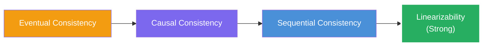
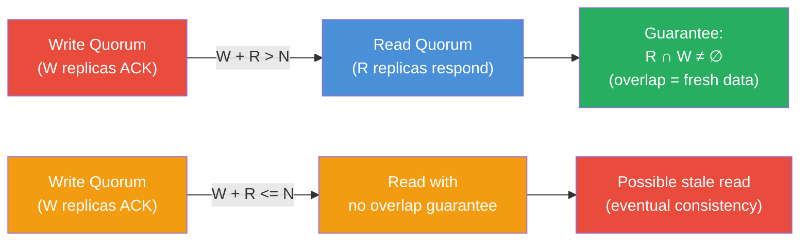
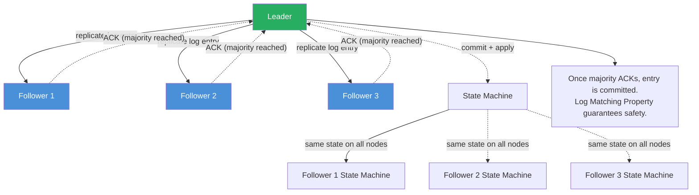
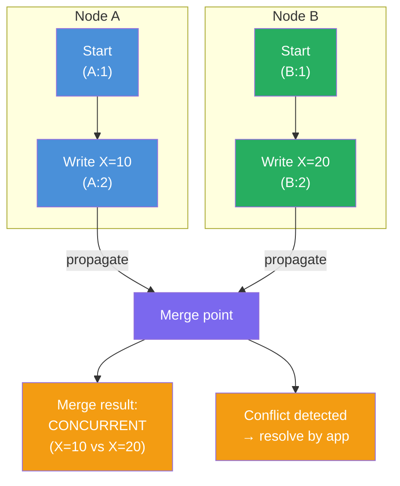
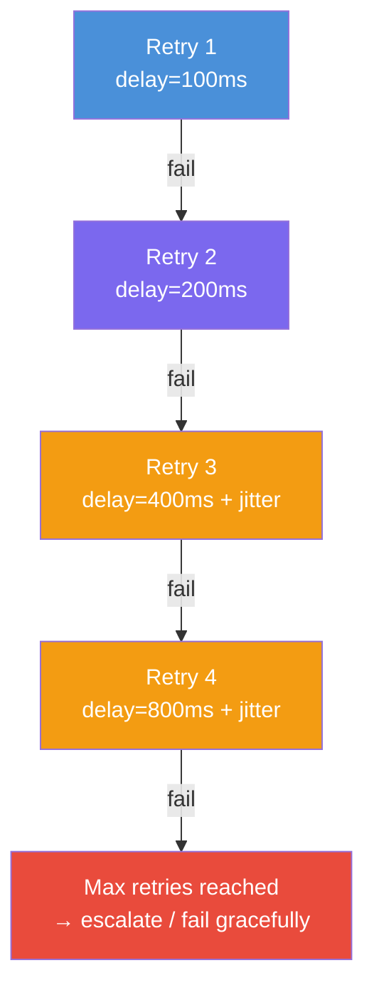
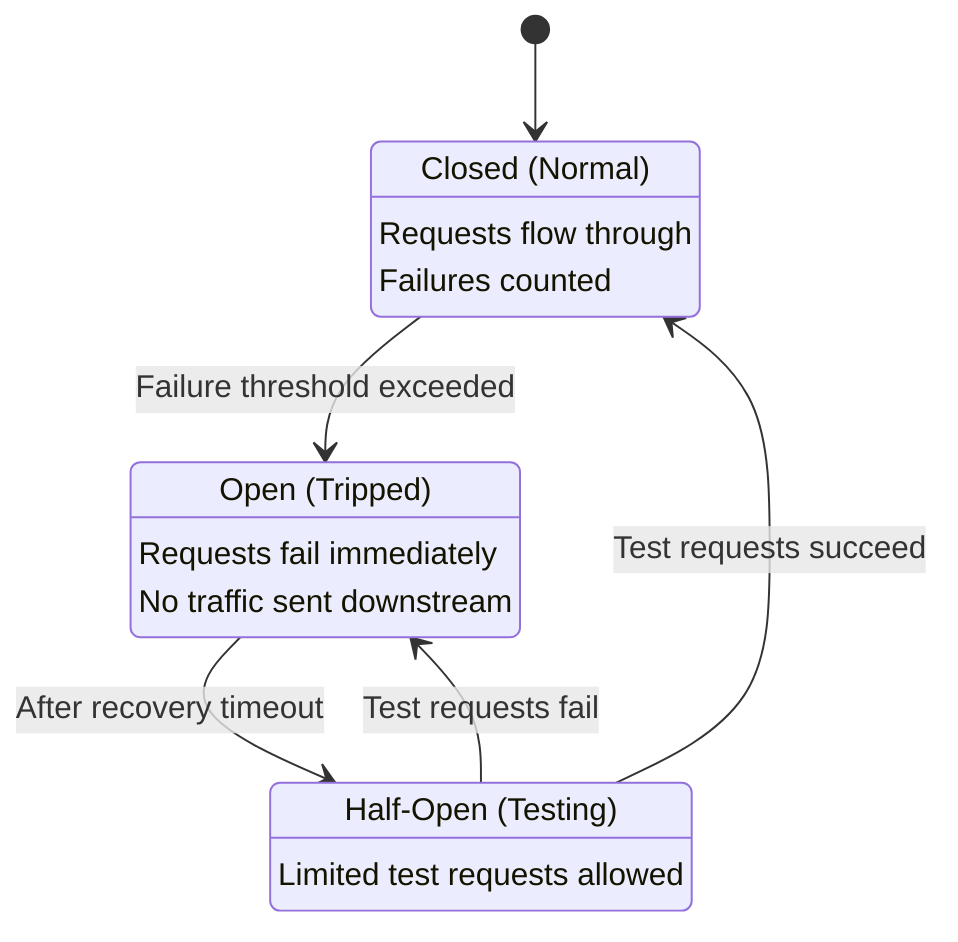
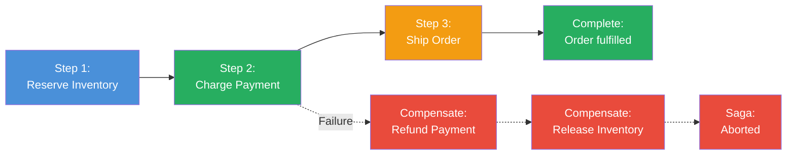

# 02 — Analysis

This document analyses the core concepts introduced in *Understanding Distributed Systems*, their structural rationale, trade-offs, and applicability criteria. Each section covers a distinct concept with a Mermaid diagram illustrating its core mechanics.

---

## 1. CAP Theorem: The Fundamental Trade-Off

```mermaid
graph TD
    A["Distributed System"] --> B{"Network Partition?"}
    B -->|Yes| C{"Choose C or A?"}
    B -->|No| D["Both C and A achievable<br/>in steady state"]
    C -->|Consistency (C)| E["CP System:<br/>Refuse writes/reads<br/>during partition"]
    C -->|Availability (A)| F["AP System:<br/>Serve all requests,<br/>may return stale data"]
    style D fill:#27AE60,color:#fff
    style E fill:#E94B3C,color:#fff
    style F fill:#F39C12,color:#fff
```

**Structural rationale.** CAP is not a general constraint — it applies specifically when a network partition occurs. In steady-state operation (no partition), most systems can offer both C and A. The theorem becomes binding only under failure, and those conditions are not rare. Vitessia's emphasis: *design for partitions; they are inevitable.*

**Trade-offs:**
- CP systems provide the strongest guarantees but reject operations or serve errors when quorum cannot be reached — actively *reducing availability* during partitions.
- AP systems always serve a response but that response may be stale or conflict with concurrent writes on other replicas.
- CA systems don't exist in practice across multiple nodes; any real multi-node deployment must tolerate partitions.

**Applicability:** Financial ledgers, inventory management, and locking typically require C and accept reduced availability during partitions (CP). Social feeds, analytics dashboards, and content delivery prioritize A and accept temporary staleness (AP). Hybrid systems isolate strongly consistent operations to critical paths while remaining AP for bulk reads.

---

## 2. Logical Clocks: Ordering Without Physical Time

```mermaid
graph LR
    subgraph "Node A"
    A1["Event A1<br/>clock=1"] --> A2["Event A2<br/>clock=2"]
    A2 -->|"send(msg, clock=2)"| Z
    end
    subgraph "Node B"
    B1["Event B1<br/>clock=1"]
    Z[receive(msg)] --> B2["Event B2<br/>clock=max(1,2)+1=3"]
    end
    style A1 fill:#4A90D9,color:#fff
    style A2 fill:#4A90D9,color:#fff
    style B1 fill:#27AE60,color:#fff
    style B2 fill:#27AE60,color:#fff
    style Z fill:#F39C12,color:#fff
```

**Structural rationale.** A Lamport clock assigns a monotonically increasing counter to every event. On receiving a message, the receiver sets its clock to `max(local_clock, sender_clock) + 1`, establishing a *happened-before* partial order. Equal clock values mean events are *concurrent* (neither causally preceded the other). Vector clocks extend this by tracking a per-node vector, enabling detection of true concurrency — when neither vector dominates, the events are concurrent.

**Trade-offs:**
- Lamport clocks: O(1) per event, minimal overhead, but cannot distinguish concurrent events.
- Vector clocks: detect concurrency precisely but O(N) space where N is node count. Practical implementations prune or truncate vectors (Dynamo, Cassandra).
- HLC (Hybrid Logical Clocks): O(1) space, approximate physical timestamps, causal ordering preserved. Used by CockroachDB, MongoDB.

**Applicability:** Lamport clocks for simple happens-before tracking. Vector clocks or HLC for conflict detection in replicated data stores and causally consistent systems. Never use physical wall-clock timestamps for event ordering.

---

## 3. Consistency Models: The Spectrum



**Structural rationale.** Consistency is not binary — it is a spectrum. Eventual: all replicas converge if no new writes. Causal: respects causality (A caused B → all nodes see A before B). Sequential: all nodes agree on a single global order respecting per-node program order. Linearizability adds real-time: if read R starts after write W completes, R must see W. Each stronger model implies all weaker ones.

**Trade-offs:**
- Eventual: lowest latency, highest availability — clients may read stale or conflicting values.
- Causal: requires causality tracking (version vectors) — moderate overhead, enables conflict-free merge.
- Sequential: requires consensus protocol — all nodes agree on the same operation order.
- Linearizable: strongest guarantee with real-time semantics — consensus on every write, highest latency.

**Key insight:** Most production systems are *tunable*, not purely one model or another. Dynamo-style `(N, W, R)` quorum lets you pick consistency per operation: `W + R > N` gives per-key linearizability; `W + R <= N` gives eventual.

**Applicability:** Linearizability for account balances, seat reservations, state where stale reads cause financial or safety harm. Sequential for social posts. Causal for collaborative editing. Eventual for CDN content, analytics counters, cache tiers.

---

## 4. Quorum Consensus: Tunable Guarantees



**Structural rationale.** With `N` replicas, a write succeeds when `W` replicas confirm. A read succeeds when `R` replicas respond. If `W + R > N`, the read and write quorums *must overlap* — at least one read replica has the latest write. This is the mathematical basis for Dynamo-style tunable consistency.

**Trade-offs:**
- High `W` and `R`: strong consistency, higher latency, reduced availability (must reach majority).
- Low `W` and `R`: low latency, high availability, but possible stale reads.
- `W = N, R = 1`: strong write, fast read — all replicas confirm writes, reads hit one replica.
- `W = 1, R = N`: fast write, thorough read — writes are fast, reads are expensive but guaranteed fresh.

**Applicability:** Wide-column stores (Cassandra, ScyllaDB), Dynamo-style key-value stores, any system where per-operation consistency tunability is valuable. Not applicable to systems requiring global linearizability across arbitrary key sets.

---

## 5. Consensus Protocols: Raft



**Structural rationale.** Raft divides consensus into three sub-problems: leader election, log replication, and safety. A leader is elected. All writes go through the leader: it appends the entry to its log, replicates to followers. Once a majority of followers acknowledge, the entry is committed and applied to the state machine. If the leader fails, a new election produces a new leader. The Log Matching Property guarantees: if two entries have the same index and term, they contain the same command. This prevents divergent replicated state.

**Trade-offs:**
- Strong safety guarantees: no two nodes decide different values; committed entries are never lost.
- Leader is a throughput bottleneck: all writes route through exactly one node.
- Leader failure causes unavailability for the election duration (typically sub-second with tuned timeouts).
- Requires a majority quorum — a 5-node cluster tolerates 2 simultaneous failures; a 3-node cluster tolerates 1.
- Paxos is equivalent in power but historically harder to understand; Raft's understandability trade-off makes it the dominant modern choice.

**Applicability:** etcd, Consul, TiKV, CockroachDB, MongoDB replica sets, any system requiring a replicated log or strongly consistent metadata store. Avoid for write-throughput-critical paths where the single-leader bottleneck is limiting; consider leaderless alternatives.

---

## 6. Vector Clocks: Concurrent Event Detection



**Structural rationale.** Each node maintains `{node_id: counter}`. On event: increment own counter. On receive: update sender's counter, set own counter to max(local, received) + 1. Two events are: *happened-before* if one vector dominates the other in all entries; *concurrent* if neither dominates — exactly when both wrote to the same key independently. This is the mechanism enabling conflict detection in Dynamo-style stores.

**Trade-offs:**
- Precise concurrency detection: no false positives (no spurious conflict reports for causally ordered events).
- Storage cost: vector grows with node count. Practical systems use pruning (Cassandra), sampled vectors, or HLC to bound size.
- Conflict resolution is application-defined: LWW, CRDT merge function, or manual resolution. The clock detects; it does not resolve.

**Applicability:** Replicated data stores where conflicts must be detected before resolution (Dynamo, Cassandra, Riak). CRDT-based systems where causal ordering is necessary for convergence. Avoid in systems where strong consistency is required — a consensus protocol is simpler and more correct.

---

## 7. Exponential Backoff and Jitter



**Structural rationale.** Immediate retries during a transient overload amplify the problem — every retry is another request hitting an already-struggling service. Exponential backoff (delay doubles each retry) reduces pressure. Jitter (randomizing delay within a range) prevents thundering herds: when 1,000 clients synchronize their retries after a service recovers, the synchronized storm can DDoS the recovered service before it has a chance to stabilize.

**Trade-offs:**
- With backoff only: clients still synchronize if their initial failure was synchronized (e.g., a deploy that restarted the same service on all clients simultaneously).
- With jitter: clients desynchronize over a few retry cycles, spreading load.
- Too aggressive (short delays, few retries): ineffective against sustained failures.
- Too aggressive (long delays, many retries): poor user experience; slots remain stuck too long.
- Bounding total retry time (not just count) is critical — a 5-retry budget at 0ms, 100ms, 200ms, 400ms, 800ms = ~1.5s total, which is reasonable for most interactive operations.

**Applicability:** Universal. Every inter-service call, every SDK-invoked API, every queue consumer retry should use exponential backoff with jitter. This is not optional.

---

## 8. Circuit Breaker: Cascading Failure Protection



**Structural rationale.** The circuit breaker is a state machine that wraps a remote call. In Closed state, all calls pass through and failures are counted. When the failure rate exceeds a configured threshold within a window, the breaker *trips* to Open — all subsequent calls fail immediately without reaching the downstream service. This gives the downstream time to recover without additional load. After a configured timeout, the breaker enters Half-Open: a limited number of test requests are allowed through. Success resets to Closed; failure returns to Open.

**Trade-offs:**
- Prevents retry storms from cascading into total outage — the primary purpose.
- Adds operational complexity: thresholds, timeouts, and recovery windows must be tuned per dependency.
- Open breakers must degrade gracefully — return a cached response, a default, or an explicit error — not silently swallow requests.
- Distinguishing transient faults (retry via backoff) from genuine unavailability (trip the breaker) is the critical design decision.

**Applicability:** Every inter-service dependency in a microservices architecture. Databases, external APIs, message brokers, cache backends, payment gateways — any remote call where failure of the downstream service should not propagate upstream.

---

## 9. Two-Phase Commit: Atomicity Across Services

```mermaid
sequenceDiagram
  participant C as Coordinator
  participant A as Service A
  participant B as Service B

  C->>A: Phase 1: Can you commit?
  C->>B: Phase 1: Can you commit?
  A-->>C: YES (voted commit)
  B-->>C: YES (voted commit)
  C->>A: Phase 2a: COMMIT
  C->>B: Phase 2a: COMMIT

  Note over C,A,B: All participants commit → atomic success

  C->>A: Phase 1: Prepare?
  C->>B: Phase 1: Prepare?
  A-->>C: NO (cannot commit)
  C->>A: Phase 2b: ABORT
  C->>B: Phase 2b: ABORT

  Note over C,A,B: Any NO → all abort → atomic rollback
```

**Structural rationale.** 2PC provides atomic commit across multiple services: either all services commit or all abort. Phase 1 (Prepare): coordinator asks each participant "can you commit?" Each participant reserves resources and responds YES or NO. Phase 2: if all YES, coordinator sends COMMIT; if any NO or timeout, coordinator sends ABORT. A participant that votes YES is contractually obligated to commit regardless of what happens next.

**Trade-offs:**
- Provides strong atomicity for multi-service operations.
- Blocks coordinator-dependent: if the coordinator crashes after Phase 1, participants are stuck — they have voted YES but cannot decide without the coordinator.
- Requires a 3- or 5-node coordinator cluster (etcd, ZooKeeper) for HA, adding infrastructure cost.
- Holding locks between Phase 1 and Phase 2 creates resource exhaustion risk if coordinator fails for an extended period.
- Two additional network round-trips per transaction adds latency.

**Applicability:** Banking transfers between internal accounts, where atomicity is non-negotiable and both participants can tolerate brief blocking. Avoid in microservices architectures requiring high availability — sagas or compensation-based patterns are preferable.

---

## 10. Saga: Availability-First Distributed Transactions



**Structural rationale.** Where 2PC blocks during coordinator failures, sagas accept temporary inconsistency as the price for availability. A saga is a sequence of local transactions executed across services. Each step publishes an event that triggers the next. If step N fails, compensating transactions *reverse* each completed step in reverse order. No global locks, no blocking coordinator — each service commits its local transaction independently.

**Choreography vs. Orchestration:**
- **Choreography:** Services react to events. Decentralized, easy to extend, hard to trace.
- **Orchestration:** Central process manager controls flow. Visible, auditable, but introduces coordination.

**Trade-offs:**
- No blocking — each service commits independently. High availability during failures.
- Compensating transactions must be implemented and tested — they are business logic, not infrastructure.
- Temporary inconsistency: between the failure and completion of compensation, the system is partially committed. Duration must be bounded.
- Saga design is more complex than 2PC to implement correctly; retriability and idempotency are essential for every step.

**Applicability:** E-commerce order fulfillment, user onboarding pipelines, any multi-service operation where the business can tolerate temporary inconsistency but cannot tolerate unavailability. Choose choreography for simple chains (3–5 steps); choose orchestration for complex workflows where auditability and control flow matter.

---

## Cross-Concept Observations

| Concept | Introduces | Solves | Cost / Trade-Off |
|---------|-----------|--------|-----------------|
| CAP Theorem | Partitions force C vs A choice | Design clarity under failure | No universal "both" — forces architectural decision |
| Logical Clocks | Happened-before order without NTP | Correct event sequencing | Vector size scales with nodes; HLC mitigates |
| Consistency Spectrum | Models from eventual → linearizable | Matching guarantees to requirements | Higher consistency = higher latency + lower availability |
| Quorum Consensus | `W + R > N` tunable guarantees | Per-operation consistency choice | Latency scales with (W + R) replicas contacted |
| Consensus (Raft) | Strong consistency via leader | Correct replicated state machine | Single leader = throughput bottleneck |
| Vector Clocks | Concurrent event detection | Conflict identification | Memory cost per node; CRDTs resolve |
| Exponential Backoff | Structured retry delay | Prevents retry amplification | Added latency per retry; bounded retry budgets required |
| Circuit Breaker | State machine for failure | Prevents cascading failure | Threshold tuning complexity; degraded UX when open |
| Bulkheads | Resource isolation | Failure blast radius containment | Resource over-provisioning |
| 2PC | Atomic commit across services | All-or-nothing multi-service ops | Blocking; coordinator SPOF; 2 extra RTT |
| Saga | Availability-first multi-service ops | Non-blocking distributed transactions | Compensating logic complexity; temporary inconsistency |