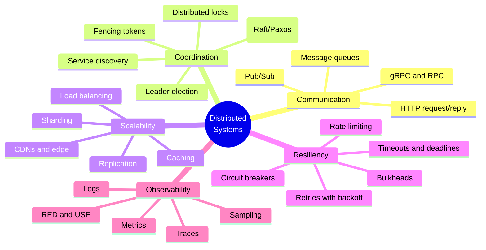
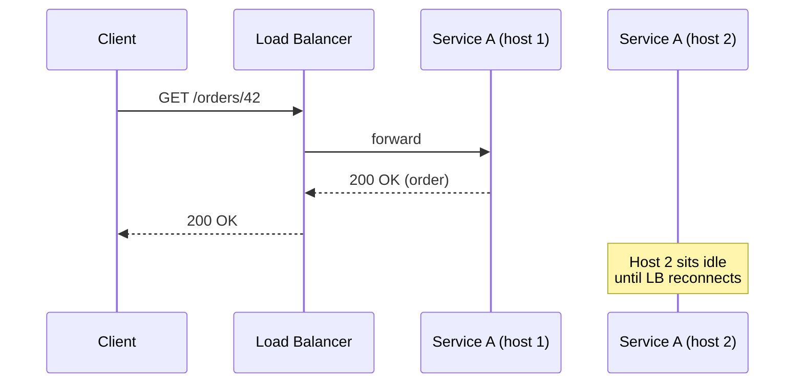
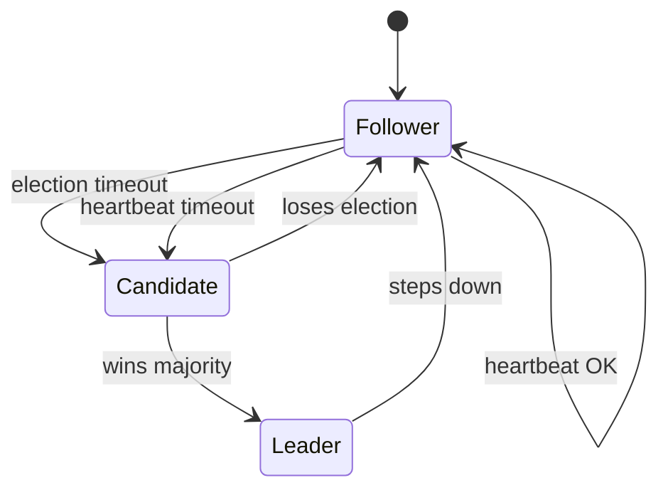
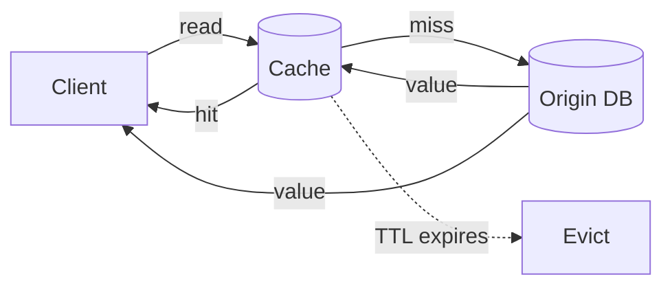
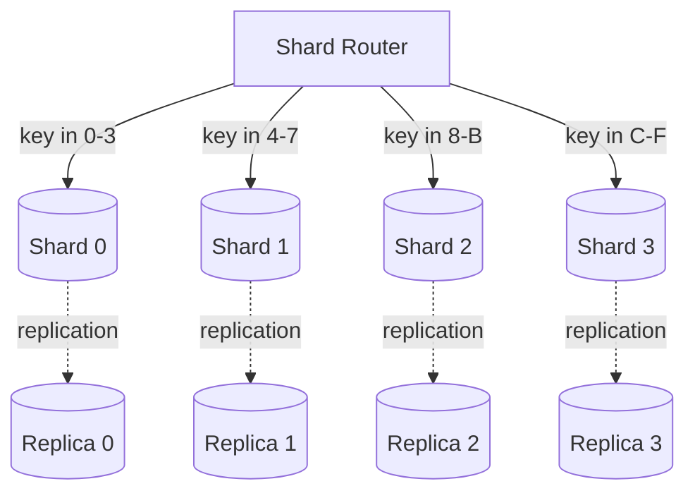
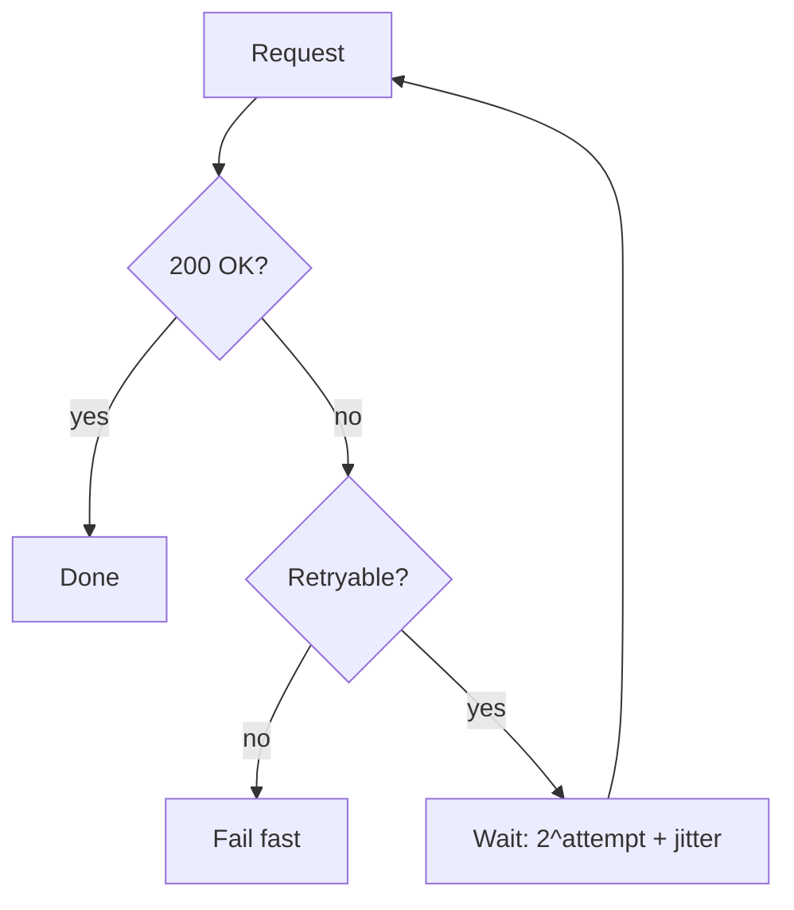
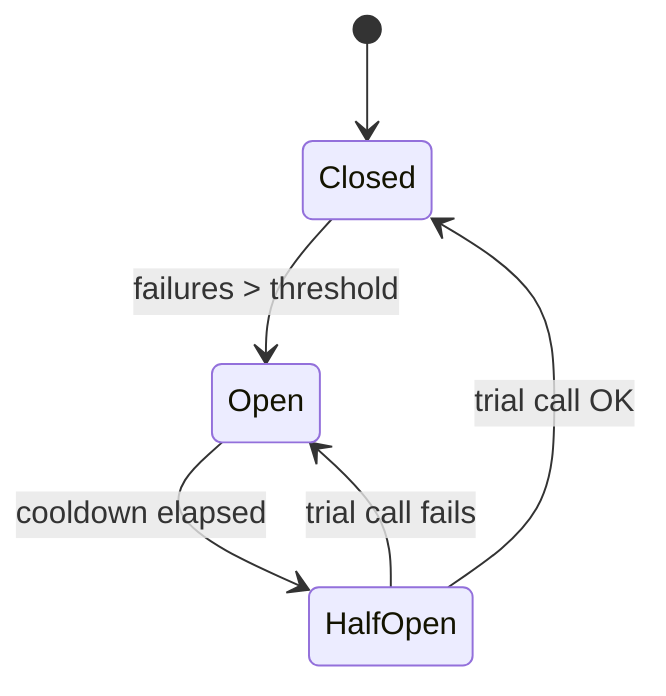
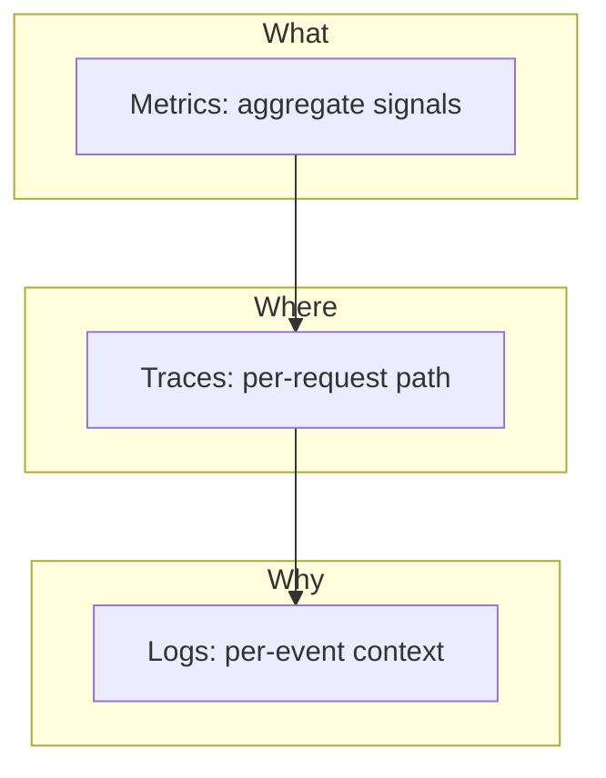
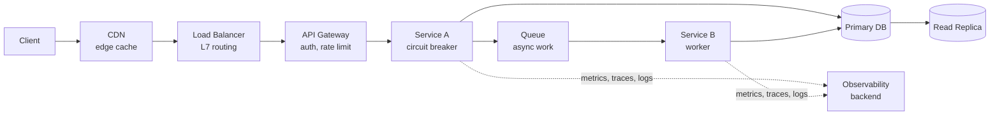

## The Five Pillars

Vitillo organizes the entire book around five concerns. Every
distributed system, in his framing, is the same five problems wearing
different uniforms:

The book walks each pillar top-down: start with the simplest case,
introduce a failure, explain the technique that mitigates it, then
generalize. By the time the reader is in chapter 14, the techniques
from chapters 1-13 have been layered together into a working mental
model of a production-grade service.

---

## Communication

The first question any distributed system answers: how does a process
on one machine invoke a process on another? Vitillo treats
communication as the substrate the rest of the book builds on.

### Request/Reply

The synchronous default. The client sends a request, blocks, and
receives a response. The textbook examples are HTTP and gRPC.

Vitillo's cautions: synchronous chains are the primary cause of
tail-latency explosions. A three-hop RPC that returns in 50 ms when
healthy can return in 30 seconds when one hop is degraded. The book
teaches the reader to **flatten RPC graphs, propagate deadlines, and
time-bound every leg.**

### Message Passing

The asynchronous alternative. Producers emit messages to a queue or
pub/sub topic; consumers process at their own pace. The same call
that blocks for 200 ms in a request/reply becomes a 2 ms enqueue
followed by background work.

| Property | Request/Reply | Message Queue | Pub/Sub |
|---|---|---|---|
| Coupling | Tight (client waits) | Loose (decoupled in time) | Loosest (no ack, fan-out) |
| Backpressure | Caller feels it | Queue absorbs it | Topic + subscribers |
| Delivery | At-most-once by default | At-least-once usually | Best-effort |
| Use case | Query, lookup, RPC | Background work, pipelines | Broadcast, fan-out events |

The book's stance: **use request/reply for queries, message queues for
work, pub/sub for events.** Mixing the three is the most common
distributed-system design error.

---

## Coordination

Once processes can talk, the next question is: how do they agree on
shared state? Coordination is the chapter where most production
incidents begin.

### Discovery and Leader Election

In a small system, a static list of hosts in a config file works. In
a real system, hosts come and go. **Service discovery** (Consul, etcd,
Kubernetes DNS) gives clients a way to ask "who is healthy right
now?" and get an answer.

**Leader election** is a special case: of N replicas, exactly one
holds a special role at any time. The leader processes writes, or
fires the cron, or holds the lock. When the leader dies, the others
hold an election and one of them becomes the new leader.

Vitillo walks through Raft's state machine with hand-drawn
diagrams. The chapter's practical advice: **do not implement this
yourself.** Use a managed service (ZooKeeper, etcd, Consul, the
Kubernetes control plane). The book treats the algorithm as something
the reader must *understand*, not something the reader must *write*.

### Consensus and Distributed Locks

Consensus is leader election plus log replication. Raft and Paxos are
the two canonical algorithms. Both prove that a majority of nodes can
agree on a value as long as a majority is reachable.

Distributed **locks** are a subtler problem. Vitillo reproduces the
canonical Kleppmann critique: a lock is not just mutual exclusion, it
is a linearization point for the protected resource. A lock holder
may be paused, network-partitioned, or replaced. The only safe lock
is one that returns a **fencing token** that the protected resource
checks on every operation. A lock without a fencing token is, in
Kleppmann's now-famous phrase, "unsafe under GC pauses and process
crashes."

The book's stance: **prefer idempotency to locks.** A correct,
idempotent operation does not need a lock to be safe. Locks are for
the cases where the operation cannot be made idempotent — and those
cases are rarer than most engineers think.

---

## Scalability

How does a system grow beyond a single machine? Four levers, in order
of leverage: caching, load balancing, sharding, replication.

### Caching

Vitillo opens the caching chapter with what he calls "the most
underestimated mistake in distributed systems": treating a cache as a
database. A cache is a database that lies to you sometimes. You must
decide in advance what the system does on:

- **Cache miss.** Fall back to origin.
- **Stale read.** How stale is acceptable? How do you tell?
- **Eviction under pressure.** What gets thrown out? Hot data or cold
  data?
- **Cache poisoning.** A bad write corrupts the cache. How do you
  recover?

**The most leveraged rule in the book:** decide your cache's
invalidation strategy *before* you write the code. The four canonical
strategies are: write-through, write-around, write-behind, and
TTL-based read-through. Each has a different consistency story. Pick
one, write it down, and tell the team.

### Load Balancing

Distribute requests across N replicas. Two families: layer 4 (TCP,
fast, no protocol awareness) and layer 7 (HTTP, smart, can route on
path or header). Algorithms range from round-robin (simplest,
ignores load) to least-connections (better, ignores request cost) to
weighted response time (best, but requires feedback from the
replicas).

Vitillo's practical advice: **use a managed load balancer.** The
algorithms you would want to write are the ones the cloud provider
has already implemented and battle-tested.

### Sharding

Split a dataset across N nodes. The single most important decision
in a sharded system is the **shard key**. A bad shard key creates a
hot spot — one shard receives a disproportionate share of traffic —
that no amount of hardware can fix without a painful re-shard.

**Sharding rules:**

1. **Choose a key with high cardinality and uniform distribution.**
   `user_id` is usually good. `country_code` is usually terrible.
2. **Re-shard early, not late.** A two-shard system that re-shards
   to four at 2x growth is healthy. A sixteen-shard system that
   re-shards to thirty-two at 2x growth is a quarter-long project.
3. **Co-locate related data.** If a query always reads `orders` and
   `users` together, shard them by the same key.

### Replication

Copy data across N nodes so that one (or several) can die without
losing data or downtime. Replication is what makes the rest of the
book's techniques survivable. The CAP trade-off lives here: do you
replicate synchronously (consistent but slow, blocked on quorum) or
asynchronously (fast but vulnerable to data loss)?

The book's stance: **replicate at the storage layer; do not reinvent
it at the application layer.** Application-level replication is
where most distributed monoliths are born.

---

## Resiliency

Resiliency is the discipline of choosing which requests to refuse
when the system is under stress. The default must be fail-safe, not
fail-open.

### Retries and Backoff

The single most common distributed-systems bug is a service that
fails fast and retries instantly, drowning the downstream service
when it recovers. The fix is **jittered exponential backoff**: wait
longer between retries, and randomize the wait so N clients do not
synchronize.

Vitillo is emphatic: **retries are dangerous.** They amplify a brief
outage into a sustained one. They create duplicate work. They corrupt
state when the operation is not idempotent. The book treats retry
policy as a first-class design decision, not a "we'll add that
later" item.

### Circuit Breakers

A circuit breaker wraps a remote call. When the call fails too many
times in a window, the breaker **opens**: subsequent calls fail fast
without hitting the downstream. After a cooldown, the breaker
**half-opens**: it lets one call through. If that call succeeds, the
breaker closes; if it fails, the breaker re-opens.

The book's stance: **circuit breakers protect the caller from the
callee, and the callee from the caller.** A downstream that is
struggling needs *fewer* calls, not more.

### Bulkheads, Rate Limiters, Deadlines

A **bulkhead** isolates resources so that one slow caller cannot
exhaust the pool shared with healthy callers. A **rate limiter**
caps inbound traffic. A **deadline** is the upper bound on how long a
request is allowed to live, propagated through every hop.

The unifying theme: **set boundaries, then enforce them.** A
system that gracefully refuses work is healthier than a system that
accepts everything and degrades into timeouts.

---

## Observability

How do we know what is happening inside a system that we cannot
introspect? Vitillo answers with three signals: metrics, logs,
traces.

| Signal | Question it answers | Cost | Cardinality |
|---|---|---|---|
| Metrics | How much, how fast, how often? | Cheap | Low |
| Logs | What happened, in detail? | Moderate | High |
| Traces | Where did the time go? | Highest | Per request |

The book's stance: **you need all three.** Metrics tell you *that*
something is wrong. Logs tell you *what*. Traces tell you *where*.

### RED and USE

Two complementary frameworks for choosing what to measure:

- **RED** (for request-driven services): Rate, Errors, Duration.
- **USE** (for resources): Utilization, Saturation, Errors.

Vitillo's practical advice: **start with RED for every service, USE
for every resource, and add custom metrics for the two or three
business-critical paths.** A team with four well-instrumented
services can debug a system of forty. A team with forty
under-instrumented services cannot.

### The Observability Hierarchy

When investigating an incident, start at the top of the pyramid
(metrics: what is the error rate?), descend into traces (which
endpoints are slow?), and finish in logs (what is the failing code
doing?).

---

## The Production Stack

The book closes with a capstone chapter that ties all five pillars
together: a request entering a real system, from the load balancer
in front to the database in the back, and the techniques applied at
each hop.

Vitillo's closing argument: distributed systems are not a research
discipline. They are a craft. The five pillars are not a curriculum
to be mastered in order; they are a vocabulary to be carried into
every design review, every postmortem, and every page of code.
