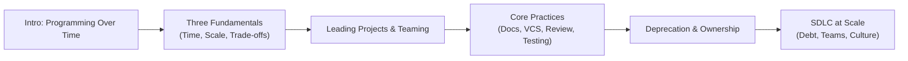

# 01 — Content Summary
<!-- book-open-props frontmatter chapter="01" title="Content Summary" -->

## Introduction: Programming Over Time

The book opens with a deceptively simple question: *What does software engineering actually mean?* The authors argue that programming is writing code; software engineering is the set of programming activities that occur over time in the context of a team. Google, they observe, operates at a scale that makes this distinction unavoidable — hundreds of thousands of repositories, millions of source files, thousands of engineers collaborating simultaneously.

They coin the term **"time as a force multiplier."** A hundred engineers working for a year is not the same as one engineer working for a hundred years; the latter produces more maintainable code if time is treated as a design goal. Every decision made today must account for the decades-long lifespan of code in production at Google.

---

## Part I: The Three Engineering Fundamentals

### Time

Code at Google is expected to be maintained indefinitely. The bias toward longevity shapes every recommendation in the book. Practices that are optimal for a weekend script — quick to write, acceptable to throw away — become liabilities when the same code is patched by engineers who never met the original author.

The authors cite Google's internal evidence: HP Enterprise Service Division (HP ESD) found that their codebase grew by 33-330× between 1980 and 1998, yet the cost of defect removal per unit of effort increased over that same period. This means the relationship between code size and maintenance cost is not linear; it is superlinear in the wrong direction.

### Scale

Scale in this book means the human dimension of software systems, not just infrastructure. Google has codebases where dozens of teams contribute to a single repository. Scale introduces communication failures, ownership ambiguity, and coupling problems that do not exist at smaller sizes. The Google Fonts project — a single repository used by publishing websites worldwide — exemplifies how a small team must design for contributors they will never meet.

### Trade-Offs

Every engineering decision is a trade-off. Google's culture demands explicit awareness of these trade-offs rather than silent defaults. The authors argue that many teams operate without a shared vocabulary for trade-off analysis, leading to avoidable conflict and rework.

---

## Part II: Leading a Software Project

### How to Lead a Project

Project leadership at Google is not about managing people subordinated to you; it is about managing the *environment* in which a team works. A project lead owns the vision, the roadmap, the technical direction, and the culture. The lead sets the context so that individual engineers can make good decisions without being micromanaged.

The book identifies three key responsibilities:

1. **Setting the vision** — articulating what success looks like
2. **Sustaining momentum** — removing blockers and keeping pace
3. **Building culture** — modeling and enforcing the team's norms

### Teaming: How Google Makes Decisions

Google uses a form of **teaming** rather than rigid hierarchy for important technical decisions. Decisions are delegated to the person with the most context, not the highest rank. Critical technical choices are made by the engineers most affected by them. The book contrasts this with traditional command-and-control models.

The authors introduce the concept of **"overfitting to stereotypes."** Many organizations adopt practices from Google, Facebook, or Amazon without understanding the preconditions that made those practices work. Google has the resources to hire extensively, run large teams, and run long experiments. Every organization should use its own context to calibrate which practices it can successfully adopt.

---

## Part III: Core Practices

### Documentation as Code

Google treats documentation with the same rigor as production code. Documentation lives in version control, undergoes code review, and has owners. The book introduces three categories of Google documentation:

- **Reference** (80%) — what is the truth about the system
- **Design documents** — how a system works and why
- **Tutorials and guides** — how to use the system

Reference documentation is the most important and most neglected. Google found that 80% of documentation effort should go into keeping reference docs accurate; tutorials and guides are secondary. The authors quote: "If the reference docs are wrong, everything else is built on sand."

Design documents — **Google's design documents** (also called RFCs internally) — are the primary mechanism for building consensus around changes. They are reviewed by peers before implementation begins, surfacing flaws when the cost of change is low.

### How to Write a Design Document

A Google-style design document includes:

- Title and metadata
- Context and motivation
- Goals (success criteria)
- Non-goals (explicit boundaries)
- Proposed solution with alternatives
- Risks and mitigations
- Security and privacy review
- Timeline

### Version Control Branching Strategy

Google's **trunk-based development** is central to its engineering identity. Engineers commit to the main branch frequently — daily or hourly — rather than working in long-lived feature branches. The book argues that long-lived branches create "merge hell" and delay feedback.

Key Google branching principles:

- No long-lived branches: work is integrated continuously
- Code review happens *before* commit, not after
- Automated CI runs on every change to trunk
- Feature flags hide incomplete features from production

### The Four Code Review Pillars

Code review at Google is not primarily about catching bugs. The four pillars are:

1. **Correctness** — the code works, tests pass
2. **Maintainability** — future engineers can modify this safely
3. **Design** — the solution fits the system architecture
4. **Mentoring** — each review teaches something

> **Correctness**: Does the code do what its author intended? Are the tests meaningful?
> **Maintainability**: Is the code readable? Are abstractions well chosen?
> **Design**: Does this integrate well with the existing system?
> **Mentoring**: What does this interaction teach the reviewer and the author?

Clients review requires an author's response before approval. Reviewers are expected to be timely. The book recommends 200-line review limits for effectiveness.

### Testing at Scale

Google took years to adopt comprehensive testing and still continues to refine its approach. Key insights:

- **Test sizes**: Google distinguishes between small (unit), medium (service), and large (end-to-end) tests. Running only unit tests catches ~60% of regressions; adding service tests catches ~80%; end-to-end catches the remaining ~20% at significantly higher cost.
- **Test coverage requirements**: Very few parts of Google require 100% coverage. The emphasis is on test quality, not quantity.
- **Testing in production**: Google uses "prodstaging" tiers and shadow traffic to validate changes before they reach 100% of users.
- **Fuzzing and property-based testing**: Google has integrated fuzz testing into core infrastructure, finding security-relevant bugs automatically at scale.

### Deprecation

Deprecation is a first-class engineering concern at Google. The book presents **three reasons a system should be retired**:

1. No one uses it
2. The cost to maintain it exceeds the value it provides
3. A better replacement exists and migration is feasible

The deprecation process at Google:

1. Announce deprecation publicly with timeline
2. Provide a migration guide
3. Monitor usage of the deprecated system
4. Disable the system after the deadline passes

Google has a dedicated deprecation team that tracks legacy systems and applies gentle pressure to retire them, preventing the gradual accumulation of unowned legacy code.

---

## Part IV: Engineering Culture

### Blameless Culture

Google's postmortem process is explicitly **blameless**. When an incident occurs, the question is not "Who caused this?" but "What system failure allowed this to happen?" Blame, the authors argue, is a reliable way to suppress information sharing, which makes future incidents more likely.

Postmortems at Google:

- Are written within 48 hours of an incident
- Focus on contributing factors, not root causes (root causes are rarely singular)
- Are shared broadly rather than kept private
- Lead to action items with owners and deadlines

### Code Ownership

Every piece of code at Google has a named **OWNERS** file. The file lists individuals authorized to approve changes. Ownership provides clarity about who can answer questions and who bears responsibility for technical debt decisions.

Good ownership means:

- Owned code has a clearly assigned maintainer
- Owners are responsible for responding to change requests
- Code without owners is periodically audited for orphan status

---

## Part V: Software Development Life Cycle at Scale

### Technical Debt Management

The book distinguishes between **inadvertent debt** (code written without full knowledge of its constraint set) and **deliberate debt** (code written knowing it will need future rework). Most technical debt is inadvertent; most of it accumulates from a lack of time for upkeep.

Google's approach:

- **Nike Lab-style tours**: engineers periodically rotated into teams fixing technical debt as their primary duty
- **Code health sprints**: regular, calendared periods dedicated to debt reduction
- **Backlog grooming**: debt items tracked alongside feature work

### Building Productive Teams

The book's final major section examines team dynamics. Research cited from Project Aristotle — Google's own study of team productivity — found that psychological safety was the strongest predictor of team effectiveness. The authors translate this into engineering practice:

- Teams should feel safe asking questions without fear of looking ignorant
- Leaders should admit mistakes publicly, modeling the blameless culture they want
- Diversity of perspective is a feature, not a bug, in engineering teams

---

## Chapter Summary

