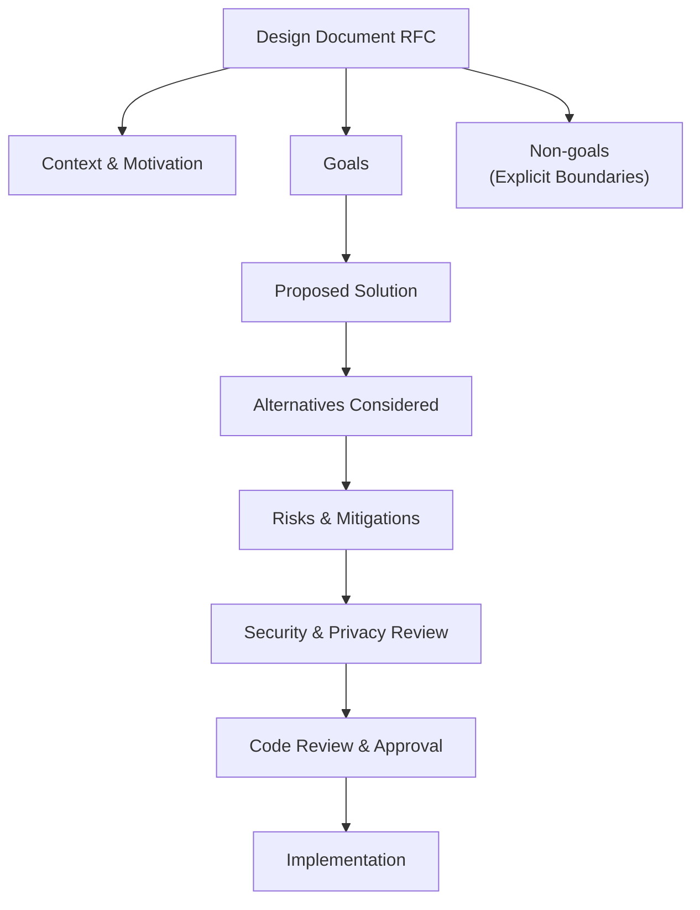
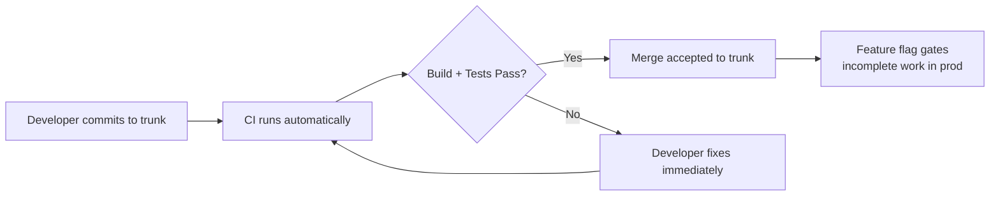
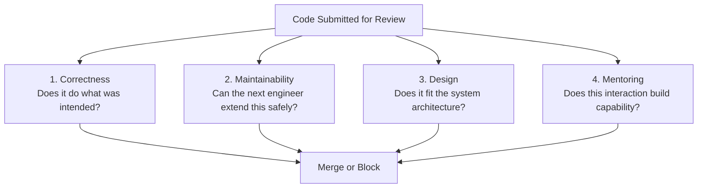
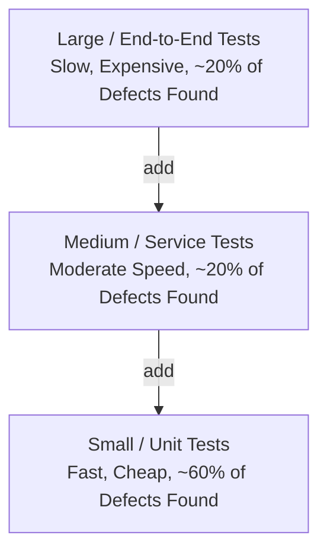
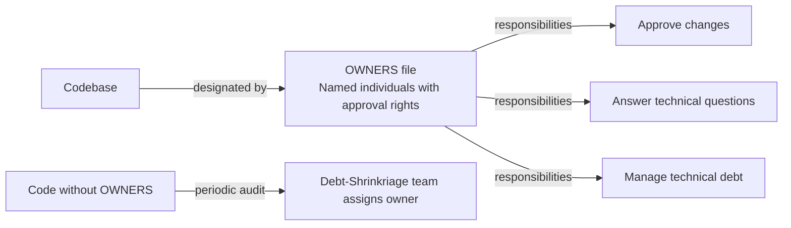
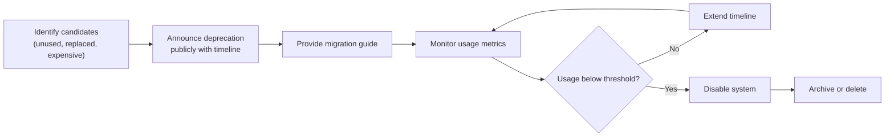

# 02 — Analysis
<!-- book-open-props frontmatter chapter="02" title="Analysis" -->

## Core Metaconcept: Software Engineering as Time-Aware Programming

The central claim of the book is that **software engineering is programming over time in the context of a team.** This framing is not rhetorical; it has direct operational consequences. A codebase is not a snapshot of what is correct today — it is a social artifact that will be read and modified by engineers who share no context with the original author. Design decisions must account for the lifespan of the code rather than the lifespan of the project that created it.

> **Implication**: Code readability is not a style preference — it is a business requirement at scale.

---

## The Three Fundamentals

### Time

| Dimension | Impact |
|---|---|
| Code longevity | Code that survives a decade imposes more than linear maintenance cost |
| Communication lag | Engineers reading old code lack the author's deleted context |
| Change accumulation | Each change compounds the except-case hazard of the system |

The **superlinear cost of maintenance** hypothesis is the book's most empirically grounded argument. Codebases are social artifacts whose complexity grows not just with code volume but with the **number of authors** who have touched them. Authorship blur — the inability to trace a decision back to its original context — is the root of maintainability failure.

### Scale

Scale in Google's context is primarily social and organizational, not infrastructural. The book identifies two forms of scale:

- **Conway's Law scale**: architectural structure mirrors communication structure
- **Coordination scale**: more contributors means more coupling-shaped edges in the authorship graph

The practical consequence: **at social scale, individual discipline is insufficient.** Process and tooling must compensate for the limits of any individual engineer's attention.

### Trade-Offs

The book identifies a pattern it calls **"overfitting to stereotypes"** — the tendency of engineers to adopt practices from iconic companies without validating fit. The authors' advice is not to be contrarian but to be systematic: understand *why* a practice works in its original context before making it your context's default.

---

## Key Frameworks and Patterns

### Design Documents (Google-style RFCs)

The design document is Google's primary consensus-building tool. Its structure encodes decision-making discipline:

```
Context → Motivation → Goals → Non-goals → Approach → Alternatives → Risks
```

The most powerful element is the **Non-goals** section. Most engineering documents describe what the system will do. Explicitly documenting what it will *not* do prevents scope creep and creates a shared contract that outlasts the discussion that created it.



### Trunk-Based Development



The book's argument against long-lived branches is epistemic, not just mechanical: long branches delay the moment of truth when your code meets the mainline, and the longer the delay, the more expensive the correction. Feature flags decouple merging from releasing, enabling the benefits of trunk-based development without exposing users to incomplete features.

### The Four Pillars of Code Review

Each pillar maps to a distinct failure mode:



### Testing Triangle



The optimization target is not "maximum coverage" but **effective defect detection per unit of test execution time.** A fast test suite you can afford to run on every commit is more valuable than a comprehensive suite you run weekly.

### Ownership Model



---

## Technical Debt Taxonomy

The book provides the most useful taxonomy in its section on debt management:

| Type | Cause | Remedy |
|---|---|---|
| **Inadvertent debt** | Written without full system context | Better documentation + knowledge transfer |
| **Deliberate debt** | Written knowing it needs rework | Planned refactoring budget |
| **Accumulated cruft** | Years of uncoordinated changes | **Shrinkriage** — periodic audit and removal |
| **Sunk cost trap** | "It works, why touch it?" | Naming it explicitly, assigning ownership |

---

## The Deprecation Lifecycle



---

## Psychological Safety and Engineering Culture

The book cites **Project Aristotle** (Google's internal team effectiveness research) to argue that psychological safety is the strongest predictor of high-performing engineering teams. Translating research into practice:

- **Blameless postmortems** create information-rich environments by eliminating the cost of truth-telling
- **Admitting mistakes publicly** as a leader models the norm you want
- **Diversity of perspective** reduces the probability of group-think in technical decisions

The culturally specific insight: Google found that the *best* predictor of team success was *how team members treated each other*, not individual skill or domain expertise.

---

## Contrarian Positions

The book takes several positions that contradict common practitioner advice:

1. **"Always run tests before commit"** → Not always. Google distinguishes between sandboxed changes (safe to run locally) and high-friction tests that should be deferred to CI.
2. **"Code review should catch bugs"** → Bug catching is a side effect. The primary value of review is correctness *communication* and maintainability signaling.
3. **"Agile means no documentation"** → Google argues documentation *is* design thinking in durable form, and skipping it at scale is technical debt.
