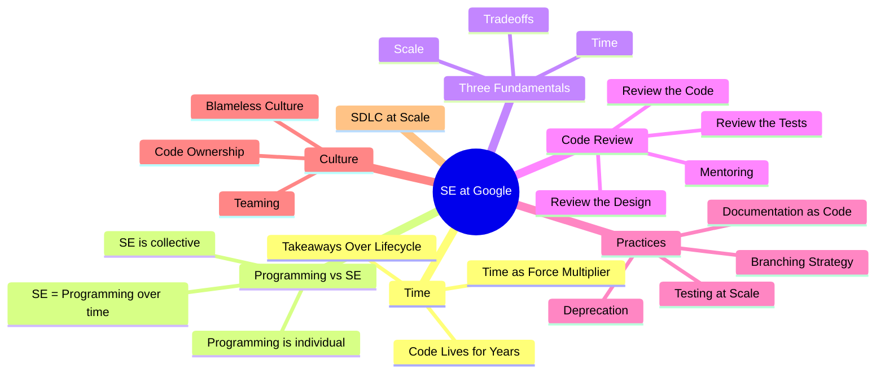

# Software Engineering at Google: Lessons Learned from Programming Over Time
<!-- book-open-props-frontmatter url="https://openlibrary.org/works/OL24937924W/Software_Engineering_at_Google" isbn="9781492082798" -->

## About This Entry

This entry covers **Software Engineering at Google** (O'Reilly, 2020) by Titus Winters, Tom Manshreck, and Hyrum Wright. It is divided into three companion documents:

- **[01-content.mdx](./01-content.md)** — Structured chapter summary
- **[02-analysis.mdx](./02-analysis.md)** — Core concepts, frameworks, and patterns
- **[03-narration.mdx](./03-narration.md)** — Cohesive prose synthesis of the book

---
{}
---

## Quick Reference

| Field | Value |
|---|---|
| Author | Titus Winters, Tom Manshreck, Hyrum Wright |
| Year | 2020 |
| Publisher | O'Reilly Media |
| ISBN | 9781492082798 |
| Pages | 506 |
| Difficulty | Intermediate |

---

## Key Concepts at a Glance

---

> Navigate to **[01-content.mdx](./01-content.md)** to begin reading.
