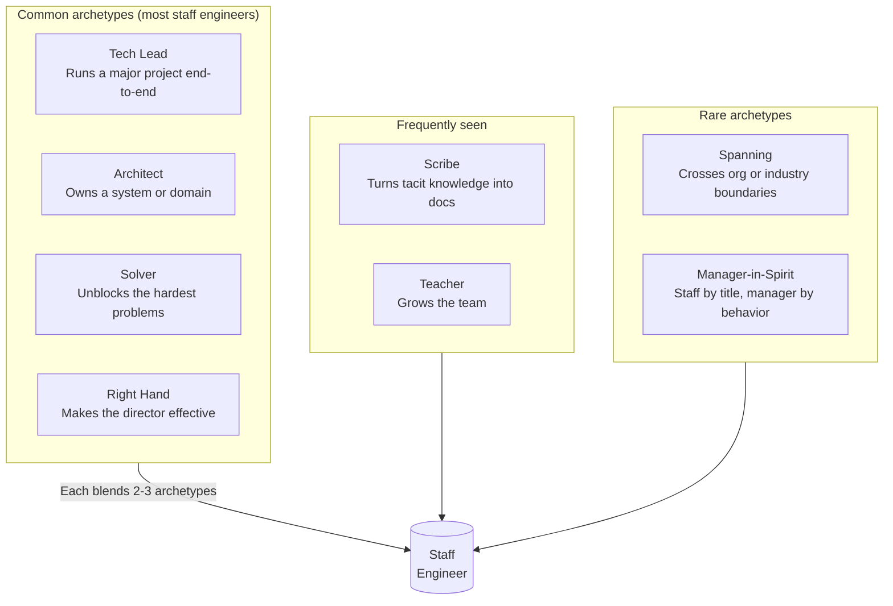
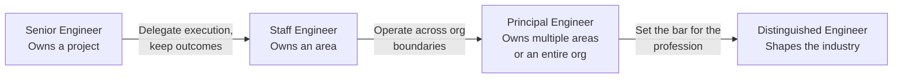

## What Is a Staff Engineer?

Larson starts with a definition, and immediately complicates it.

The simple definition: a staff engineer is a senior engineer with
broader scope and higher impact. The organization trusts them to own
a whole area, not just a project. They influence technical direction
across teams.

The complication: there is no single "staff engineer" job
description. The role is shaped by the team, the org, and the
person. Some staff engineers are deep technical individual
contributors. Some are quasi-managers. Some spend half their time
writing code and half their time in cross-org meetings.

Larson's resolution: the role is best understood as a **family of
archetypes**. A given staff engineer's job depends on which
archetypes they embody and which their team needs.

---

## The Eight Staff Archetypes

Larson's most cited contribution to the staff-plus conversation. The
archetypes are not mutually exclusive; staff engineers blend them,
but most lean heavily on two or three.

### Tech Lead

The most common archetype. The Tech Lead is the engineer who runs a
significant project — a re-architecture, a new product line, a major
migration — from proposal through delivery. They do not manage the
team, but they coordinate the work, write the design doc, and make
the day-to-day technical decisions.

**Strengths.** Clear ownership. Visible impact. The team knows who
is in charge of the project.

**Failure mode.** Confusing project management with engineering
leadership. Spending all the time in coordination meetings and none
in code.

### Architect

The Architect owns a system or domain. They make the long-term
design decisions, review the most consequential changes, and are the
escalation point for ambiguity. They are often the author of the
canonical design doc for their area.

**Strengths.** Long time horizon. Deep context. The system has a
coherent direction because one person holds the vision.

**Failure mode.** Becoming the bottleneck for every decision. Hoarding
context. Refusing to delegate design work.

### Solver

The Solver is the engineer the organization calls when everyone else
is stuck. Their work is heterogeneous: debugging a production
incident, designing a new algorithm, untangling a migration, doing
a root-cause analysis on a long-standing performance problem. They
are not attached to a project; they are attached to *hard
problems*.

**Strengths.** Outsized impact on the hardest issues. The team has
someone to escalate to. Solvers prevent issues from festering.

**Failure mode.** Becoming a single point of failure. Other engineers
learn to route every hard problem to the Solver rather than building
their own skills.

### Right Hand

The Right Hand makes their director (or VP, or CTO) more effective.
They are the trusted engineer the leader consults before major
decisions. They are in the meetings. They review the strategy. They
are often the first to know about org changes, and they are the
last to act surprised by them.

**Strengths.** The leader's leverage is multiplied. Decisions are
better-informed. The org has continuity through leadership changes.

**Failure mode.** The Right Hand's identity is too tied to the
leader's. When the leader leaves, the Right Hand can become
disconnected. They also risk becoming a shadow manager without
authority, which frustrates everyone.

### Scribe

The Scribe writes things down. Design docs, RFCs, runbooks,
onboarding guides, post-mortems, decision logs. The Scribe's output
is rarely celebrated, but it is the reason the rest of the team can
operate without re-deriving context.

**Strengths.** Knowledge survives personnel changes. The team is
faster. New hires ramp up in weeks, not months.

**Failure mode.** Writing instead of deciding. The Scribe can
procrastinate on the hard calls by documenting them. They can also
write so much that nobody reads it.

### Teacher

The Teacher grows the team. They mentor junior engineers, run
training sessions, lead code reviews, and invest in the next
generation of staff. The Teacher's leverage is the engineers they
shape.

**Strengths.** Multiplies the team's capacity. Improves retention.
Builds the org's long-term capability.

**Failure mode.** Becoming the de facto mentor for everyone,
neglecting their own work. The Teacher can also fall into the trap
of always working through others and never shipping anything
themselves.

### Spanning

The Spanning engineer crosses org or industry boundaries. They are
the engineer whose work touches multiple teams, multiple products,
or the broader engineering community. They attend industry
conferences, publish papers, contribute to open source, or sit on
cross-company standards bodies.

**Strengths.** Brings outside context in. Builds the company's
reputation. Identifies opportunities nobody inside the org would
see.

**Failure mode.** Spending more time outside the company than
inside. The Spanning engineer can be perceived as not pulling
their weight by teams who do not see their work.

### Manager-in-Spirit

The rarest and most controversial archetype. The Manager-in-Spirit
is a staff engineer by title who does most of what a manager does:
they run one-on-ones, they give performance feedback, they hire,
they set team direction. They are a manager in everything but the
org chart.

**Why they exist.** Some companies do not have enough management
bandwidth. Some engineers are too valuable to promote to management.
Some teams have a manager who is spread too thin.

**Why it is controversial.** It is the archetype most likely to
create organizational dysfunction. The Manager-in-Spirit may be
giving feedback that the actual manager does not know about. They
may be making decisions the manager believes they own. And their
career path is unclear: the next step is usually "actual manager"
or "staff forever," neither of which is satisfying.

---

## The Career Arc: Senior to Staff to Principal to Distinguished

### Senior to Staff

The hardest transition. The work changes from "own the project" to
"own the area." A senior engineer is usually the technical lead of
one project at a time. A staff engineer is responsible for the
health of an entire area, which may contain many concurrent
projects.

The trap: trying to be the technical lead of every project in your
area. The senior-to-staff engineer who has not internalized the
delegation lesson will end up burning out and bottlenecking the
team.

The success pattern: a staff engineer at this level is the person
their peers go to when they are stuck, the person the director
trusts to make calls in ambiguous situations, and the person who
unblocks the team without taking over.

### Staff to Principal

The next transition is about **operating without control**. A staff
engineer usually has a clear domain. A principal engineer's domain
is *wider than their org*. They set direction in areas where they
have no direct authority, only influence.

This is the transition where the soft skills matter most. The
principal engineer who can navigate cross-org politics, build
consensus, and persuade engineers across multiple teams is the one
who thrives. The one who tries to dictate direction from above
fails.

### Principal to Distinguished

The final transition is the rarest and the most ambiguous. A
distinguished engineer is someone whose work shapes the industry.
They publish, they speak, they sit on advisory boards, they
influence standards. The number of distinguished engineers at a
typical company is in the single digits.

Larson is honest that he has not personally made this transition
(he was principal at the time of the book, though he has since
moved on to VC). The chapter is the weakest in the book, but it is
also the one that few engineers ever need to read in detail.

---

## Influence Without Authority

The central craft of the staff engineer. Most staff engineers have
no direct reports. Their power comes from influence, not authority.
Influence is built three ways:

### 1. Trust

A staff engineer is trusted when their judgment is repeatedly
correct, when they admit what they do not know, and when they
follow through. Trust is slow to build and fast to destroy. A
single public mistake handled badly can wipe out a year of trust.

### 2. Reduction of Decision Surface Area

The most leveraged staff engineers are the ones who make decisions
that *unblock* other decisions. Writing a clear design doc. Building
a shared library. Defining a coding standard. Each of these
removes a decision someone else would have had to make.

### 3. Calibrated Communication

A staff engineer knows when to write a doc, when to have a meeting,
when to send a Slack message, and when to do nothing. Each mode has
a different cost and a different audience. Most staff engineers
over-use meetings. The good ones are ruthless about async-by-default.

---

## Engineering Ladders

A practical chapter. Ladders are how organizations describe career
growth. They are intentionally vague. Larson reads them in three
layers:

1.  **The outcomes.** What is this person expected to own? A staff
    engineer owns an area. A principal engineer owns multiple
    areas. Read the ladder for the *what*.
2.  **The signals.** How does the organization know if you are
    meeting the outcomes? Code shipped. People grown. Incidents
    handled. Decisions influenced.
3.  **The behaviors.** What specific actions demonstrate the
    signals? Writing design docs. Mentoring. Running review
    meetings. These are *examples*, not requirements.

The most common mistake engineers make with ladders is reading them
as checklists of behaviors. "The ladder says a staff engineer runs
architecture reviews, so I will start running architecture reviews."
But the behavior is in service of the signal (raising the quality
bar), which is in service of the outcome (owning the area). If the
behavior does not produce the signal, the engineer is just going
through motions.

---

## Promotion

Larson's chapter on promotion is one of the most practically useful
in the book. The core advice:

- **Promotion is a marketing exercise.** You have to make your work
  legible to people who are not in your daily standups. Design docs,
  project memos, and visible launches are the inputs. Calibration
  meetings and promotion packets are the outputs.
- **Find a sponsor, not just a mentor.** A mentor gives advice. A
  sponsor actively advocates for you in rooms you are not in. Most
  engineers confuse the two and end up with advice but no
  advocacy.
- **The promotion packet is not the work.** Engineers often delay
  promotion prep because they are heads-down on projects. The
  reality is that the project work and the promotion packet are
  parallel tracks. Both need attention.
- **Calibration is a politics game.** Calibration meetings decide
  who gets promoted. The people in those meetings — your manager's
  peers, the skip-level director — need to know your work. The
  staff engineer who is invisible to the calibration committee does
  not get promoted.

---

## Interviews: Lessons from Stripe, Google, Twitch, Cloudflare, Vercel

The book is woven with interviews from staff and principal engineers
at major tech companies. A few recurring lessons:

- **On the staff-to-principal transition:** the engineers who made
  it best are the ones who explicitly stopped trying to be the
  technical lead on every project in their area. They learned to
  influence without controlling.
- **On writing:** every staff engineer interviewed said writing was
  the single highest-leverage activity in their job. Most also said
  they had to learn this the hard way.
- **On failure modes:** the most common failure was the staff
  engineer who became the bottleneck. The second most common was
  the staff engineer who could not say "I was wrong" in public.
- **On ladders:** every company has a different ladder. The
  archetypes are universal; the ladder language is not.
