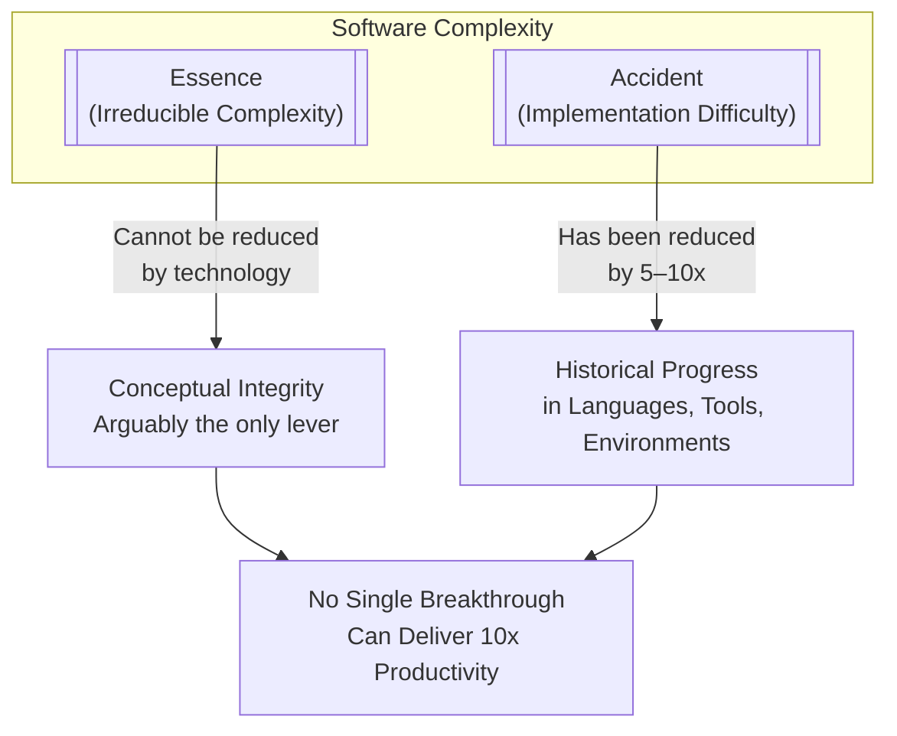
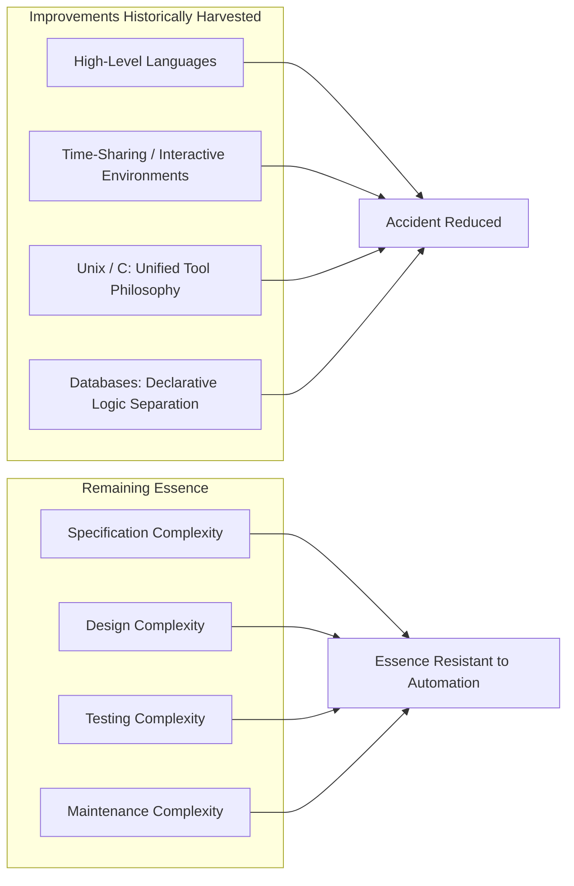
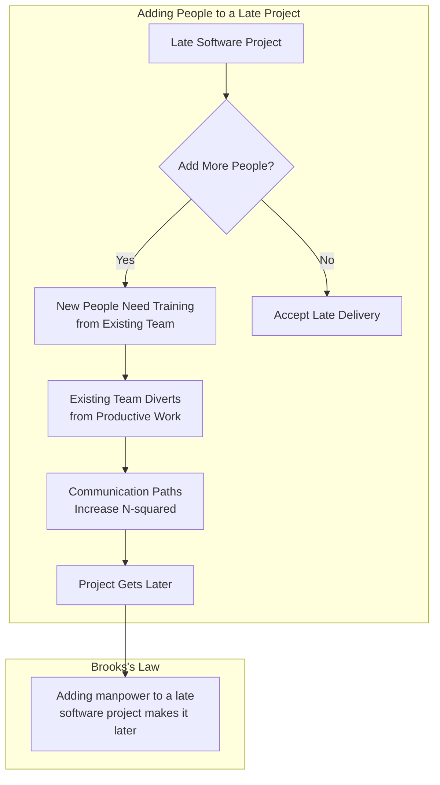
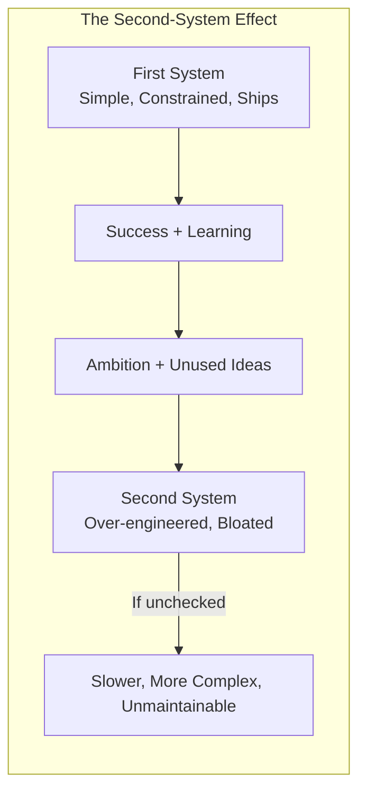
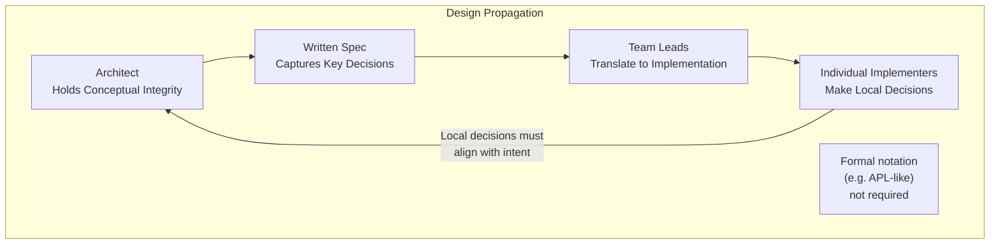
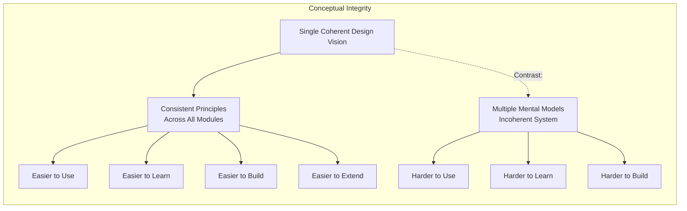

## No Silver Bullet — Essence and Accident



Brooks divides all software difficulty into two categories. **Essence** is the
difficulty inherent in specifying a complex, logical, abstract structure — the
problems of what to build. **Accident** is the difficulty of expressing that
specification in a programming language — the problems of how to build it.

The argument is historical. Over the previous two decades, programming had been
transformed by high-level languages, time-sharing, and interactive environments.
These eliminated enormous amounts of accidental difficulty. Brooks's thesis is
that the easy, accidental improvements have already been harvested. What remains
is essence — and essence resists automation.

The consequence: no technology breakthrough on the horizon — not object-oriented
programming, not artificial intelligence, not casual development — can be a
*silver bullet* that eliminates the essential complexity of software construction.
Each new tool helps, but none transforms the equation by an order of magnitude.



---

## Brooks's Law and the Mythical Man-Month

The titular essay explains why the metaphor of "man-month" as a unit of
measurement is flawed. A man-month is divisible only when a task is **fully
partitionable** — meaning every subtask can be assigned independently with no
communication overhead between workers. Most software tasks are not like this.

When a software project falls behind schedule, the instinct is to add more
people. Brooks's Law states that this makes the project later, for two reasons:

1. **Ramp-up time** — new people must be trained by existing team members,
   consuming productive time before they contribute net value.
2. **Communication overhead** — each new person adds communication paths
   proportional to N-squared with existing team members.



The man-month is a dangerous fiction because it treats software work as if it
were harvestable like wheat — more hands, more bushels. In reality, software
construction is a thinking activity with high coordination costs. The essay
uses the analogy of nine women cannot produce a baby in one month: some tasks
are inherently sequential.

---

## The Surgical Team

To address the problem of how to scale *creative* work (not manufacturing),
Brooks proposes the **surgical team** model from medicine. In surgery, one
person — the surgeon — does the critical work. Everyone else on the team
supports that person: preparing tools, handling routine tasks, managing
logistics. The team is structured around enhancing the productivity of the
best person, not dividing the work equally.

Applied to software, this means identifying the best designers and building
teams whose purpose is to amplify their effectiveness, not dilute it.

```mermaid
flowchart TB
  subgraph "Surgical Team (Software)"
    direction TB
    SURGEON[Surgeon (Chief Designer)]
    CODPATH[Co-Pilot (Design Partner)]
    ADMIN[Administrator (Manages Resources)]
    EDITOR[Editor (Manages Documentation)]
    PRODUCER[Production Team (Builds Artifacts)]
    TOOLSMITH[Toolsmith (Builds Supporting Tools)]
    Tester[Tester (Finds Defects)]
    LANGUAGE[Language Lawyer (Expert in Language)]
  end

  SURGEON --> CODPATH
  CODPATH --> SURGEON
  ADMIN --> SURGEON
  EDITOR --> SURGEON
  PRODUCER --> SURGEON
  TOOLSMITH --> SURGEON
  Tester --> SURGEON
  LANGUAGE --> SURGEON

  style SURGEON fill:#e1f5fe,stroke:#01579b,stroke-width:2px
```

The key insight: **ten equally skilled developers produce less output than a
team built around one excellent developer plus nine supporters**. This is
uncomfortable for engineers raised on egalitarian team norms, but the evidence
from software projects is clear: super-productivity is not linear and not
distributed evenly.

---

## The Second-System Effect

Brooks observes a recurring pattern: the first system an architect builds is
constrained by practical necessity — it must ship, so it stays simple. The
second system, built with the confidence of success and the luxury of time,
tends to be over-engineered. The architect packs in every idea that was
suppressed in the first system.

The result is bloated, complex, and slower than the original. The cure is
conscious awareness of the tendency and active restraint.



Practical examples of the second-system effect:
- OS/360's second release was significantly slower and more complex
- Many version 2.0 products add features that confuse rather than help
- Refactoring without discipline can produce the same over-engineering
- Microservices "version two" architectures often add complexity without value

---

## Passing the Word and The Whole and the Parts

These essays deal with how large systems are designed and communicated.

**"Passing the Word"** addresses how technical decisions propagate through an
organization. Brooks describes the challenges of maintaining a coherent design
when the architect is not present at every implementation decision. The essay
advocates for writing down the core concepts explicitly and ensuring that
implementers understand the *why*, not just the *what*.



**"The Whole and the Parts"** extends the argument. Brooks uses the OS/360
experience to argue that **system design must be integrated**. The architecture
must be thought through as a complete system before individual modules are
designed. Incremental, bottom-up design without an overarching vision produces
systems that work but lack coherence. The conceptual integrity of the whole
matters more than the perfection of any individual part.

---

## Conceptual Integrity

The most important concept running through all of Brooks's essays is
**conceptual integrity** — the idea that a system should reflect a single,
coherent vision. A system with conceptual integrity is easier to use, easier to
learn, easier to build, and easier to extend.

Conceptual integrity does not mean simplicity. It means that all design
decisions flow from a consistent set of principles. When different parts of
a system were designed by different people with different mental models, the
result is incoherent — it might work, but it does not feel designed.



The conceptual integrity argument is Brooks's deepest contribution. It reframes
software architecture from a problem of partitioning work to a problem of
maintaining a single mind across a large project. The solution is not better
process — it is better communication, a single chief architect with taste,
and a culture that values coherence over local optimization.
