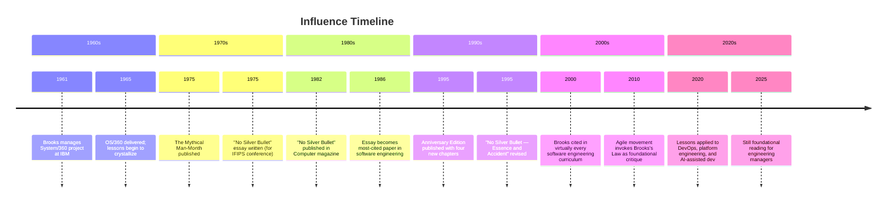

import { getBook } from '../../_data/books'

export const book = getBook('the-mythical-man-month-fred-brooks')!

export const sections = [
  {
    id: 'about',
    title: 'About This Book',
    items: [
      { href: '#at-a-glance', label: 'At a Glance' },
      { href: '#the-author', label: 'Fred Brooks' },
      { href: '#legacy', label: 'Legacy & Impact' },
    ],
  },
  {
    id: 'key-essays',
    title: 'Key Essays',
    items: [
      { href: '#no-silver-bullet', label: 'No Silver Bullet' },
      { href: '#mythical-man-month', label: "Brooks's Law" },
      { href: '#surgical-team', label: 'The Surgical Team' },
      { href: '#conceptual-integrity', label: 'Conceptual Integrity' },
    ],
  },
  {
    id: 'resources',
    title: 'Resources',
    items: [
      { href: '#further-reading', label: 'Further Reading' },
    ],
  },
]

import BookLayout from '../../components/BookLayout.astro'
import ContentOverview from './01-content.mdx'
import Analysis from './02-analysis.mdx'

<BookLayout
  book={book}
  sections={sections}
  coverSrc={book.coverImage}
  coverAlt={`Cover of ${book.title}`}
>

---
{}
------ | ----- |
| **Author** | Frederick P. Brooks Jr. |
| **Published** | 1975 (original); 1995 (Anniversary Edition) |
| **Publisher** | Addison-Wesley |
| **Pages** | 336 |
| **ISBN** | 9780201835953 |
| **Language** | English |
| **Subject** | Software Engineering & Project Management |

## The Author

**Frederick P. Brooks Jr.** (born 1931) is a computer architect and software
engineer who shaped the foundations of modern computing. He earned his PhD from
Harvard under Howard Aiken, working on the Harvard Mark III and Mark IV
computers.

At IBM, Brooks was the manager of the System/360 computer family project and
then the OS/360 operating system project — the largest software project of its
era. He later founded and chaired the Department of Computer Science at the
University of North Carolina at Chapel Hill.

Brooks received the **Turing Award in 1999** for his contributions to computer
architecture and software engineering. His acceptance speech revisited the themes
of the book, noting that many of its lessons remain unlearned decades later.

Key biographical points:
- Managed the IBM System/360 hardware and OS/360 software projects (1961–1965)
- Founded UNC Chapel Hill Computer Science department (1964)
- Architect of the IBM Stretch (7030) and Harvest computers
- Turing Award recipient (1999)
- National Medal of Technology recipient (1985)

## Legacy & Impact

The Mythical Man-Month introduced the idea that **software engineering is
fundamentally different from other kinds of engineering** — not because of
technical complexity alone, but because of the combinatorial nature of software
systems and the irreplaceability of key contributors.

The book established vocabulary that is now universal: Brooks's Law, the
mythical man-month itself, the second-system effect, the surgical team, winning
an argument by showing working code rather than debate. These are not just
historical curiosities — they are still diagnosed daily in software organizations.

The "No Silver Bullet" essay argued that **essence** (the irreducible complexity
of software) cannot be reduced by technology, while **accident** (implementation
difficulties) can. This distinction shaped how the industry thought about
productivity for decades. The essay's pessimism — that there is no single
breakthrough that will produce an order-of-magnitude improvement in software
productivity — remains debated but largely validated.

---

## Key Essays

<ContentOverview />

## Further Reading

- *Peopleware* — Tom DeMarco and Timothy Lister
- *The Pragmatic Programmer* — Hunt and Thomas
- *Accelerate* — Nicole Forsgren, Jez Humble, Gene Kim
- *Drive* — Daniel Pink
- *Team Topologies* — Matthew Skelton and Manuel Pais
- [Brooks's Law — Wikipedia](https://en.wikipedia.org/wiki/Brooks%27s_law)
- ["No Silver Bullet" — original 1986 paper](https://www.cs.virginia.edu/~evans/cs655/readings/silverbullet.pdf)

<Analysis />

</BookLayout>
