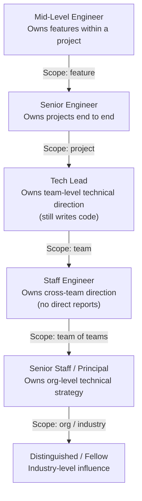
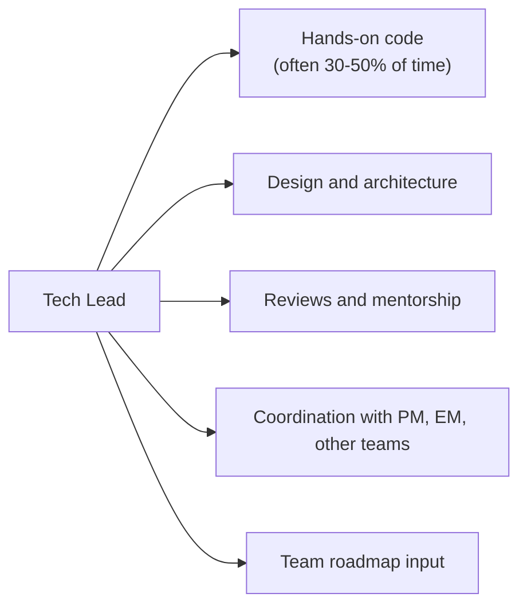
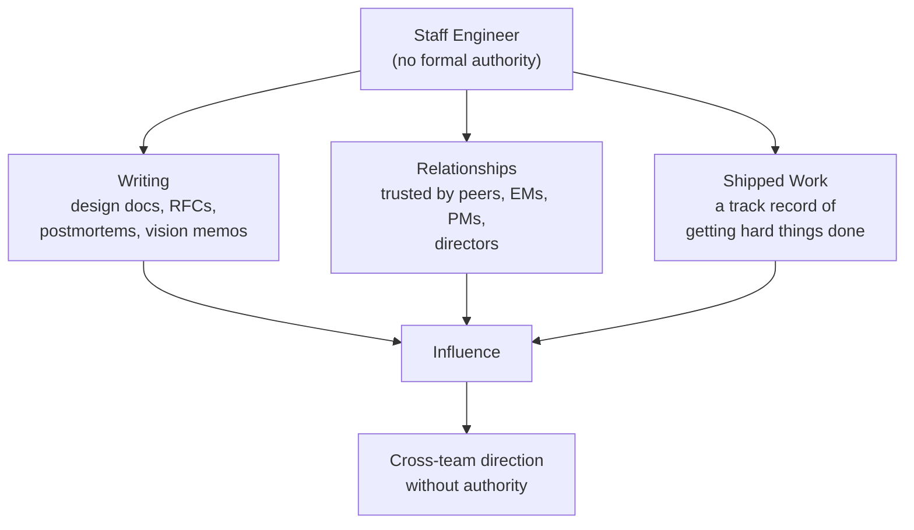
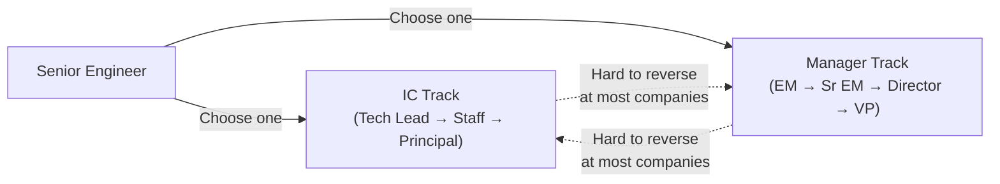

## The Ladder as a Ladder of Scope

Orosz's organizing idea: every level on the engineering ladder is
defined by **scope of impact**, not by skill or seniority in the
abstract. The line of code you can write is a constant. What changes
is the radius of the system you can move.

The arrows are not promotions. They are expansions. Each level asks:
what is the largest system whose behavior you can change?

| Level | Scope | Output looks like |
|---|---|---|
| Mid | Feature | Shipped features within a defined project |
| Senior | Project | Shipped projects you defined and drove |
| Tech Lead | Team | A team's roadmap, quality bar, on-call health |
| Staff | Team of teams | Cross-team initiatives, shared infrastructure |
| Senior Staff | Org | Org-wide technical strategy, multi-quarter bets |
| Principal / Distinguished | Industry | Standards, papers, external influence |

This is the same shape at every company, but the *names* differ. A
"senior engineer" at a 50-person startup is roughly a tech lead at
Google. A "staff engineer" at a startup is often a director of
engineering at a larger company. Orosz spends significant time
decomposing these equivalences.

---

## Senior Engineer: Ownership

The senior engineer is where most engineers stall and where the
ladder begins to feel like a ladder. Orosz's definition is precise:
a senior engineer **owns projects**. Not tasks. Not stories.
*Projects*.

Ownership means four things in practice:

1. **Defining done.** The senior engineer does not wait for a
   specification. They figure out what success looks like, write it
   down, and align the team around it.
2. **Driving unblocking.** When the project is stuck on another team,
   a dependency, a tooling issue, the senior engineer fixes it. They
   do not write a ticket and wait.
3. **Holding the quality bar.** The senior engineer is the one who
   pushes back on shortcuts that would compound. They ship, but they
   do not ship debt.
4. **Communicating.** Stakeholders know what's happening. Risks are
   flagged early. The senior engineer's project is never a surprise.

The trap at this level: confusing activity with ownership. A senior
engineer who closes many tickets is not necessarily owning projects.
A senior engineer who closes fewer tickets but makes the whole team
faster is.

---

## Tech Lead: The Hybrid Role

The tech lead role is the most variable across companies, which is
why Orosz gives it its own careful treatment. In broad strokes, a
tech lead is a senior engineer who also coordinates a small team's
technical direction. They still write code — often a lot of it — but
they are also the person who decides what the team should build,
holds the architectural bar, and unblocks the team.

The tech lead role is **not** the first step to engineering management.
At many companies, it is a parallel path that goes as high as
principal engineer. At others it is a temporary role on the way to
staff. Orosz is explicit: ask, at your company, what tech lead means.
Do not assume.

Three flavors of tech lead, distinguished by Orosz:

- **The coding tech lead.** Spends most of their time writing code,
    coordinates through informal conversation and code review. Common
    at startups.
- **The architect tech lead.** Spends more time on design, less on
    code. Sets the technical direction; delegates implementation.
    Common at scale-ups.
- **The coordinating tech lead.** Spends significant time in meetings,
    aligning stakeholders, removing dependencies. Still writes some
    code. Common in big tech.

These are different jobs. Liking one and ending up in another is a
common source of misery.

---

## Staff Engineer: Influence Without Authority

The staff engineer is, for Orosz, the role that most clearly tests
whether an engineer has leveled up. The reason: a staff engineer
usually has no direct reports, no formal authority, and no
administrative power. What they have is **influence**, which they
exercise through three mechanisms:

A staff engineer's job is to set technical direction across multiple
teams. They do this by:

- **Writing things down.** A staff engineer who cannot write a design
  doc that gets five teams to align cannot do the job.
- **Picking the right battles.** A staff engineer who tries to set
  direction on everything is a bottleneck. The skill is in
  *choosing* what to influence.
- **Building relationships before needing them.** A staff engineer
  who shows up asking for help on a project they've never
  contributed to will fail. A staff engineer who has been helpful on
  ten previous projects will succeed.
- **Being right, often.** Influence is a function of trust. Trust is
  a function of being right. Staff engineers are not always right —
  but they are right often enough that people follow.

Orosz's most quoted observation: a staff engineer is essentially a
**tech lead of multiple teams**, with the key difference that they
have to earn the right to lead rather than being assigned it.

### The Staff-Plus Levels

Above staff, Orosz treats the levels as variations on the same role
with wider scope:

- **Senior staff engineer.** Sets direction across an org, not just
  teams. Often owns the org's technical strategy.
- **Principal engineer.** Org-level or company-level. Influences
  company strategy, often paired with directors and VPs.
- **Distinguished engineer / Fellow.** Industry-level. Influences
  outside the company. Rare — often 1-3 in a company of thousands.

The progression is the same shape as below: wider scope, less code,
more writing, more external influence.

---

## The Manager Versus IC Fork

The single most consequential career decision Orosz covers is the
choice between staying on the IC track and moving into management.
The reason it is consequential: at most large companies, it is a
**one-way door**. Once you are a manager for two years, going back
to IC is treated as a demotion. Compensation drops. Respect drops.
You are not the only one who notices.

Orosz's framework for the decision:

| You like... | Consider... |
|---|---|
| Solving technical problems end to end | IC |
| Coaching, hiring, and team health | Manager |
| Hands-on coding as your primary work | IC |
| Setting team direction through people | Manager |
| Writing design docs and influencing peers | IC (staff) |
| Running 1:1s and performance reviews | Manager |

The trap: **drifting into management** because the IC step looked
hard. Orosz warns against this repeatedly. The IC track to staff is
genuinely harder than the management track in many companies, but the
choice should be made on what you want to do, not on which path looks
shorter.

---

## Big Tech, Scale-Up, Startup: Different Games

The same level means different things in different environments.
Orosz devotes significant attention to this, because most engineers
change environments at least once in their career, and the unspoken
rules are not portable.

| Behavior | Big tech | Scale-up | Early startup |
|---|---|---|---|
| Cross-team impact | Required at staff | Required at senior | Optional, often impossible |
| Process / rigor | Valued, can be excessive | Valued in moderation | Distrusted unless it unblocks |
| Specialization | Expected, rewarded | Helpful | Liability |
| Generalism | Risky for promotion | Useful | Required |
| Visible artifacts (docs) | Required | Helpful | Often skipped |
| Speed of decision | Slow, deliberate | Medium | Hours, not weeks |
| Failure cost | Reputation | Material | Existential |

The implication: an engineer who thrives at Google may stall at a
50-person startup, and vice versa. Orosz treats this as a feature of
the industry, not a personal failing.

### Promotion Is a Different Game in Each

At big tech, promotions are determined by **calibration committees**,
where managers argue for their reports against an objective rubric.
Self-promotion, design docs, and cross-team visibility are how you
get promoted.

At startups, promotions happen when **the company needs you in a
bigger role**. There is no committee. The CEO decides. The signal is
the scope you are already operating at, not the artifacts you have
produced.

A startup engineer who has spent two years writing design docs and
asking for cross-team sponsorship has been doing the wrong game.

---

## Performance Reviews and Promotion Packets

Orosz treats the performance review as a **packaging problem**, not
a work-quality problem. The work is necessary. It is not sufficient.
The work has to be **seen**, **described**, and **defended** by
people who are not you.

### The Promotion Packet

A typical staff-engineer promotion packet at a big tech company
includes:

- **A self-assessment.** What you did, with metrics, scoped to the
  level above your current one.
- **A list of projects.** Each with scope, outcome, your role,
  cross-team impact, and links to artifacts (design docs,
  postmortems, launch metrics).
- **Evidence from others.** Peer reviews, manager reviews, letters
  from stakeholders, customer feedback.
- **A narrative.** The single most important piece. The packet
  tells a story of expanding scope over a year or more.

The narrative is what people remember. The metrics are what they
check. Both are required.

### Traps

- **Working on invisible things.** A critical infrastructure
  improvement that nobody notices does not get you promoted.
  The work is real. The career impact is zero.
- **Owning everything.** The engineer who has done a bit of
  everything is hard to promote. The engineer who has done one thing
  at increasing scope is easy.
- **Skipping the self-assessment.** The packet that reads like a
  list of tasks reads like a senior engineer's packet. The packet
  that argues for the next level reads like one.

---

## Writing as the Staff-Engineer Multiplier

Orosz makes a strong case that **writing is the single highest-
leverage skill for staff-and-beyond engineers**. The reason is
mechanical: a staff engineer is responsible for aligning multiple
teams, and the only scalable way to align multiple teams is through
text.

| Artifact | Purpose |
|---|---|
| Design doc | Align on a technical approach before building |
| RFC | Get cross-team input on a shared change |
| Postmortem | Extract and share lessons from incidents |
| Vision memo | Set multi-quarter direction for an area |
| Decision record | Capture the *why* behind a hard choice |
| Launch review | Document what shipped, what worked, what didn't |

The staff engineer who writes well multiplies their impact. The staff
engineer who relies on meetings does not. Meetings do not scale
across teams and time zones. Documents do.

---

## Salary Negotiation and Compensation

Orosz covers compensation last, deliberately. The reason: **you
negotiate from a position of strength only if you understand the
structure of the offer first**. Going in cold costs real money — at
staff level at a US big tech company, the difference between a
well-negotiated and a poorly-negotiated offer can be a year's salary
over four years of vesting.

### The Components

| Component | Big tech | Startup |
|---|---|---|
| Base | Set by band, less negotiable | More negotiable |
| Equity | RSUs, vests over 4 years | Options, vests over 4 years |
| Bonus | Annual, % of base | Variable, often tied to performance |
| Signing | One-time, used to close gaps | Common, especially for senior hires |
| Level | Drives base band, equity grant | Sets the whole package |

### The Levers

At big tech, the level is the dominant lever. Dropping a level costs
hundreds of thousands of dollars. Everything else is incremental.

At startups, the levers are base, equity percentage, vesting, and
signing. The headline number on the offer is the least important
piece; the equity grant and the strike price are the most important.

### The Preparation

Orosz's checklist, paraphrased:

- Know the market band for the level, in your geography.
- Know the company's recent comp changes and how they compare.
- Have a competing offer if possible, but understand the rules for
  using it.
- Decide in advance what you will and will not accept.
- Negotiate in writing. Phone calls are not records.

---

## A Word on What the Book Does Not Cover

In the spirit of accuracy: Orosz is focused on the **software
engineering** career, at companies with formal ladders, primarily in
the US and Western Europe. The book says less about:

- Engineering careers at non-software companies (banks, governments,
  defense).
- Engineering careers in regions without mature ladder systems.
- Non-engineering technical roles (data science, ML, design).

These are real and important careers. The book is not about them.
