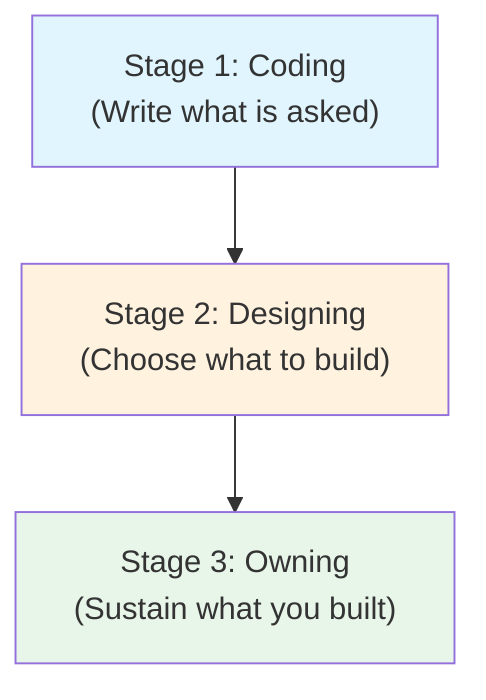
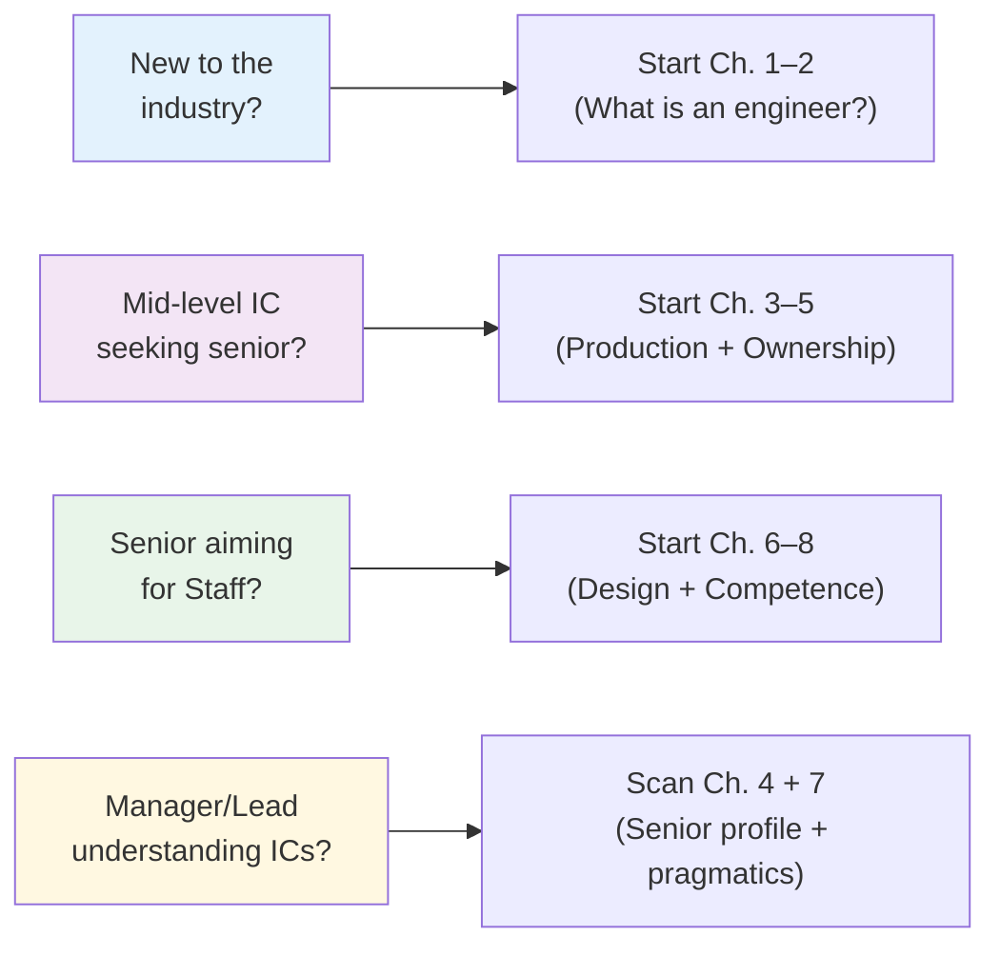

## Full-Chapter Content Notes

> Structured reference for the deep-reading study path. No fluff — outlines, quotes, and hook facts only.

---

## Volume I (2021) — The IC2 Foundation

### 1. What Is a Software Engineer, Anyway?

**Opening premise:** Job titles in tech are inconsistent across companies. The only thing that unifies the role is *impact*, not output.

> "A fresh grad who shipped a feature used by 1M users did more engineering work than a principal engineer who shipped nothing for a quarter."

| Level | Decision scope | Risk | Output measure |
|--------|----------------|------|----------------|
| E1/E2 (new grad) | Assigned tasks | Low | Tickets closed |
| E3 (mid) | Assigned features | Medium | Features shipped |
| E4 (senior) | Projects, ambiguity | High | Outcomes delivered |
| E5/E6 (staff+) | Multi-team area | Very high | Org-level change |

**Key concept introduced:** Engineering is the translation of ambiguous business goals into *definable, bounded technical systems*.

---

### 2. The Shift: From Coder to Engineer

**The coder mindset:** Given requirements → write code → ship it → move on.

**The engineer mindset:** Given goals → define bounded problems → model systems → design solutions → ship → operate → iterate.

**Nasser's three stages of mature engineering:**



The third stage is where most engineers stall. Ownership requires *operational discipline* — monitoring, on-call, incident response, and the humility to revisit past decisions.

---

### 3. Writing Production-Ready Code

**"It works" is not shipping.** Production readiness checklist Nasser uses:

- Error handling is explicit, not assumed
- Input validation lives at boundaries, not scattered
- Observability is built in, not bolted on later
- Configuration is externalised
- Dependencies are audited
- Backward compatibility is considered

**On abstraction:**

> "Premature abstraction is the root of all evil. Build twice, generalise once — and document why."

Nasser distinguishes between *necessary* abstraction (repeated pattern across three or more callers) and *aesthetic* abstraction (feels cleaner but adds indirection without removing duplication).

---

## Volume II & III (2023) — The Senior/Staff Playbook

### 4. What Does "Senior Engineer" Actually Mean?

This section is the most misunderstood part of the book, and the most widely quoted.

> "Senior is not about years of experience or title. It's about the _scope of trust_ an organisation places in you."

**The Senior Engineer Venn Diagram:**

```mermaid
venn chart
    circle A["Technical<br/>Mastery"]
    circle B["System<br/>Thinking"]
    circle C["Communication<br/>& Influence"]
    fill A #2196F3, opacity=0.4
    fill B #4CAF50, opacity=0.4
    fill C #FF9800, opacity=0.4
    fill overlap 0.2
    label "Senior Engineer Zone"
```

The sweet spot is the overlap. Pure technical depth without communication = IC. Pure communication without craft = manager. Senior engineering lives in all three.

---

### 5. The Concept of Ownership

Nasser builds ownership as a structured model, not a vague expectation.

**Ownership levels (expanded):**

| Level | Scope | Duration | Accountability |
|-------|-------|----------|----------------|
| Feature ownership | One bounded initiative | Sprint to quarter | "I shipped it" |
| System ownership | A service or domain | Year+ | "I know how it behaves" |
| Area ownership | Multi-system domain | Indefinite | "I set the direction" |
| Org ownership | Company-wide concern | Career | "I shaped the decision" |

**The anti-pattern:** Most engineers stop at feature ownership and wonder why they aren't progressing. The jump to system ownership is where the promotion conversation changes.

**Ownership ritual checklist:**

- You can explain *why* your system looks the way it does, not just *what* it does
- You wrote the runbook before the incident, not after
- You read the on-call reports from the previous rotation
- You know who your system's downstream dependants are
- You said "I don't know" in a meeting — and followed up

---

### 6. System Design Perspectives

**The platform engineer's lens:** Every system design decision is a bet. Your job is to state the bet clearly before the code is written.

**Design document structure Nasser advocates:**

```
1. Problem statement (1–2 paragraphs, non-technical)
2. Constraints (hard → soft ordering)
3. Existing approach (what would keep working)
4. Proposed approach (with diagram)
5. Trade-offs (explicitly listed, not hidden)
6. Rollout plan (canary, kill switch, rollback)
7. Observability plan (what happens if it goes wrong — not if)
```

**On choosing technology:**

> "Technology selection is never neutral. Choosing a database is choosing a failure mode. Choose the failure mode you know how to diagnose."

---

### 7. The Pragmatic Side of Engineering

This chapter covers the non-coding activities that determine how effective your code actually is.

**Meetings:** Nasser's rules for engineers:
- If you can resolve it asynchronously, don't schedule a meeting
- Always send a document before the meeting, not after
- If there is no agenda, you don't need to be there
- The goal of the meeting is to make a decision, not to share information

**Design Documents:** The document is for your future self. Write it as though you will have to operate the system alone at 2 AM. This discipline compounds.

**Incident Response:** Nasser treats incident response as a design problem, not a people problem. The postmortem format he uses:

1. **Timeline** (factual, no interpretation)
2. **Blast radius** (what broke, what didn't)
3. **Root cause** (not the trigger — the systemic condition that made the trigger sufficient)
4. **Remediation** (short-term fix + long-term systemic fix)
5. **Action items** (owner + due date for each)

**On non-technical skills:**

> "Technical skills get you the interview. Non-technical skills get you the promotion. And the team that trusts you is the only leverage you will ever have."

---

### 8. Building Competence at All Levels

Nasser provides per-level expectations across four dimensions:

| Dimension | E4 Senior | E5 Staff | E6+ Principal |
|-----------|-----------|----------|---------------|
| Scope | One team | Cross-team | Org-wide |
| Projects | Define | Drive | Set direction |
| Quality | Own your work | Own team's work | Own org's standards |
| Mentoring | Occasionally | Systematically | Culturally embedded |

**The meta-skill that separates E5 from E6:** The ability to resolve ambiguity *across teams*, not just within your own. Staff engineers operate in spaces where teams disagree on goals. Principals operate in spaces where goals themselves are unclear.

---

### 9. Key Quotes for Reference

> "The best engineers I've worked with share one trait: they are willing to be wrong in public."

> "Production is the only test suite that matters."

> "Ownership without authority is the hardest thing you will ever learn. Do it anyway."

> "A design doc that says 'we chose X because it's popular' has failed at the first step."

> "You are not a senior engineer because you know more. You are a senior engineer because people trust you to decide."

---

## Navigation Map by Learner Type


