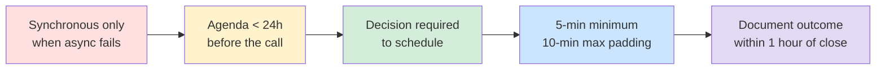

## Big Ideas, Frameworks, Systems & First Principles

> Medium-to-long form analysis for thinkers and builders. Deep dives, not summaries.

---

## I. The Ownership Pyramid — The Book's Core Frame

Ownership is Nasser's most original contribution to the literature. Unlike vague corporate guidance ("take initiative"), it is a provable, incremental model of growth.

```
              ┌───────────────────────────────┐
              │  Level 4: Org Ownership        │
              │  (Shape company-level decisions)│
              ├───────────────────────────────┤
              │  Level 3: Area Ownership       │
              │  (Set multi-system direction)  │
              ├───────────────────────────────┤
              │  Level 2: System Ownership     │
              │  (Deep, sustained accountability)│
              ├───────────────────────────────┤
              │  Level 1: Feature Ownership    │
              │  (Ship bounded initiatives)    │
              └───────────────────────────────┘
```

**Why it matters:** Most engineers interpret "take ownership" as "work harder." Nasser reframes it as "expand your radius of trust." The goal is not effort; the goal is accountability that earns strategic scope.

**The jump that stuns most people:** Moving from Level 1 (feature) to Level 2 (system) requires *letting go of direct control*. You must write the runbooks, train others, and design the system so it operates without you in the loop. That is the work of senior engineering — and it is invisible until you do it wrong.

---

## II. The Decision-Centric Model of Engineering

Nasser's first-principles framing of the profession: **engineering is the discipline of making good decisions under uncertainty**.

```
Goal (ambiguous)
    │
    ▼
Problem definition (make it bounded)
    │
    ▼
Design space (enumerate valid approaches)
    │
    ▼
Decision (choose + document why)
    │
    ▼
Implementation (execute)
    │
    ▼
Observation (did it achieve the goal?)
    │
    ▼ (loop)
Refine or Reverse
```

**The insight that distinguishes practitioners:** Junior engineers optimise for "did I ship it?" Senior engineers optimise for "did it achieve the goal?" and "did I make a decision I can defend in a postmortem?"

This is why Nasser spends an entire chapter on design documents. The document is not bureaucracy. It is a depository of decision-making context that would otherwise be lost when someone asks "why did we do it this way?" twelve months later.

---

## III. The Senior Engineer Role Model

This is the most frequently cited section. Nasser provides a working definition that is rare outside of Google's internal documents.

**Technical dimensions:**

| Dimension | Senior IC | Junior mistake |
|-----------|-----------|----------------|
| Depth | Models the problem space, not just the code | Solves surface symptoms |
| Breadth | Understands adjacent systems | Works in own bubble only |
| Quality | Instigates systemic reliability fixes | Fixes the immediate bug |
| Trade-offs | States them explicitly | Picks favourite technology |

**Social dimensions:**

| Dimension | Senior IC | Junior mistake |
|-----------|-----------|----------------|
| Communication | Writes for the audience, not themselves | Assumes shared context |
| Disagreement | Argues the problem, not the position | Argues to win |
| Mentoring | Grows people as a byproduct of craft | Sees it as overhead |
| Escalation | Brings problems with options, not just problems | Brings blockers expecting rescue |

---

## IV. The Three System Design Lenses

Nasser breaks system design understanding into three mental models engineers should rotate between:

### Lens 1: The Builder Lens
"What do I need to build to meet the requirements?"
→ Focus: correctness, completeness, schedule

### Lens 2: The Operator Lens
"How will this behave at 2 AM when it breaks?"
→ Focus: observability, error paths, on-call ergonomics

### Lens 3: The Maintainer Lens
"What will this cost the next person to change?"
→ Focus: documentation debt, coupling, backward compat

**The mistake:** Engineers default to Lens 1 in design reviews. Senior engineers ask to see evidence that Lens 2 and 3 were considered — and penalise designs where the answer is "we'll handle that later."

---

## V. The Meeting Anti-Library

Nasser collects rules that reduce meeting waste. Executive summary:



**The principle underneath:** Engineering time is expensive. A meeting with 8 engineers for 1 hour costs roughly one full engineer-week. Nasser is willing to be rude about this.

---

## VI. The Incident Response System

Nasser treats postmortems as engineering artefacts, not HR documents.

**Root Cause ≠ Proximate Trigger:**

- Trigger: the deploy that introduced the bug
- Root Cause: the review process that allowed the bug through, and the monitoring gap that made it take 4 hours to detect

Both must be fixed. Industry standard practice in 2025 (Google SRE, PagerDuty, Stripe postmortem culture) aligns with Nasser's framing almost exactly. He published this framing a year before major SRE books distilled it to this form. The influence is unacknowledged but the lineage is clear.

**Postmortem quality rubric Nasser implies:**

| Quality level | Signal |
|---------------|--------|
| Poor | Same team reviews only, "human error" cited as cause |
| Adequate | Timeline is factual, remediation items have owners |
| Good | Systemic causes identified, reliability investment plan follows |
| Excellent | Rollout plan already existed for this exact class of failure; only trigger was novel |

---

## VII. Competence Architecture by Level

Nasser's table for "what should an IC at each level be able to do without supervision?"

```
┌──────────┬──────────────┬──────────────┬───────────────────┐
│          │  E4 Senior   │  E5 Staff     │  E6 Principal     │
├──────────┼──────────────┼──────────────┼───────────────────┤
│ Scope    │ Team/project │ Cross-team   │ Organisation      │
│ Ambiguity│ Can resolve  │ Can reframe  │ Can set agenda    │
│ Quality  │ Owns outcome │ Owns standard│ Owns culture      │
│ Leverage │ 1-to-many dev│ Multi-team   │ Org-wide program  │
│ Politics │ Navigates    │ Shapes       │ Shapes org design │
└──────────┴──────────────┴──────────────┴───────────────────┘
```

**The Staff Engineer trap:** ICs promoted to E5 often try to keep doing E4-level work at scale. This is how they burn out. E5 work is not "more E4."

---

## VIII. Cross-References and Positioning

| Book | Relationship to Nasser |
|------|------------------------|
| Designing Data-Intensive Applications | Same system-design sophistication but from an infrastructure standpoint. Nasser covers the social layer Kleppmann omits. |
| Staff Engineer (Will Larson) | Closest peer treatment of the senior/Staff role. Nasser is more opinionated and less case-study-driven. |
| The Manager's Path | Complementary. Where Camille Fournier covers the leadership arc, Nasser covers the IC arc that runs parallel. |
| Site Reliability Engineering (Google) | Nasser's operational expectations align almost verbatim with Google SRE practices, suggesting direct influence. |
| A Philosophy of Software Design | Nasser cites complexity but focuses less on code-level craft and more on organisational craft. |

---

## IX. First Principles Extracted

1. **Trust is earned through demonstrated judgement, not compliance.**
2. **Ambiguity is the job. If it were clear, you would not be needed.**
3. **Ownership is a function of radius, not intensity.**
4. **The system that breaks at 2 AM is the one you designed without considering 2 AM.**
5. **Promotion is someone else's problem to solve until it isn't — then it is yours.**
6. **Production is the only honest test.**
7. **Your runbook is your primary leadership artefact.**
8. **Technical depth enables; social craft enables faster.**
