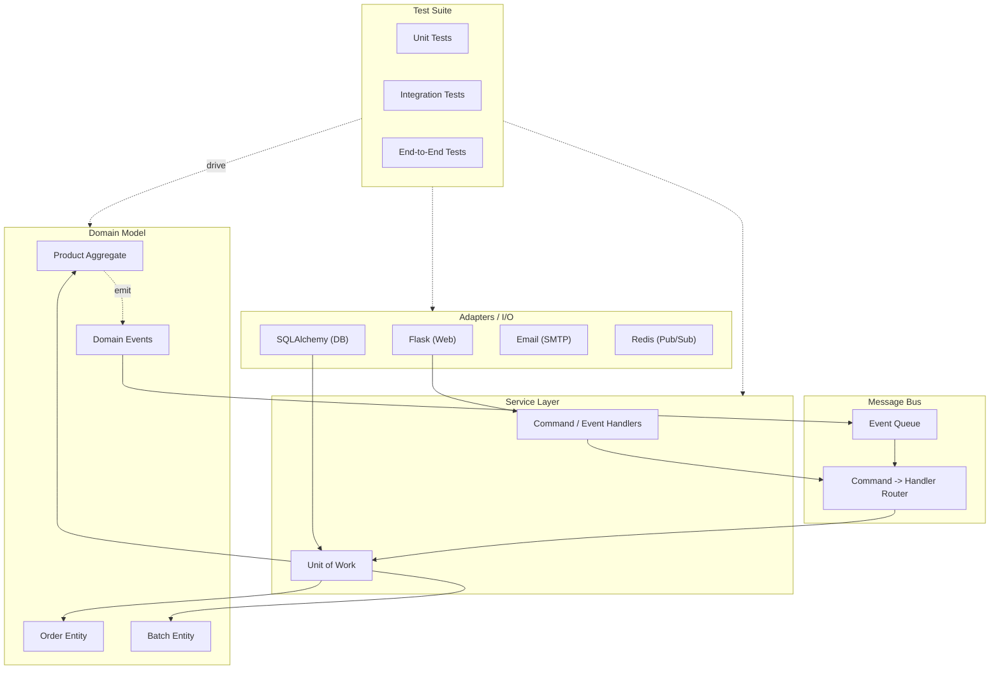

## The Architectural Blueprint

The book builds a single e-commerce allocation system across every
chapter. The architecture evolves through six layers:



The rule: arrows point toward the domain. The domain model depends
on nothing. Everything depends on it.

---

## Part I: Building the Foundation

### 1. Domain Model First

The book starts with a plain Python domain model — no ORM, no
framework. An `OrderLine` value object, a `Batch` entity, and a
`Product` aggregate. Business rules live here as pure functions:

- `Batch.can_allocate()` — can this batch fulfill an order line?
- `Batch.allocate()` — reduce available quantity
- `Product.allocate()` — find and allocate the best batch

These are tested with zero infrastructure. Pure TDD: write the test,
write the domain code, watch it pass.

### 2. The Repository Pattern

Problem: domain logic tests that hit a real database are slow and
brittle. Solution: abstract data access behind a `Repository`
protocol.

```python
class AbstractRepository(ABC):
    @abstractmethod
    def add(self, product):
        ...

    @abstractmethod
    def get(self, sku) -> Product:
        ...
```

Two implementations follow:
- `SqlAlchemyRepository` — real database
- `FakeRepository` — an in-memory dict for tests

The test for allocation now creates a `FakeRepository`, injects it
into the service layer, and verifies business logic without a
database. This is the core win: your core logic is testable in
milliseconds.

### 3. The Unit of Work Pattern

The Repository pattern works for reads but doesn't coordinate
writes. If allocating an order line triggers multiple repository
writes, partial failures leave the database inconsistent.

The Unit of Work captures the atomicity concern:

```python
class AbstractUnitOfWork(ABC):
    products: AbstractRepository

    @abstractmethod
    def commit(self):
        ...

    @abstractmethod
    def rollback(self):
        ...

    def __enter__(self):
        return self

    def __exit__(self, *args):
        self.rollback()
```

The service layer uses a context manager:

```python
def allocate(order_line: OrderLine, uow: AbstractUnitOfWork):
    with uow:
        product = uow.products.get(order_line.sku)
        product.allocate(order_line)
        uow.commit()
```

Key benefit: the test can use a `FakeUnitOfWork` (which bundles a
`FakeRepository` and a no-op commit) and verify that `commit()` was
called. No database needed — even transactional behavior is
testable at unit speed.

### 4. Aggregates and Consistency Boundaries

An Aggregate is a cluster of domain objects treated as a single
unit for data changes. The book's `Product` aggregate contains
`Batch` entities and enforces invariants:

- Cannot allocate more than available stock
- Can deallocate and reallocate
- Emits domain events when state changes

The aggregate is the consistency boundary: within a single
aggregate, strong consistency; between aggregates, eventual
consistency. This distinction becomes critical in Part II.

### 5. The Service Layer

The service layer (or use-case layer) orchestrates domain operations
without embedding orchestration in the domain or leaking it into
the web layer. A typical service function:

1. Retrieves an aggregate via the repository
2. Calls a domain method
3. Commits the unit of work

The Flask endpoint becomes a thin adapter:

```python
@flask.route("/allocate", methods=["POST"])
def allocate_endpoint():
    line = OrderLine(request.json["sku"], ...)
    try:
        allocate(line, uow)
        return OK, 201
    except OutOfStock as e:
        return {"error": str(e)}, 400
```

No business logic in the controller. The controller just translates
HTTP to domain calls and back.

---

## Part II: Going Event-Driven

### 6. Domain Events

A domain event is something that happened in the domain that domain
experts care about:

```python
class Allocated(Event):
    order_id: str
    sku: str
    qty: int
    batch_ref: str

class Deallocated(Event):
    order_id: str
    sku: str
    qty: int
```

Events are emitted by the aggregate when state changes. They are
not yet handled — they are simply recorded:

```python
class Product:
    def allocate(self, line: OrderLine) -> str:
        batch = self._find_batch(line)
        batch.allocate(line)
        self.events.append(
            Allocated(
                order_id=line.order_id,
                sku=line.sku,
                qty=line.qty,
                batch_ref=batch.ref,
            )
        )
        return batch.ref
```

### 7. The Message Bus

The Message Bus connects commands (intent) to handlers (behavior)
and events (facts) to event handlers (side effects). The bus pattern
decouples the caller from the callee:

```python
class MessageBus:
    def __init__(self, uow: AbstractUnitOfWork):
        self.uow = uow

    def handle(self, command: Command):
        handler = COMMAND_HANDLERS[type(command)]
        handler(command, self.uow)
        for event in self.uow.collect_new_events():
            self._handle_event(event)

    def _handle_event(self, event: Event):
        for handler in EVENT_HANDLERS[type(event)]:
            handler(event, self.uow)
            for e in self.uow.collect_new_events():
                self._handle_event(e)
```

This is the heart of the architecture. Commands are routed to a
single handler. Events can have multiple handlers (e.g., send email
and update read model). Handlers can emit new events, which the bus
recursively processes.

### 8. CQRS (Command-Query Responsibility Segregation)

The book introduces CQRS as an escape hatch: when the read model
diverges from the write model, build a separate read-only view.

For example, allocating products requires aggregates and invariants.
But showing a user their order history is a simple query that does
not need aggregates at all. CQRS says: use the domain model for
writes, use flat queries (raw SQL, materialized views) for reads.

The authors are pragmatic here — CQRS is an option, not a mandate.
They introduce it only when the example genuinely needs it.

### 9. Dependency Injection

The final piece: wire everything together at the entrypoint:

```python
uow = SqlAlchemyUnitOfWork(session_factory)
bus = MessageBus(uow)

app = Flask(__name__)
app.config["bus"] = bus
```

No global state. No `import db` from a config module. The bus, the
unit of work, and the session are created once and injected. Every
component can be swapped for testing.

---

## Key Lessons

- **Architecture follows testability.** The patterns exist to make
  core logic testable without infrastructure. If a pattern doesn't
  improve testability, reconsider it.
- **The domain model is the center of the universe.** Infrastructure
  (web, DB, queues) is peripheral. Dependencies point inward.
- **Start simple, add patterns as you grow.** The book introduces
  Repository in chapter 2, UoW in chapter 3, events in chapter 8.
  Each pattern solves a concrete problem that appeared in the
  previous chapter.
- **Python handles these patterns idiomatically.** Protocols
  instead of interfaces, context managers for UoW, simple callables
  for handlers — no heavy framework needed.
- **Events make side effects explicit.** Instead of hiding email
  sending inside `allocate()`, emit an event and let a handler send
  it. The domain stays pure; the side effect is visible and testable.
