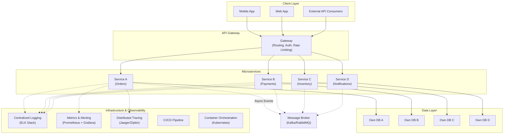
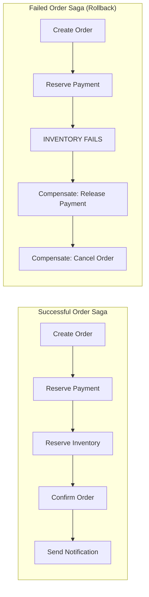

## The Microservice Architecture

---

## Part I: Foundation

### What Are Microservices?

Microservices are independently deployable services that model a single
business domain. They communicate over a network, each owning its own
data and technology stack.

The key distinction from SOA: microservices are **fine-grained** and
**independently deployable**. SOA often shared databases and
middleware; microservices do not.

### Benefits vs. Drawbacks

Newman lists six benefits and nine drawbacks — a deliberate asymmetry
that signals his balanced perspective:

| Benefits | Drawbacks |
|----------|-----------|
| Technology heterogeneity | Technology overload |
| Robustness | Latency |
| Scalability | Data consistency |
| Ease of deployment | Developer experience overhead |
| Organizational alignment | Cost |
| Composability | Monitoring and troubleshooting |
| Security | Reporting |
| Testing | |
| | Network reliability |

### Service Decomposition

The hardest design decision: **where to draw service boundaries**.

Newman recommends Domain-Driven Design's bounded contexts as the primary
heuristic. A bounded context is the boundary within which a particular
domain model applies. Services should map one-to-one with bounded
contexts.

Other decomposition heuristics:
- **Business capability** — Align services with business functions
  (orders, payments, shipping)
- **Change patterns** — Things that change together should be in the
  same service
- **Conway's Law** — Organizations produce systems that mirror their
  communication structures
- **Volatility** — High-churn modules may benefit from isolation

---

## Part II: Implementation

### Integration Styles

Newman covers three primary integration approaches:

#### REST

The default choice for most services. RESTful HTTP APIs are
technology-agnostic, widely understood, and cacheable. Newman
recommends using hypermedia controls (HATEOAS) cautiously — pragmatic
REST (JSON over HTTP with sensible URL conventions) is usually
sufficient.

#### gRPC

Suitable when both client and server are within your control and
performance matters. Strong typing, streaming, and code generation make
gRPC attractive for internal service-to-service communication. The
downside: gRPC requires significant infrastructure.

#### Messaging

Asynchronous message brokers (Kafka, RabbitMQ, Amazon SQS) decouple
services in time and space. Events become the integration surface.
Newman prefers messaging for high-volume, loosely-coupled interactions.

### Data Management

**Each service owns its data store.** This is non-negotiable. Sharing
databases between services recreates the coupling problems of
monoliths.

Consequences of per-service databases:
- Data duplication across services is acceptable
- Eventually, you need distributed transactions (sagas)
- Reporting and analytics require an event-sourcing or CQRS approach

#### Sagas

A saga is a sequence of local transactions where each step publishes an
event that triggers the next step. If a step fails, compensating
transactions undo the previous steps.

### Deployment

Newman strongly advocates for containers (Docker) and orchestration
(Kubernetes). Consistent environments from dev to prod eliminate the
most common deployment failure: environmental differences.

He also covers serverless (AWS Lambda, Cloud Functions) as a deployment
model that removes infrastructure management entirely — appropriate for
event-driven, low-volume services.

### Testing

Testing distributed systems requires a layered approach:

1. **Unit tests** — Test individual functions in isolation
2. **Integration tests** — Test service boundary with real dependencies
3. **Consumer-driven contract tests** — Verify that a service meets its
   consumers' expectations without deploying both services
4. **End-to-end tests** — The most expensive, least reliable; use
   sparingly for critical user journeys

Newman emphasizes contract tests (backed by tools like Pact) as the
sweet spot for microservice testing — they catch integration issues
without the fragility of end-to-end tests.

### Monitoring & Observability

Three pillars of observability:

- **Logging** — Structured, centralized logs (ELK stack, Splunk)
- **Metrics** — Aggregated time-series data (Prometheus, Grafana)
- **Tracing** — Request-scoped correlation across services (Jaeger,
  Zipkin)

Correlation IDs are the simplest and most impactful practice: pass a
unique ID through every service call so you can trace a request end to
end.

---

## Part III: People

### Organizational Alignment

Conway's Law: organizations design systems that mirror their
communication structures. The inverse is also true: if you want
microservices, you need small, cross-functional teams that can own
services end to end.

Newman recommends the **Spotify model** (squads, tribes, chapters,
guilds) as one organizational pattern, but emphasizes that team
topology must be tailored to the organization.

### When to Avoid Microservices

- **Startups** — No stable service boundaries yet; teams are small
- **Consumer software** — Operating a distributed system for
  shrink-wrapped software imposes unacceptable operational burden
- **Simple applications** — A monolith with clean internal modularity
  is often the right answer

---

## Key Lessons

- Independent deployability is the defining goal of microservices
- Service boundaries are the hardest and most consequential design
  decision — get them wrong and you get a distributed monolith
- Each service must own its data; shared databases are the enemy
- Prefer eventual consistency and sagas over distributed transactions
- Contract tests are the sweet spot for integration testing
- Observability (logging, metrics, tracing) is non-negotiable
- Containers and orchestration standardize the deployment pipeline
- Organizational structure must align with service architecture
- Start monolithic; split only when boundaries become clear
- Understand the drawbacks as thoroughly as the benefits

---

## Practical Applications

### Migration Strategy

For organizations migrating from a monolith, Newman recommends the
**Strangler Fig pattern**: gradually replace monolithic functionality
with microservices, routing traffic to the new service while keeping
the old code path until it is fully replaced.

### Service Template

Standardize each service with a template that includes:
- Dockerfile and CI/CD pipeline
- Health check endpoint
- Metrics endpoint (Prometheus format)
- Structured logging setup
- Service discovery registration
- Correlation ID middleware

### Team Structure

Organize into small (5-9 person), cross-functional teams that own 2-3
related services. Each team handles development, testing, deployment,
and first-line operations for their services.

---

## Action Plan

1. **Apply DDD** — Map your business domain into bounded contexts
2. **Start monolithic** — Build a well-structured monolith with clear
   module boundaries
3. **Identify extraction candidates** — Watch for modules that change
   independently or have different scaling needs
4. **Extract one service at a time** — Use the Strangler Fig pattern
5. **Add infrastructure gradually** — Containerization, CI/CD, service
   discovery as needed
6. **Invest in observability** — Centralized logging, metrics, and
   tracing before the second service is deployed
7. **Establish contract tests** — Prevent integration regressions
8. **Review team structure** — Align teams with service boundaries
9. **Iterate** — Boundaries will be wrong; expect to refactor
10. **Never share databases** — Protect independent deployability
