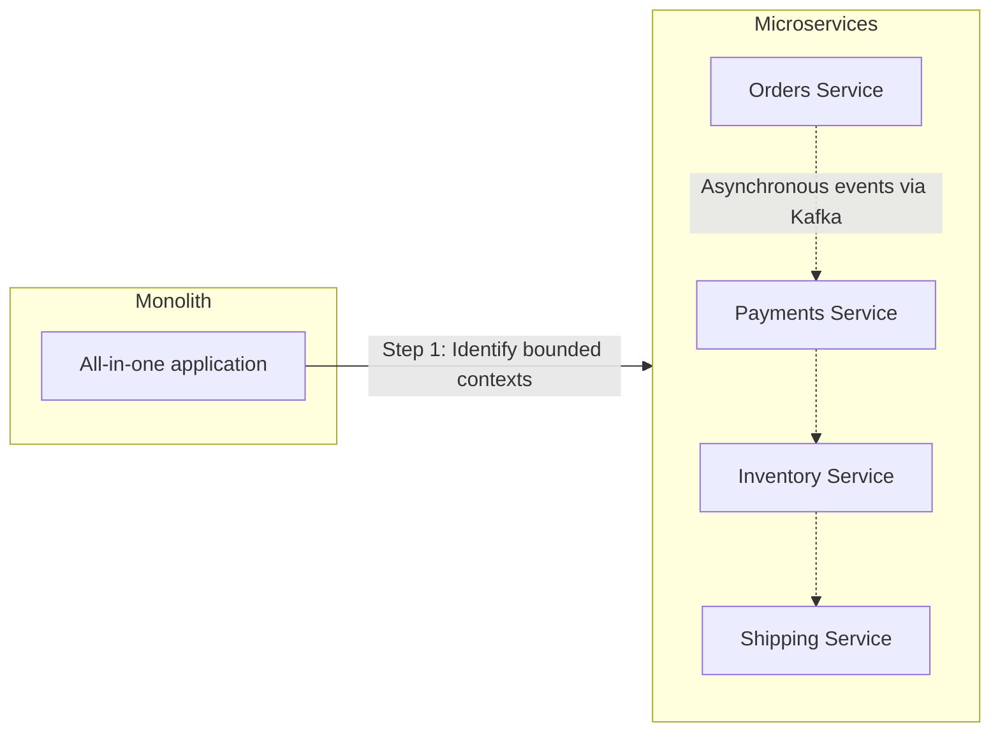

## Introduction

Welcome to BookAtlas. Today: *Building Microservices: Designing
Fine-Grained Systems* by Sam Newman. 2nd Edition published 2021,
O'Reilly Media. 612 pages.

This is the book that taught a generation of developers how to split
monoliths into services. But with the industry backlash against
microservices gaining steam — Amazon Prime Video, Segment, and others
have publicly abandoned them — we need to ask: is the advice still
sound?

Let's find out with two voices. On one side, a software architect who
has built and run microservice systems in production. On the other, a
skeptic who thinks most teams would be better off with a monolith.

---

## The Core Thesis

The book defines microservices as independently deployable services
that model a single business domain. Each service owns its data,
communicates over a network, and can be deployed, scaled, and changed
independently.

**Architect:** This definition is the book's most important
contribution. Before Newman, "microservices" meant different things to
different people. He gave us a clear, operational definition:
independent deployability is the key metric. If you can't deploy a
service without deploying others, it's not a microservice.

**Skeptic:** That's a useful definition, but it also reveals the
problem. True independent deployability requires so much discipline —
contract testing, backward compatibility, graceful degradation — that
most teams never achieve it. They end up with the worst of both worlds:
network overhead without actual independence.

---

## Service Boundaries: The Hardest Problem

The book dedicates significant space to service decomposition.
Newman's primary heuristic: bounded contexts from Domain-Driven
Design.

**Architect:** DDD bounded contexts are the right tool for this job.
They force you to think about where the domain model changes meaning —
the "context" boundary. When "Order" means one thing to the sales team
and another to the warehouse, that's a natural service boundary.

**Skeptic:** In theory, yes. In practice, bounded contexts are
ambiguous. Two experienced DDD practitioners can draw different
boundaries for the same domain. And once you draw the boundaries and
build services around them, changing them is enormously expensive.
The cost of getting boundaries wrong is higher than the cost of staying
monolithic.

---

## Data: The Non-Negotiable Rule

Each service must own its data. Shared databases are the enemy of
independent deployability.

**Architect:** This is the hill Newman dies on, and he's right. The
moment two services share a database schema, they're coupled. A schema
change in one service can break the other. The deployment cadence is no
longer independent. It's the single most violated rule because it's
inconvenient — duplicating data across services feels wasteful.

**Skeptic:** It's also the rule that makes reporting a nightmare.
Suddenly you need event sourcing, CQRS, or a dedicated data warehouse
just to answer the question "how many orders did we process last
month?" The book addresses this, but the operational complexity of
these patterns is significant.

---

## Sagas: Transactions Without Pain

Newman recommends sagas — sequences of local transactions with
compensating actions — instead of distributed transactions.

**Architect:** Sagas are the right pattern, but they introduce
fundamental complexity. Now your error handling isn't a simple ROLLBACK
— it's a series of compensating actions that must be idempotent,
reliable, and carefully orchestrated. The book covers this well, but
it's one of those things that sounds simple in theory and is brutal in
practice.

**Skeptic:** And yet, the most common saga implementation I see is a
mess of hardcoded compensation logic distributed across services with
no observability into the saga state. Newman describes the ideal; the
reality is often a debugging nightmare.

---

## Testing: Contract Tests Are the Sweet Spot

The book's testing guidance is among its most practical contributions.
Newman argues that end-to-end tests are too brittle for microservice
systems and recommends consumer-driven contract tests as the primary
integration testing strategy.

**Architect:** Contract tests (using tools like Pact) changed how I
think about service integration. Instead of deploying everything and
running expensive E2E tests, each consumer publishes its expectations,
and the provider validates against them. It's faster, more reliable,
and scales with the number of services.

**Skeptic:** Contract tests work well for request-response patterns.
For event-driven systems with asynchronous messaging, they're harder to
implement. And the book doesn't fully address the governance question:
who owns the contracts? What happens when a consumer needs a breaking
change?

---

## The Organizational Challenge

Part III is what makes this book unique among technical architecture
books. Newman explicitly addresses Conway's Law and team topology.

**Architect:** This section alone is worth the price. The technical
aspects of microservices are hard, but the organizational aspects are
harder. You cannot have independently deployable services without
autonomous teams. Period. If your organization is structured as
component teams (frontend team, backend team, DBA team), microservices
will fail.

**Skeptic:** But most organizations ARE structured as component teams.
Newman acknowledges this but offers limited guidance on how to
transition from component teams to cross-functional teams. The Spotify
model he references has its own well-documented problems.

---

## The Biggest Criticisms

1. **Premature decomposition.** The most common failure: teams read
   chapters 1-21 and start splitting before they understand their
   domain boundaries. Newman's advice to "start monolithic" is buried
   deep in the text.

2. **Operational complexity understated.** Running 15 services is
   dramatically harder than running 1. The book catalogs the
   challenges but may not convey the experiential weight.

3. **Rapid aging.** Tool-specific chapters (Kubernetes, monitoring
   stacks) date quickly. The book is already showing its age in spots.

4. **The theory gap.** Practitioners who truly understand distributed
   systems need Kleppmann, not just Newman.

---

## The Verdict

**Architect:** This book is essential reading for anyone considering
microservices. It's balanced, practical, and comprehensive. But it
must be read critically — not as a recipe book but as a starting point.
And you must read the "when to avoid" sections as carefully as the
"how to" sections.

**Skeptic:** I agree that it's the best book on the subject. But I'd
argue that the best outcome of reading this book is deciding NOT to use
microservices — or at least deferring the decision until you deeply
understand the trade-offs. Newman's balanced presentation accidentally
makes a stronger case against microservices than for them. Six
benefits. Nine drawbacks. Read the list again.

---

## Final Thoughts

The book that defined microservice architecture for a generation now
reads as a sober, measured guide — less a manifesto than a field
manual. It is strongest where it addresses organizational design and
weakest where it dives into fast-moving operational tooling.

Whether microservices are right for your organization is a question the
book helps you answer, but the answer increasingly seems to be "not
yet" or "only for certain bounded contexts." And that may be the most
valuable takeaway of all.

This has been a BookAtlas narration of Building Microservices by Sam
Newman. Thanks for listening.
