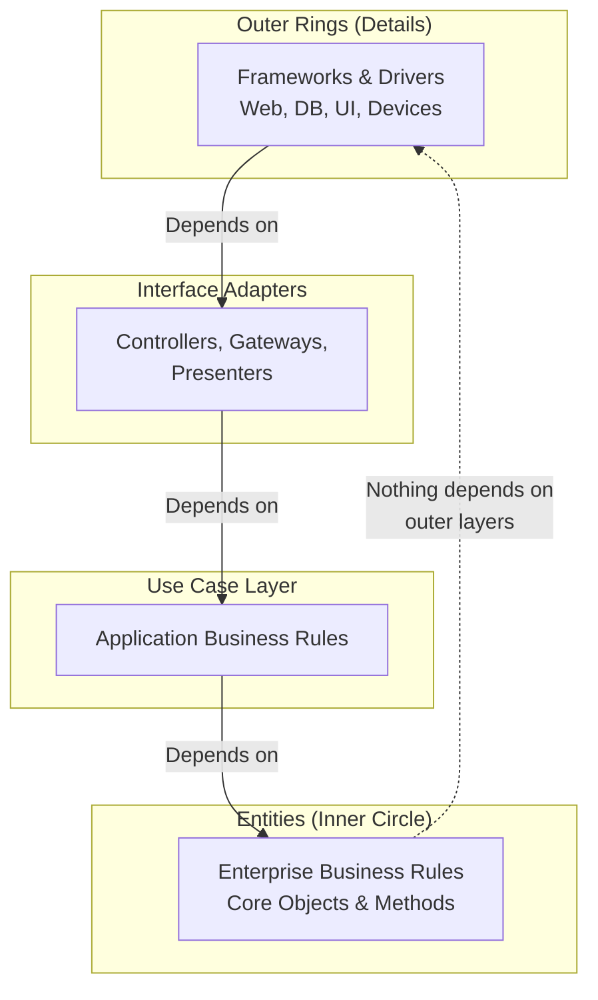
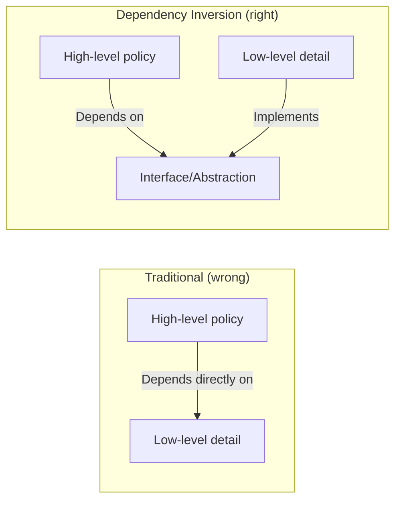

## The Dependency Rule

The central law of clean architecture: **source code dependencies must
point only inward, toward the highest-level policies.** Nothing in an
inner circle can know anything about an outer circle.

---

## Part I: Programming Paradigms

Three paradigms constrain what programmers can do:

| Paradigm | Key Constraint | When Established |
|----------|----------------|------------------|
| **Structured** | Direct transfer of control (no goto) | 1968 (Dijkstra) |
| **Object-oriented** | Indirect transfer of control (polymorphism) | 1966 (Dahl/Nygaard) |
| **Functional** | Assignment of variables (immutability) | 1958 (McCarthy) |

Each paradigm removes something from the programmer: structured removes
goto, OOP removes function pointers (replaces with polymorphism),
functional removes mutable state.

---

## Part II: SOLID Principles

| Principle | Name | Rule |
|-----------|------|------|
| SRP | Single Responsibility | A class should have only one reason to change |
| OCP | Open-Closed | Open for extension, closed for modification |
| LSP | Liskov Substitution | Subtypes must be substitutable for their base types |
| ISP | Interface Segregation | No client should depend on methods it does not use |
| DIP | Dependency Inversion | Depend on abstractions, not concretions |

Martin's key insight: the SOLID principles are not about objects and
classes. They are about **dependencies** — managing the relationships
between modules to minimize the impact of change.

### Dependency Inversion (the architectural principle)

The biggest idea: conventional structured programming depends on
concrete implementations. Clean architecture **inverts** that:

---

## Part III: Component Principles

Scaled-up SOLID for packages and modules:

### Cohesion Principles

| Principle | Name | Rule |
|-----------|------|------|
| REP | Reuse/Release Equivalence | Release granularity = reuse granularity |
| CCP | Common Closure | Classes that change together belong together |
| CRP | Common Reuse | Classes that are used together belong together |

### Coupling Principles

| Principle | Name | Rule |
|-----------|------|------|
| ADP | Acyclic Dependencies | No cycles in the dependency graph |
| SDP | Stable Dependencies | Depend in the direction of stability |
| SAP | Stable Abstractions | Stable components should be abstract |

---

## Part IV: The Clean Architecture Pattern

The clean architecture combines:
- **Hexagonal Architecture** (Alistair Cockburn) — ports and adapters
- **DCI** (Trygve Reenskaug) — Data, Context, Interaction
- **BCE** (Ivar Jacobson) — Boundary, Control, Entity

The result is concentric circles:
1. **Entities** — Enterprise business rules (the inner circle)
2. **Use Cases** — Application-specific business rules
3. **Interface Adapters** — Convert format between use cases and
   external world
4. **Frameworks & Drivers** — Web, database, UI, devices

### Screaming Architecture

The package structure of a well-architected system should reveal its
intent. A health care system should have packages like `patients/`,
`visits/`, `billing/` — not `controllers/`, `models/`, `views/`.

If you look at the package structure and see Spring or Rails or Django,
you have a framework-oriented architecture, not a use-case-oriented
one.

---

## Part V: Details

### Databases are Details

- The database is a mechanism for storing and retrieving data, not a
  source of architecture
- Business rules should not know anything about SQL, NoSQL, or the
  storage format
- Use interfaces (Repository pattern) to decouple business rules from
  persistence

### The Web is a Detail

- HTTP is a delivery mechanism, like a keyboard or mouse
- The architecture should not depend on HTTP being present
- Controllers receive requests and translate to use-case inputs, then
  return responses

### Frameworks are Details

- Do not marry the framework
- Treat the framework as an outer circle detail
- If the framework wants you to extend its base classes, think twice
  — you are creating a dependency

### Boundaries

Every boundary between a core and a peripheral concern should be a
seam. This means:
- The core defines the interface
- The peripheral implements it
- The peripheral knows about the core; the core does not know about
  the peripheral

---

## Key Lessons

- The Dependency Rule is the fundamental law of architecture
- Organize around use cases, not frameworks
- Decouple at architectural boundaries
- Databases, web servers, and frameworks are details
- Good architecture maximizes deferred decisions
- Testability without infrastructure is the litmus test
- SOLID is about managing dependencies
- Screaming architecture reveals intent
- Boundaries make architectural flexibility possible
- Architecture is primarily about managing cost

---

## Practical Applications

### For Architects

- Start with use cases, not with frameworks
- Draw boundaries between core and peripheral concerns
- Define interfaces from the inside out

### For Developers

- Apply the Dependency Inversion Principle daily
- Keep business rules free of framework imports
- Test use cases without a running web server or database

### For Teams

- Adopt architectural fitness functions to enforce boundaries
- Use ArchUnit or similar tools to prevent dependency violations
- Review architecture as a team, not just as architects

---

## Action Plan

1. **Audit your package structure.** Does it scream the system's
   intent or the framework's name?
2. **Find a dependency violation.** Where does business logic
   reference a framework type?
3. **Introduce an interface.** Decouple a use case from its
   framework-specific implementation
4. **Test a use case in isolation.** Can your business rules run
   without a database?
5. **Draw your boundaries.** Identify the architectural seams in an
   existing system
