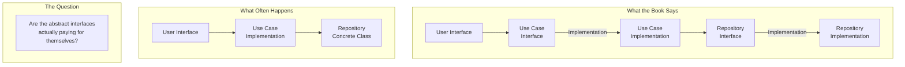

## Introduction

Welcome to BookAtlas. Today: *Clean Architecture: A Craftsman's Guide
to Software Structure and Design* by Robert C. Martin. Published 2017,
Prentice Hall. 432 pages.

This is the book that claims your architecture should "scream" what
your system does. It's the third in Uncle Bob's trilogy, after *Clean
Code* and *The Clean Coder*, and it's arguably the most ambitious —
trying to establish a universal set of architectural rules that apply
to any software system, in any language, on any platform.

Today: an architect who builds systems using these principles, and a
senior engineer who thinks they create more problems than they solve.

---

## The Dependency Rule

**Architect:** The Dependency Rule is the single most important
architectural insight of the last 20 years. Everything in our system
depends on abstractions. Business logic has zero references to Spring,
PostgreSQL, or HTTP. When we switched from MongoDB to Postgres, it was
a two-day change.

**Engineer:** It sounds great in theory. In practice, it produces a
mountain of interfaces that exist only for the sake of abstraction. I
counted: in the last project, we had interfaces for repositories,
interfaces for services, interfaces for factories — and almost every
interface had exactly one implementation. That's not architecture;
that's busywork.

---

## Frameworks: Tools or Structures?

**Architect:** The book's treatment of frameworks is exactly right.
Spring Boot is a tool, not an architecture. If your business logic
inherits from Spring's controller base class, you've already lost — you
cannot run that logic outside Spring. The framework becomes the
architecture.

**Engineer:** But the framework IS the architecture. I don't want to
write a custom DI container. I don't want to write my own web routing.
The framework provides battle-tested solutions to real problems. Uncle
Bob's advice creates a parallel, custom, untested version of what the
framework already does well. That's not craftsmanship — that's
unnecessary complexity.

---

## The Database is a Detail?

**Architect:** Again, this is right. The database is a persistence
mechanism. If my business logic calls `OrderRepository.save()` instead
of `INSERT INTO orders...`, I can change databases, split schemas, or
add caching without touching business logic. That flexibility is
enormously valuable.

**Engineer:** For most systems, the database schema IS the business
logic. The data model encodes the relationships and constraints that
define what the system does. Pretending it's a "detail" you can swap
out is fantasy. You are not going to switch from SQL to MongoDB midway
through a project — and if you do, your repository interface isn't
going to save you.

---

## When Clean Architecture Helps

**Architect:** This architecture shines in systems with complex,
changing business rules — insurance, banking, healthcare. When the
business logic is the primary source of complexity, protecting it from
framework churn is critical. We've delivered three major rewrites of
our UI without touching business logic.

**Engineer:** But most software is not insurance. Most software is
CRUD over a database, wrapped in a web framework. For those systems,
clean architecture is overhead without benefit. The cost of the
abstractions — mental overhead, indirection, boilerplate — exceeds the
value they provide.

---

## The Verdict: Universal or Situational?

**Architect:** The principles are universal. The degree of application
varies, but the idea that you should decouple business rules from
infrastructure is always valid. Even a simple CRUD app benefits from
having clean domain models.

**Engineer:** I think the book presents a specific architectural
pattern as universal when it is actually situational. It's excellent
advice for complex enterprise systems. It's harmful dogma for simple
web applications. The skill is knowing when to apply it — and the book
doesn't help you learn that judgment.

**Architect:** Fair. But I'd rather start with clean architecture and
simplify than start with tight coupling and try to untangle it later.
The first is work. The second is impossible.

---

## Final Thoughts

*Clean Architecture* is a book every senior engineer should read and
engage with. The Dependency Rule is a genuinely powerful principle.
The framework-skepticism is healthy. The emphasis on testability is
correct.

But the book should be read critically. Not every system needs entity,
use case, presenter, controller, gateway, and repository interfaces. The
art of architecture is applying these principles proportionally — and
that judgment comes from experience, not from reading.

This has been a BookAtlas narration of Clean Architecture by Robert C.
Martin. Thanks for listening.
