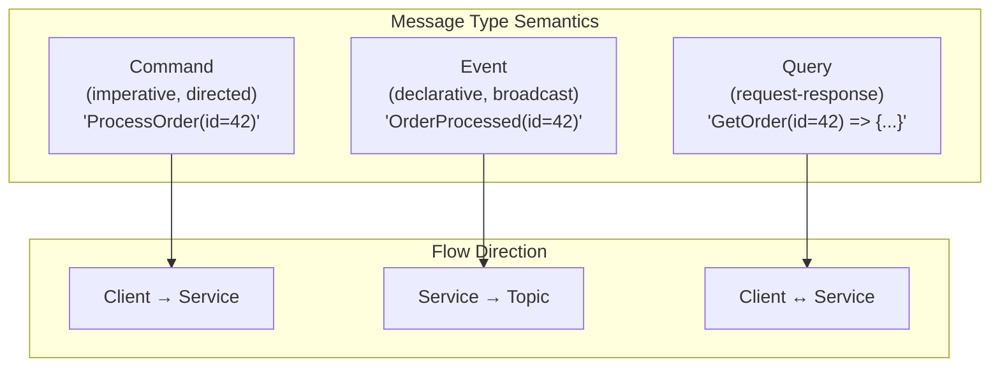
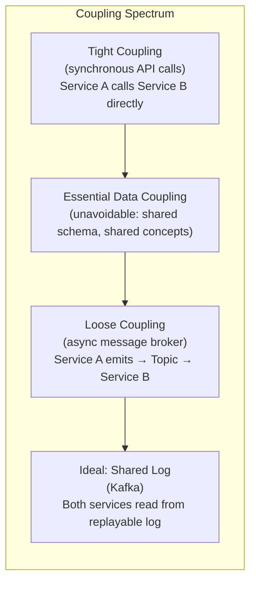
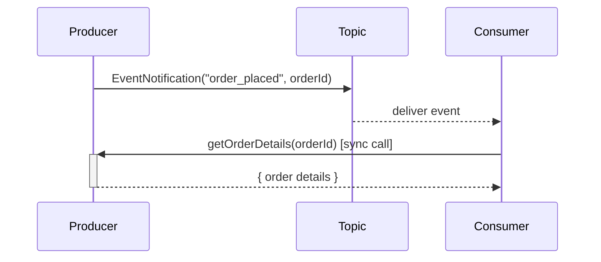
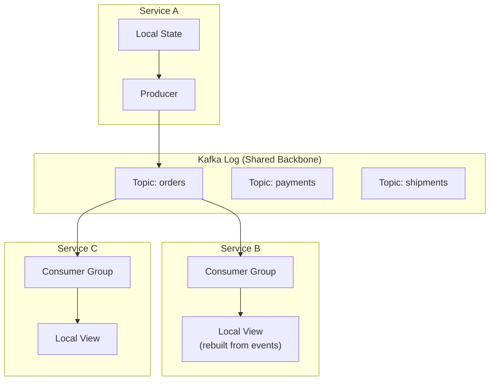
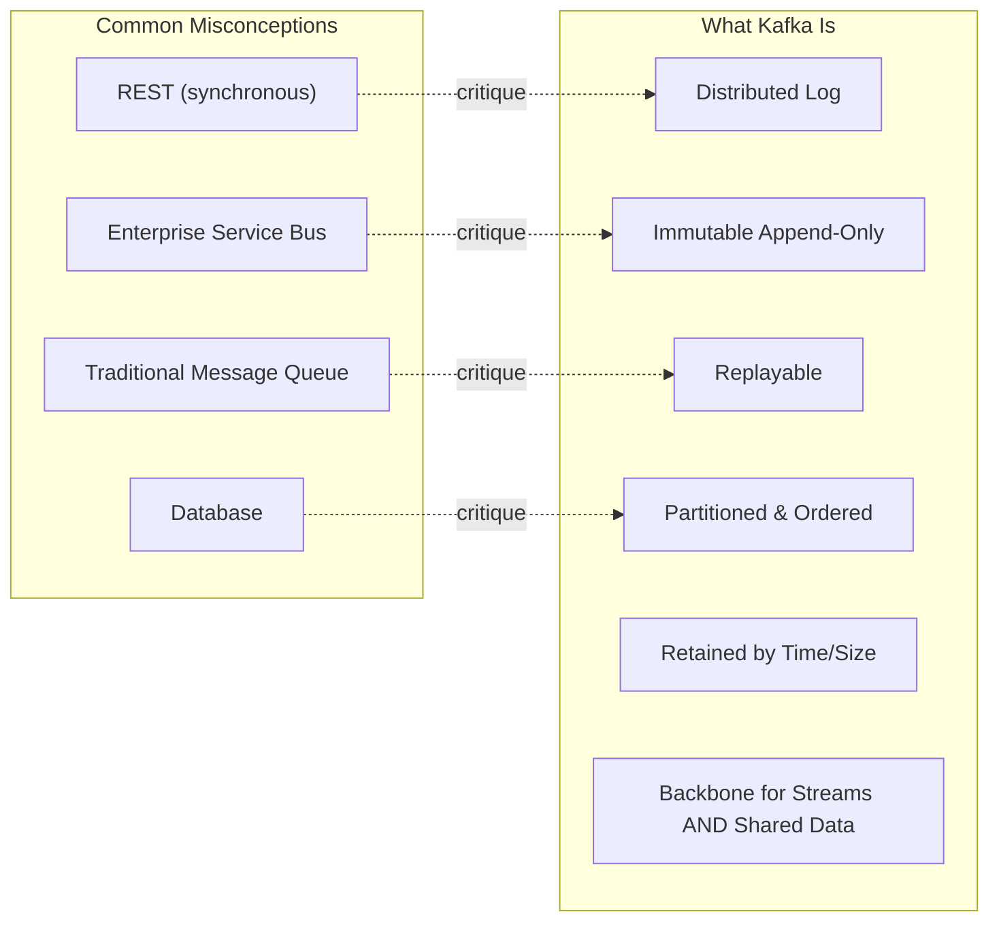
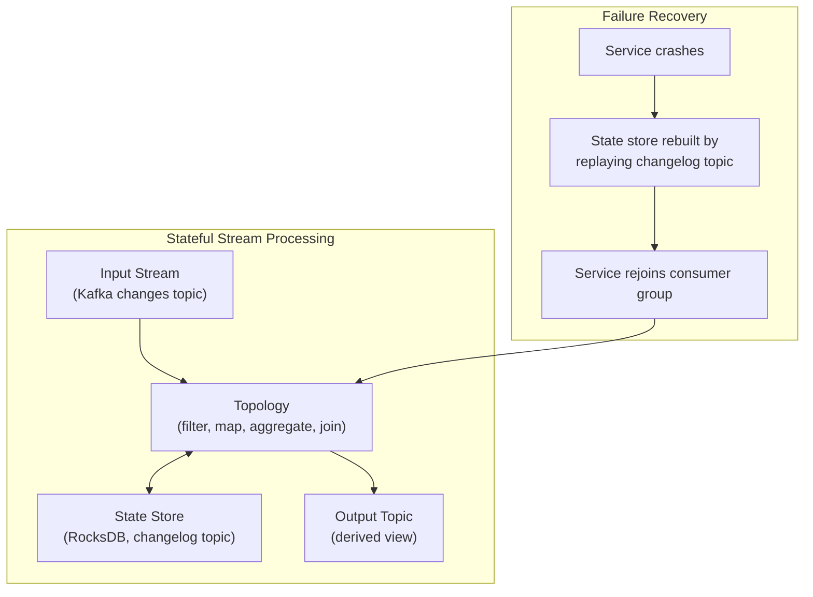
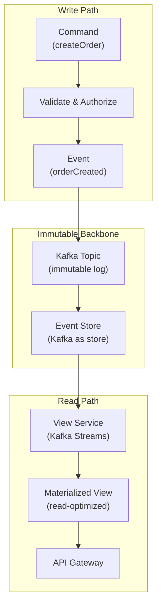
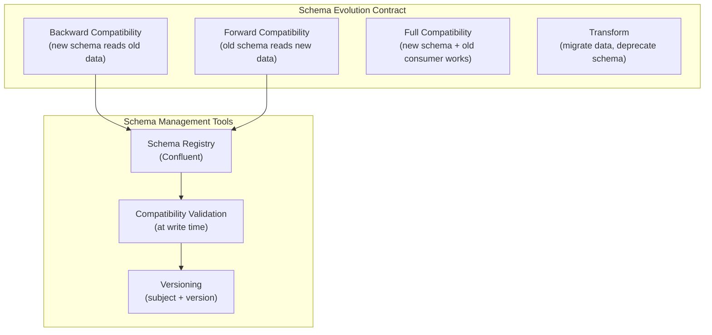

## The Three Message Types

Stopford's most influential contribution is the strict separation of
commands, events, and queries — three message archetypes with different
semantics, lifecycles, and implications for system design.

**Commands** request action. They are directed at a specific service,
expect a response, and have an imperative verb form (`ProcessOrder`,
`DeleteUser`). They are the synchronous world's default.

**Events** announce what happened. They are named in the past tense
(`OrderProcessed`, `UserDeleted`), addressed to a topic, and broadcast
to any number of consumers. They are the shared language of event-driven
systems.

**Queries** ask for state without side effects. In practice they tend
to be synchronous REST calls or materialized view lookups.

Mixing these types — especially using events as commands — causes
operational chaos: consumers fail and the producer never knows, or
consumers retry and produce duplicates.

---

## Coupling: The Spectrum

Stopford forces the reader to confront the myth that message brokers
eliminate coupling. They change the *kind* of coupling, not eliminate it.

The three collaborative patterns:

### Event Notification (Level 1)

Service A emits `OrderPlaced`. Service B is notified, then looks up
order details via a separate call. Works for simple cases but still
requires coupling on the query interface.

### Event-Carried State Transfer (Level 2)

The event itself carries enough state that the consumer doesn't need
to call back. Reduces coupling but increases message volume and
risks data duplication.

### Event Collaboration (Level 3)

Services interact primarily through events on a shared log. No direct
calls between services; the log is the only communication channel.
The most decoupled form, but requires careful design of event schemas
and lifecycle.

---

## The Kafka Log: What It Is

Stopford devotes an entire chapter (3) to demystifying Kafka. The core
insight: **Kafka is a persistent, distributed, replayable log** —
not a queue, not a message broker.

A Kafka log consists of partitions — ordered, immutable sequences of
records. Each partition has a single leader broker and replicated
followers. Consumers read at their own pace; the log is retained
independently of consumption.

Critical properties:
- **Ordering** is guaranteed per-partition
- **Retention** is time- or size-based; events are not deleted on
  consumption
- **Replay** means any consumer can re-read events from any offset
- **Compacted topics** retain only the latest value per key

---

## Event Streaming vs. Event Sourcing

One of Stopford's most valuable distinctions: event streaming and event
sourcing solve different problems. Confusing them causes design errors.

```mermaid
graph LR
    subgraph Event_Streaming["Event Streaming"]
        ES1["Purpose: Decouple systems"]
        ES2["Events: transient messages"]
        ES3["Retention: short to medium"]
        ES4["Pattern: fire and listen"]
        ES5["Example: OrderPlaced → PaymentService → ShipmentService"]
    end
    subgraph Event_Sourcing["Event Sourcing"]
        EV1["Purpose: Rebuild state"]
        EV2["Events: system of record"]
        EV3["Retention: permanent append-only"]
        EV4["Pattern: replay to rebuild"]
        EV5["Example: rebuild bank account balance by<br/>replaying all transactions"]
    end
    Event_Streaming -. "often combined" .-> Event_Sourcing
```

**Event Streaming**: Get data from system A to system B. The event log
is a communication channel. Events may be retained briefly. Consumption
is typically fire-and-forget.

**Event Sourcing**: The event log *is* the data. The state of the system
is *derived* from replaying events. Events are never updated or
deleted. This enables audit trails, time-travel debugging, and
complete rebuilds of derived views.

Many systems combine both: streaming events between services *while*
using event sourcing within individual services.

---

## Stateful Stream Processing

Stopford distinguishes three processing models, each with different
trade-offs for state management:

| Model | State Location | Recovery | Best For |
|-------|---------------|----------|----------|
| Stateless (pure streaming) | Stateless functions | No state to recover | Simple transformations, filtering |
| Event-driven (notification) | Source services | Callback to rebuild | Notifications, trigger workflows |
| Stateful streaming | Local state stores (Kafka Streams) | Rebuild from log | Aggregations, joins, windows |

The changelog topic — write-only, compaction-enabled — is the mechanism
that makes state stores durable. It records every state change, allowing
full recovery without checkpointing.

---

## Event Sourcing, CQRS, and Materialized Views

Chapter 7 is the deep dive. Stopford covers the full implementation
spectrum with Kafka:

Key patterns in this chapter:

**Command Sourcing**: Save every command (what was requested) alongside
events (what happened). Enables full audit trail of intent and outcome.

**CTR**: Commands trigger validation; valid commands become events.
Each event has a single, deterministic handler.

**Materialized Views**: Pre-computed query results built from events.
Views are rebuilt by replaying events — from the beginning or from a
saved offset.

**Polyglot Views**: Different read models for different query
patterns. One service writes events; N services build N views in N
storage technologies. The log enables this without tight coupling.

**Change Data Capture (CDC)**: Unlock legacy databases by streaming
their change log (via Debezium + Kafka Connect) into the event
ecosystem. Old systems become event producers without code changes.

---

## Schema Evolution

Stopford treats event schemas as first-class API contracts, not an
afterthought. The practical framework:

- **Backward compatible**: new producer → old consumer (most common)
- **Forward compatible**: old producer → new consumer (rare but needed
  for rolling upgrades)
- **Full compatibility**: both directions (the safe zone)
- **Schema transformations**: reshape data at the boundary to avoid
  breaking changes

Structured schemas (Avro, Protobuf, JSON Schema with Registry) prevent
the "unreadable message" problem — when a consumer cannot deserialize
because the schema changed unexpectedly.
